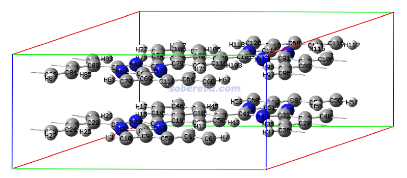
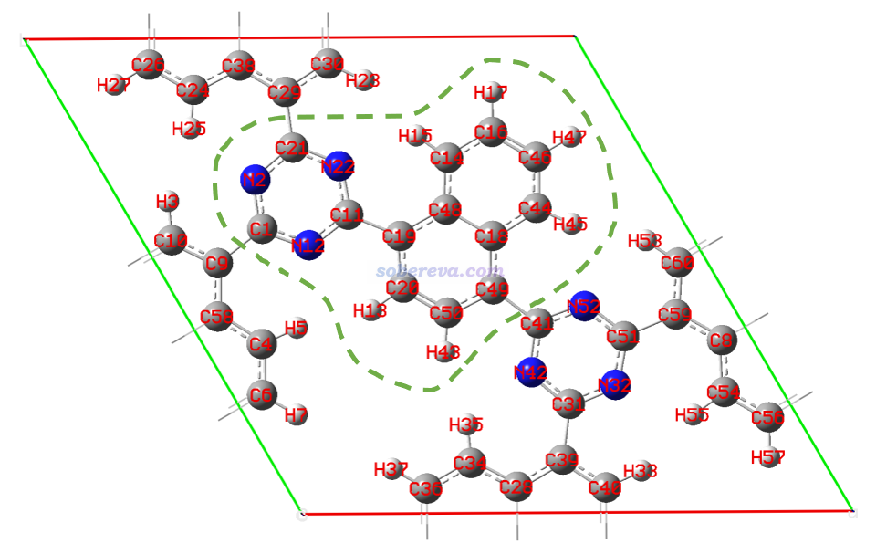
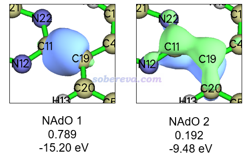
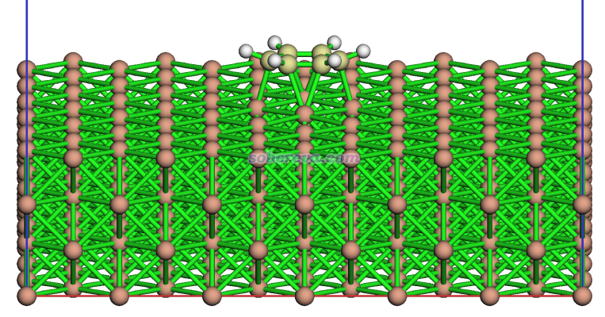
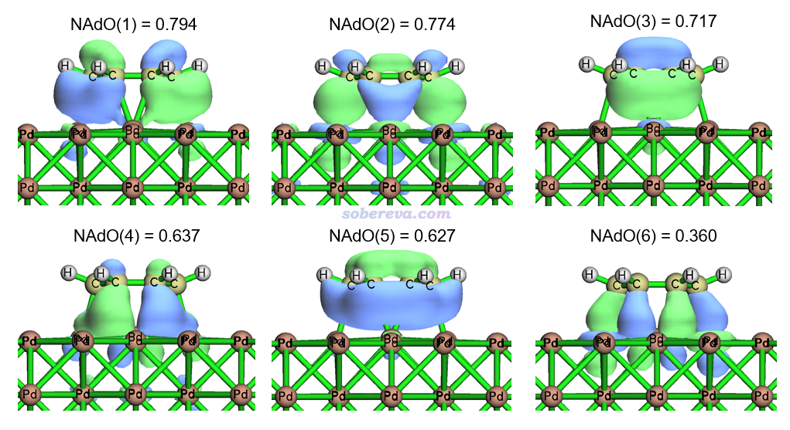

**使用Multiwfn对周期性体系做键级分析和NAdO分析考察成键特征**  
Using Multiwfn to perform bond order analysis and NAdO analysis to study bonding characters for periodic systems

文/Sobereva@[北京科音](http://www.keinsci.com)  

First release: 2024-Jul-12    Last update: 2025-Dec-5

## 0 前言

键级是考察化学键特征的一类重要方法，非常强大的波函数分析程序Multiwfn可以方便地计算很多类型的键级，在《Multiwfn支持的分析化学键的方法一览》（<http://sobereva.com/471>）的键级部分有具体的说明，Multiwfn手册4.9节有一些实际计算例子，在“量子化学波函数分析与Multiwfn程序培训班”（<http://www.keinsci.com/workshop/WFN_content.html>）里做了特别全面详细的讲解和演示。另外，Multiwfn还支持NAdO方法，可以将原子间的模糊键级以轨道形式图形化展现，对于了解成键本质极其有用，介绍和实例看《使用键级密度(BOD)和自然适应性轨道(NAdO)图形化研究化学键》（<http://sobereva.com/535>）。

以上博文都是举的孤立体系的例子，而如今Multiwfn已经将上述方法扩展到了对周期性体系的分析上。将Multiwfn与CP2K做周期性DFT计算产生的波函数相结合，可以很容易地用上述方法考察周期性体系的成键情况，在本文将通过一个层状的共价有机框架化合物（COF）体系，以及一个Pd表面吸附苯的体系，对具体做法进行演示，希望读者举一反三将本文介绍的方法运用到实际研究中。**使用本文的方法计算的结果若用于发表，记得需要按照Multiwfn启动时的提示恰当引用Multiwfn的原文**。

**读者务必使用2024-Jun-24及以后更新的Multiwfn版本**，否则情况与本文所述不符。Multiwfn可以在主页<http://sobereva.com/multiwfn>免费下载。不了解Multiwfn者建议阅读《Multiwfn入门tips》（<http://sobereva.com/167>）和《Multiwfn FAQ》（<http://sobereva.com/452>）。本文要用到非常流行、高效且免费的第一性原理程序CP2K，笔者假定读者已具备了相关常识，十分推荐不熟悉者通过“**北京科音CP2K第一性原理计算培训班**”（<http://www.keinsci.com/KFP>）系统性学习。本文要使用Multiwfn创建CP2K输入文件，这在《使用Multiwfn非常便利地创建CP2K程序的输入文件》（<http://sobereva.com/587>）里有简要介绍。本文用的CP2K是2024.1版。

下面的例子涉及到的所有文件都可以在<http://sobereva.com/attach/719/file.rar>里得到。

## 1 单层COF体系

这部分示例的COF体系的cif文件是本文文件包里的COF_16371N2.cif，用GaussView显示的结构如下，可见晶胞里有两层。

### 1.1 准备输入文件

此体系两层之间的相互作用主要是pi-pi堆积，对电子结构影响微乎其微，因此只计算一层就够了，可以节约时间，尤其是能显著节约NAdO分析过程中计算原子重叠矩阵（AOM）的时间。于是在GaussView里删除一层，然后保存为COF.gjf。由于当前体系不是导体且晶胞边长约15埃已经不小了，所以可以不用扩胞就直接做gamma点计算。注意CP2K导出molden文件只支持gamma点的情况，这在《详谈使用CP2K产生给Multiwfn用的molden格式的波函数文件》（<http://sobereva.com/651>）里已明确说了。

启动Multiwfn，然后输入  
COF.gjf  
cp2k  //进入产生CP2K输入文件的界面  
[回车]  //输入文件名用默认的COF.inp  
-2  //要求产生molden文件  
-7  //设置周期性  
XY  //仅在平行于COF的方向考虑周期性，而垂直于COF的方向用非周期性  
-9  //其它设置  
16  //要求将Kohn-Sham矩阵导出到.csr文件里。此文件在Multiwfn计算NAdO轨道能量时会用到  
0  //返回  
0  //产生输入文件

现在当前目录下就有了COF.inp，对应PBE/DZVP-MOLOPT-SR-GTH级别的单点计算。用CP2K运行之，当前目录下会产生记录波函数信息的COF-MOS-1_0.molden和记录KS矩阵的COF-KS_SPIN_1-1_0.csr。按照《详谈使用CP2K产生给Multiwfn用的molden格式的波函数文件》所述，在molden文件开头插入以下内容定义晶胞信息和当前赝势基组描述的各元素的价电子数  
 [Cell]  
  14.94670000     0.00000000     0.00000000  
  -7.47335000    12.94422190     0.00000000  
   0.00000000     0.00000000     8.00000000  
  [Nval]  
  C 4  
  N 5  
  H 1

之后就可以基于这个molden格式的波函数文件做各种周期性体系的分析了。

### 1.2 计算Mayer键级

首先计算非常常用的Mayer键级，它衡量原子间等效的共享电子的对数。启动Multiwfn，载入COF-MOS-1_0.molden，然后输入  
9  //键级分析  
1  //Mayer键级  
Multiwfn首先计算重叠矩阵，然后立刻输出了Mayer键级，只有大于阈值的（由settings.ini里的bndordthres参数控制）才直接显示了出来。要想看所有原子间的Mayer键级可以再选择y导出键级矩阵然后查看相应的矩阵元。为了便于对照，下图显示了当前体系各个原子的序号，本文主要关注其中绿色虚线圈住的那些原子。

Multiwfn输出的一些有代表性的键的Mayer键级值如下  
11(C )   19(C )    1.12454138  
 11(C )   22(N )    1.48268711  
 19(C )   48(C )    1.27625346  
 20(C )   50(C )    1.39369508  
 18(C )   48(C )    1.24722702  
可见这些键的Mayer键级都不同程度地明显大于1.0，因此可以推测它们都不仅仅形成了sigma键，还有一定pi成份。在后文会计算pi键级和使用NAdO分析更进一步确认这一点。上面列出的C-C键键级可以体现出体系中哪种C-C键的强度更强。可见连接萘单元和C3N3单元的C11-C19的键是相对最弱的。

### 1.3 计算模糊键级（fuzzy bond order）

Mayer键级怕弥散函数，而模糊键级则没有这个问题，用于任意基组都可以。Mayer键级用于MOLOPT系列基组都是没问题的，不过这里作为例子，也计算一下模糊键级。由于计算模糊键级需要先构造AOM，对较大的体系很耗时，所以对于Mayer键级适用的情况建议优先用Mayer键级。注意对孤立体系Multiwfn计算模糊键级默认是基于Becke划分的，而对于周期性体系计算模糊键级默认是基于Hirshfeld划分的，因此默认设置下周期性体系的计算结果和孤立体系的没有严格的可比性。

在键级分析主功能的菜单里选择7，然后Multiwfn就会开始计算AOM，之后立刻给出模糊键级的计算结果，前述的那些键的模糊键级如下  
11(C )   19(C )    1.05202861  
 11(C )   22(N )    1.50866214  
 19(C )   48(C )    1.22313834  
 20(C )   50(C )    1.38494183  
 18(C )   48(C )    1.17984661  
虽然模糊键级与Mayer键级在定量上有一些差别，但不同的键的键级的大小顺序是完全一致的，没有结论上的差异。

### 1.4 计算pi电子贡献的Mayer键级

我在《在Multiwfn中单独考察pi电子结构特征》（<http://sobereva.com/432>）中专门介绍了pi键级的计算方法，也即pi占据轨道对Mayer键级的贡献，没读过的话务必先阅读。这一节对单层COF这个周期性体系也做这个计算，看看各个键的pi作用程度的差异。由于当前体系是精确平行于XY平面的，所以让Multiwfn自动指认pi轨道前不需要先做轨道定域化。

启动Multiwfn并载入COF-MOS-1_0.molden后，依次输入  
100  //其它功能（Part 1）  
22  //检测pi轨道  
0  //当前的轨道都是离域形式（如正则分子轨道）  
2  //设置其它轨道占据数为0  
0  //返回  
9  //键级分析  
1  //Mayer键级  
前面提到的那些键的键级计算结果如下，这对应的就是pi键级。可见C3N3六元环中的C-N键的pi共享电子作用很强，比这里列出的C-C键的还要更显著。  
11(C )   19(C )    0.14583409  
 11(C )   22(N )    0.41775145  
 19(C )   48(C )    0.28202057  
 20(C )   50(C )    0.38270736  
 18(C )   48(C )    0.27414145

使用此做法发表文章时，除了引用Multiwfn原文外还建议同时引用介绍Multiwfn做pi电子结构分析的文章Theor. Chem. Acc., 139, 25 (2020)。

### 1.5 NAdO分析

利用前述的《使用AdNDP方法以及ELF/LOL、多中心键级研究多中心键》中介绍的NAdO分析，可以将sigma和pi作用分别以轨道形式呈现出来，非常有价值。例如在我的研究18氮环的ChemPhysChem (2024) <https://doi.org/10.1002/cphc.202400377>文中就用了NAdO分析非常清楚、严格地展示了较短的N-N键的sigma+pi作用特征。本节我们用NAdO分析展示一下C11-C19的sigma和pi轨道相互作用情况。

启动Multiwfn并载入COF-MOS-1_0.molden后，依次输入  
15  //模糊空间分析  
3  //计算AOM。对周期性体系默认是基于Hirshfeld原子空间计算的  
[回车]  //用默认的0.2 Bohr格点间距。此设置对当前体系耗时不高，但对于明显更大体系为了节约耗时可以适当用更大的格点间距如0.35 Bohr，但会多多少少牺牲精度

计算完成后当前目录下出现了记录AOM的AOM.txt。在Multiwfn里接着输入  
0  //返回  
200  //其它功能（Part 2）  
20  //BOD和NAdO分析  
-1  //要求计算NAdO的能量  
2  //从外部文件读取Fock矩阵  
COF-KS_SPIN_1-1_0.csr  //输入此文件的实际路径  
1  //基于AOM计算原子间的相互作用  
[回车]  //读取当前目录下的AOM.txt  
11,19  //分析11和19号原子间的相互作用  
马上NAdO分析就做完了，屏幕上显示以下内容。这说明所有NAdO的本征值加和为1.052，和上一节得到的模糊键级一致。并且当前只有前两个NAdO的本征值明显大于0，它们是最值得考察的，其它的基本可以忽略

 Eigenvalues of NAdOs: (sum=   1.05204 )  
    0.78955   0.19252   0.06784   0.02133   0.00807   0.00651   0.00127  
    0.00096   0.00031   0.00011   0.00010   0.00005   0.00004   0.00000  
 ...略

所有的NAdO轨道现在都已经导出到了当前目录下的NAdOs.mwfn中。现在输入y让Multiwfn载入此文件，之后退回到Multiwfn主菜单，进入主功能0查看NAdO轨道。不熟悉Multiwfn看轨道功能的话参考《使用Multiwfn观看分子轨道》（<http://sobereva.com/269>）。在图形界面里分别选择1号和2号轨道，可分别看到下面的图像，同时在文本窗口显示的NAdO本征值和轨道能量也标上了。这里等值面数值用的是0.08。

由上可见，C11-C19同时具有sigma和pi作用特征，前者远比后者显著得多。而且由于C19处在pi共轭区域，所以NAdO方法产生的主要描述C11-C19的pi作用的轨道并不完全定域在C11和C19上，也同时一定程度离域到了周围原子上。通过NAdO轨道能量还可以看到，C11和C19之间共享的sigma电子的能量明显比pi电子要低，这十分符合一般化学常识。

## 2 Pd(100)表面吸附苯

本节通过Pd(100)晶面吸附苯的体系，演示一下苯与Pd(100)基底这两个片段间Mayer键级的计算，以及对于像这样很大的体系怎么尽可能节约整个NAdO分析的时间。此体系的CP2K做结构优化的输入和输出文件，以及优化任务跑完后产生的restart文件都在本文文件包里提供了。优化完的结构如下，可见吸附作用很强，以至于Pd-C的作用都令苯产生弯曲了。

由于此例子的molden文件、FOM.txt和NAdOs.mwfn文件太大，本文的文件包里就没提供了。

### 2.1 准备输入文件

用Multiwfn载入本文文件包里的Pd+ben_opt-1.restart读取优化完的坐标和晶胞信息，然后输入以下命令创建一个做单点且产生molden文件的任务  
cp2k  //产生CP2K输入文件  
Pd+ben_SP.inp  //产生的输入文件名  
-7  //设置周期性  
XY  
-2  //要求产生molden文件  
6  //由于Pd基底是导体，开启smearing  
0  //产生输入文件

为了帮助SCF收敛，把Pd+ben_SP.inp里的ALPHA设为0.15，NBROYDEN设为12。用CP2K计算Pd+ben_SP.inp，得到Pd+ben_SP-MOS-1_0.molden。然后在里面开头部分加入以下内容。

 [Cell]  
  23.33880000     0.00000000     0.00000000  
  0.00000000    23.33880000     0.00000000  
  0.00000000     0.00000000    24.79750184  
  [Nval]  
  Pd 18  
  C 4  
  H 1

### 2.2 片段间Mayer键级

这一节将苯和Pd(100)基底分别定义为一个片段计算它们之间的Mayer键级。启动Multiwfn，载入Pd+ben_SP-MOS-1_0.molden，然后输入  
9  //键级分析  
-1  //定义片段  
289-300  //苯的部分  
1-288  //Pd(100)基底部分  
1  //计算键级

Multiwfn开始产生重叠矩阵，之后给出了原子间键级，以下是其中一部分，可见苯中的C和有的Pd之间的Mayer键级较大，即共价作用很显著。

...略  
  # 1412:       246(Pd)  270(Pd)    0.21887832  
  # 1413:       246(Pd)  271(Pd)    0.21771061  
  # 1414:       246(Pd)  289(C )    0.08497491  
  # 1415:       246(Pd)  293(C )    0.09391700  
  # 1416:       246(Pd)  294(C )    0.55236636  
  # 1417:       247(Pd)  271(Pd)    0.23611928  
  # 1418:       247(Pd)  272(Pd)    0.23841126  
 ...略

老有人问怎么判断固体表面对分子是物理吸附还是化学吸附，判断方法很多，如结合能的数量级、原子间距离和原子半径的关系、电子密度差、IGMH（<http://sobereva.com/621>）等等，而用Mayer或模糊键级是最能说明问题的。以上Mayer键级体现的C和Pd之间的明显的共价作用意味着二者之间形成了明显的化学键作用，显然Pd(100)对苯是化学吸附。如果键级只有比如零点零几的程度，那一般可以说是物理吸附，但也不排除形成典型离子键的可能，这通过原子电荷可以判断，计算方式可参考《使用Multiwfn对周期性体系计算Hirshfeld(-I)、CM5和MBIS原子电荷》（<http://sobereva.com/712>）。

最后Multiwfn还给出了片段间键级：  
The bond order between fragment 1 and 2:    4.309784  
即苯分子和Pd(100)之间等效共享电子对数多达4.3，显然太共价了，如果这都不叫化学吸附...

### 2.3 NAdO分析

这一节我们将Pd(100)与苯之间显著的共价作用通过NAdO方法以轨道形式直观展现。本节的做法和1.5节示例的常规的NAdO分析流程有两个明显的不同：  
(1)对当前这样原子数又多、轨道数又多的大体系计算所有原子的AOM是相当耗时间的事情，而且导出、载入AOM.txt的耗时巨高而且巨占硬盘（正比于占据轨道数的平方乘以原子数）。为了极大程度节约时间，可以使用Multiwfn提供的一个特殊的策略，也就是在主功能15里用选项33计算感兴趣的两个片段间的片段重叠矩阵（FOM）并导出为FOM.txt，然后对两个片段之间做NAdO分析时直接从中读取要用的FOM，这样不仅省得导出和载入巨大的AOM.txt，而且产生FOM的过程中不需要计算片段里没有涉及的原子的AOM，当片段里的原子数占整个体系的原子数比例较少的时候这可以大幅节约时间。对于当前的例子，苯可以作为片段1，与苯相互作用最密切的那部分Pd原子适合作为片段2，这比起把所有Pd都定义为片段2能节约巨量耗时。但用户很难判断哪些Pd原子与苯作用密切，此时可以利用Multiwfn特意提供的一种定义片段2的方法，即片段1以外的原子中，与片段1任何一个原子之间Mayer键级大于指定阈值的原子都被定义为片段2。利用这个做法可以使得与苯的轨道相互作用最显著的Pd原子被定义为片段2，其数目远少于总的Pd数目。  
(2)在计算FOM和做NAdO分析之前，需要先用主功能6的子功能38令电子根据轨道能量由低到高重新排列，使得轨道占据数都为整数。这是因为当前CP2K计算用了smearing，导致费米能级附近的轨道处于分数占据状态，这不是单行列式波函数应具有的特征，而Multiwfn的NAdO分析目前只支持单行列式波函数。重新排列后，当前的波函数就成了标准的单行列式波函数形式，从而可以做NAdO分析。另一方面，这么重排占据数后在计算AOM和FOM时可以只对占据轨道之间计算，也只有这部分是NAdO分析所实际需要的，只计算占据轨道之间的AOM/FOM的耗时、对内存的占用远远低于考虑所有轨道的情况。还应注意一点，如果你的体系自旋多重度>1的话，用smearing时还应当在&DFT/&SCF/&SMEAR里把FIXED_MAGNETIC_MOMENT设为-1，从而强制alpha与beta电子数之差为整数，否则无法通过上述功能对占据数重排得到单行列式形式的波函数。

启动Multiwfn，载入Pd+ben_SP-MOS-1_0.molden，然后输入  
6  //修改波函数  
38  //按照轨道能量由低到高重排占据数  
-1  //返回  
15  //模糊空间分析  
33  //计算FOM  
3  //定义两个片段并计算FOM，不属于片段1的原子若与片段1的任意原子的Mayer键级大于指定值则被定义为片段2  
289-300  //苯的部分  
0.001  //Mayer键级的阈值

之后看到以下信息，告诉了你哪些原子被作为了片段2，并且可见片段1和2之间的Mayer键级为4.114，和上一节看到的苯与整个Pd(100)表面的片段间Mayer键级4.310相差很小，这说明当前自动定义的片段2是合理的。如果你把片段2的原子在Multiwfn主功能0里用菜单栏的Other settings - Set atom highlighting功能高亮显示，会看到它们都是离苯不远的原子。

 Atoms in fragment 2:  
  76,77,80-83,86,87,97,101-103,106-108,112,195-197,200-202,205-207,220,221,224-22  
  6,230,231,241,245-247,250-252,256,265,266,269-272,274-277,280,281  
  Mayer bond order between fragments 1 and 2:   4.114

之后输入0.35，Multiwfn就开始用0.35 Bohr间距的立方格点计算AOM，然后构造出FOM并导出到当前目录下的FOM.txt。在双路7R32机子上96核并行计算，整个过程花了26分钟（耗时与格点间距的三次方呈反比，耗时太高的话可以用比如0.5 Bohr格点间距，误差也还可以接受，此时只需要不到10分钟）。然后输入  
0  //返回  
200  //其它功能（Part 2）  
20  //BOD/NAdO分析  
4  //直接从当前目录下的FOM.txt中读取NAdO分析要用的片段1和2的FOM  
之后开始了NAdO的计算，结果如下

 Eigenvalues of NAdOs: (sum=   6.95512 )  
    0.79476   0.77393   0.71745   0.63686   0.62698   0.35965   0.22325  
    0.16243   0.14986   0.14655   0.14545   0.13818   0.12618   0.12058  
    0.11388   0.11078   0.10617   0.09335   0.09007   0.08979   0.08423  
    0.08224   0.07942   0.07434   0.07391   0.07171   0.06475   0.05751  
    0.05507   0.05478   0.05246   0.04964   0.04669   0.04030   0.03771  
 ...略

当前显示的所有NAdO本征的加和6.955对应于苯和Pd(100)之间在Hirshfeld原子空间划分下算的模糊键级，和前面看到的片段间Mayer键级4.31有一定差异，这很正常，毕竟对原子空间的定义截然不同。由以上数据可见有不少NAdO轨道对模糊键级的贡献都显著，尤其是前六个。现在输入y载入新产生的NAdOs.mwfn，在主功能0里观看NAdO轨道，其中本征值最大的6个NAdO轨道如下所示，等值面数值用的0.03

从上图中可以看到这些轨道在苯与Pd(100)之间都是相位相同方式叠加的，必然都是起到明显成键作用的，所以本征值都不小。从轨道图形上可以看出这些轨道来自于苯上C原子的垂直于苯环的p轨道与Pd的原子轨道混合，而且有的图里直接就能清楚看出Pd用的是d原子轨道。例如NAdO(2)中和苯接触的Pd明显用的是dz2轨道，从Pd区域的轨道等值面形状就能看出这一点。感兴趣的话可以进一步按照《谈谈轨道成份的计算方法》（<http://sobereva.com/131>）介绍的用SCPA方法做一下轨道成分分析。在Multiwfn主菜单里输入  
8  //轨道成分分析  
3  //SCPA方法  
2  //2号NAdO轨道

Multiwfn马上就输出了轨道成份，下面列出的是Multiwfn返回的各个原子上各个角动量基函数产生的贡献。明显可以看到Pd主要都是用D基函数，而C用的都是P基函数。因此对NAdO(2)的轨道成份的分析体现了Pd的d原子轨道与C的p原子轨道的显著混合对Pd吸附苯有关键性贡献。可见以这种方式讨论成键特征能分析得巨清楚透彻！

Composition of each shell  
 Shell  1370 Type: D    in atom  196(Pd) :     0.50345 %  
 Shell  1405 Type: D    in atom  201(Pd) :     0.88530 %  
 Shell  1440 Type: D    in atom  206(Pd) :     0.50251 %  
 Shell  1538 Type: D    in atom  220(Pd) :     0.80192 %  
 Shell  1545 Type: D    in atom  221(Pd) :     0.76004 %  
 Shell  1570 Type: S    in atom  225(Pd) :     0.53572 %  
 Shell  1573 Type: D    in atom  225(Pd) :    10.40186 %  
 Shell  1577 Type: S    in atom  226(Pd) :     0.56745 %  
 Shell  1580 Type: D    in atom  226(Pd) :    10.21554 %  
 Shell  1608 Type: D    in atom  230(Pd) :     0.80255 %  
 Shell  1615 Type: D    in atom  231(Pd) :     0.76058 %  
 Shell  1713 Type: D    in atom  245(Pd) :     0.53415 %  
 Shell  1717 Type: S    in atom  246(Pd) :     0.96339 %  
 Shell  1720 Type: D    in atom  246(Pd) :    21.79157 %  
 Shell  1748 Type: D    in atom  250(Pd) :     0.53493 %  
 Shell  1752 Type: S    in atom  251(Pd) :     0.96056 %  
 Shell  1755 Type: D    in atom  251(Pd) :    21.80729 %  
 Shell  2019 Type: P    in atom  289(C ) :     1.48815 %  
 Shell  2024 Type: P    in atom  290(C ) :     1.47584 %  
 Shell  2029 Type: P    in atom  291(C ) :     6.18539 %  
 Shell  2034 Type: P    in atom  292(C ) :     1.44475 %  
 Shell  2039 Type: P    in atom  293(C ) :     1.41651 %  
 Shell  2044 Type: P    in atom  294(C ) :     6.20361 %

感兴趣的读者还可以用CDA方法从苯的分子轨道与Pd表面的晶体轨道的混合角度来考察Pd对苯吸附造成的电子转移和轨道相互作用的细节。详见《使用Multiwfn结合CP2K对周期性体系做电荷分解分析（CDA）》（<http://sobereva.com/716>）。

## 3 总结

本文通过COF二维层状体系和Pd(100)表面吸附苯作为例子，演示了如何用Multiwfn程序计算原子间和片段间的Mayer键级和模糊键级，还演示了如何计算pi键级单独考察pi电子的贡献，以及讲解了如何做NAdO分析以轨道形式清楚直观地考察原子间或片段间的共价作用的内在特征。可见使用Multiwfn可以把成键特征情况展现得超级清楚透彻。本文的做法对其它情况的周期性体系，诸如三维原子晶体、过渡态结构等等，也都是完全适用的。更多细节和相关知识请参看本文提到的相关博文。

Multiwfn对周期性体系能算的键级不止本文示例的这些。对周期性体系Multiwfn还能算Mulliken键级和Wiberg键级，还能把Mulliken和Mayer键级分解成不同轨道的贡献，后者称为轨道占据数扰动的Mayer键级。具体介绍见《Multiwfn支持的分析化学键的方法一览》（<http://sobereva.com/471>），做法见Multiwfn手册4.8节的相关例子，本文就不特意演示了。除了本文介绍的这些外Multiwfn还有很多其它考察成键的方法对周期性体系都可以用，比如AIM拓扑分析，见《使用Multiwfn结合CP2K做周期性体系的atom-in-molecules (AIM)拓扑分析》（<http://sobereva.com/717>）。

使用Multiwfn计算的结果若用于发表，记得需要按照Multiwfn启动时的提示恰当引用Multiwfn的原文。给别人代算的话也必须明确告知对方这一点。
