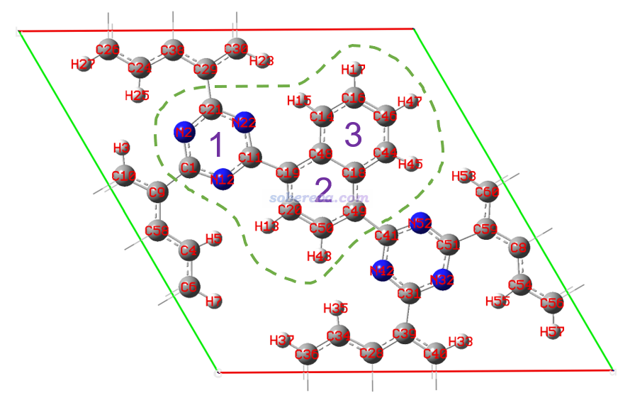
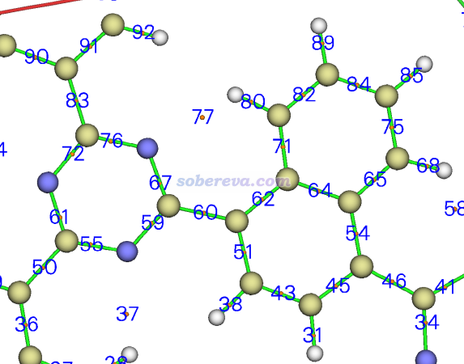
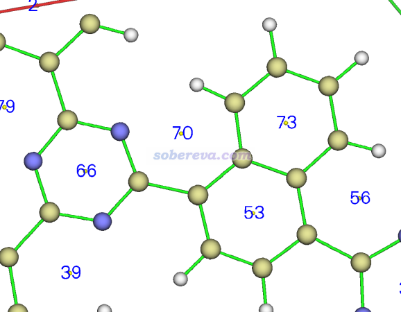
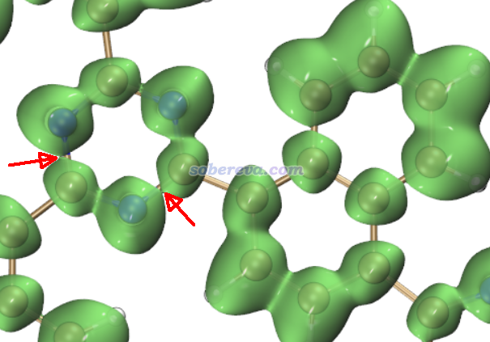
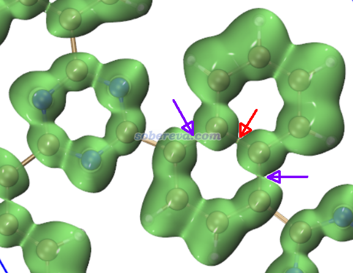
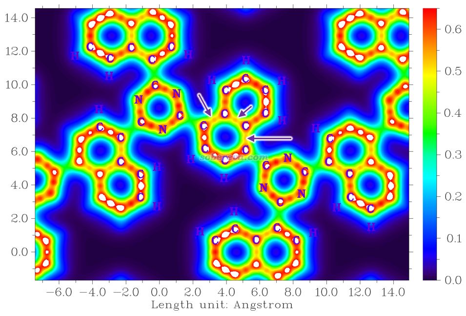

**使用Multiwfn考察周期性体系的芳香性**  
Using Multiwfn to study aromaticity for periodic systems

文/Sobereva@[北京科音](http://www.keinsci.com)  2024-Jul-31

## 0 前言

衡量化学体系的芳香性的方法非常多，见《衡量芳香性的方法以及在Multiwfn中的计算》（<http://sobereva.com/176>）。研究芳香性的文章数目甚巨，但大多数都是对分子、原子团簇这样的孤立体系研究的，主要在于很少有程序能够支持将衡量芳香性的方法用于周期性体系。如今Multiwfn已经可以将很多方法用于周期性体系了，包括多中心键级、AV1245、AVmin、PDI、FLU、FLU-pi、PLR、HOMA、Bird、ELF二分值、Shannon芳香性指数、芳香环的环临界点属性，等等，还可以通过绘制LOL-pi函数图像直观考察共轭情况。在本文中，将对其中大部分方法在Multiwfn中的操作进行演示。作为例子的体系是一个共价有机框架化合物（COF）的一层，此体系在《使用Multiwfn对周期性体系做键级分析和NAdO分析考察成键特征》（<http://sobereva.com/719>）中已经作为例子分析过，结构如下所示，本文要通过不同方法对比绿色虚线里三个环的芳香性的大小。可见1号环是C3N3，原子序号为1,2,21,22,11,12。2号环和3号环相当于萘片段中的两个六元环，2号环序号为19,20,50,49,18,48，3号环序号为14,48,18,44,46,16。这里序号是按照成键关系排的。

笔者假定读者已经阅读过《衡量芳香性的方法以及在Multiwfn中的计算》充分了解了各种衡量芳香性方法的特征，也假定读者有了Multiwfn的基本使用常识，不了解者建议阅读《Multiwfn入门tips》（<http://sobereva.com/167>）和《Multiwfn FAQ》（<http://sobereva.com/452>）。Multiwfn可以从官网<http://sobereva.com/multiwfn>免费下载，注意务必使用2024-Jul-1及以后更新的版本（注意看Multiwfn启动时的更新日期的提示），否则情况和本文所述不符。

本文涉及的多数芳香性分析方法都是基于波函数的，上面COF这个体系的由CP2K程序在PBE/DZVP-MOLOPT-SR-GTH级别计算得到的molden格式的波函数文件和<http://sobereva.com/719>里用的是一致的，请从此文的链接里下载，是其中的COF-MOS-1_0.molden。此文件的产生方法在此文里也详细说了，不会用CP2K者必须仔细看。顺带一提，通过北京科音CP2K第一性原理计算培训班（<http://www.keinsci.com/KFP>）可以很容易从零上手CP2K。本文涉及到的诸如HOMA这样的芳香性指数是基于几何结构的，只要给Multiwfn提供的文件里包含结构信息就可以，如cif、pdb、xyz、gjf、mol2等常见格式都可以。如果被分析的区域是跨晶胞的，则输入文件必须能给Multiwfn提供晶胞信息，哪些格式能提供晶胞信息见《使用Multiwfn非常便利地创建CP2K程序的输入文件》（<http://sobereva.com/587>）里的说明。

## 2  计算多中心键级

多中心键级是非常好、很严格的考察芳香性的指标。这一节计算一下当前体系中三个六元环的六中心键级，以此考察它们六中心共轭的强弱，这正比于它们的芳香性。多中心键级的概念参看《衡量芳香性的方法以及在Multiwfn中的计算》（<http://sobereva.com/176>）和《使用AdNDP方法以及ELF/LOL、多中心键级研究多中心键》（<http://sobereva.com/138>）。

启动Multiwfn，载入COF-MOS-1_0.molden，然后输入  
25  //离域性与芳香性分析  
1  //多中心键级  
1,2,21,22,11,12  //计算1号环。原子序号按原子连接关系输入  
此时得到多中心键级结果为0.0399。类似地，再分别输入19,20,50,49,18,48 [回车]和14,48,18,44,46,16 [回车]计算2、3号环，多中心键级分别为0.0212和0.0281。

根据六中心键级大小可见此体系中的C3N3环（1号环）的芳香性显著强于六元碳环，而不与C3N3环连接的六元碳环（3号环）的芳香性比与C3N3环连接的六元碳环（2号环）更强。

## 3 计算AV1245和AVmin

AV1245的概念和计算方法在《使用Multiwfn计算AV1245指数研究大环的芳香性》（<http://sobereva.com/519>）中介绍过，这里就不多说了。这里用AV1245算一下前述的三个环的芳香性。

启动Multiwfn，载入COF-MOS-1_0.molden，然后输入  
25  //离域性与芳香性分析  
2  //AV1245  
1,2,21,22,11,12  //计算1号环。原子序号按连接关系输入  
看到以下结果  
AV1245 times 1000 for the selected atoms is    7.35835761  
AVmin times 1000 for the selected atoms is     7.358354 (   11   12    2   21)  
即AV1245乘以1000和AVmin乘以1000都为7.358。

再输入19,20,50,49,18,48计算2号环，结果为  
AV1245 times 1000 for the selected atoms is    4.46380673  
AVmin times 1000 for the selected atoms is     3.441219 (   20   50   18   48)

再输入14,48,18,44,46,16计算3号环，结果为  
AV1245 times 1000 for the selected atoms is    6.30980750  
AVmin times 1000 for the selected atoms is     4.014836 (   46   16   48   18)

可见，无论是从AV1245还是AVmin上来看，芳香性都是1号环>3号环>2号环，这和多中心键级的结论完全一致。

## 4 计算PDI

这一节用PDI衡量芳香性。注意PDI只能用于六元环。Multiwfn中PDI是基于模糊空间定义的离域化指数算的，对周期性体系默认用的是Hirshfeld原子空间划分。

启动Multiwfn，载入COF-MOS-1_0.molden，然后输入  
15  //模糊空间分析  
5  //PDI  
[回车]  //用默认的格点间距计算原子重叠矩阵（AOM）。对较大体系可以用更大的比如0.35 Bohr格点间距明显节约这一步的计算时间，对结果影响甚微  
1,2,21,22,11,12  //第一个环里的原子序号  
结果如下

Delocalization index of     1(C )   --   22(N ):    0.104520  
Delocalization index of     2(N )   --   11(C ):    0.104520  
Delocalization index of    21(C )   --   12(N ):    0.104520  
PDI value is    0.104520

再依次输入19,20,50,49,18,48 [回车]和14,48,18,44,46,16 [回车]分别计算第2、3个环的PDI，结果分别为0.083658和0.096507。PDI越大芳香性越强，可见PDI给出的芳香性大小的结论也是1号环>3号环>2号环。

## 5 计算FLU和FLU-pi

先计算FLU芳香性指数。启动Multiwfn，载入COF-MOS-1_0.molden，然后输入  
15  //模糊空间分析  
6  //FLU  
[回车]  //用默认的格点间距计算原子重叠矩阵（AOM）  
现在从屏幕上可以看到做FLU计算用的参数。输入第一个环里的原子序号1,2,21,22,11,12，得到如下结果

        Atom pair         Contribution          DI  
   1(C )  --    2(N ):       0.000800        1.474298  
   2(N )  --   21(C ):       0.000312        1.508760  
  21(C )  --   22(N ):       0.000800        1.474298  
  22(N )  --   11(C ):       0.000312        1.508761  
  11(C )  --   12(N ):       0.000800        1.474298  
  12(N )  --    1(C ):       0.000312        1.508761  
FLU value is    0.003335

再依次输入19,20,50,49,18,48 [回车]和14,48,18,44,46,16 [回车]分别计算第2、3个环的FLU，结果分别为0.017882和0.012199。由于FLU越小芳香性越强，因此FLU的芳香性大小的结论是1号环>3号环>2号环，和前述芳香性指标结论相同。

下面再来计算FLU-pi。算这个需要告诉Multiwfn当前体系的所有pi占据轨道序号。可以按照《使用Multiwfn观看分子轨道》（<http://sobereva.com/269>）肉眼一个个看来记录序号，但太麻烦。建议按照《在Multiwfn中单独考察pi电子结构特征》（<http://sobereva.com/432>）介绍的做法自动指认。启动Multiwfn，载入COF-MOS-1_0.molden，然后输入  
100  //其它功能（Part 1）  
22  //自动检测pi轨道  
0  //当前轨道是离域的（分子/晶体轨道属于这类）  
马上Multiwfn就显示了占据的pi轨道序号，为47,50,60,61,64,70-73,77,81,82,84-89,92-94。下面计算FLU-pi，接着输入  
0  //对识别出的pi轨道什么都不做  
0  //返回主菜单  
15  //模糊原子空间分析  
7  //FLU-pi  
[回车]  //用默认的格点间距计算原子重叠矩阵（AOM）  
47,50,60,61,64,70-73,77,81,82,84-89,92-94  //pi占据轨道的序号  
之后输入第一个环里的原子序号1,2,21,22,11,12，得到如下结果

Average of DI-pi is    0.387267  
        Atom pair         Contribution          DI  
   1(C )  --    2(N ):       0.000191        0.375470  
   2(N )  --   21(C ):       0.000191        0.399063  
  21(C )  --   22(N ):       0.000191        0.375471  
  22(N )  --   11(C ):       0.000191        0.399063  
  11(C )  --   12(N ):       0.000191        0.375470  
  12(N )  --    1(C ):       0.000191        0.399063  
FLU-pi value is    0.001148

再依次输入19,20,50,49,18,48 [回车]和14,48,18,44,46,16 [回车]分别计算第2、3个环的FLU-pi，结果分别为0.028167和0.026396。由于FLU-pi越小芳香性越强，因此FLU-pi的芳香性大小的结论是1号环>3号环>2号环，和前述芳香性指标结论相同。

## 6 计算HOMA

HOMA是流行的基于环上的键长特征衡量芳香性的方法。给Multiwfn提供的输入文件里有结构信息就行了。由于COF-MOS-1_0.molden里也包含结构信息，所以此例还是用这个作为输入文件。启动Multiwfn，载入COF-MOS-1_0.molden，然后输入  
25  //芳香性分析  
6  //HOMA和Bird芳香性指数  
0  //开始计算HOMA（基于默认参数）  
现在屏幕上显示了计算HOMA用的参数。输入第一个环里的原子序号1,2,21,22,11,12，得到如下结果

        Atom pair         Contribution  Bond length(Angstrom)  
   1(C )  --    2(N ):      -0.003592        1.349180  
   2(N )  --   21(C ):      -0.001191        1.342742  
  21(C )  --   22(N ):      -0.003592        1.349181  
  22(N )  --   11(C ):      -0.001191        1.342741  
  11(C )  --   12(N ):      -0.003592        1.349181  
  12(N )  --    1(C ):      -0.001191        1.342741  
HOMA value is    0.985651

可见HOMA为0.985651，并且环上各个键的键长以及对HOMA的贡献量都给出了。再依次输入19,20,50,49,18,48 [回车]和14,48,18,44,46,16 [回车]分别计算第2、3个环的HOMA，结果分别为0.598160和0.781579。由于HOMA越接近1芳香性越强，因此HOMA的芳香性大小的结论是1号环>3号环>2号环，和前述芳香性指标结论相同。

Bird芳香性指数的计算方法和HOMA非常类似，只不过是在主功能25里的子功能6里选择2而非此例的0而已，这里就不演示了。

## 7 计算Shannon芳香性指数

Shannon芳香性指数是基于被考察的环上的各个键的键临界点的电子密度定义的，因此计算它之前必须先用Multiwfn搜索临界点。这方面的操作在《使用Multiwfn结合CP2K做周期性体系的atom-in-molecules (AIM)拓扑分析》（<http://sobereva.com/717>）里有详细说明，这里就不对细节做具体介绍了。

启动Multiwfn，载入COF-MOS-1_0.molden，然后输入  
2  //拓扑分析  
3  //用每一对原子连线的中点作为初猜点搜索临界点  
0  //在图形窗口里查看结果

在图形界面里要求只显示(3,-1)临界点，也就是键临界点，并且要求把临界点序号显示出来，看到下图。可见第一个环上的临界点序号为72,76,67,59,55,61。

点击图形界面右上角的Return按钮，然后输入  
20  //计算Shannon芳香性  
72,76,67,59,55,61  //第1个环上的BCP序号  
马上看到结果：

Electron density at CP 72:   0.3352748688  Local entropy:   0.2993061920  
Electron density at CP 76:   0.3318277479  Local entropy:   0.2979424307  
Electron density at CP 67:   0.3352750629  Local entropy:   0.2993062683  
Electron density at CP 59:   0.3318276569  Local entropy:   0.2979423945  
Electron density at CP 55:   0.3352752224  Local entropy:   0.2993063310  
Electron density at CP 61:   0.3318279246  Local entropy:   0.2979425011  
Total electron density:   2.0013084835  
Total Shannon entropy:   1.7917461175  
Expected maximum Shannon entropy:   1.7917594692

Shannon aromaticity index:    0.0000133518

即Shannon芳香性指数为0.0000133518，每个键临界点的电子密度和局部熵也都给出了，这些是计算Shannon芳香性指数的中间量。

类似地也输入第2、3个环上的键临界点的序号，分别为62,64,54,45,43,51和64,71,82,84,75,65，结果分别为0.0013759152和0.0010309007。由于Shannon芳香性指数越小芳香性越强，因此芳香性大小的结论是1号环>3号环>2号环，和前述芳香性指标结论相同。

## 8 基于环临界点属性判断芳香性

在某个环中央区域的环临界点位置上，若垂直于环的方向上电子密度曲率越负，说明这个环的芳香性越强。这种判断芳香性的方法需要利用AIM拓扑分析得到的环临界点的属性。为了用这种分析，和上一节一样先用主功能2做拓扑分析，然后在选项0里只显示(3,+1)临界点，即环临界点，看到的图如下。可见第1、2、3号环的环临界点序号分别为66、53、73。

关闭图形窗口后输入  
21  //计算顺着某个方向的电子密度梯度和曲率  
66  //第1个环的环临界点序号  
1  //指定某个方向  
0,0,1  //当前体系平行于XY平面，因此计算Z方向的电子密度的梯度和曲率  
结果如下

Electron density is                            0.0287379670 a.u.  
Electron density gradient is                   0.0000000000 a.u.  
Electron density curvature is                 -0.0261250099 a.u.

可见，在第一个环的环临界点位置上垂直于这个环的电子密度曲率为-0.0261250099 a.u.。类似地再使用这个功能考察第2、3个环分别对应的第53、73号环临界点垂直于环平面的电子密度曲率，结果分别为-0.0154770974和-0.0159388407 a.u.。由于数值越负芳香性越强，因此芳香性大小的结论是1号环>3号环>2号环，和前述芳香性指标结论相同。

## 9 ELF-pi二分点考察芳香性

这一节通过各个环上ELF-pi函数的等值面首次发生二分的ELF-pi数值（ELF-pi二分值）来衡量芳香性的大小。这个值既可以通过反复微调等值面数值来获得，也可以通过对ELF-pi做拓扑分析来获得，前者更直观，后者更精确，相关信息见《在Multiwfn中单独考察pi电子结构特征》（<http://sobereva.com/432>）。这一节演示前者的做法。

首先需要产生ELF-pi的格点数据。启动Multiwfn，载入COF-MOS-1_0.molden，然后输入  
100  //其它功能（Part 1）  
22  //检测pi轨道  
0  //轨道都是离域形式  
2  //设置其它轨道占据数为0  
0  //返回主菜单  
5  //计算格点数据  
9  //ELF  
9  //利用晶胞平移矢量定义格点信息  
[回车]  //坐标原点为(0,0,0)  
[回车]  //盒子三个方向尺寸和相应晶胞边长一致  
0.15  //用较精细的0.15 Bohr格点间距，使得通过观看等值面获得二分值能尽可能准确  
2  //将格点数据导出为cube文件

现在当前目录下就有了ELF.cub，对应ELF-pi的格点数据。用VMD显示其等值面（不会操作的话用《在VMD里将cube文件瞬间绘制成效果极佳的等值面图的方法》<http://sobereva.com/483>里提供的脚本）。选Display - Orthographic用正交视角，在Graphics - Representation里将等值面数值（isovalue）由小到大调节，会发现在等值面数值为0.761的时候正好1号环上等值面首次发生二分，位置如下图箭头所示。因此1号环的二分点数值为0.761。

由上图可见，在1号环ELF-pi等值面二分的时候，2、3号环早就发生了二分、等值面间间隔已经很大了，这说明1号环的芳香性远强于2、3号环。

再将等值面数值调节到0.623，会看到2、3号环上首次出现了ELF-pi的二分，如下图红色箭头所示。这个键是被两个六元环共享的，怎么区分哪个芳香性更强？这需要再看其它的键。在下图紫色箭头所示的2号环上的位置，只要等值面数值再增加一点点就会二分，而3号环就没有这个情况，说明3号环的芳香性比2号环更强、环上的电子共轭遇到的瓶颈更少。因此ELF-pi的分析结论和其它方法完全一致。

## 10 LOL-pi图形分析

作为前述分析的扩展和补充，这一节绘制LOL-pi图直观展示一下单层COF体系的pi共轭情况，这能十分清楚地让大家理解三个环上电子离域特征的差异。这种分析在前述的《在Multiwfn中单独考察pi电子结构特征》文中有大量介绍，在笔者的Theor. Chem. Acc, 139, 25 (2020)中也有很多例子，欢迎阅读和引用。

启动Multiwfn并载入COF-MOS-1_0.molden后，依次输入  
100  //其它功能（Part 1）  
22  //检测pi轨道  
0  //轨道都是离域形式  
2  //设置其它轨道占据数为0  
0  //返回  
4  //绘制平面图  
10  //LOL  
1  //填色图  
[回车]  //用默认的格点数  
1  //XY平面  
4.25  //当前体系中的原子都在Z=3.25位置，绘制平面上方1 Bohr处的图像显然应该设Z=4.25 Bohr

利用后处理菜单对作图效果的一番调节，得到下图。如果不会调的话，仔细把Multiwfn手册4.4节的所有例子都仔细领会了，结合后处理菜单中提示得很清楚的选项名字去理解，自然就明白了。当前用的色彩刻度是0到0.65，超过上限的区域显示为白色。

由上图可见，在1号环上pi共轭很显著，LOL-pi在环上分布得比较均匀。而如图上我标注的箭头所示，2号环上有三个键的pi共轭显著低于其它地方，因此这个环上的六中心pi共轭作用明显受到了很大遏制。而3号环上的pi共轭整体相对好点，但也不是很均匀，而是在不同键上有大有小，所以芳香性只是介于1和2号环之间。

## 11 总结

Multiwfn支持极为丰富的考察化学体系芳香性的方法，本文对其中已支持周期性体系的大部分方法的操作过程进行了简明扼要的演示。从结果可见尽管这些方法思想差异很大，但对于当前研究的这个体系中的三个六元环，它们给出的芳香性顺序完全一致，互相印证了彼此的可靠性。当然对于一些特殊情况，由于一些方法原理上的局限性、稳健性和普适性的不足也有可能导致结果存在差异。本文示例的只是一个很标准、简单的体系，希望大家能充分举一反三，将Multiwfn应用于广泛体系的芳香性的研究中。

**使用Multiwfn做任何分析在发表文章时都请务必记得按照程序启动时的提示恰当引用Multiwfn原文，给别人代算时也必须明确告知对方这一点。**
