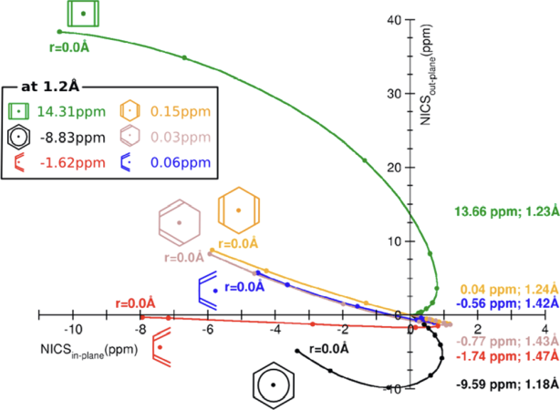
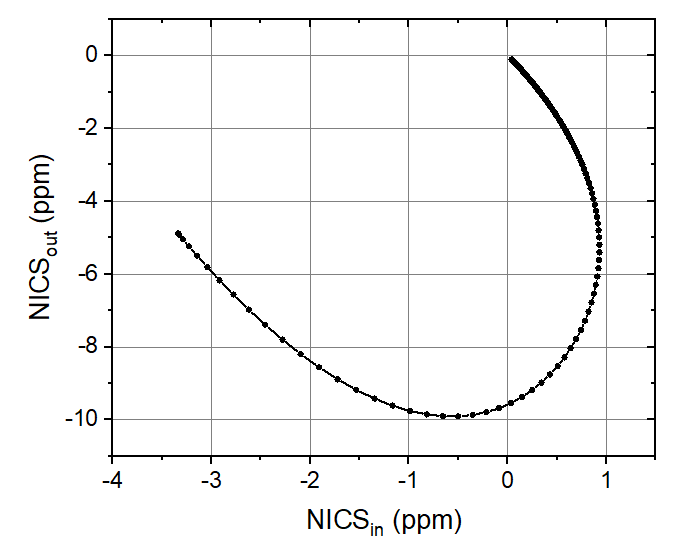

**使用Multiwfn计算FiPC-NICS芳香性指数**  
Using Multiwfn to calculate FiPC-NICS aromaticity index

文/Sobereva@[北京科音](http://www.keinsci.com)  2024-Aug-21

## 0 前言

笔者之前在《衡量芳香性的方法以及在Multiwfn中的计算》（<http://sobereva.com/176>）里介绍过大量衡量化学体系芳香性的方法，其中NICS十分流行，并且有大量变体。本文将介绍Inorg. Chem., 53, 3579 (2014)提出的一种和NICS密切关联的芳香性指数，称为free of in-plane component NICS (FiPC-NICS)，不仅比最原始的NICS(0)强得多，比认可度很高的NICS(1)ZZ在原理上也更好。笔者之前写过《使用Multiwfn绘制一维NICS曲线并通过积分衡量芳香性》（<http://sobereva.com/681>），如今Multiwfn对此文介绍的功能进行了扩展，在后处理菜单中新加入了计算FiPC-NICS的功能。

下面就介绍FiPC-NICS方法的思想，并给出在Multiwfn中计算的完整实例。上面提到的博文如果还没看过的话一定要先仔细看一看，笔者假定读者已经读过了。Multiwfn可以在官网<http://sobereva.com/multiwfn>免费下载。如果对Multiwfn不了解，建议阅读《Multiwfn入门tips》（<http://sobereva.com/167>）和《Multiwfn FAQ》（<http://sobereva.com/452>）。使用Multiwfn计算FiPC-NICS用于发表文章的话必须按照Multiwfn启动时的提示恰当引用Multiwfn的原文，给别人代算时也必须明确告知这一点。

## 1 原理

对于一个平面体系（至少是对于计算NICS的区域来说是局部平面的体系），任意一个点计算的NICS可以视为平行于环的in-plane分量（NICS_in）和垂直于环的out-of-plane分量（NICS_out）之和。假设环平面平行于XY平面，有以下关系  
NICS = NICS_in + NICS_out = (NICS_XX + NICS_YY + NICS_ZZ)/3  
NICS_in = (NICS_XX + NICS_YY)/3  
NICS_out = NICS_ZZ/3  
其中诸如NICS_ZZ等于相应位置的磁屏蔽张量的ZZ分量的负值。

FiPC-NICS原文认为NICS_in对环中定域化的电子（内核电子、sigma键的电子、孤对电子）敏感，而芳香性本质上来自于电子在环上的离域，那些定域化的电子对芳香性实质上是没有贡献的。因此，如果以NICS的方式来衡量芳香性，不应当纳入NICS_in部分。但也不是从环中心出发垂直于环方向上随便找个地方计算NICS_out就行，如果距离环中心太远，则NICS_out数值太小、对芳香性不敏感；而如果距离环中心太近，则定域化的电子会“污染”NICS_out，导致它不能充分反映芳香性。因此Inorg. Chem., 53, 3579 (2014)提出一种较严格地利用NICS思想衡量芳香性的指数FiPC-NICS，它定义为从环中心出发垂直于环的扫描路径上NICS_in为0的位置的NICS_out值，这可以尽可能避免定域化的电子产生的影响。

很常用的NICS(1)ZZ和FiPC-NICS有密切联系。设NICS_in为0的位置距离环中心垂直距离为x，则FiPC-NICS=[NICS(x)ZZ]/3。根据原文的测试，对于碳环的情况，x在1.2埃左右，和计算NICS(1)ZZ所用的x=1埃相近。这也体现出NICS(1)ZZ用于衡量芳香性的内在合理性，即统一用距离环中心1埃处来计算NICS_ZZ是个近似合适的位置。而对于非碳环类体系，考虑到不同元素原子大小的差异，用FiPC-NICS来对比芳香性会比用NICS(1)_ZZ更为严格。

如《使用Multiwfn绘制一维NICS曲线并通过积分衡量芳香性》（<http://sobereva.com/681>）、《基于Gaussian的NMR=CSGT任务得到各个轨道对NICS贡献的方法》（<http://sobereva.com/670>）和《将核独立化学位移(NICS)分解为sigma和pi轨道的贡献》（<http://sobereva.com/145>）所述，计算NICS时还可以只考虑pi电子的贡献，pi电子对芳香性是有真正贡献的电子。因此至少对于碳环类体系来说，只考虑pi电子贡献的NICS(1)ZZ有可能比FiPC-NICS在衡量芳香性上还更理想，但FiPC-NICS原文没有进行对比。FiPC-NICS相对来说好处是在程序实现上更容易，不需要考虑量子化学程序是否支持将pi和非pi贡献在NMR计算时进行分离，也不需要事先确定pi轨道序号。

FiPC-NICS原文还提出将NICS_in和NICS_out绘制成相关图的思想，如下所示，横坐标是NICS_in值，纵坐标是NICS_out值，图中每个点对应于从环中心出发垂直于环扫描路径上的一个点。扫描从环中心开始，对应下图最左端（r=0.0Å处）。图中各个体系的曲线都是逐渐收敛到(0,0)位置，因为距离环中心很远处NICS的各个分量都会收敛到0。图中黑线是最典型的芳香性分子苯，可见曲线是下凹的，绿线是最典型的反芳香性分子环丁二烯，可见曲线是上凸的，而其它都是非芳香性分子，曲线接近直线。由此可见，不同芳香性特征的分子的这种NICS_in vs. NICS_out相关性图的特征截然不同，这给判断芳香性提供了一个新的手段，值得借鉴。

## 2 实例

下面我们就通过Multiwfn结合Gaussian来计算一下FiPC-NICS。Gaussian用的是16 C.02版，Multiwfn是2024-Jul-13版。下面牵扯到的大多数操作和《使用Multiwfn绘制一维NICS曲线并通过积分衡量芳香性》是一致的，所以就不详细解释了。所有用到的文件都可以在<http://sobereva.com/attach/724/file.rar>中得到。我们试图重现FiPC-NICS原文里苯的计算结果，本例使用和原文中相同的PBE0/6-311++G**计算级别。

启动Multiwfn，输入  
opt.out  //这是Gaussian 16对苯在PBE0/6-311++G**下做几何优化得到的输出文件，在本文的文件包里。Multiwfn会读取最后一步的结构，分子平面平行于XY  
25  //芳香性与离域性分析  
13  //NICS-1D扫描、积分与FiPC-NICS计算  
2    //通过一批原子定义环，将扫描的两个端点置于环中心上方和下方一定距离处，且连线垂直穿越环中心  
1-6   //用于1-6号碳原子定义环  
[回车]  //用环上的原子的几何中心作为环中心  
0  //首端位于环中心  
10  //另一个端点位于环上方10埃处  
200  //扫描的点数。此例相当于每隔约0.05埃一个点，足够精细了。点数越多计算越耗时  
1  //产生Gaussian输入文件  
template_NMR_6-311++Gxx.gjf  //这是Gaussian做NMR计算的模板文件，在本文的文件包里。打开它便知计算是在PBE0/6-311++G**下进行的，和普通输入文件唯一的差异是坐标部分用[geometry]代替

当前目录下现在出现了NICS_1D.gjf。用Gaussian运行之，得到NICS_1D.out。然后在Multiwfn中接着输入  
2  //读取NICS-1D扫描结果  
NICS_1D.out  //在本文的文件包里  
6  //计算FiPC-NICS

现在在屏幕上看到以下结果，说明FiPC-NICS为-9.58 ppm，是在苯环中央上方1.192埃处计算出来的。  
FiPC-NICS is   -9.577714 ppm, at   1.192 Angstrom

FiPC-NICS原文中的结果为-9.59 ppm，位于环中心上方1.18埃，可见我们计算的与文献相符极好（文献用的是Gaussian 09）。

Multiwfn在当前目录下还输出了FiPC-NICS.txt文件，其中一部分内容如下。第1列是扫描的点的序号，第二列是距离环中心的距离，第3、4列分别是NICS_in和NICS_out。

...略  
   20     0.955   -0.656100   -9.899500  
   21     1.005   -0.500933   -9.902900  
   22     1.055   -0.354133   -9.864733  
   23     1.106   -0.215967   -9.788600  
   24     1.156   -0.086633   -9.678467  
   25     1.206    0.033833   -9.538367  
   26     1.256    0.145400   -9.372367  
   27     1.307    0.248267   -9.184367  
...略

对FiPC-NICS.txt最后两列在Origin里绘制scatter+line图，如下所示，可见和上一节展示的FiPC-NICS原文里的图1中的苯的曲线完全吻合！

## 3 总结

本文介绍了FiPC-NICS芳香性指数，它比常用的NICS(1)ZZ更为严格，尤其是对于讨论无机的环状区域来说（例如FiPC-NICS原文里讨论的N和P交替构成的六元环）。从例子可见通过Multiwfn计算这个指数以及绘制NICS_in vs. NICS_out扫描图的过程相当容易，值得大家在实际芳香性研究中考虑使用。

注意用这个功能时扫描路径必须平行于X或Y或Z轴，如果环平面不平行于某个笛卡尔平面的话，需要利用《Multiwfn中非常实用的几何操作和坐标变换功能介绍》（<http://sobereva.com/610>）中介绍的功能令要考察的环平行于某个笛卡尔平面，并且模板文件里应带上nosymm关键词避免Gaussian自动旋转朝向，参考《谈谈Gaussian中的对称性与nosymm关键词的使用》（<http://sobereva.com/297>）。

使用Multiwfn计算FiPC-NICS用于发表文章的话请记得按照程序启动时的提示恰当引用Multiwfn的原文。
