**18个氮原子组成的环状分子长什么样？一篇文章全面揭示18氮环的特征！**  
What does a ring molecule composed of 18 nitrogen atoms look like? A paper fully reveals the characteristics of cyclo[18]nitrogen!

文/Sobereva@[北京科音](http://www.keinsci.com)  2024-Aug-31

## 0 前言

2019年首次在凝聚相中发现的18个碳原子相连构成的环状体系18碳环（cyclo[18]carbon）已经广为知晓，笔者对此体系及衍生物陆续做过大量理论研究，成果汇总见<http://sobereva.com/carbon_ring.html>。在研究18碳环的过程中有一个问题引发了笔者的好奇心：18个氮原子形成的18氮环（cyclo[18]nitrogen）会是什么结构？能否存在？具有什么性质？之前无论是实验还是理论研究，都完全没有18氮环或其它的较大的纯氮环体系的报道。无疑通过量子化学计算和电子波函数分析回答这些问题非常有理论和实际意义。应ChemPhysChem期刊的邀请，笔者近期在此期刊上发表了18氮环的专题研究，欢迎阅读和引用：

Tian Lu, Theoretical Prediction and Comprehensive Characterization of an all-Nitrogenatomic Ring, Cyclo[18]Nitrogen (N18), *ChemPhysChem*, **25**, e202400377 (2024) DOI: 10.1002/cphc.202400377

此文可以在此免费在线阅读：<https://onlinelibrary.wiley.com/share/author/YPJDJ5XPMVT8SD7VDDYQ?target=10.1002/cphc.202400377>

下面，笔者将对这篇文章的关键内容进行深入浅出的介绍，同时对研究思想和细节做一些补充说明，以帮助读者更好、更容易地理解这篇文章的工作。此文的研究内容和手段对于理论探究其它特征新奇的物质也很有借鉴意义。

## 1 18氮环的构型

理论研究一个完全未知的物质，最先要研究的是它的几何结构，然后再说其它的。有的体系有可能存在多个有意义的极小点构型，就都得优化出来并对比能量，以弄清楚哪个是热力学上最稳定的、最需要关注的，以及不同构型的分布比例如何。ωB97XD/def2-TZVP是优化大部分体系很靠谱的级别，笔者之前做过的18碳环及各种衍生物的研究也都是用这个级别优化，因此对18氮环也首先用Gaussian 16在这个级别下做了优化，总共得到了以下结构，三个极小点分别对应C1、D3、D9点群。图中为了令其结构特征看得尽可能清楚，给了俯视图和侧视图，并且让分子最大程度平行于XY平面，并在VMD里根据Z坐标按照色彩刻度条进行了着色。可见，18氮环的极小点结构并不是18碳环那样严格纯平面的，而是弯折的，这和18氮环具有孤对电子而缺乏全局离域的pi电子有关，详见后文。

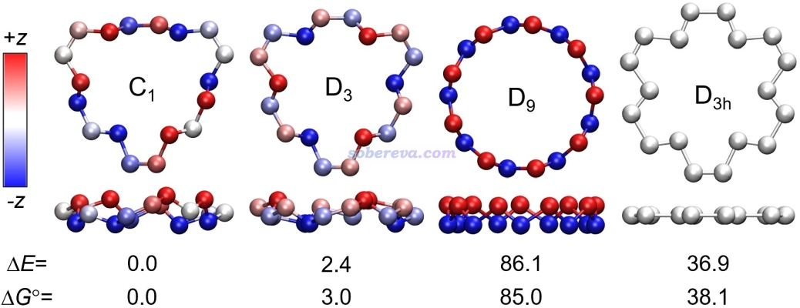

此文用ORCA在非常精确的DLPNO-CCSD(T1)/cc-pVQZ级别下对上述优化完的结构计算了电子能量，不同构型间相对电子能量如图中的ΔE所示（kcal/mol）。文章还利用Shermo程序（<http://sobereva.com/552>）计算了标况下的自由能热校正量并与电子能量相加得到自由能，标况下的相对自由能如图中ΔG所示（kcal/mol）。可见，能量关系是D9>>D3>C1。因此看似结构理想、对称性特别高、像皇冠一样的D9结构实际上无法在现实中出现。根据《根据Boltzmann分布计算分子不同构象所占比例》（<http://sobereva.com/165>）介绍的方法，可以算出标况下D3的出现比率也可以忽略不计，C1和它出现比率是158:1。所以本文后面的研究基本都只基于C1结构来做。

为了确认是否有比上述C1能量更低的18氮环的结构，此文还借助molclus程序（<http://www.keinsci.com/research/molclus.html>）做了构型搜索。具体来说，此文在相对便宜的ωB97XD/def2-SVP级别下控温在较高温度跑了5 ps从头算动力学模拟对势能面进行采样，每隔0.4 ps提取一帧用molclus做批量优化，最后发现所有结构都收敛到了C1，因此可以确信不存在能量更低的结构。注：实测ωB97XD/def2-SVP级别会严重高估18氮环的解离势垒，所以用较高温度跑动力学时也不至于出现解离。

可能有读者想问上述三种极小点结构是怎么获得的。由于18氮环实际长什么样事先完全无法估计，笔者的做法是把18碳环里面每个碳都替换为氮，然后反复进行优化和做消虚频的操作，最终找出无虚频的结构。这个过程中会遇到同时存在许多虚频的结构，虚频大多都会破坏局部对称性，这种情况消虚频常用的做法是按照虚频模式调结构并重新优化，反复如此直到没有任何虚频，这在《Gaussian中几何优化收敛后Freq时出现NO或虚频的原因和解决方法》（<http://sobereva.com/278>）中专门说过。取决于以这种方式消虚频的消除顺序，最终得到的无虚频结构可能不同。前述的三种极小点结构是以不同方式调结构消虚频得到的。这么搞不排除遗漏某些极小点的可能，但由于做前述的构型搜索过程中并没有得到其它能量较低构型，因此可以认为至少不存在值得关注的其它能量很低的极小点结构。

前面图中最右边的D3h点群的结构是消除了所有破坏环平面的虚频后的结构，它依然有平面内的虚频。它的能量明显也很高。18氮环不仅能量最低结构不是纯平面的，纯平面结构就连对应的极小点都没有。

毕竟18氮环是个新颖的体系，为了100%确保ωB97XD优化的结构合理，此文还在常用的B3LYP-D3(BJ)、PBE0-D3(BJ)、M06-2X泛函下，以及可靠且昂贵的CCSD级别下也都做了优化（对比见补充材料），结果和ωB97XD的高度一致，而且T1诊断体现出18氮环的极小点结构的多参考特征不强而没必要用多参考方法，因此可以认为本文给出的结构是非常可靠的，笛卡尔坐标在补充材料里提供了。

此文利用《使用Multiwfn计算Bond length/order alternation (BLA/BOA)和考察键长、键级、键角、二面角随键序号的变化》（<http://sobereva.com/501>）介绍的方法，利用Multiwfn很便利地得到了整个环上的键长、键角的变化图，如下所示，这从定量层面更进一步展现了18氮环的结构特征。由左图可见，18氮环上的N-N键键长是很明显长-短交替变化的，这也体现出N-N键的强弱是显著交替变化的，这从后文对成键本质的分析上可以了解原因。值得一提的是18碳环也具有类似的明显长-短交替的C-C键。D9结构的较长N-N键比C1结构中的明显更长，一定程度体现出D9的稳定性更弱、更易解离。从键角变化来看，C1和D3极小点结构的键角是在一定范围内波动的，而高对称性的D9中所有键角等同，而且比所有的C1和D3的键角都明显要小。这过小的键角无疑是为了满足其高对称性所致，也必定会因此带来明显的键角张力，这是D9具有很高能量的关键原因。

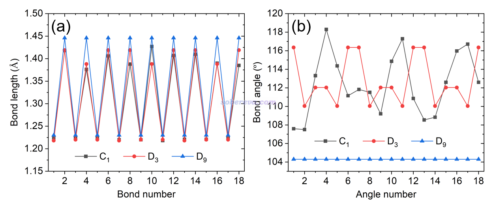

## 2 18氮环的动力学稳定性

为了研究18氮环的动力学稳定性，以及它的分解机理，此文对C1结构的一个较长的N-N键按照《详谈使用Gaussian做势能面扫描》（<http://sobereva.com/474>）说的方法进行了逐渐拉长的柔性扫描，发现在扫描路径上有个极大点，并且根据它和后面一个点的结构可以确认它适合作为搜索解离过程的过渡态的初猜，果然基于它进一步优化过渡态后得到了对应于18氮环解离的过渡态，并由此按照《在Gaussian中计算IRC的方法和常见问题》（<http://sobereva.com/400>）中的做法进一步跑了IRC，而且要求IRC尽可能跑得完整、理想。下图是在ωB97XD/def2-TZVP级别下跑的IRC曲线，以及过渡态和IRC最后一帧的结构。过渡态标记为C1-TS，它具有的唯一虚频对应的振动模式按照《在VMD中绘制Gaussian计算的分子振动矢量的方法》（<http://sobereva.com/567>）的做法用黄色箭头绘制了出来。可以看到18氮环的解离不是一次只断一个N-N键，而是三个N-N键同时断开（虚频模式对应它们仨同时显著的伸缩运动），直接解离产物是两个氮气分子和一个14个氮组成的链状结构。

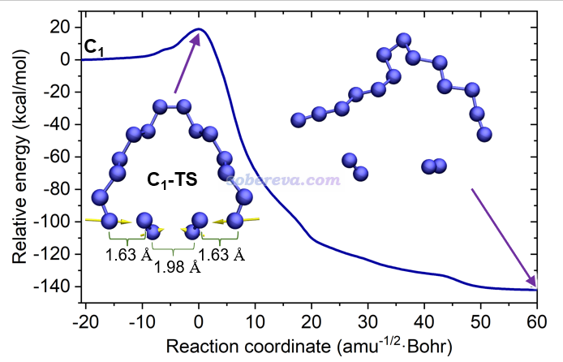

上面的IRC图左端对应C1结构，以它为能量零点，可见这个反应经历了18.9 kcal/mol的势垒。实际上这个势垒数据并不准确。笔者在高精度的DLPNO-CCSD(T1)/cc-pVQZ级别下对过渡态和C1极小点结构计算了电子能量并求差，得到的高精度势垒是8.8 kcal/mol，明显ωB97XD/def2-TZVP严重高估了势垒。再进一步考虑自由能热校正量后，得到的高精度的标况自由能垒是4.4 kcal/mol。将之代入《基于过渡态理论计算反应速率常数的Excel表格》（<http://sobereva.com/310>）提供的表格里计算反应速率常数，可知常温下18氮环解离的反应速率常数是3.7E9 /s，对应于半衰期为180 ps。因此，在常温下18氮环的寿命极短，转瞬即解离。然而，在很低温下它则具有一定稳定性，例如70 K的时候自由能垒为5.5 kcal/mol，对应于半衰期为14.8小时（如果再考虑隧道效应会更短）。所以在极低温下产生并检测到18氮环还是有希望的。

## 3 18氮环的分子动力学行为

前面都是从静态角度研究18氮环。为了了解其动力学行为，以及从动态角度考察解离过程，此文按照《使用ORCA做从头算动力学(AIMD)的简单例子》（<http://sobereva.com/576>）介绍的做法做了从头算动力学模拟。如前所述，ωB97XD/def2-TZVP严重高估了解离势垒，势必会导致在动力学过程中严重高估结构的稳定性，因此必须选择一个又足够便宜又能较好符合DLPNO-CCSD(T1)/cc-pVQZ高精度计算的势垒的级别。测试发现B3LYP-D3(BJ)/def2-SVP可以满足这个要求，因此AIMD在此级别下做。

下图左侧是在300K下模拟20 ps过程中18氮环的结构变化，用VMD绘制，每1 ps绘制一次并叠加显示，根据模拟时间按照蓝-白-红着色以区分。可见在算得动的很有限的模拟时间尺度内，18氮环的骨架结构保持得较好，始终都在C1极小点结构附近波动。

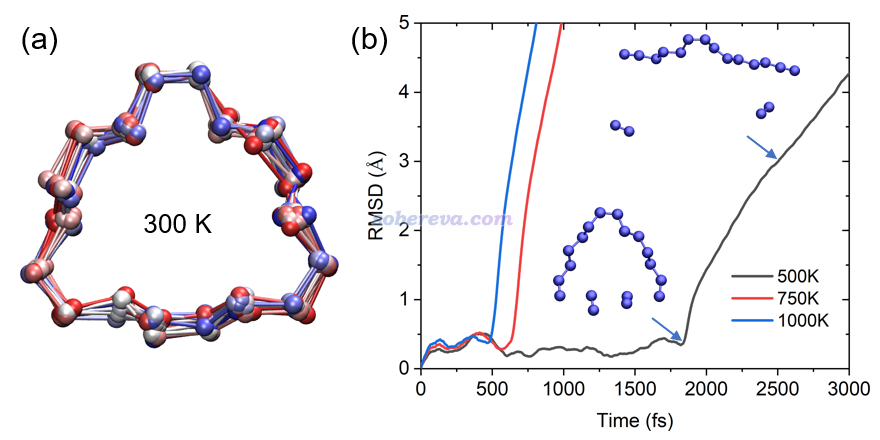

上图右侧是分别在较高的500K、750K、1000K下模拟得到的轨迹相对于初始结构的RMSD曲线图。可见三个温度下在前3 ps内都发生了解离，而且温度越高解离时间越早，解离的时刻对应于RMSD突然飙升的位置。从500K曲线上标注的结构可见，在刚解离时，其结构正好和前面优化出的解离过渡态结构C1-TS高度一致，解离产物也和之前跑的IRC的产物端一致，这体现出研究一个反应可以同时在静态和动态两个视角下进行。

温度不光影响解离发生的快慢，还同时影响解离的直接产物。如下图所示，在750K下18氮环不是先解离出两个氮气分子，而是一下子彻底解离成9个氮气分子。这充分体现出18氮环完全解离成氮气在高温下是一瞬间的事，且不经历中间体。

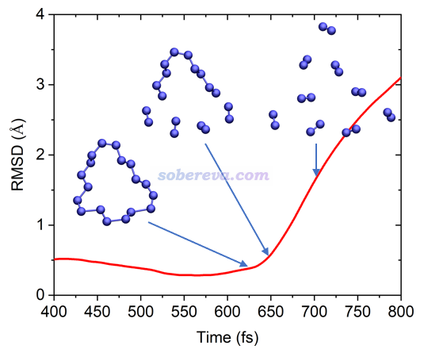

## 4 18氮环的能量相关属性

此文从能量属性角度对18氮环的特征做了一系列考察。首先此文在DLPNO-CCSD(T1)/cc-pVQZ//ωB97XD/def2-TZVP级别下用Shermo计算了18氮环的标况下的生成自由能和生成焓，分别为685.1和598.7 kcal/mol，前者很大体现出从氮气分子直接合成18氮环在热力学上是极度不利的，后者很正体现出当18氮环分解为氮气分子时会释放巨大热量，因此是极为高能的物质。

值得一提的是18氮环并不是N18最稳定的异构体。有前人研究过N3(N5)3分子，和18氮环一样化学组成都是N18，而N3(N5)3的电子能量和标准自由能分别比18氮环低62.3和56.2 kcal/mol。尽管如此，这并不意味着18氮环就一定不能在实验上得到。一方面如前所述，本身18氮环在很低温下就有一定稳定性，另一方面，利用特殊合成手段，亚稳的环状物质本来也可能得到。例如20个碳连成环状的20碳环如今在实验上已经观测到了，然而高精度理论计算指出碗状的C20比环状的C20的能量低得多。

18氮环可以与氧气反应发生燃烧变成NO2气体，此反应计算出的标准反应焓是-426.6 kcal/mol。这体现出若18氮环固体能制备出来，它可以作为可燃材料，而且由于氮气是空气中含量最多的分子，它在原理上还可以无限产生。

环张力是环状分子重要的特征，在《谈谈如何计算环张力能：以CPP和碳单环体系为例》（<http://sobereva.com/698>）里有详细的计算方式的介绍。为了考察18氮环的环张力的大小，此文通过同联反应法计算了其最稳定的C1结构的环张力能，结果为6.3 kcal/mol。相比之下，18碳环的环张力能61.7 kcal/mol以及含有18个碳的[18]环聚乙炔的环张力能70.0 kcal/mol都远大于之，这体现出18氮环环张力能极小，也因此环张力并不是18氮环具有很高能量的原因。之所以它的环张力能相对非常小，在于它由于缺乏整体的pi共轭，使得它的骨架柔性较大，可以自发避免显著形成环张力。

此文还在ωB97XD/aug-cc-pVTZ级别下计算了18氮环的第一垂直电离能、第一垂直电子亲和能、fundamental gap（等于电子硬度）、电子软度和电负性，并与18碳环和氮气分子做了对比，如下表所示。可见18氮环的电离能比氮气分子小得多，主要在于18氮环的较长的N-N键远比氮气分子的N-N键弱得多，因此成键轨道能量较高，自然其电子更容易电离。氮气分子的电子亲和能为负，说明没法再结合额外的电子，这在于它的LUMO轨道是反pi特征，被电子占据后自然会由于削弱成键作用而令能量变得更高。而18氮环的电子亲和能则为正，说明可以再结合电子形成(N18)-阴离子。之所以它还有再额外结合电子的能力，在于它的最低空轨道并不完全对应反pi特征，而是对部分N-N键来说还具有成键轨道特征，因此被电子占据后还能令体系能量变得更低。18氮环的电子软度比氮气分子大很多，说明18氮环的电子整体更容易变形、被极化。与18碳环相比，由VIP和VEA可见18氮环更难失电子而更容易得电子，这也正对应于表中它具有明显更大的电负性，相对来说是更好的电子受体。

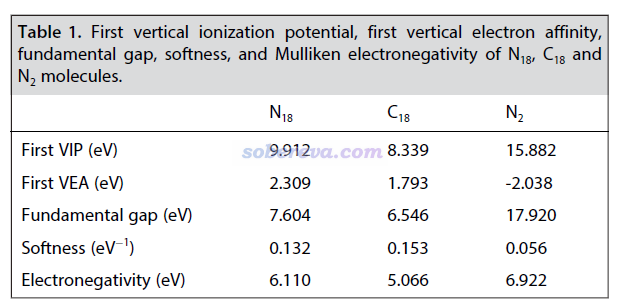

## 5 18氮环的分子光谱

为了令实验化学家在未来可以通过光谱技术检测18氮环，本文理论预测了它的振动光谱和电子光谱。按照《使用Multiwfn绘制红外、拉曼、UV-Vis、ECD、VCD和ROA光谱图》（<http://sobereva.com/224>）的做法用Multiwfn模拟的18氮环的基于谐振近似的红外光谱如下所示。由于C1结构的18氮环不像18碳环那样具有高对称性，因此也没有对称禁阻现象，使得它的光谱特征比碳环类体系的丰富的多。笔者发表的不同尺寸碳环的振动光谱和振动行为的专题研究介绍见《揭示各种新奇的碳环体系的振动特征》（<http://sobereva.com/578>），里面给出了18碳环的红外光谱。相比之下，18氮环不具备18碳环那样在某些振动模式上具有特别强的红外吸收强度的特征。同样在ωB97XD/def2-TZVP级别下做谐振近似的振动分析，18氮环红外强度最强的振动模式的强度是23.7 km/mol，而18碳环则高达224.4 km/mol。

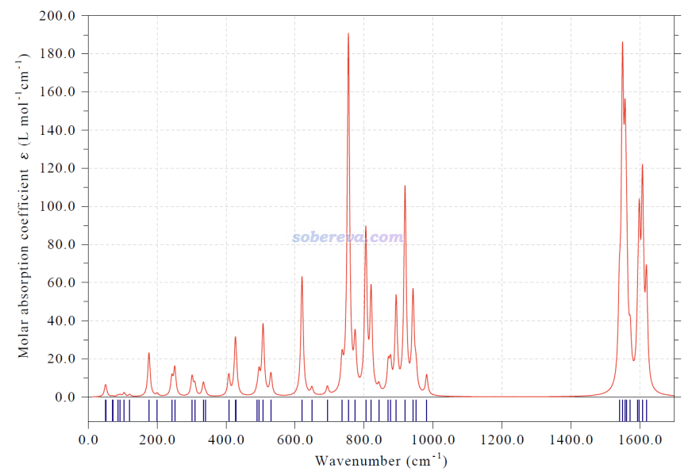

Multiwfn具有绘制分振动态密度图（partial vibrational density-of-state maps, PVDOS)的功能，由此可以了解不同频率范围的振动模式主要对应的是什么区域或什么特征的运动。下图绘制了总的振动态密度图，并且键伸缩、键角弯曲、二面角扭转三类运动模式的PVDOS也分别给出了。可见在整个波数范围内，三类运动模式之间都有显著的耦合，但导致18氮环骨架大幅变化的二面角扭转模式主要贡献的是中、低频部分，而高频部分更多来自于刚性的键伸缩运动模式。

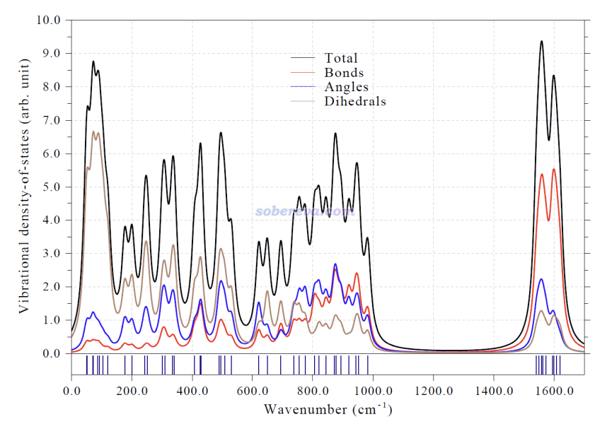

文中还用Multiwfn模拟了18氮环的UV-Vis光谱图，如下所示，使用的是TDDFT结合PBE0/def2-TZVP。对于不牵扯里德堡激发、电荷转移激发的单重态价层激发的情况，PBE0通常是较好选择，没有明显高估和低谷激发能的趋势，这在《乱谈激发态的计算方法》（<http://sobereva.com/265>）里说过。从模拟的谱图上可见18碳环在可见光区的吸收可忽略不计，因此基本上可认为是无色的，起码是对于当前研究的孤立状态来说。PS：想更严格预测可以用《通过量子化学计算和Multiwfn程序预测化学物质的颜色》（<http://sobereva.com/662>》里说的方法。

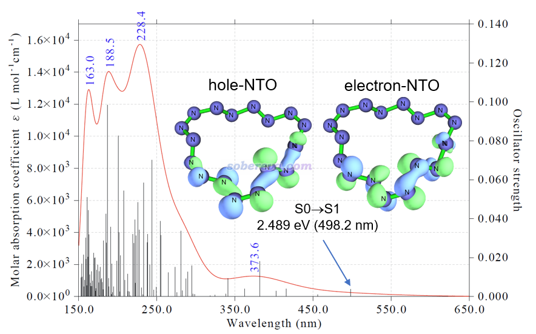

对于18碳环这样基态是单重态的分子，通常最关键的电子激发是S0到S1的激发。为了考察其电子激发本质，文中按照《使用Multiwfn做自然跃迁轨道(NTO)分析》（<http://sobereva.com/377>）所述的方法用Multiwfn对S0-S1激发做了NTO分析，并发现此电子激发基本可以由上图中的hole-NTO到electron-NTO的跃迁来描述。从等值面图可以看出，hole-NTO同时具有孤对电子(n)和sigma轨道的特征，而electron-NTO则只有反pi（pi*）轨道特征，因此S0-S1激发可以认为是n-pi*和sigma-pi*的杂化激发。这种情况对于普通有机体系是极其罕见的，因为其sigma占据轨道能量一般都较低，很难在S0-S1激发中牵扯到。

## 6 18氮环的电子结构

18氮环具有非同寻常的电子结构，这是本文研究的关键重点，必须充分运用波函数分析的手段才能考察。

LOL是一个重要的考察定域化电子出现区域的实空间函数，参见《Multiwfn支持的分析化学键的方法一览》（<http://sobereva.com/471>）里的简介。文中使用Multiwfn绘制了18氮环的LOL函数的0.55的等值面图，如下所示，上面标注的数字是Multiwfn算的Mayer键级值。由此图可以明显看出18氮环有显著的N-N共价键，同时每个氮上还都有显著的孤对电子。

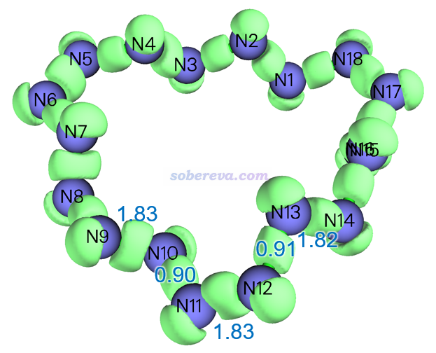

很值得一提的是，前面第1节给出的D3和D9点群的18氮环的几何结构像极了下图所示的[18]annulene和[18]trannulene，它们都有长-短键交替的特征，关键差别在于每个C-H单元在18氮环里对应一个氮原子，也可以视为每个C-H共享的电子对对应于氮原子上的孤对电子。显然，18氮环中的氮原子的杂化状态可以视为与[18]annulene和[18]trannulene中的碳原子一样是sp2杂化。

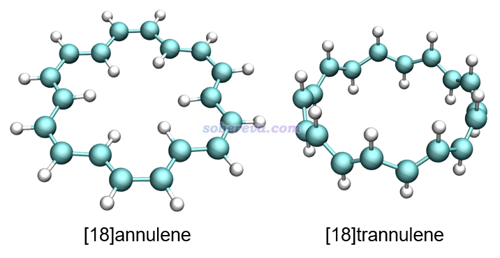

由于18氮环中的孤对电子之间距离较近，因此孤对电子之间可能存在位阻-互斥效应，文中补充材料中S1节对此进行了专门的分析讨论并通过计算证实了这一点。D9结构下孤对电子之间的位阻-互斥效应尤为明显，这是其结构能量很高的另一个原因。

Mayer键级反映了原子间等效的共享电子对数。从前面的LOL等值面图上标注的Mayer键级可见，18氮环中N-N键近似可以视为具有单-双键交替特征。也由此，可以把18氮环的形成用下图来示意，即它是由氮气分子聚合而成的环状产物，聚合过程中每个氮气分子的N-N三键变成双键，并与每一侧的另一个氮气分子形成一个单键。这非常类似于乙炔形成聚乙炔的过程，只不过聚合产生的氮链远没那么稳定。值得一提的是，氮链类物质已经在高压合成的一些晶体中观测到了，只不过目前观测到的物质中氮链都是与过渡金属配位的状态。

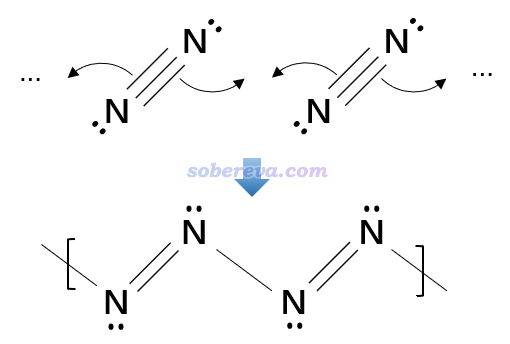

为了能更充分地理解18氮环的成键，文中还使用Multiwfn按照《使用键级密度(BOD)和自然适应性轨道(NAdO)图形化研究化学键》（<http://sobereva.com/535>）和《使用Multiwfn对周期性体系做键级分析和NAdO分析考察成键特征》（<http://sobereva.com/719>）中介绍的NAdO方法对18氮环的N-N键进行了考察。每个化学键的模糊键级可以分解为一系列NAdO轨道的贡献，通过观看NAdO轨道的特征，就可以确切了解键级内在对应了什么样的相互作用。对一个较短和一个较长N-N键进行的NAdO分析的结果如下，只有贡献相对显著（大于0.2）的NAdO轨道被列了出来，括号外的是NAdO轨道对键级的贡献，括号内的是轨道的能量。可见较短的N-N键基本上可以视为一个sigma和一个pi键构成，因为相应的两个NAdO轨道对模糊键级的贡献0.926和0.858都很大且接近1，而其余的NAdO的贡献远远小于它们。对较长N-N键的模糊键级贡献接近1的仅仅有一个sigma特征的NAdO轨道。由此可以看到，18氮环中的N-N键其实在成键特征上并没有什么特别之处，可以近似视为是较典型的sigma+pi双键与sigma单键的交替出现。值得注意的是，如标注的NAdO轨道能量所体现的，较长N-N键的sigma轨道的能量是明显高于较短N-N键的，而且前者对键级的贡献更小，这说明较长N-N键的sigma轨道相对更弱。

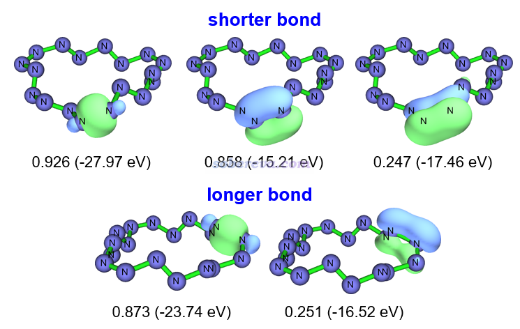

文中还用Multiwfn对18氮环做了AIM拓扑分析，这是讨论化学键非常常用的方法，见《Multiwfn支持的分析化学键的方法一览》（<http://sobereva.com/471>）以及《AIM学习资料和重要文献合集（<http://bbs.keinsci.com/thread-362-1-1.html>）。下图左侧图中橙色小圆球是键临界点（BCP），对具有代表性的一个较长和较短的N-N键的BCP计算的结果如下图右侧所示。BCP位置的电子密度（ρ）及每电子能量密度（E/ρ）体现出较短的N-N键相对更强。电子密度拉的普拉斯函数值▽2ρ和能量密度都为负体现出两类N-N键都属于典型的共价键。BCP位置很大的ELF值体现出成键的电子具有很强的定域性，这也是共价键的典型特征。较短的N-N键的BCP处的电子密度的椭率ε明显大于0，体现出它具有显著的单套pi作用特征，而较长的N-N键的这个值则基本为0，说明成键区域电子密度几乎完全轴对称，故基本上是纯sigma的作用。这些结论和前述的其它分析相一致。

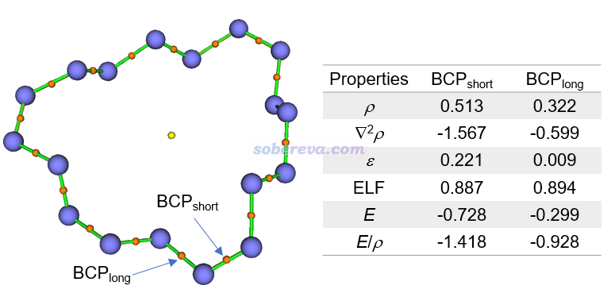

分子的静电势对于讨论分子间相互作用有极其重要的意义，相关信息参看《静电势与平均局部离子化能相关资料合集》（<http://bbs.keinsci.com/thread-219-1-1.html>）。基于《使用Multiwfn+VMD快速地绘制静电势着色的分子范德华表面图和分子间穿透图》（<http://sobereva.com/443>）和《使用Multiwfn结合VMD分析和绘制分子表面静电势分布》（<http://sobereva.com/196>）中介绍的方法，本文绘制了18氮环范德华表面的静电势填色图并做了表面静电势分布的定量统计，如下图所示。从左图可见，18氮环表面静电势分布很不均匀，既有很正的地方，最高达到30 kcal/mol，也有较负的地方，最负为-12.1 kcal/mol。这体现出取决于具体位置，18氮环既可以表现出明显的局部Lewis酸性特征，也可以表现出一定Lewis碱性特征（主要来自于孤对电子）。

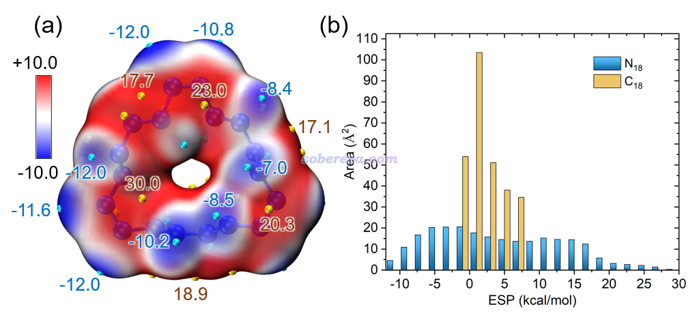

上图右侧的不同静电势范围的面积统计图中同时包含18氮环和18碳环的情况。通过对比可明显看出18氮环的静电势分布范围较广，而18碳环仅分布在数值接近0的较窄的范围内，这在《全面探究18碳环独特的分子间相互作用与pi-pi堆积特征》（<http://sobereva.com/572>）介绍的笔者的研究文章里也专门讨论过。这体现出18氮环有形成静电主导的分子间相互作用的能力，而18碳环则只能形成范德华作用主导的相互作用。笔者曾基于表面静电势提出过MPI指数衡量分子的等效极性，详见《谈谈如何衡量分子的极性》（<http://sobereva.com/518>）。18氮环和18碳环的MPI分别为8.0和2.6 kcal/mol，对比可见18氮环的极性显著大于18碳环。值得一提的是靠偶极矩是无法如实区分它们的极性的，C1结构下的18氮环的偶极矩仅为0.161 Debye，和偶极矩精确为0的中心对称的18碳环几乎没什么区别。

本文还计算了18氮环的原子电荷以考察其电荷分布特征。原子电荷概念的介绍见《一篇深入浅出、完整全面介绍原子电荷的综述文章已发表！》（<http://sobereva.com/714>）里提到的笔者的综述文章。无论是用ADCH原子电荷还是CHELPG原子电荷，得到的18氮环的原子电荷都分布在很窄的范围内（ADCH电荷在-0.023至0.029之间），因此18氮环里每个原子所带的净电荷甚微、感受到的化学环境高度相似。

18碳环具有明显的芳香性和整体的pi电子的离域性，这在笔者的论文Carbon, 165, 468-475 (2020)中层做过全面、深入的讨论。18氮环是否也有这样的特征？为了揭晓答案，文中首先使用Multiwfn计算了多中心键级，这是衡量电子多中心离域强度的非常流行的指标，见《衡量芳香性的方法以及在Multiwfn中的计算》（<http://sobereva.com/176>）和《使用AdNDP方法以及ELF/LOL、多中心键级研究多中心键》（<http://sobereva.com/138>）中的介绍。18氮环的多中心键级的计算结果近乎精确为0，也远远小于18碳环，因此从这一点上已经证明18氮环不具备像18碳环一样明显的整体电子离域特征，因而也没有芳香性。18氮环尽管有很多pi电子，但这些pi电子完全定域在一个个化学键上，并没有有效联通为整体。

《通过Multiwfn绘制等化学屏蔽表面(ICSS)研究芳香性》（<http://sobereva.com/216>）介绍的通过绘制ICSS_ZZ等值面图考察芳香性的方法虽然昂贵，但是非常严格而且直观，也比流行的NICS更有说服力。为了进一步确认18氮环的芳香性，文中使用Multiwfn绘制了18氮环的ICSS_ZZ等值面图，如下所示，C1和D9构型的图都给出了，等值面数值也标出来了。图中绿色和蓝色区域分别是对垂直于环方向上施加的磁场产生屏蔽和去屏蔽的区域。无论哪种构型，其等值面特征都和具有典型芳香性分子的情况截然不同（即环中心区域完全是磁屏蔽，而环外侧是一圈连贯的去屏蔽），进一步证明了无论哪种构型，18氮环都不具备芳香性。

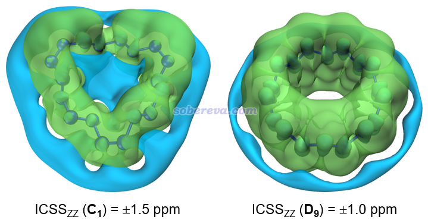

最后，文章还根据《使用AICD 2.0绘制磁感应电流图》（<http://sobereva.com/294>）的做法绘制了18氮环两种构型的感生电流图。由下图可见，无论哪种构型都没形成像Carbon, 165, 468-475 (2020)中的18碳环那样环绕整体的磁感生电流，再次确认了18氮环的非芳香性特征。

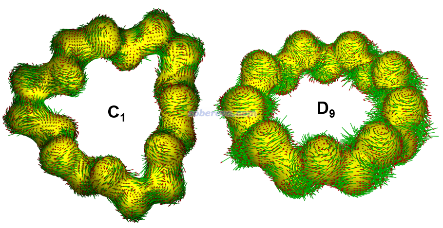

## 7 总结

本文浅显易懂地介绍了近期发表的专门研究新颖的18氮环特征的文章ChemPhysChem, 25, e202400377 (2024)的主要内容，更多细节请读者阅读原文。此文不仅首次研究了18个氮原子形成的大环分子，也是首次系统性考察孤立状态下纯氮构成的长链状物质的特征，它可以视为是氮气分子作为单体产生的聚合物。相信本文可以明显拓宽大多数读者对纯氮物质的认识。本文的很多研究思想和分析方式也可以作为范例，在理论预测和分析其它新颖的化学物质时予以借鉴。同时本文也充分体现出使用Multiwfn程序做波函数分析考察新颖物质的电子结构的重要意义。
