**全面揭示各种碳环与富勒烯之间独特的pi-pi相互作用！**  
Comprehensively revealing the unique pi-pi interactions between different cyclocarbon and fullerene!

文/Sobereva@[北京科音](http://www.keinsci.com)   2024-Oct-28

## 0 前言

18碳环以其独特的几何和电子结构，自从2019年在凝聚相观测到后引发了化学界的巨大关注。与之相关的分子间相互作用文章已有不少，例如《全面探究18碳环独特的分子间相互作用与pi-pi堆积特征》（<http://sobereva.com/572>）介绍的Carbon, 171, 514-523 (2021)、《8字形双环分子对18碳环的独特吸附行为的量子化学、波函数分析与分子动力学研究》（<http://sobereva.com/674>）介绍的Phys. Chem. Chem. Phys., 25, 16707 (2023)、《理论设计新颖的基于18碳环构成的双马达超分子体系》（<http://sobereva.com/684>）介绍的Chem. Commun., 59, 9770 (2023)，等等。笔者迄今对18碳环及其衍生物的研究论文汇总和各种相关博文见<http://sobereva.com/carbon_ring.html>（不断更新）。

碳单环体系和富勒烯体系是碳元素的两种关键的同素异形体，形状截然不同，一个环形一个球形，而且由于二者都有pi共轭特征，理应存在pi-pi相互作用。这显著的差异性和明显的共性无疑使得碳环与富勒烯的相互作用非常值得进行细致、充分的探索。近期，北京科音自然科学研究中心（<http://www.keinsci.com>）的卢天和江苏科技大学的刘泽玉在知名的Chem. Eur. J.（欧洲化学）期刊上发表了极为全面、系统、透彻的研究不同尺寸碳环（C18到C36）与不同数目C60富勒烯相互作用的理论研究文章，充分揭示了它们之间独特的相互作用，包括强度、结构和本质，内容很新颖有趣，非常欢迎阅览和引用：

Zeyu Liu, Tian Lu*, Theoretical Insight into Complexation Between Cyclocarbons and C60 Fullerene, *Chem. Eur. J.*, **30**, e202402227 (2024) DOI: 10.1002/chem.202402227  
可以通过此链接免费在线阅览：<https://onlinelibrary.wiley.com/share/author/PJDSJZN8IMBAVDCCBXQS?target=10.1002/chem.202402227>

此文不仅研究碳环与富勒烯相互作用本身，文章在分析思想和方法学方面对于其它分子间相互作用的研究也颇有借鉴意义，十分推荐对这类研究问题感兴趣的读者阅读。此文充分运用了强大的Multiwfn（主页<http://sobereva.com/multiwfn>）波函数分析程序提供的丰富的弱相互作用分析功能，包括IGMH、sobEDA、范德华势等，是Multiwfn研究弱相互作用问题的很好的范例。Multiwfn支持的弱相互作用分析功能在《Multiwfn支持的弱相互作用的分析方法概览》（<http://sobereva.com/252>）有概述，在量子化学波函数分析与Multiwfn程序培训班（<http://www.keinsci.com/workshop/WFN_content.html>）的“弱相互作用的分析”部分有最全面透彻的讲解和演示。

下面将对上述Chem. Eur. J.文章的主要内容进行深入浅出的介绍，便于读者更容易理解文章的研究结果，同时额外附上许多分析和计算细节以帮助读者能够将文中的研究手段举一反三运用到自己的研究中。原文里还有很多细节信息和讨论，故请阅读下文后阅读原文。

## 1 碳环-富勒烯二聚体

文章首先考察了碳环与富勒烯形成的二聚体结构。文中用Gaussian 16在ωB97XD/6-311G*级别下优化了碳环Cn (n=18, 20, 22, 24, 26, 30, 32, 34, 36)与富勒烯形成的二聚体C60@Cn，并确认了无虚频。ωB97XD泛函曾用于<http://sobereva.com/carbon_ring.html>里罗列的笔者的各种18碳环的研究中，不仅可以正确描述18碳环的几何结构（见Carbon, 165, 468 (2020)中的方法对比测试），也能合理描述弱相互作用，故很适合用于优化涉及碳环的复合物。得到的二聚体中比较有代表性的5个如下所示。可以看到随着碳环尺寸的增大，富勒烯逐渐陷入碳环中，到了C60@C34的时候富勒烯正好不偏不倚精确嵌入在碳环的正中央，富勒烯的中心和碳环的中心正好重合，这是一个完美的纳米土星（nano-saturn）结构。而当碳环尺寸进一步增大到C36，为了最大化分子间相互作用，富勒烯的中心自发偏离了碳环的中心。

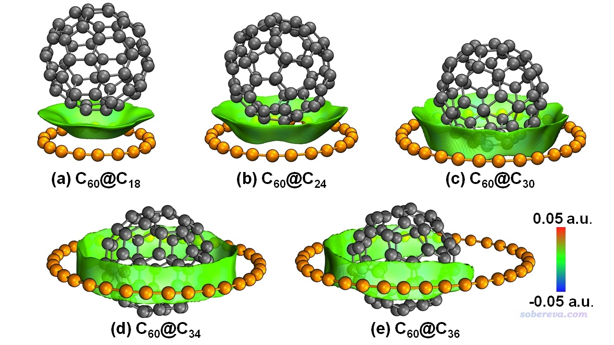

笔者提出的IGMH是目前非常流行、效果理想的可视化片段间相互作用的分析方法，见《使用Multiwfn做IGMH分析非常清晰直观地展现化学体系中的相互作用》（<http://sobereva.com/621>）、《一篇最全面介绍各种弱相互作用可视化分析方法的文章已发表！》（<http://sobereva.com/667>）和《Angew. Chem.上发表了全面介绍各种共价和非共价相互作用可视化分析方法的综述》（<http://sobereva.com/746>）介绍的综述。上图的等值面是IGMH方法定义的sign(λ2)ρ着色的δg_inter等值面，描述富勒烯和碳环这两个片段间的相互作用。图中非常清楚直观地展现出了碳环-富勒烯之间的相互作用区域。等值面几乎都是绿色，说明相互作用区域的电子密度数值非常低，pi-pi相互作用区域普遍具有这种特点，再加上碳环和富勒烯的接触面也正是pi电子分布的区域相互接触，无疑富勒烯和碳环之间的结合是典型的pi-pi相互作用所驱动的。

为了严格考察碳环和富勒烯的结合强度，基于Gaussian优化的几何结构，文中用ORCA程序精确计算了不同碳环与富勒烯形成二聚体对应的结合能，即E_bind = E(C60@Cn) - E(C60) - E(Cn)，其中E是电子能量，每个能量都在各自分别优化的结构下得到。计算级别用的是ωB97M-V/def2-QZVPP，ωB97M-V不仅像ωB97XD一样是长程极限HF成份为100%的范围分离泛函因而能够合理描述碳环的电子结构，而且大量测试都体现了其计算弱相互作用能相当优秀，在《简谈量子化学计算中DFT泛函的选择》（<http://sobereva.com/272>）中以及北京科音中级量子化学培训班（<http://www.keinsci.com/workshop/KBQC_content.html>）里的“弱相互作用的计算与相关问题”专题部分也专门说过这一点。def2-QZVPP是相当高质量的基组，算分子间相互作用能的BSSE问题小到可以忽略，在ORCA里利用RIJCOSX加速技术计算像C60@C36这样约100个非氢原子体系的单点能完全算得动。此外，为了从热力学角度严格考察C60@Cn二聚体形成的可能性，文中还计算了标况下的结合自由能，其中对电子能量的自由能热校正量通过《使用Shermo结合量子化学程序方便地计算分子的各种热力学数据》（<http://sobereva.com/552>）介绍的Shermo程序基于ωB97XD/6-311G*振动分析的输出文件得到。如552博文所述，像这种含有大量很低频的体系的自由能的计算一定要用Shermo支持的quasi-RRHO模型得到的自由能热校正量，而切勿直接用Gaussian等程序基于RRHO模型给出的，否则低频模式对熵的贡献可能被高估得离谱，导致结合自由能误差很大。另外，为了考察溶剂效应对结合的影响，文章还使用Gaussian的SMD溶剂模型按照《谈谈隐式溶剂模型下溶解自由能和体系自由能的计算》（<http://sobereva.com/327>）说的做法获得了水环境下的自由能，并求差得到了水中的结合自由能。计算结果汇总如下

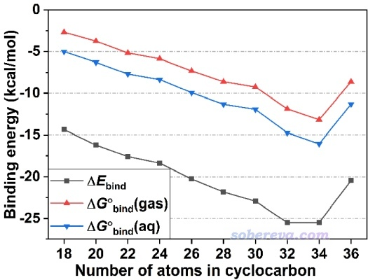

由上图可见，从C18到C32，随着碳环尺寸的增大，它与富勒烯的结合强度近乎严格地线性增强，这是由于二者间的接触面积逐渐增大，这点从上文的IGMH图的等值面面积的变化就可以清晰地反映出来。而从C34变成C36，结合强度反倒减弱了，这正如IGMH图所示的，C36有的地方与富勒烯离得相对较远、作用较弱，导致δg_inter等值面也没有在相应区域出现。

上图体还现出标况气相的结合自由能和基于电子能量算的结合能的变化趋势基本一致，但前者没有后者那么负，这是因为结合过程中熵减小对结合造成了严重不利的影响。对比上图中的红线和蓝线可见水溶剂环境下的结合自由能比气相下的更负几kcal/mol，说明极性溶剂会促使碳环与富勒烯的结合，这本质上就是疏水效应，众所周知疏水效应会驱动非极性物质间在水中的结合。

很值得一提的是，文中发现碳环-富勒烯之间的δg_inter=0.002 a.u.的等值面面积与它们的结合能有颇好的线性关系，如下所示。因此IGMH图像的等值面面积在某些情况下可以作为解释或预测相互作用能的很好的描述符，这一点很值得在未来进一步探索。这种面积的计算方法见《计算IGMH等值面的面积和体积的方法》（<http://sobereva.com/738>）。

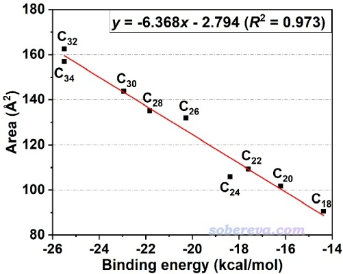

为了考察温度对碳环-富勒烯结合的影响，以及探索结合的临界温度，文中利用Shermo程序做了自由能随温度的扫描，并进而得到了结合自由能与温度的关系，如下所示。可见温度越高越不利于结合，在气相常压下，C18碳环与富勒烯之间从366 K开始就无法结合了，而C34和富勒烯之间的二聚体在高达605 K以下都是可以形成的。C36的情况处于二者之间。

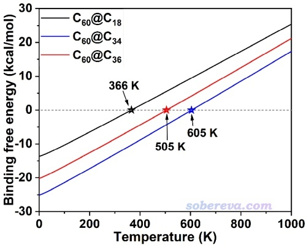

碳环与富勒烯的复合势必造成单体的结构变化，由于单体结构相对于极小点结构改变导致单体的电子能量在复合过程中的升高称为变形能。文中补充材料里的表S1给出了不同碳环与富勒烯结合时的碳环的变形能，发现C18到C34的变形能都<=0.3 kcal/mol，可以忽略不计，而C36的变形能则达到了1.0 kcal/mol，这一方面是因为这样较大的碳环有足够显著的柔性，另一方面在于它与富勒烯之间的不对称的相互作用（如全面IGMH图所展示的），这造成了这种碳环在复合物中相对于圆形的极小点结构的不可忽略的形变。下图是按照《在VMD中计算RMSD衡量两个结构间的差异以及叠合两个结构》（<http://sobereva.com/290>）的方法绘制的C36在孤立状态（红线）和与富勒烯结合状态（蓝线）的叠加图，可见富勒烯的存在诱使C36碳环被拉长了。

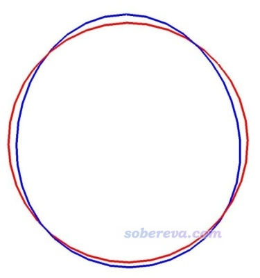

碳环与富勒烯的作用虽然形式上属于“弱相互作用”类别，但结合强度真不是一般的强，而是相当的强！如《透彻认识氢键本质、简单可靠地估计氢键强度：一篇2019年JCC上的重要研究文章介绍》（<http://sobereva.com/513>）所列举的，像是水二聚体这样的一般强度氢键的结合能才-5 kcal/mol左右，而本文研究的与富勒烯结合最弱的18碳环，它与富勒烯的结合能都达到了-14.4 kcal/mol，将近三个普通氢键的强度。而且这比《全面探究18碳环独特的分子间相互作用与pi-pi堆积特征》（<http://sobereva.com/572>）提到的曾经笔者研究的两个18碳环间的结合能-9.2 kcal/mol强得多，也比J. Chem. Theory Comput., 13, 274 (2017)高精度计算的两个富勒烯之间的结合能-8.3 kcal/mol强得多！

2023年笔者提出的能量分解方法sobEDA和sobEDAw的详细介绍见《使用sobEDA和sobEDAw方法做非常准确、快速、方便、普适的能量分解分析》（<http://sobereva.com/685>），其中sobEDAw用于考察碳环+富勒烯的相互作用成份极为合适，速度足够快而且结果也很准确。sobEDAw只对部分泛函拟合了参数，由于碳环体系需要HF成份较高的泛函才能正确描述，因此文中使用了HF成份达到50%的BHandHLYP泛函结合DFT-D3(BJ)色散校正和6-311+G(2d,p)基组做碳环-富勒烯之间的sobEDAw能量分解，并且考虑了counterpoise校正，结果是总相互作用能为-12.0 kcal/mol，其中静电贡献-8.4、交换互斥贡献25.6、轨道相互作用贡献-2.4、色散作用贡献-26.8 kcal/mol。可见色散作用对碳环-富勒烯之间的吸引作用起绝对主导效果，静电作用相对次要，而轨道相互作用可忽略不计。这完全符合pi-pi堆积的典型特征，在《全面探究18碳环独特的分子间相互作用与pi-pi堆积特征》（<http://sobereva.com/572>）介绍的Carbon, 171, 514 (2021)中使用sSAPT0/jun-cc-pVDZ级别对18碳环的pi-pi作用形成的二聚体做能量分解基本上也是这个情况。

此文还使用Multiwfn通过笔者提出的ADCH原子电荷计算方法，以及很常用的Mulliken方法，计算了C60@C18中18碳环部分的片段电荷。如果对原子电荷缺乏了解的话建议阅读《一篇深入浅出、完整全面介绍原子电荷的综述文章已发表！》（<http://sobereva.com/714>）里提到的笔者的原子电荷综述。这两种方法给出的18碳环的电荷分别为0.015和-0.027，都十分接近于0，体现出碳环与富勒烯之间的基态的电荷转移效应可以忽略不计。文中也用Multiwfn的主功能9的选项-1将18碳环和富勒烯分别定义成片段1和片段2，然后计算了它们之间的总Mayer键级，数值仅为可忽略的0.041，即基本没有共享电子作用，再次体现出两个分子间完全是非共价相互作用。如果读者对键级不了解，建议看《Multiwfn支持的分析化学键的方法一览》（<http://sobereva.com/471>）中键级的相关部分。

文中发现18碳环和富勒烯实际上有两种极小点结构（见原文图S1），次低的比最低的能量高0.9 kcal/mol，它们之间互变的过渡态的虚频为9.8i cm-1，振动模式如下所示，可见明显对应于富勒烯相对于18碳环的旋转。在ωB97M-V/def2-QZVPP级别下计算出的正向和逆向势垒分别为0.90和0.04 kcal/mol，极低的势垒体现出复合物中富勒烯可以非常自由地旋转。实际上pi-pi堆积作用的体系之间普遍容易发生滑移（如18碳环二聚体，在<http://sobereva.com/572>里做了动力学模拟直接体现了这一点），因为滑移造成的能量变化很小。

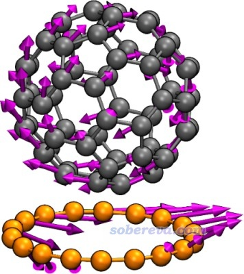

## 2 碳环-富勒烯 2:1三聚体

文章系统考察了一个富勒烯结合两个碳环（C18至C34）形成的三聚体的结构，优化得到的结果如下图所示。这种体系中既有碳环与富勒烯之间的相互作用，也有两个碳环之间的相互作用，为了能直观区分，这两类相互作用的δg_inter等值面分别用绿色和青色着色，这样的IGMH图真是巨直观！可以看到，随着碳环的增大，两个碳环间的夹角逐渐减小，富勒烯越来越多地被两个碳环“吃”了进去，富勒烯始终与碳环保持着紧密的接触和充分的pi-pi作用。当碳环大到C34时，两个碳环之间完全平行并形成了全面的pi-pi相互作用，而且和<http://sobereva.com/572>提到的18碳环二聚体一样是较长的C-C键对着较短的C-C键，此时富勒烯已精确嵌入到了两个碳环的正中间。

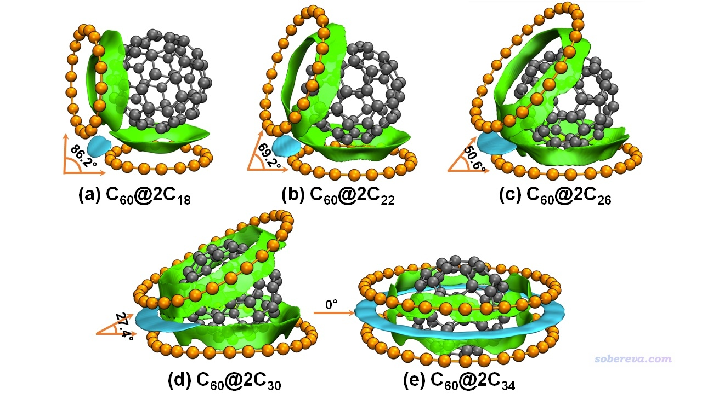

ωB97M-V/def2-QZVPP计算远超100个非氢原子的体系时过于昂贵，因此文中在计算三聚体和更多聚体时在ORCA里使用的是ωB97M-V/def2-TZVP结合gCP方式的经验性的BSSE校正，精度比ωB97M-V/def2-QZVPP差不了多少而耗时低得多得多。使用ωB97M-V/def2-TZVP+gCP，文中计算了富勒烯结合第一个碳环的结合能ΔE_1_bind，以及在此基础上再结合第二个碳环的结合能ΔE_2_bind（即C60@Cn与Cn形成C60@2Cn的结合能），总的结合能（三聚体结合能）为ΔE_1_bind与ΔE_2_bind之和。结果如下图(a)所示。可见随着碳环增大，结合能越来越负、结合作用越来越强，而且ΔE_2_bind比ΔE_1_bind明显更负，这体现出多个碳环与富勒烯结合的非常明显的协同作用。如上面的IGMH图所示，已有的一个碳环可以和另一个碳环形成pi-pi作用，而且碳环越大时pi-pi作用越显著（青色等值面越来越大），这是为什么碳环越大时协同效应越强。

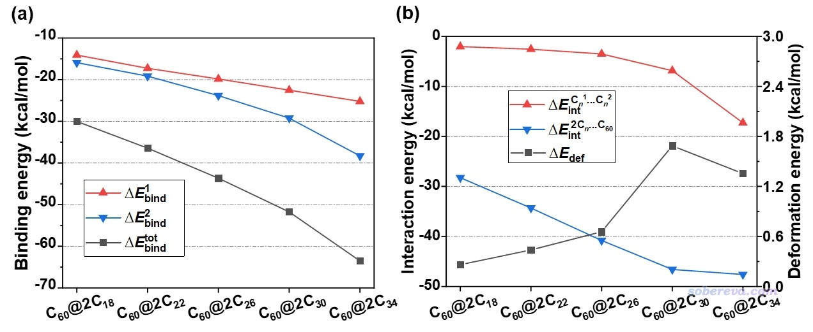

为了更进一步考察三聚体结构中不同片段之间的相互作用强度，此文还基于优化后的三聚体结构计算了片段间的相互作用能，如上图(b)所示，两个碳环间的相互作用能对应红线，两个碳环与富勒烯之间的相互作用能对应蓝线。可见随着碳环增大，碳环间的相互作用逐渐增强，特别是两个C34碳环之间的相互作用格外强，这是因为如前面的IGMH所示，它们能形成完整的遍及整个碳环的pi-pi作用，而不再只是局部区域的pi-pi作用。还可见从C18到C30之间，碳环越大，由于可以和富勒烯相互作用的原子越多，碳环-富勒烯的相互作用越强，但是从C30到C34这种相互作用反倒稍微变弱了，这是因为在C60@2C34中C34与富勒烯的接触不像C60@2C30中C30与富勒烯的接触那么充分，这一点从IGMH图上就可以明显看出来，即C60@2C34中绿色的两条环状等值面明显比C60@2C30的窄很多。这体现出恰当利用IGMH方法可视化分子间相互作用，甚至可以把不同体系间轻微的差异性也给明确揭示出来。《直观解释分子间相互作用如何影响不对称催化：Nature Chemistry上一个很好的IGMH分析范例》（<http://sobereva.com/700>）里的例子也同样体现了这一点。

各个片段在结合成C60@2Cn三聚体过程中的总变形能如上图的黑线所示，由于富勒烯的刚性很强，因此变形能基本都来自于碳环的变形。可见随着碳环的增大，变形能也逐渐上升，这在于越大的碳环柔性越强。从前面的结构图甚至肉眼都能明显看出来C30碳环在三聚体结构中有明显的弯曲。而C34的变形能则小于C30，这是因为C60@2C34复合物中的两个C34基本是圆形、平面的结构，和孤立状态结构特征相差较小，而且此结构中C34与富勒烯的相互作用没有C30的那么强。

## 3 碳环-富勒烯 1:2三聚体

下面再来看一个碳环与两个富勒烯结合成2C60@Cn（n=18到30）三聚体的情况。优化后的复合物结构和IGMH图如下所示，绿色等值面展现富勒烯与碳环之间的相互作用，黄色等值面展现两个富勒烯之间的相互作用。标注的d_min对应两个富勒烯之间最近原子距离（可以将结构文件载入Multiwfn，进入主功能100的主功能21，输入dist，然后依次输入两个片段里的原子序号得到此值）。由图可见，从C18到C26碳环，碳环越大，由于对两个富勒烯之间的接触阻碍越小，富勒烯之间的距离越近、富勒烯之间的相互作用越显著。碳环从C22变成C26时，富勒烯与碳环之间的IGMH等值面明显变窄，体现相互作用明显变弱，和富勒烯之间的相互作用强度的变化形成了此消彼长的关系。对于2C60@C30的情况，碳环与两个富勒烯的相互作用不再对称，上面的富勒烯歪到一侧去了，与碳环的相互作用显著小于下面的富勒烯，因此可以预料2C60@C30的稳定性明显不及2C60@C26。

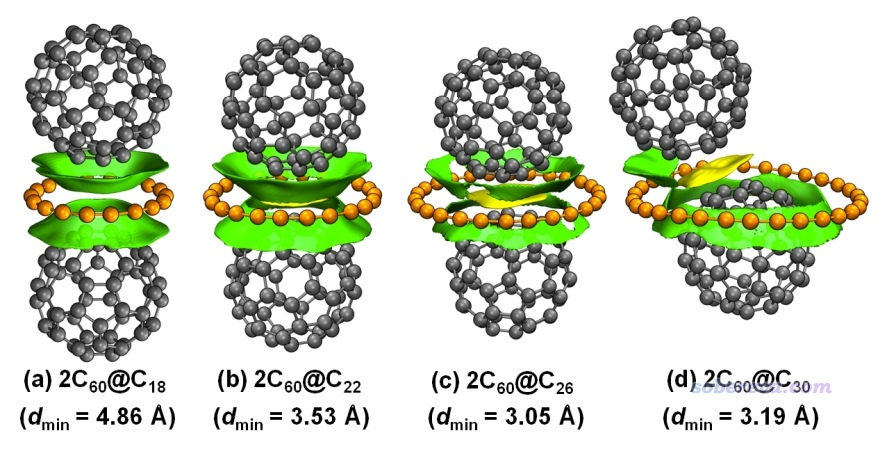

下图(a)给出了2C60@Cn的三聚体总结合能（黑线），以及结合第一个和第二个富勒烯时候的结合能（红线和蓝线）。可见碳环越大，对第一个富勒烯的结合越强，这在前文的碳环-富勒烯二聚体的研究中已经说过。由于已有的富勒烯会对第二个结合的富勒烯产生吸引作用，对于2C60@C18、2C60@C22、2C60@C26，第二个富勒烯的结合能比第一个富勒烯的结合能更负，即两个富勒烯与C18、C22、C26碳环的结合有明显的协同效应。而对于2C60@C30，由于第一个富勒烯严重妨碍第二个富勒烯的结合，导致第二个富勒烯只能歪斜着与C30碳环发生较弱的相互作用，同时第二个富勒烯结合时还稍微削弱了第一个富勒烯与碳环的相互作用，因此第二个富勒烯的结合能只有第一个富勒烯结合能的一半。

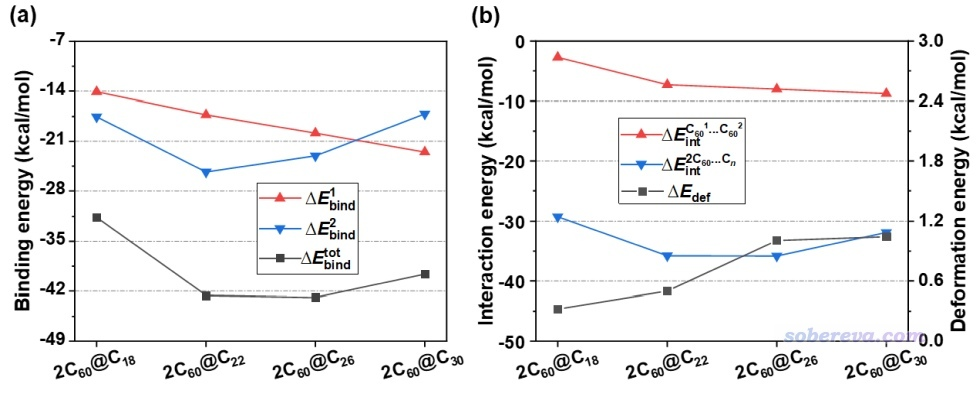

上图(b)更进一步考察了2C60@Cn的三聚体中各个片段间的相互作用能。可见由于碳环越大、越不给富勒烯之间的接触碍事，图中红线对应的富勒烯之间的相互作用能是随着碳环的增大而越来越负的。图中蓝线体现C22和C26与两个富勒烯的相互作用最强，而C30由于只能松散地与其中一个富勒烯相互作用，因此它与两个富勒烯的总相互作用更弱一些。

根据以上信息，文中提出了新颖的“分子胶水”的概念。大小恰到好处的碳环，如C22，可以把两个富勒烯特别牢固地粘在一起。C22对第二个富勒烯的结合能，也等价于C60@C22与一个富勒烯的结合能，达到了约-42 kcal/mol，这比起两个富勒烯之间的结合能-8.3 kcal/mol强太多了，甚至都轻微超过了C-C单键键能的一半！！！

为了更充分地探究碳环对富勒烯结合起到的胶水作用，此文运用了《谈谈范德华势以及在Multiwfn中的计算、分析和绘制》（<http://sobereva.com/551>）中介绍的方法，基于GAFF力场参数绘制了2C60@C22和2C60@C30三聚体结构中碳环产生的范德华势，以碳原子为探针原子，如下所示。图(a)的黄色等值面对应范德华势=-0.8 kcal/mol，富勒烯的原子按照原子所在位置的范德华势着色，颜色越蓝体现富勒烯的相应原子与碳环间的色散吸引作用越强。图(b)是利用VESTA程序基于Multiwfn产生的范德华势cube文件绘制的填色平面图。由图可见C22碳环的范德华势最负的区域从碳环中心向上下两侧延伸出来，没过了每个富勒烯大约1/3的区域，显然C22碳环的这种范德华势分布能恰到好处地把两个富勒烯粘起来，是富勒烯之间最简单且最完美的胶水分子！而碳环也不宜过大，如图中C30的情况，虽然其范德华势很负的区域能覆盖下方的富勒烯将近一半的原子，但对上方的富勒烯的色散吸引则较为有限。尽管如此，C30对第二个富勒烯的结合能-17.1 kcal/mol仍然比两个富勒烯之间的结合能-8.3 kcal/mol负得多。因此哪怕碳环偏大，照样能促进两个富勒烯的结合。

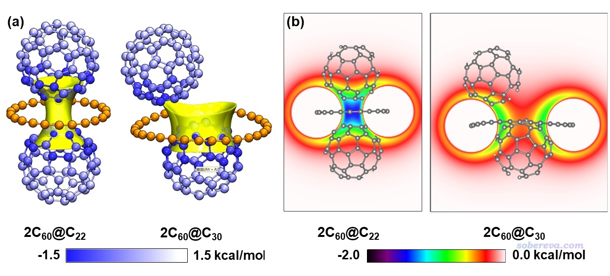

## 4 一个富勒烯最多能结合多少个18碳环？

从前面给出的两个18碳环与一个富勒烯形成的复合物来看，富勒烯表面实际上还有空间可以结合更多的18碳环。那么一个富勒烯最多能结合多少个18碳环？多少个碳环才能令富勒烯的表面饱和？为了探究这个有趣的问题，文中根据碳环和富勒烯的结构，搭建了6个碳环均匀分布在富勒烯上下左右前后的结构并做了几何优化。由于此体系多达168个碳原子，用ωB97XD/6-311G*优化和振动分析实在过于昂贵，所以这部分的计算对碳环用6-311G，而对富勒烯用6-31G。这么做的合理性一方面在于碳原子对于极化函数的要求远低于杂原子，另一方面是以C60@C18进行测试，6-311G&6-31G优化的结果与6-311G*的结果的差异确实可忽略不计，分别如下图的红线和蓝线所示（原文图S4），可见几乎完全重合。注意18碳环的基组不能再减小到6-31G，这点笔者在《我对一篇存在大量错误的J.Mol.Model.期刊上的18碳环研究文章的comment》（<http://sobereva.com/584>）中专门指出过。

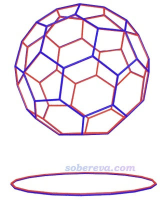

优化得到的富勒烯结合6个18碳环的结构如下图(a)所示。为了清楚起见，在VMD程序里通过绘图命令用黄色圆球把18碳环中心位置显示了出来，并且把相邻的黄球用蓝线连了起来，由此可以清楚地看出6个碳环构成了一个包围富勒烯的近乎理想的正八面体空间。下图(b)是IGMH图，依然是富勒烯与碳环之间的作用用绿色展示，碳环之间的作用用青色展示，可见这个C60@6C18结构中每个碳环都与富勒烯产生了非常显著、充分的pi-pi作用，而且每一对相邻碳环之间也产生了特别显著的pi-pi作用，这是何等完美的结构啊！6个18碳环与富勒烯的结构匹配程度完美到令人惊叹！

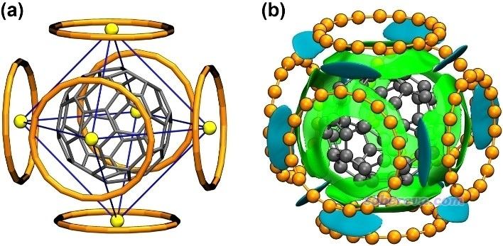

在ωB97M-V/def2-TZVP+gCP级别下计算的C60@6C18的总结合能高达-101.3 kcal/mol，已经达到了常规化学键的数量级！此体系中平均每个18碳环的结合能是-101.3/6=-16.9 kcal/mol，这比起C60@2C18中18碳环平均结合能-15.0 kcal/mol更负，体现出C60@6C18的形成过程的协同作用真是巨强。这在于此体系中每个18碳环都能同时与周围四个18碳环充分地吸引。C60@6C18在气相标况下的结合自由能为-13.4 kcal/mol，体现出此结构在热力学上很容易自发形成。

基于C60@6C18的结构，文章还大胆地设想了富勒烯与18碳环形成的共晶的结构，示意图如下所示（原文图S4）。此结构里每个碳环、富勒烯都最大程度利用了自己的色散吸引能力与对方结合，因此应当是一个颇为稳定、大概率在未来能被实验合成出来的晶体。

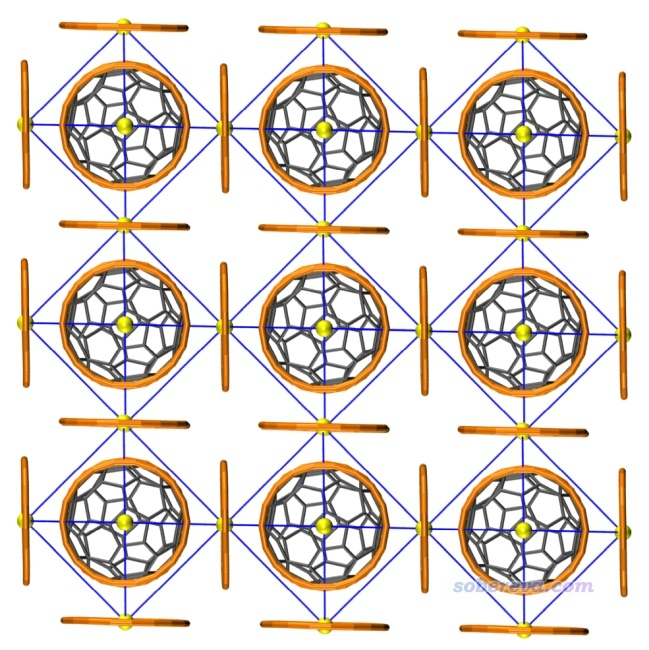

## 5 总结

本文介绍的Chem. Eur. J., 30, e202402227 (2024)一文通过严谨的量子化学计算并充分运用Multiwfn实现波函数分析，首次预测了各种尺寸碳环与不同数目C60富勒烯形成的复合物的结构，并深入探讨了相互作用强度和本质。此文体现出富勒烯与碳环这两种碳的同素异形体之间通过pi-pi作用表现出极强的亲合性。碳环体系以其特殊的环形几何结构以及独特的两套全局共轭的pi电子，还可以作为分子胶水将两个富勒烯牢牢粘在一起。文章还证明了一个富勒烯最多能结合6个18碳环，而且结合过程中有显著的协同性，结合越多越容易。因此靠富勒烯吸附碳环，或许在未来能成为一种富集富勒烯的手段。文章还预测了富勒烯与18碳环形成共晶的可能，在未来有可能能以这种形态将不稳定的18碳环稳定地储存起来。

此文是通过理论计算研究新颖的分子间复合物的很好的例子，兼具重要的理论意义和实际意义。同时此文也是利用Multiwfn做波函数分析探究弱相互作用的很好的范例，把相互作用特征研究得十分通透，尤其是IGMH方法把富勒烯与碳环的复合物中的弱相互作用展现得超级生动直观、一目了然，此文充分体现出掌握Multiwfn程序做波函数分析对弱相互作用研究的关键性价值！

另外，如果你对pi-pi研究感兴趣，强烈建议阅读《谈谈pi-pi相互作用》（<http://sobereva.com/737>）。
