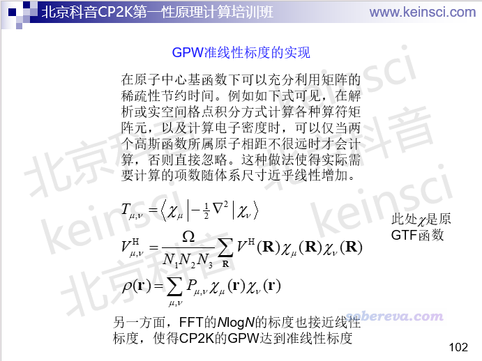
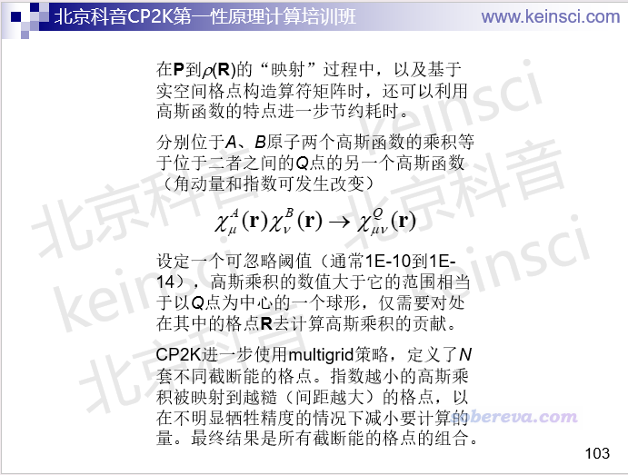
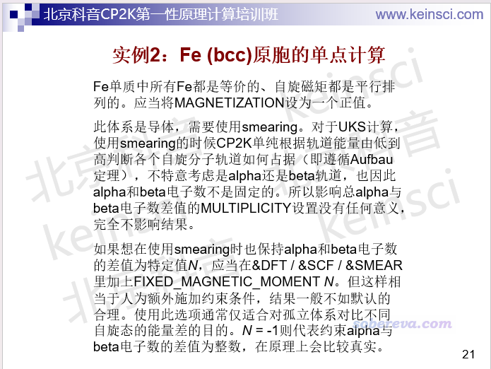
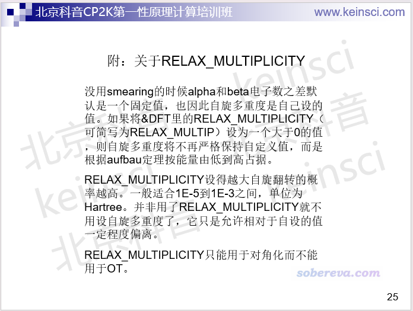
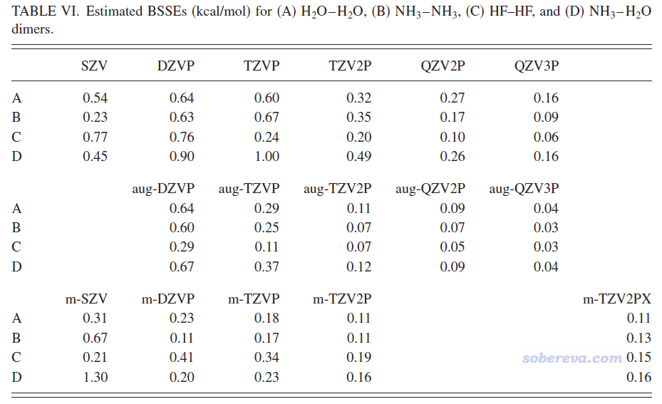
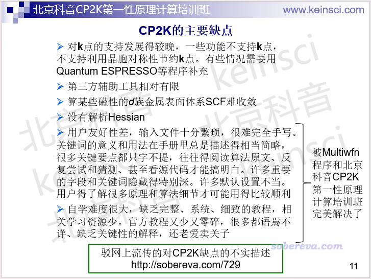

**驳网上流传的对CP2K缺点的不实描述**  
Refuting the false description of shortcomings about CP2K circulating on the Internet

文/Sobereva@[北京科音](http://www.keinsci.com)  2025-Dec-28

## 0 前言

CP2K是极其流行、强大并且免费的第一性原理程序，在《2024年计算化学公社举办的计算化学程序和DFT泛函的流行程度投票结果》（<http://sobereva.com/706>）的流行度得票统计中甚至已超过了售价高昂的VASP。笔者在**北京科音CP2K第一性原理计算培训班（**[**http://www.keinsci.com/KFP**](http://www.keinsci.com/KFP)**）**里也积极推广CP2K、全面介绍其相关理论背景知识和正确的使用方式。笔者之前在网上答疑时，就曾偶尔听到一些关于CP2K的不实谣言，诸如什么算导体慢、算相互作用能不准之类。今天在群里看到有人发了一页讲CP2K缺点的幻灯片，里面列了四条，根本就没有一条是对的，令我深感这种幻灯片实在太以讹传讹了！估计已有很多对CP2K一无所知的人看了这种幻灯片对CP2K产生了严重错误印象，导致其放弃了其实极其适合他们的CP2K而转向使用某些又贵又慢的程序。因此笔者忍不住写本文，对幻灯片里的不实说法进行驳斥和斧正。实际上，如果读者参加过北京科音CP2K第一性原理计算培训班，正确、深入、系统学习过CP2K计算相关的理论知识，并结合培训里的例子用CP2K做过各类计算，就自然而然就知道那幻灯片里对CP2K缺点的说法有多么离谱。**我也希望读者看到有非蠢即坏的人再给CP2K乱扣屎盆子时转发本文链接**。

## 1 对导体计算慢

那幻灯片里说CP2K“*对导体计算较慢，CP2K之所以算的快是因为OT算法，对有带隙的体系可以迅速SCF迭代收敛。但是此法原理上不适用于导体。所以导体只能用对角化方法*”。

以上说法大错特错。首先说CP2K为什么快。对于纯泛函的DFT计算，CP2K对中、大体系远比VASP、Quantum ESPRESSO、Abinit等纯粹基于平面波的程序快，这在于CP2K是原子中心基函数（具体来说是Gaussian型基函数）展开轨道波函数，同时用传统平面波程序的方式计算经典库仑作用。用原子中心基函数使得CP2K的得以利用矩阵的稀疏性巨幅节约算较大体系的时间，而且CP2K的开发者把程序效率视为重中之重，把CP2K的效率优化到了极致。由于相关公式较多，这里直接贴北京科音CP2K第一性原理计算培训班讲CP2K的GPW算法的两页ppt进行说明

此外，对于杂化泛函的计算，使用原子中心基函数的CP2K由于可以充分利用积分屏蔽技术大幅节约要计算的双电子积分的量，使得CP2K在主流的双路服务器上做杂化泛函计算算到上千原子都不是难事。

上述原因是CP2K做DFT特别快的最关键原因，而不是在于CP2K有OT。OT只不过是在这CP2K本来就特别高效的基础上进一步令大体系每一轮的SCF耗时更低，因为OT避免了算大体系耗时很高的对角化巨大KS矩阵的步骤（体系越大时越重要，对小体系OT和对角化的差异不大）。另外，用OT时SCF往往比对角化更容易收敛。一些相关信息看《CP2K中遇到SCF难收敛时的解决方法》（<http://sobereva.com/665>）。即便CP2K只用传统对角化算法做SCF而不用OT，算中、大体系的速度依然吊打VASP等纯平面波程序。

算金属体系时需要开smearing，此时需要算空轨道，由于用OT做SCF过程中无法求解空轨道，因此OT一般来说不能用于金属体系。金属体系的KS矩阵不是很稀疏，因此前述的CP2K基于原子中心基函数带来的优势没有非金属的情况那么明显。但即便如此，CP2K算不小的以金属为主的体系也完全不比平面波程序慢！（这里只从gamma点的能量和受力计算来说，至于对称性的利用与k点的考虑、SCF收敛性等其它方面另谈，那是其它层面的事）

上述的北京科音CP2K第一性原理计算培训班里的丰富的例子中就有不少是金属为主的体系，比如“Pd(100)晶面对苯分子的吸附”、“Cu(001)表面的银原子迁移”、“Au(111)表面H2分子解离”、“Ir(001)表面活化甲烷”等，学员亲自用CP2K跑过一遍这些例子就会感受到CP2K对这些金属为主的体系的计算效率也非常高，何来“对导体计算较慢”？

另外，前述网传的ppt中说OT“对有带隙的体系可以迅速SCF迭代收敛”也是错误说法。不少情况下OT达到收敛所需的SCF圈数反倒显著多于对角化。OT也并不保证肯定能收敛，而且也经常遇到OT需要一百轮以上SCF才收敛的收敛缓慢的情况。OT远没有那么神乎其神。

## 2 磁性体系处理比较麻烦

那幻灯片里说CP2K“*对于磁性体系处理比较麻烦，因为CP2K计算需要提前指定自旋多重度，不像VASP一样可以自动寻找合适的磁矩*”。

以上说法严重不实。为了保证收敛到正确的磁性状态，CP2K需要用MAGNETIZATION指定初猜波函数中的原子自旋磁矩或者用&BS指定初始的原子电子组态，VASP也需要用MAGMOM来设定初猜波函数中的原子自旋磁矩，显然在这点上CP2K根本没有什么额外的更麻烦之处。

CP2K的计算根本就不是必须“提前指定自旋多重度”。北京科音CP2K第一性原理计算培训班的下面这两页幻灯片里我把情况说得非常清楚：

## 3 k点功能不完善、小体系计算不准确

那幻灯片里说CP2K“*K点功能不完善，只有用Gamma点计算比较好用，在添加的K点参数以后一些很好的加速算法就不能用了比如ASPC波函数外推，老版本的CP2K里只有Gamma点计算的功能。这意味着对大体系可以，但是小体系计算不准确*”

以上说法极具误导性。说CP2K的k点（不叫K点）的功能不完善我没意见，确实尚有不少特性不支持k点，截止到2024版包括OT、NMR、SCCS溶剂模型、DFT+U等等，但若说成“只有用Gamma点计算比较好用”就完全是在开玩笑。CP2K早就能在纯泛函计算的时候很好地考虑k点，而且效率也很好，在能量计算、（变胞）优化、CI-NEB产生反应路径和搜索过渡态、能带计算等等方面都表现得很好，北京科音CP2K第一性原理计算培训班里大量例子都是开着k点做的，根本什么问题都没有。而且如<http://bbs.keinsci.com/thread-43683-1-1.html>所说，CP2K从2024开始还支持了杂化泛函结合k点计算的RI-HFXk算法。CP2K做DFT计算对k点考虑的一个不足（至少截止到撰文时最新的2024版）是不支持利用晶格的对称性节约k点来降低耗时（而Quantum ESPRESSO、VASP支持），但这也不是什么大问题，因为本来CP2K就已经很快了。

CP2K支持波函数的外推，也就是在结构优化、动力学过程中用之前几步的波函数外推出这一步的较好的初猜波函数，ASPC是其中一种。用k点时任何外推方法都没法用，因此上面那段话提到的ASPC不支持k点不假。然而这在实际中仅仅是一个小问题，上面那段话把这问题的重要性完全夸大了。考虑k点时做几何优化完全可以用USE_PREV_P直接使用上一步SCF收敛的密度矩阵当初猜，从而让SCF收敛更快、降低几何优化每一步的耗时。而分子动力学用的盒子尺寸通常不小，否则会有虚假的周期性效应导致动力学行为/现象不合理，因此此时一般都用不着考虑k点。

那幻灯片里说CP2K“小体系计算不准确”纯属无稽之谈。CP2K考虑k点计算小晶胞体系不仅效率上足够好，也不存在任何bug，何来不准确？北京科音CP2K第一性原理计算培训班讲“能量的计算及相关问题”的部分还专门给了个计算例子，令学员清楚地看到CP2K做n*n*n的超胞只考虑gamma点算的能量正好是用n*n*n k点算原胞的n*n*n倍，充分体现出CP2K考虑k点计算小体系的正确性没有丝毫问题。

## 4 高斯基组带来巨大的BSSE

那幻灯片里说CP2K用的“*高斯基组带来巨大的BSSE，基组不完备误差，不适合计算结合能。VASP使用平面波基组就不存在这个问题*”。

以上说法真是**！

BSSE问题我在《谈谈BSSE校正与Gaussian对它的处理》（<http://sobereva.com/46>）有简要介绍，北京科音中级量子化学培训班（<http://www.keinsci.com/KBQC>）里“弱相互作用的计算与相关问题”一节有深入介绍。BSSE是计算弱相互作用能时候需要注意的问题，而不说具体基组谈BSSE的大小根本毫无意义！！！CP2K能用的基组多了去了，最常用的是MOLOPT系列，按照此顺序尺寸依次增大、BSSE依次减小：SZV-MOLOPT-GTH、DZVP-MOLOPT-SR-GTH、DZVP-MOLOPT-GTH、TZVP-MOLOPT-GTH、TZV2P-MOLOPT-GTH、TZV2PX-MOLOPT-GTH。在计算弱相互作用能方面，常用的DZVP-MOLOPT-SR-GTH有严重的BSSE问题，而到了TZV2P-MOLOPT-GTH档次BSSE问题就已经相当小了。下面是MOLOPT基组原文JCP, 127, 114105 (2007)中的不同基组的对比测试，m-开头的对应MOLOPT系列，可见TZV2P-MOLOPT-GTH算小分子相互作用能BSSE带来的误差仅仅有区区不到0.2 kcal/mol，远远小于相互作用能自身的数量级（水分子二聚体间相互作用能约5 kcal/mol），难道这能叫“巨大的BSSE”？更何况CP2K还直接支持做counterpoise校正，可以令本来就很小的BSSE问题更是完全忽略不计。虽然算大体系之间弱相互作用会比小体系间的BSSE更大，但只要用到TZV2P-MOLOPT-GTH结合counterpoise档次依然误差微乎其微。

有些人对CP2K使用的基组可谓近乎一无所知，就随便网上看几个零碎的（往往还是不适合自己情况或者有严重误导性的）例子，拿比如TZVP-GTH、DZVP-MOLOPT-SR-GTH这种BSSE挺大的基组算弱相互作用能，也不知道counterpoise是何物，发现算出来结果差（一般会严重高估）就直接赖CP2K算不准，这些人太令人无语了。我不得不说，参加北京科音CP2K第一性原理计算培训班把这些必备知识好好系统学学再做计算实在太重要了。以不恰当的方式做计算，不管什么程序都算不准，诸如VASP计算时用很小的平面波截断能、Gaussian计算时用6-31G，结果能不烂么？

注意前面说的是弱相互作用能，对于涉及到成键的相互作用，如化学吸附的能量变化，相同的基组体现出的BSSE问题会更小，并且也不建议用counterpoise校正，见《计算化学键键能时以counterpoise方式考虑BSSE不仅是多余的甚至是有害的》（<http://sobereva.com/381>），直接用足够大的比如TZV2P-MOLOPT-GTH档次做单点计算就够了（优化和振动分析一般用DZVP-MOLOPT-SR-GTH即可）。

前述网上的幻灯片里的说法不仅严重误导了CP2K的业余和潜在用户，还令所有使用Gaussian基函数的程序中枪！诸如Gaussian、ORCA、NWChem、GAMESS-US等等等等，难道这些被广为使用的量子化学程序算相互作用能都有巨大误差不成！？

那幻灯片最后还来了句“VASP使用平面波基组就不存在这个问题”，显得好像VASP、Quantum ESPRESSO平面波程序相对于CP2K就明显很适合算相互作用似的。不仅前面说了，这种说法有严重误导性，而且还忽略了纯平面波程序在这方面的一个普遍劣势，即必须用三维周期性。关于这点，挺值得一提的是在Mol. Phys., 117, 1298 (2019)文中，作者专门比较了Quantum ESPRESSO以三维周期性的方式和Q-Chem以孤立体系的方式计算的22种小分子相互作用能，结论是基于平面波计算的时候必须盒子取得很大，即便开偶极校正，也建议至少留15埃真空层，以确保令误差小到不至于严重影响结果。CP2K相较于纯平面波程序的一个优点是还可以以非周期性（像量子化学程序一样）、一维周期性、二维周期性的方式做计算，因此在非周期性方向可以不考虑周期性，相应方向就可以用小得多的真空区（具体看Poission solver的选择，在培训班里会很详细讲），避免需要设很大的真空区浪费耗时。

值得一提的是，CP2K里有个专门做纯平面波计算的SIRIUS模块，可以得到和Quantum ESPRESSO极为相近的结果。如果你就是有特殊原因非要做平面波计算也可以用这个模块。第5届开始的北京科音CP2K第一性原理计算培训班（<http://www.keinsci.com/KFP>）里面专门有一节讲SIRIUS模块的使用。

## 5 CP2K真正有哪些缺点？

在我来看CP2K的缺点是以下这些

上面这张幻灯片里关于CP2K的k点的局限性前文已经说过一部分了，对一般应用并不构成问题。如果做的某些计算真是必须考虑k点但CP2K此时不支持的话，实际上扩胞到只需要考虑gamma点也可以解决，由于CP2K算大体系的速度非常快此时一般也都算得动。

上面这张幻灯片里说的第三方辅助工具相对有限，注意这只是目前跟VASP、Quantum ESPRESSO等历史更长的程序相比，实际上CP2K已有大量辅助工具可以用。比如创建输入文件可以非常便利地用Multiwfn实现，见《使用Multiwfn非常便利地创建CP2K程序的输入文件》（<http://sobereva.com/587>）；Multiwfn基于CP2K的输出文件可以做非常丰富的波函数分析以及绘制DOS和能带图；计算各种热力学量CP2K可以结合Shermo，见《使用Shermo结合量子化学程序方便地计算分子的各种热力学数据》（<http://sobereva.com/552>）；观看振动模式可以用MfakeG+GaussView，见<http://sobereva.com/soft/MfakeG>；计算声子谱可以CP2K结合Phonopy；做晶体结构预测可以CPK结合USPEX；做非绝热动力学可以CP2K结合Newton-X；ASE有CP2K的接口，等等。由于CP2K的巨大、无可取代的优点，无疑以后辅助工具还会越来越多！

上面这张幻灯片里说的算某些磁性的d族金属表面体系SCF难收敛，典型例子就是诸如Ni(111)表面、Fe(001)表面这种，而且改各种SCF收敛相关设置也不太好解决。碰到这种情况可以用CP2K的SIRIUS模块基于平面波计算（CP2K用户做DFT默认用的是Quickstep模块），或者改用免费的Quantum ESPRESSO程序。注意绝对绝对绝对、千万千万千万不要以为CP2K算磁性体系就有SCF必然难收敛的问题！北京科音CP2K第一性原理计算培训班里讲了很多例子，诸如“Fe2O3的铁磁性和反铁磁性状态的单点计算”、“Fe (bcc)原胞的单点计算”、“反铁磁性的UO2的DFT+U的计算”、“顺磁性物质CuCl2晶胞的优化”等等，都是顺利收敛的。

上面这张幻灯片里说的没有解析Hessian，因此只能基于解析受力做有限差分得到Hessian，是相对于Quantum ESPRESSO、VASP的一个缺点。但在实际中也不是大问题。有对称性的小晶胞的振动分析结合Phonopy程序可以利用对称性巨幅节约要做的有限差分的次数，再加上CP2K算其中要涉及的超胞的受力计算本来就很快，所以振动分析也花不了什么时间。而对于没对称性的原子较多的大晶胞，多数情况也可以通过恰当的冻结巨幅节约要做的有限差分的次数（如计算表面吸附，基底的不与被吸附分子接触的区域都可以冻住）。

除了上述以外CP2K还有些次要缺点，例如SCCS溶剂模型下容易遇到SCF难收敛、考虑k点的变胞优化容易中途卡住（但完全可以解决，培训里讲了，计算化学公社论坛首页google框搜也能找到我的回答）等等。

总的来说，CP2K的缺点相对于其优点是相当次要的，因此我十分推荐把极为高效、功能十分强大、特别流行还开源免费的CP2K作为第一性原理计算的默认选择、当做主力程序，结合GaussView建模和Multiwfn产生输入文件和做各种后处理分析（北京科音CP2K第一性原理计算培训班里有非常全面系统的讲解，零散的相关博文见<http://sobereva.com/category/CP2K/>里的文章）用起来相当丝滑，有额外需求时再利用其它程序作为补充。

## 6 正确分辨网上关于CP2K的说法

最后我想再强调一下，大家切勿随便听信网上的可信度不明的关于CP2K的评价。比如今天看到群里有人说什么“CP2K对磁性系统太难收敛了”、“我的体系没有磁性，也很慢”。这种说法非常不负责任。但凡是严谨的内行，首先就不会在没有具体前提的情况下说这种话，而如果不是内行，又有什么能力客观评价CP2K？像是上来就说CP2K磁性体系难收敛的，我要反问：具体是什么磁性体系（是否容易收敛都是case by case的事）？你确认初始原子磁矩合理设置了么？其它程序算这个体系就能容易收敛么、有参照物么？没有这些最基本前提，就说“CP2K对磁性系统太难收敛了”毫无意义。至于那个说“我的体系没有磁性，也很慢”的，我要问：慢具体是多慢、什么体系花了多少耗时？你的计算资源如何、什么CPU多少核并行？确保以合理的方式做并行计算了么（别告诉我说你用的是往往很慢的ssmp）？算的什么任务？用的什么计算级别和CUTOFF等直接影响耗时的设定？你监控SCF或几何优化步数了么、是否发生震荡？我这里说的这些因素都是严重关乎收敛性和耗时的，但凡有人没有把这些细节准确交代出来就批CP2K，大概率其水平堪忧，因此切勿随便听信他们的说法，否则极大概率会误导你。我在网上答疑时见到过太多外行人自己根本不懂怎么正确使用程序，遇到使用程序不顺心的情况就直接赖程序有问题，他们应该自我检讨。
