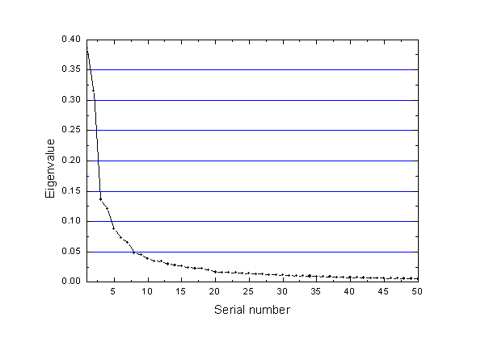
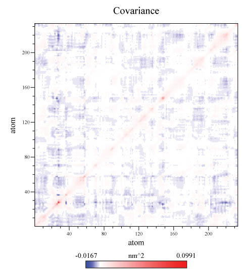
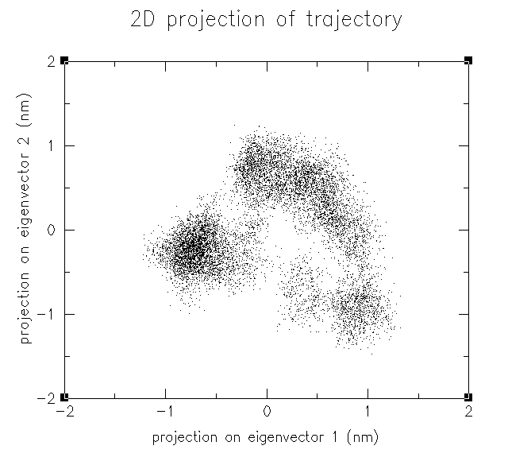
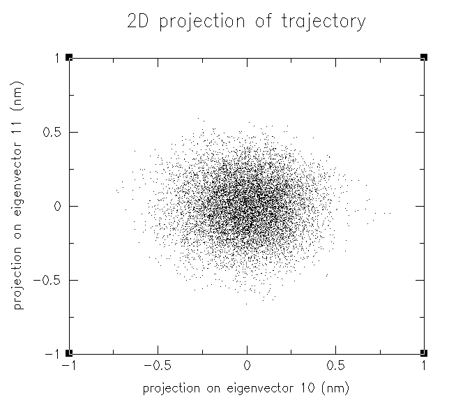
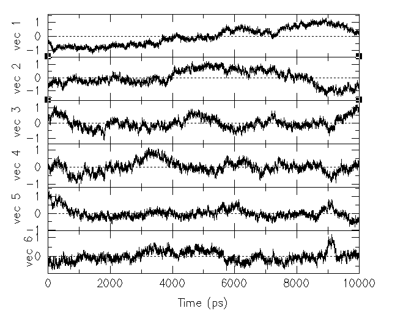
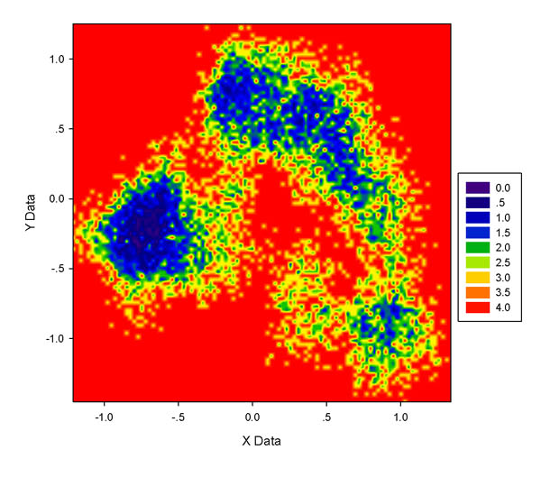
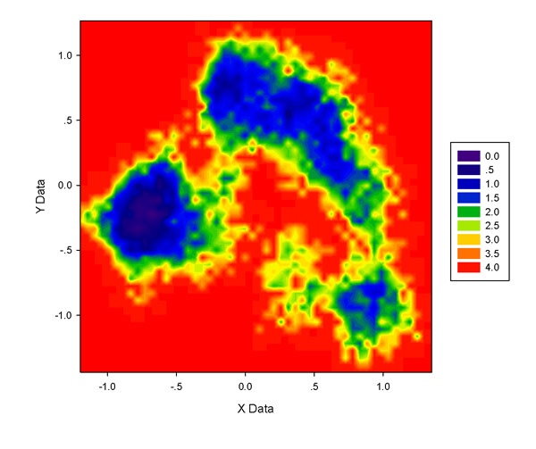
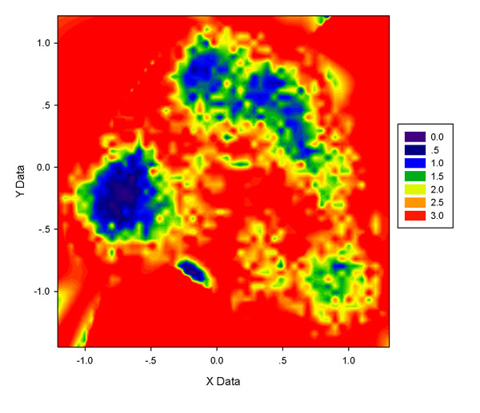
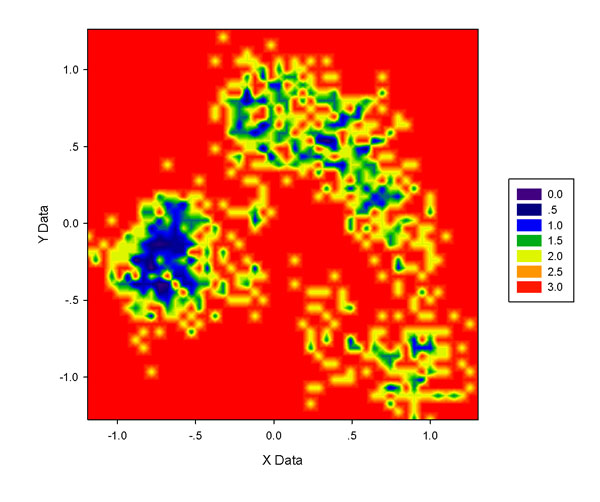
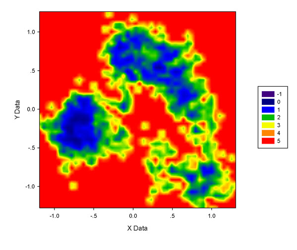

**浅谈PCA与g_covar+g_anaeig+ddtpd+sigmaplot做自由能面图的方法**  
A brief introduction to PCA and the g_covar+g_anaeig+ddtpd+sigmaplot scheme to plot free energy surface map

文/Sobereva @[北京科音](http://www.keinsci.com/)  2010-Nov-11

其实这个问题两年前就写过帖子讨论过，但由于近来又有人问，也觉得在作图的时候有些问题值得补充说明一下，故撰此贴。

## 1 PCA浅谈

N个原子的柔性大体系运动轨迹需要3N维笛卡尔坐标描述，然而这样高维度的数据很难直观分析，尤其是随着计算能力越来越高，模拟的体系也越来越大、模拟的时间越来越长、内容越来越复杂，这就需要发展更多的分析方法去挖掘出海量信息中感兴趣的信息，而使数据“噪音”被过滤，比如从复杂轨迹中了解蛋白的折叠/去折叠主要路径、酶重要域的大尺度运动行为、体系构象分布倾向、配体/残基突变/质子化等效应对体系构象的影响等等。一种解决途径是将坐标维度约化得尽可能低，同时尽可能使原始高维空间下的信息最大程度保留，这样就方便人直观考察体系的运动过程。统计学上的Principal component analysis(PCA)正适合解决这个问题，一般是将变量选为3N个笛卡尔坐标（也有其它选择方式，诸如二面角PCA等），要处理的数据集就是各帧结构。首先由MD轨迹构建协方差矩阵，然后计算其本征值和本征向量。这3N个本征向量也就是由原始笛卡尔坐标组合而成的新坐标，它们彼此间从协方差的意义上说是不相关的（也就是把轨迹转换到这些新坐标上后，协方差均为0）。本征向量对应的本征值越大说明体系的运动行为越多地体现在这个本征向量坐标上，若最大的几个本征值的和除以协方差矩阵的迹等于0.85，说明在这几个维度上就可以描述体系85%的运动信息。这样有高本征值的本征向量也称主成分(Principal component, PC)。

实际上一般不将大分子全部N个原子都考虑，比如研究蛋白骨架行为就考虑alpha-C即可，研究某一个区域的运动就选择这个区域的原子即可，不仅计算会省时、省内存，而且如果把过多无关原子也考虑进去，若它们在模拟中运动也比较明显，则感兴趣的原子的运动反倒被掩盖了。另外，做PCA前必须将整个轨迹向指定帧的结构做align以消除平动和转动的影响，前文所谓“运动”皆是指体系的内运动，否则分子内运动行为会被整体运动掩盖住。（实际上即便做了align，整体运动的成分也并没彻底消除，因而出现了基于内坐标的PCA方法，即dihedral PCA）。限于本文篇幅和目的不再对PCA进行更具体讨论，可以参考Principal Components Analysis: A Review of its Application on Molecular Dynamics Data。下载地址：[/usr/uploads/file/20150610/20150610200236_48141.pdf](http://sobereva.com/usr/uploads/file/20150610/20150610200236_48141.pdf)

## 2 自由能面图(Free energy landscape)

一般所谓自由能面图就是通过一张图来描述大分子各种构象自由能的大小。这就需要知道各种构象{x}出现的概率密度P(x)，然后通过Boltzmann关系计算G(x)：  
G(x)=-kT*Ln(P(x))+常数  
常数项不用管，它和配分函数有关，是极难计算的。我们关心的只是各种构象的相对自由能而不是绝对自由能，常数项与此无关，所以做自由能面图时常数项可以取任意值。

在平面上最能清晰展现出来的是二维坐标的图，通常将自由能面图的两个坐标轴分别取为PC1、PC2（最大两个本征向量），若选取的原子在模拟中运动范围大，它们一般已经能描述体系70%以上的运动行为。如果PC3的本征值也不小，可以再加一张图以PC1和PC3为轴。（对某些问题也可以用其它描述体系特征的量为轴，比如转动半径）

选定了坐标轴后需要将原始轨迹根据相应的本征向量投影到这两个坐标轴上。如果做散点图，图上就会显现疏密不均的小点，点越密集处说明构象出现概率越大，相应的构象自由能越低。接下来将图上的散点分布转换成概率分布P(x)，再由前式获得G(x)，做它的等值线图或者填色图就得到了自由能面图。接下来将给出实例，通过gromacs的g_covar和g_anaeig子程序、笔者开发的ddtpd以及sigmaplot绘图程序绘制一个10ns模拟中酶蛋白骨架的自由能面图。

## 3 使用g_covar

g_covar用来生成轨迹的协方差矩阵并计算本征向量和本征值。运行方法（方括号代表可选的项）：  
g_covar -f 输入的轨迹文件 -s 输入的结构文件 -n [输入的index文件] -o 输出的本征值文件 -v 输出的本征向量文件 -av 输出的平均结构文件 -l 输出的日志文件 -ascii [输出的协方差矩阵数据文件] -xpm [图形描述的N阶协方差矩阵] -xpma [图形描述的3N阶协方差矩阵]

例如g_covar -s a-sol-prnowat.gro -f allnowat.xtc -o eigenvalues.xvg -v eigenvectors.trr -xpma covapic.xpm  
其中allnowat.xtc是一个10000帧的10ns的轨迹，a-sol-prnowat.gro是与它对应的某一帧结构文件。运行后程序会问将哪些范围原子做align，选C-alpha，说明每帧的C-alpha将会朝着输入的结构文件做align；然后会问对哪些范围原子做PCA，选C-alpha（也可以与刚才选的不同）。

由于alpha-C共有232个，所以协方差矩阵是3*232=696阶的方阵，故eigenvalues.xvg含有696个值，本征值顺序是从大到小。由于这个体系处于平衡态，骨架整体运动不明显，所以由eigenvalues.xvg信息绘制的下面的“本征值大小vs本征值序号”的图上看，虽然随序号增大本征值立刻降低，但是收敛不快，超过5号后降低平缓，前十个本征向量总共只能解释体系58.7%的运动信息，PC1和PC2一起只能解释32.2%的信息，说明对此体系全部alpha-C原子做PCA意义不大。由于本文目的主要是说明如何做自由能面图，所以这无所谓。

696个本征向量分别记录在eigenvectors.trr中的每一帧中，其原子坐标代表原3N个笛卡尔坐标是如何组合成本征向量的，这个轨迹虽然也可以用可视化软件观看，但没什么意义。实际上得到的轨迹有698帧，是因为第一帧保存的是align时的参考结构，第二帧是轨迹平均结构。

covapic.xpm是图形化描述的协方差矩阵，在Linux下可以用比如GNOME之眼打开；若在windows下打开，可以先用gromacs自带的xpm2ps转换成eps文件，再用诸如再用诸如photoshop、GhostView查看（也可以用adobe distiller等软件转成pdf）。此文件中3N*3N协方差矩阵已经被转化成N*N协方差矩阵，即坐标轴刻度对应原子序号。越红的区域说明矩阵元数值大，白的区域对应矩阵元数值为0，越蓝代表越负。矩阵对角线就是方差，必大于零，故是白色或偏红色。图中坐标为(28,28)的区域较红，说明26~29号alpha-C在模拟中运动比较明显，实际上这几个残基正处于蛋白质柔性末端，直接考察轨迹也能得出相同结论。非对角元区域可正可负，越正/越负说明相应两个原子运动方式越趋于正相关/负相关。图中虽有深蓝色区域，但从色彩刻度上看其值其实并不很负。alpha-C原子间运动多呈负相关和残基侧链间静电作用导致排斥/吸引而使相关原子产生反相运动有关。若是研究同一残基的原子运动的协方差矩阵，由于某原子运动会拉动周围原子同向运动，所以对角线附近也会偏红。

## 4 使用g_anaeig

g_anaeig的主要功能之一是将轨迹投影到选取的本征向量上，这里要投影到PC1和PC2上，执行：  
g_anaeig -f allnowat.xtc -s a-sol-prnowat.gro -v eigenvectors.trr -first 1 -last 2 -2d 2d.xvg  
首先allnowat.xtc各帧会被align到eigenvectors.trr里记录的参考结构上，然后投影到-first和-last所选的本征向量，命令中1、2就是指前两个本征向量，即PC1和PC2。-2d 2d.xvg代表将每帧结构在PC1和PC2上的投影值输出到2d.xvg。

如果装了xmgrace，运行xmgr 2d.xvg，调整显示方式得到下面的散点图：

每个点代表一帧结构，越密集的区域说明这个区域对应的分子构象能量越低。在密集区域中随便取一个点，若这个点的编号是i，就说明轨迹中第i帧的构象是较稳定、能量较低的，反之稀疏区域的点对应的帧是不稳定构象。在xmgrace中获得点的编号首先要将感兴趣的区域放大，然后在设定符号/图例的页面中将显示的符号设为Index，数据点就以其编号显示了。利用PCA可以做簇分析，比如图中左侧一团密集的点对应的构象就可以归为同一个簇，即它们构象相似。下图是投影到PC10和PC11的结果。

比较可见，投影到PC10、11后数据点都凑在一起成球状，看不出任何特征，构象的差异引起的能量差异得不到充分显现，也不可能做簇分析。这就是为什么轨迹要投影到PC1、2的原因，PC1、2最能描述体系运动模式，或者说PC1、2能将体系的自由能面形貌最大程度地展现，使其细节特征能够充分地暴露出来。

使用g_anaeig时如果用“-3d 文件名”，会将轨迹投影到从-first到-last的3个主成分上，输出的是.gro文件，原子坐标的X/Y/Z值分别代表在三个PC上的投影，原子编号就是帧号。如果用“-proj 文件名”，可以同时将轨迹投影到从-first到-last的任意多个主成分上。比如投影到前六个PC，用xmgr对得到的.xvg文件作图得到：

图中表现轨迹在PC1至PC6上投影值随时间的变化。前两个PC波动比较大，说明其数据方差大，这也说明为何在协方差矩阵中其对应的本征值大（本征值=方差）。后面几个PC的波动依次渐缓，尤其是PC5和PC6，完全就像是体系在平衡态的RMSD曲线，体系的运动信息用它们根本描述不出来。

## 5 使用ddtpd做自由能面图

### 5.1 ddtpd简介

ddtpd全称Converting dot distribution to probability distribution，是笔者开发的将上述-2d关键词生成的点分布.xvg文件转换成概率或自由能分布的小程序。原理是根据数据最大、最小值设定空间范围，然后根据用户输入的两方向格点数将空间划分为一个个微小的格子，根据 P(x,y)=此网格内数据点数量/总数据点数量/网格面积 来计算不同位置的概率密度，进而转化为自由能。ddtpd v1.3还支持高斯展宽功能，用于解决数据点较少时图像难看的问题。

ddtpd v1.3的下载地址：[/usr/uploads/file/20151115/20151115220021_45515.rar](http://sobereva.com/usr/uploads/file/20151115/20151115220021_45515.rar)。  
压缩包里的test.xvg就是下文要用的xvg文件。

### 5.2 作图步骤

启动ddtpd后，依次输入  
2d.xvg  //文件名  
100  //将X轴划分的格子数  
100  //将Y轴划分的格子数  
2  //选择输出方式。2代表输出-LnP  
y  //令P=0的点也输出。此时数据被输出到当前目录的result.txt下。由于没有数据点分布的区域P=0，没法求对数，对这样的区域ddtpd认为其P是一个很小的常数，自由能直接设为-Ln0.000001。  
y  //把-LnP最负的值，此处为-0.821262设为自由能的零点。我们感兴趣的只是相对值，所以可以加减任意常数，这样所有值加上0.821262之后数据最小值就是0，设定色彩刻度会比较方便。此时数据将输出到当前目录的result2.txt下，前两列是PC1和PC2的坐标，第三列是-LnP的值。

sigmaplot比较易用，适合做填色图描绘自由能面。为了让色彩刻度中色彩变化明显的范围覆盖-LnP数据主要分布范围，以使图上数值大小不同的区域能够被清晰地区分开，需要对ddtpd输出的数据做一下调整。注意程序最后在屏幕上输出“Now maximum result is    2.772589”（注：这个最大值是指除P=0以外区域的值）以及“14.636773 means P=0 in this minival area”。打开result2.txt，将P=0的值替换为最大值加上1.0~1.5得到的整数或半整数（凑整数/半整数只是为了方便而已），此例中就是将14.636773替换为4。由于数据较多，不同文本编辑器替换速度由于算法不同差异明显，建议用Ultraedit。

然后将result2.txt放到sigmaplot里做图，得到下图（色彩刻度为默认）：

注意这类图的单位是kT，k是Boltzmann常数(J/K)，T是当前模拟时的温度(K)，所以kT=T*1.3806503*10^-23J。如果想转化到kcal/mol，就除以4186再乘以阿伏伽德罗常数。比如对于图中的4位置，假设模拟是在310K进行的，就是4*310*1.3806503*10^-23/4186*6.023*10^23=2.4633kcal/mol.

### 5.3 格点数目的选择对图像的影响

上图整体效果不错，越蓝区域说明自由能越低，图中显示构象主要分布在左、右上和右下三部分，自由能依次升高。不过图也略有缺点，也就是诸如右上角低能量区域有很多红色或黄色的窟窿，蓝色区域没那么连贯，显得细碎。这与格点数目选取有关，格点数太多不仅图像细碎，做图还慢；格点数太少虽然会连贯，但是缺乏细节，图像边缘时常呈现棱角。一般来说，.xvg文件中数据点越多可以用越多的格点，图像边缘细节会更丰富，且不使图像细碎；当数据点不够多的时候用较大数目格点只有坏处，得到的图甚至就像散点图。下图是此xvg文件50*50格点和200*200格点的图，后者凌乱很不好看，而前者又有些模糊，由于前面100*100做的图也略有零碎，所以75*75格点比较适合做这个xvg文件的填色图。对不同体系应当反复摸索最适合的格点设定，一般不超过60*60至120*120范围。另外，调整色彩刻度上下限也能有效改善图像效果，这里就不谈了，请自行摸索。

### 5.4 P=0的点对图像的影响

为何要让ddtpd输出P=0的点需要说明一下，尽管这些点看似没有意义。sigmaplot会对输入的数据点的空隙进行差值使图像平滑。如果P=0的区域都不输出，这么大范围的数据空缺区域sigmaplot都会通过插值来弥补。但由于空缺区域往往过大，插值出的结果经常很糟糕。下图是75*75格点，不含P=0的点时sigmaplot给出的结果，和前面的图相对比，会发现在数据点集中分布的区域周围多出了一些的东西（如图的左下角），尤其是在图的中心偏左下的位置多出现一块深蓝区域，如果将它解释为自由能很低的区域就明显错了，这都是因为sigmaplot插值所致。

### 5.5 对数据点进行高斯展宽

如果用g_anaeig的时候加上-skip 10，就代表每10帧输出一次投影值，前例有10000个点，此时就只有1000个点了，。这样少的数据点很难做出满意的图，哪怕只用50*50格点，图像仍然零碎，尤其是右上角的一片区域，如下图所示。如果进一步降低格点数，图像就不好看了。这时需要利用ddtpd的高斯展宽功能来改善。

所谓高斯展宽，就是把每个点改成用高斯函数来表达（经过归一化），简单来说，比如一个格子内没有数据点，而附近的某个格子内有1个数据点，那么这个格子也能分享到零点几个数据点。这样就不会造成数据点分布密集区域中由于恰好有一些格子没有数据点（格点密度高的时候这种情况尤甚），而使图像出现一堆窟窿或者显得零碎。下图是经过高斯展宽后的图，明显数值连续性比上图好很多。为了效果更好，图中色彩刻度设为了-1~4.5。

此图做法是启动ddtpd，依次输入：  
2dskip10.xvg  //文件名  
50  //将X轴划分的格子数  
50  //将Y轴划分的格子数  
4  //输出将数据点经过高斯展宽后的-LnP  
1  //展宽系数，默认是1，其值越大展宽效果越明显，但会造成细节区域越难以显现，可反复尝试。假设输入的是k，就代表展开成的高斯函数的半高宽是k*sqrt(dx^2+dy^2)，其中dx和dy分别是X/Y方向的网格宽度。  
y  //输出P=0的点  
y  //调整G的零点  
注意屏幕上提示数据的最大值为5.11，20.305551对应P=0区域的值。对于利用高斯展宽得到的结果，作图前将P=0区域的值替换成最大值就行了（不用再加1.0~1.5），此例即把result2.txt里的20.305551都替换为5.11，然后放到sigmaplot里作图，调调色彩刻度即得到上图。
