**深度揭示互为等电子体的苯、无机苯和carborazine的芳香性的显著差异**  
Deeply revealing the significant differences in the aromaticity of benzene, inorganic benzene and carborazine

文/Sobereva@[北京科音](http://www.keinsci.com)  2024-Dec-12

## 1 前言

众所周知，苯具有极其显著的芳香性特征。它的重要的等电子体borazine（硼吖嗪）也被称为无机苯，具有B3N3H6的化学组成，是把苯的六元碳环上的碳替换为交替相连的氮和硼。无机苯的芳香性虽然早就被很多文章研究过，都指出其芳香性明显不及苯，但不同文章里关于它的芳香性强度说法不一，甚至出入很大，还有的文章使用不严谨的方法对其芳香性进行表征得到了误导性的结论。New J. Chem., 39, 2483 (2015)提出了carborazine（我将它译为碳硼吖嗪）分子，是苯的另一种等电子体，它的结构介于苯与无机苯之间，如下所示，虽然此文指出了它具有芳香性，但对芳香性研究得并不深入和严格。

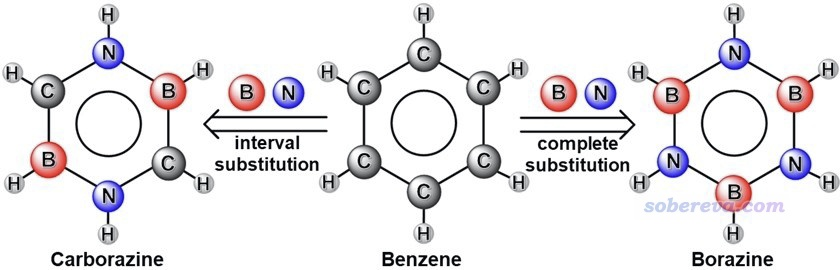

为了真正全面、透彻阐释苯及其上述两种等电子体的芳香性特征、揭示芳香性差异的内在本质，以及了解carborazine的特点，北京科音自然科学研究中心的卢天和江苏科技大学的刘泽玉等人近期在知名的Chem. Eur. J.（欧洲化学）期刊上发表了专门的研究文章充分研究了上述体系的电子结构和芳香性，非常欢迎大家阅读和引用：

Yang Wu, Xiufen Yan, Zeyu Liu,* Tian Lu,* Mengdi Zhao, Jingbo Xu,  
 Jiaojiao Wang, Aromaticity in Isoelectronic Analogues of Benzene, Carborazine and Borazine, from Electronic Structure and Magnetic Property, *Chem. Eur. J.*, **30**, e202403369 (2024) DOI: [10.1002/chem.202403369](https://doi.org/10.1002/chem.202403369)

此文可通过以下链接免费在线阅读：  
<https://onlinelibrary.wiley.com/share/author/PYSFYG86FNTHBBWXITBI?target=10.1002/chem.202403369>

这篇文章还被选为了Chem. Eur. J.的封面文章（DOI: 10.1002/chem.202486603）：

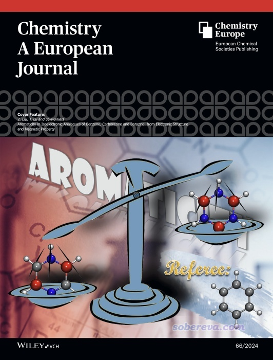

下文将对这篇文章的主要内容做深入浅出的介绍，便于读者快速顺利地了解文章的研究结论，并且同时附加一些额外信息，使得读者可以更充分了解研究思想和计算细节，从而能够参考本文的内容更好地做自己的研究。

本文充分利用了强大的Multiwfn程序（<http://sobereva.com/multiwfn>）做波函数分析讨论芳香性，是波函数分析方法和Multiwfn程序的很好且十分典型的应用范例。Multiwfn能做的芳香性分析在《衡量芳香性的方法以及在Multiwfn中的计算》（<http://sobereva.com/176>）里有简略介绍，在**北京科音量子化学波函数分析与Multiwfn程序培训班（**[**http://www.keinsci.com/WFN**](http://www.keinsci.com/WFN)**）**里有多达160页以上的幻灯片极为完整、全面、系统地讲授芳香性的各种概念和全部分析手段，非常推荐参加！

与本文的研究有密切相关的是《18碳环等电子体B6N6C6独特的芳香性：揭示碳原子桥联硼-氮对电子离域的关键影响》（<http://sobereva.com/696>）介绍的Inorg. Chem., 62, 19986 (2023)一文，十分建议看完下文后认真阅读。

## 2 苯、无机苯和carborazine的结构和稳定性

文中首先用ωB97XD/def2-TZVP对上述三个体系做了几何优化，这是相当稳的级别，也被用于<http://sobereva.com/carbon_ring.html>列举的18碳环及其各种衍生物的研究中，后文的各种分析也都是在这个级别下做的。得到的苯的C-C键长1.387埃和电子衍射实验测定的1.399埃相符极好，得到的无机苯的B-N键长1.426埃也完全在X光衍射测定的1.422-1.429埃范围内。所有三个结构都是纯平面的，苯、无机苯和carborazine分别属于D6h、D3h和C2h点群。

尚未合成的carborazine的稳定性并不得而知，跑从头算动力学（AIMD）是一种有效的检验手段，例如在《18个氮原子组成的环状分子长什么样？一篇文章全面揭示18氮环的特征！》（<http://sobereva.com/725>）介绍的文章里通过AIMD直接证明了18氮环非常不稳定。本文对carborazine和borazine用ORCA程序在ωB97XD/6-311G*级别下做了50 ps AIMD，由于AIMD的昂贵耗时使得模拟时间很有限，文中故意用了1000 K的较高温度令势能面的采样尽量充分。文中还确认了当前温度下的AIMD过程的平均总能量是高于极小点结构下的ZPE的，因此当前的模拟不会低估实际的振动基态能量。这种模拟在北京科音高级量子化学培训班（<http://www.keinsci.com/KAQC>）里有超详细的讲解，在《使用ORCA做从头算动力学(AIMD)的简单例子》（<http://sobereva.com/576>）里讲了一些粗略的信息。模拟轨迹多帧叠加图如下所示，每1 ps绘制一次，按照模拟时间颜色按蓝-白-红变化。可见模拟过程中carborazine和无机苯一样始终保持结构稳定，并未解离或异构化，而且结构波动范围相仿佛，这很大程度体现了carborazine像无机苯一样是稳定的物质，在未来很有可能被成功合成出来。

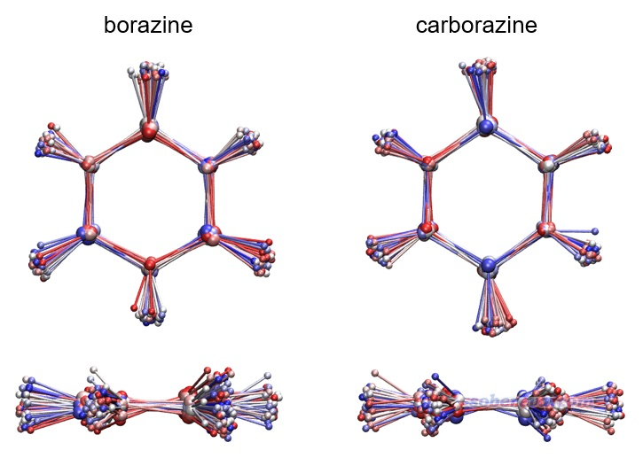

文中还在ωB97XD/def2-TZVP下计算了原子化能，carborazine的原子化能-1200.9 kcal/mol和无机苯的-1225.6 kcal/mol非常接近，进一步体现出carborazine具有显著的稳定性。

值得一提的是carborazine的结构并非是其B2C2N2H6的化学组成的所有的可能异构体中能量最低的，这从文中在SI里给出的各种可能的异构体相对于carborazine的能量可以看出，如下所示，可见让两个碳挨在一起的能量更低。但由于原子的迁移要破坏原先的C-N和C-B键，决速步的能垒必定巨高，因此这样的自发异构化并不会在现实中发生。

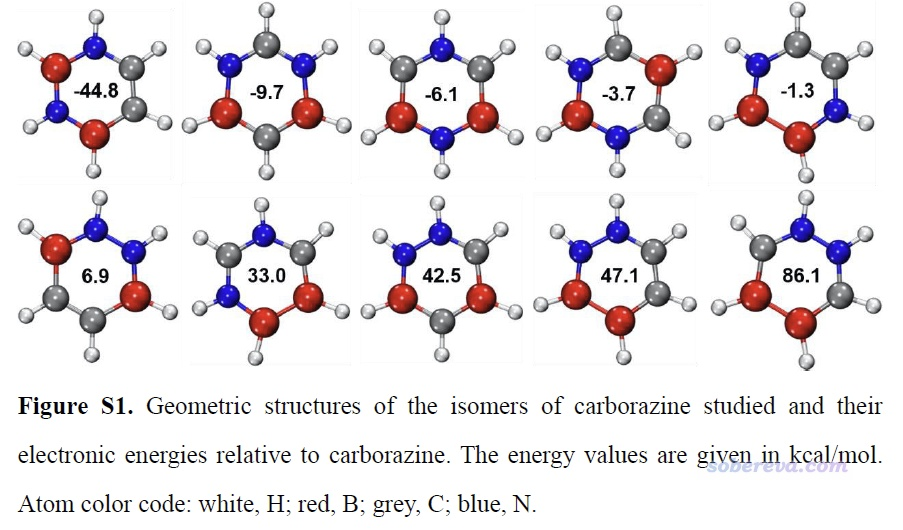

## 3 苯、无机苯和carborazine的电荷分布

原子电荷的概念在《一篇深入浅出、完整全面介绍原子电荷的综述文章已发表！》（<http://sobereva.com/714>）介绍的笔者的文章里有充分介绍，这是定量衡量体系电荷分布最常用的指标。本文通过流行的ADCH方法以及NPA、Hirshfeld和Hirshfeld-I、CHELPG方法都对前述三个体系计算了原子电荷，结果如下所示。可见虽然不同方法计算的原子电荷存在定量差异，但结论都是共通的，即硼和氮由于电负性一个很小一个极大，导致分别带显著的正电荷和负电荷，而在carborazine中它们的差异远小于在无机苯中，这体现出在硼和氮之间插入的碳可以极大地均衡体系中的电荷分布。另外，carborazine中的碳的原子电荷的大小很小，体现出旁边的氮和硼并没有对碳的净电荷带来明显影响。

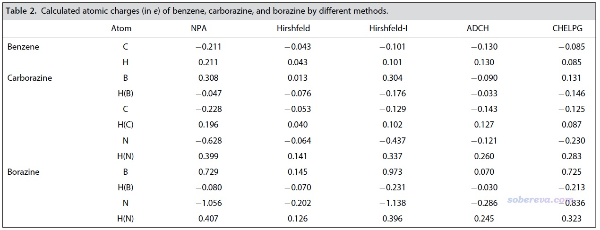

《在Multiwfn中单独考察pi电子结构特征》（<http://sobereva.com/432>）介绍了Multiwfn对pi电子的分析功能。本文使用Multiwfn通过Mulliken方法计算了前述体系的非氢原子的pi布居数以考察它们pi电子的分布情况。结果是苯(C=0.995)、无机苯(B=0.429, N=1.558)、carborazine (B=0.586, C=0.985, N=1.411)。此结果清楚地体现了相对于无机苯，carborazine中在硼和氮之间引入的碳原子可以平衡它们的pi电子数的差异。而carborazine中的碳的pi布居数和它在苯中几乎没区别。

为什么要讨论环上的pi电子分布？因为它的分布量和分布均衡性与芳香性有关键的联系。较强的pi芳香性必须同时满足环上的pi电子丰富、pi电子分布较均衡，以及pi电子在环上的离域性较强这三个条件。虽然无机苯的pi电子数和苯一样，都是6个电子，但环上的原子的pi布居数的最小值，即硼的pi布居数，仅有0.429，因此姑且不论其电子的离域性与苯的差距有多大，光凭这点，其芳香性至多也只有苯的约40%。反之，carborazine六元环上硼的pi布居数达到0.586，因此可以认为其芳香性的上限约有苯的60%。

## 4 苯、无机苯和carborazine的pi轨道

pi分子轨道的特征与pi电子的芳香性有密切联系，所以此文也考察了pi轨道的特征。前述三个体系的HOMO、LUMO轨道都是pi轨道，它们的能级和等值面图如下所示，其它两个占据的pi轨道也一起显示了。可见carborazine的HOMO-LUMO gap比苯和无机苯明显更小，一定程度暗示可能其稳定性相对更弱一些。

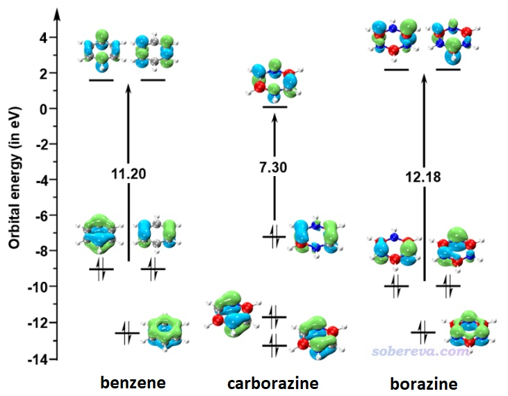

Multiwfn可以非常便利地计算轨道成份，见《谈谈轨道成份的计算方法》（<http://sobereva.com/131>）。使用Mulliken方法计算的上面图中展示的占据的pi轨道的成份如下所示。可见无机苯的所有pi轨道全都是由氮原子贡献所主导的，这也必定导致无机苯的pi电子几乎都集中且定域在氮原子上，因此在这点上它就不可能有显著的芳香性。而虽然carborazine的HOMO-3和HOMO-5也是以氮原子的贡献为主（因为氮的pz原子轨道的能量比碳和硼的都要低，故偏向于对能量较低的分子轨道贡献较多），但还不至于起到绝对的主导性，而其HOMO的主要贡献则来自硼和碳。由于carborazine的硼、碳、氮都同时明显参与了pi占据轨道，它势必有比无机苯强得多的六中心pi电子离域。

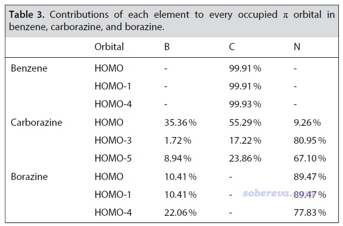

## 5 苯、无机苯和carborazine的成键特征

键级的概念在《Multiwfn支持的分析化学键的方法一览》（<http://sobereva.com/471>）中做了简要介绍。文中用Multiwfn对上述三个体系计算了Mayer键级，它体现两个原子间等效共享的电子对儿数，结果如下表左侧所示，并且还按照《在Multiwfn中单独考察pi电子结构特征》（<http://sobereva.com/432>）所述的方法将sigma和pi电子的贡献分别给出了。可见虽然B-N、C-N、C-B的pi键级都比C-C键的更小，但数值也都不低，所以它们的pi作用都是不容忽视的，也因此切勿以为B-N键只能算作纯sigma键。carborazine六元环上的各个键的pi键级都大于无机苯的B-N键，这点已在一定程度上能体现出carborazine的整体pi共轭是强于无机苯的。

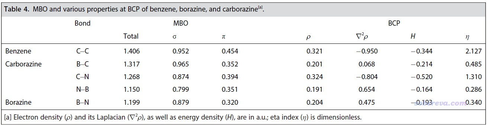

文中还对前述体系用Multiwfn做了流行的atom-in-molecules (AIM)拓扑分析，以从键临界点（BCP）处的实空间函数角度考察体系的成键特征，结果如上表右侧所示。AIM的相关知识和Multiwfn里的操作见AIM学习资料和重要文献合集（<http://bbs.keinsci.com/thread-362-1-1.html>）里提到的内容。共价键在BCP处的能量密度（H）应当为负，并且eta指数（η）大于1是最典型共价键的特征。当前的结果体现出苯的C-C键和carborazine的C-N键都具有最典型的共价键特征，而carborazine和无机苯的N-B的共价性相对最低、离子性相对最强，因此H没那么负且η显著小于1，这无疑是硼和氮的巨大电负性差异所带来的。

要注意切勿把B-N当做离子键。有些文章盲目使用BCP位置的电子密度拉普拉斯函数（▽2ρ）的正负作为共价键的判据，如Inorg. Chim. Acta., 360, 619 (2007)以这个为理由说B-N是离子键，这是很误导的。之前我在《AIM键临界点处电子密度拉普拉斯值符号判断相互作用类型失败原因的图形分析》（<http://sobereva.com/161>）中专门说过类似情况。对B-N键，如前所示Mayer键级显著大于1，而且BCP处的能量密度明显为负，就已经充分体现出这属于共价键了。文中更进一步在补充材料里还用Multiwfn绘制了电子定域化函数（ELF）和变形密度图，分别如下图左侧和右侧所示，可见B-N之间有显著的电子高定域性区域，并且从孤立状态变成分子过程中在B-N键上有显著的电子密度增加（图中红色实线为正值部分），这都进一步证明B-N键本质上是共价键，只不过极性很强而已。关于变形密度的知识见《使用Multiwfn作电子密度差图》（<http://sobereva.com/113>）和《通过价层电子密度分析展现分子电子结构》（<http://www.whxb.pku.edu.cn/EN/10.3866/PKU.WHXB201709252>），关于ELF的知识见《ELF综述和重要文献小合集》（<http://bbs.keinsci.com/thread-2100-1-1.html>）和《电子定域化函数的含义与函数形式》（<http://www.whxb.pku.edu.cn/EN/10.3866/PKU.WHXB20112786>），绘制方法参考Multiwfn手册4.4节，在量子化学波函数分析与Multiwfn程序培训班（<http://www.keinsci.com/WFN>）里有更丰富的例子、更细致的讲解和各种技巧的传授。

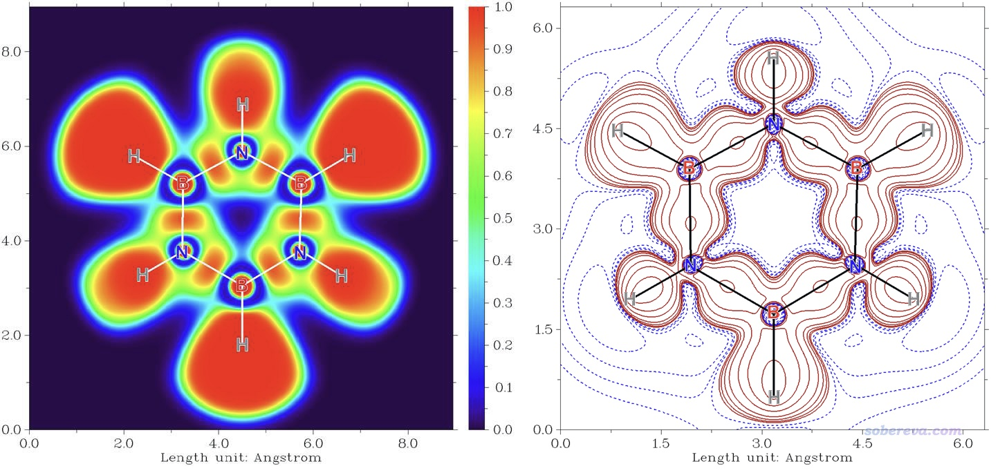

## 6 苯、无机苯和carborazine的电子离域特征

如《在Multiwfn中单独考察pi电子结构特征》（<http://sobereva.com/432>）和笔者的Theor. Chem. Acc., 139, 25 (2020)所提到的，pi电子的局域轨道指示函数（LOL），即LOL-pi，对于展现pi电子的离域性极为直观。对前述三个体系用Multiwfn计算并用VMD绘制的LOL-pi等值面图如下所示，可见苯的六中心共轭作用最强，等值面均匀、理想地贯穿六元环。虽然carborazine和无机苯的LOL-pi等值面都没有分布得很均匀，特别是在B-N键处受到了阻碍，算是电子共轭的“瓶颈”，但是carborazine的每个B-C-N单元上的等值面较为均匀、连贯，这是无机苯不具有的，因此从LOL-pi展现的电子离域性图上可以期望carborazine有明显更强的芳香性。

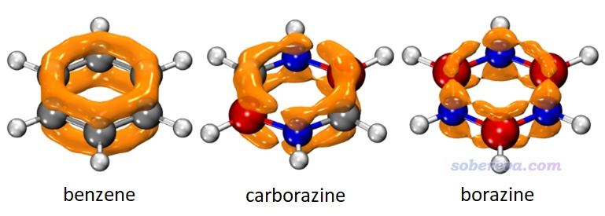

文中还绘制了EDDB_P-π等值面图，详见原文。LOL-pi展现的是不同区域电子的离域程度，而EDDB_P-π展现的是不同区域离域的pi电子量，二者体现的信息存在互补性。EDDB_P-π等值面图及其布居分析展现出无论是carborazine还是无机苯，硼上的离域的pi电子都比环上的其它原子更少，原因之一是硼上的pi电子数本来就非常少，这在前面的pi布居分析中已经体现了。相比之下，carborazine的硼的离域的pi电子为0.360，明显多于无机苯的0.184，这进一步体现出carborazine具有更强的pi芳香性。并且0.360这个值是苯的碳原子的离域pi电子数0.885的41%，这说明carborazine至少有苯41%的芳香性。

进一步，文章还使用Multiwfn计算了多中心键级（MCBO），以及sigma+core和pi电子各自的贡献量，相关知识参看《使用AdNDP方法以及ELF/LOL、多中心键级研究多中心键》（<http://sobereva.com/138>）和《衡量芳香性的方法以及在Multiwfn中的计算》（<http://sobereva.com/176>）。结果如下所示，可见六中心电子离域性是苯 > carborazine > 无机苯，差异非常鲜明，这和上述其它分析给出的结论非常一致。从MCBO的数值大小来说，carborazine具有苯的大约一半的芳香性，而无机苯则连carborazine芳香性的一半都不到。

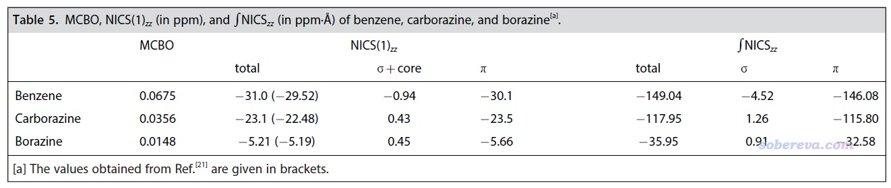

## 7 苯、无机苯和carborazine的磁屏蔽特征

有大量的方法从体系对外磁场的屏蔽角度衡量芳香性，参考笔者写过的《衡量芳香性的方法以及在Multiwfn中的计算》（<http://sobereva.com/176>）、《使用Multiwfn绘制一维NICS曲线并通过积分衡量芳香性》（<http://sobereva.com/681>）、《使用Multiwfn计算FiPC-NICS芳香性指数》（<http://sobereva.com/724>）、《通过Multiwfn绘制等化学屏蔽表面(ICSS)研究芳香性》（<http://sobereva.com/216>）、《使用Multiwfn巨方便地绘制二维NICS平面图考察芳香性》（<http://sobereva.com/682>），在《量子化学波函数分析与Multiwfn程序培训班》（<http://www.keinsci.com/WFN>）里有更全面系统的讲授。本文从磁屏蔽角度对苯、无机苯和carborazine的芳香性特征进行了定量的考察以及直观的展现。

NICS及其变体在定量衡量芳香性强弱方面极为常用，文中对苯、无机苯和carborazine计算了NICS最理想的形式之一NICS(1)ZZ，并通过《基于Gaussian的NMR=CSGT任务得到各个轨道对NICS贡献的方法》（<http://sobereva.com/670>）介绍的做法分解成了sigma+core和pi电子各自的贡献，数值越负说明芳香性越强。由数据可见，carborazine的pi芳香性虽然不及苯，但也相当显著，而无机苯的芳香性极为微弱，接近非芳香性。sigma电子对芳香性的贡献可忽略不计。

如《使用Multiwfn绘制一维NICS曲线并通过积分衡量芳香性》所述，对NICS_ZZ在垂直于环的方向上积分，即∫NICS_ZZ或称integrated NICS (INICS)，是比NICS(1)ZZ还更为严格的基于磁屏蔽特征衡量芳香性的方法，因为它的结果不依赖于计算磁屏蔽张量的位置的选取。从上面表格的数据可见∫NICS_ZZ的结论与NICS(1)ZZ相一致，更进一步体现了之前结论的可靠性。∫NICS_ZZ计算过程中利用到的穿过环中心且垂直于环方向上的NICS_ZZ曲线可以绘制出来并进行直观对比，如下所示，横坐标是相对于环中心（零点）的位置。根据pi电子的NICS_ZZ曲线，可以清楚地看出carborazine的曲线与苯比较接近，这将carborazine显著的pi芳香性特征体现得非常确切，而无机苯的pi芳香性相比之下显得微乎其微，其曲线在全范围都很接近0。三个体系的sigma电子的NICS_ZZ曲线几乎完全重合，很严格地体现出它们的sigma芳香性基本没有任何区别。

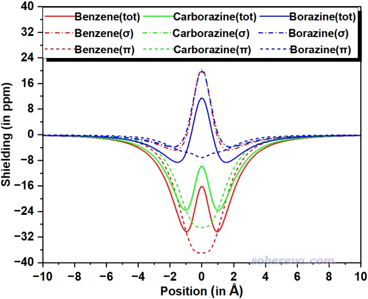

下图左列是Multiwfn结合VMD绘制的ICSS_ZZ等值面图，等值面数值为3 ppm，橙色和深蓝色分别是对外磁场屏蔽和去屏蔽区域。从这种图上能非常完整地了解体系的磁屏蔽特征。可见carborazine和苯一样都是在分子外围形成了环状的去屏蔽区域，又一次体现出了carborazine类高度似于苯的显著的芳香性，而无机苯的去屏蔽区域等值面则明显显得不够连续，体现出其芳香性远比carborazine弱得多。

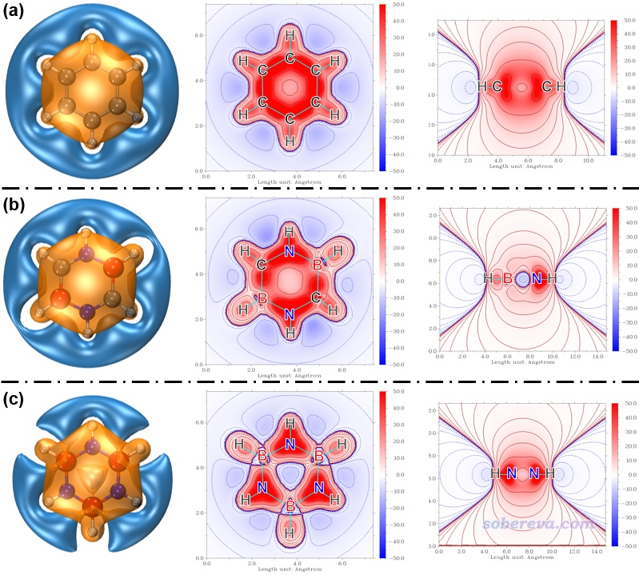

上图还给出了Multiwfn直接绘制的填色等值线图，中列和右列分别是分子平面以及分子的侧截面，颜色越红和越蓝分别对应相应位置的磁屏蔽和去屏蔽效应越强。可以看到carborazine在分子中心是磁屏蔽的，颜色和苯一样是偏红的，而borazine在分子中心却是去屏蔽的，颜色偏蓝，这充分反映了carborazine和苯在芳香性上是类似物，而无机苯可近似归为非芳香性分子一类。

## 8 苯、无机苯和carborazine的感生电流

在外磁场作用下在环状区域内离域的电子可以形成感生环电流，这是衡量电子离域性和芳香性的非常直观的方法，其中AICD展现方式尤为常见，详见《使用AICD 2.0绘制磁感应电流图》（<http://sobereva.com/294>）。本文对苯、无机苯和carborazine分别绘制了总的、sigma电子的和pi电子的AICD图，如下所示，从AICD(pi)图中箭头标注的感生电流上可以清楚地看出carborazine形成了和苯一样的贯穿整个六元环的显著的感生电流，而无机苯则完全不具备这样的特征。AICD图进一步有力地体现出，carborazine和苯一样都属于芳香性物质，而无机苯是近乎非芳香性的，这和ICSS分析的结论一致，彼此相互印证。

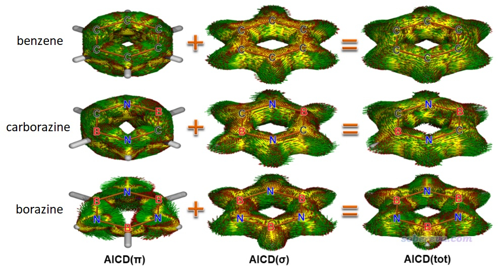

此文还使用《使用SYSMOIC程序绘制磁感生电流图和计算键电流强度》（<http://sobereva.com/702>）中介绍的做法用CTOCD-DZ2方法绘制了分子平面上方1 Bohr处的感生电流图，如下所示，灰、红、蓝分别对应碳、硼、氮原子。由图可见CTOCD-DZ2方法展现的感生电流图和pi电子的AICD图的现象很类似，而这种平面图看得更清楚一些。此图体现carborazine分子平面上方pi区域的感生电流的强度虽不像苯那么均匀，在硼上方相对弱一些，但终究还是形成了明显的全局感生电流。而无机苯的感生电流则主要在氮原子周围打转，体现出pi电子主要都是定域在各个氮的局部原子空间里。

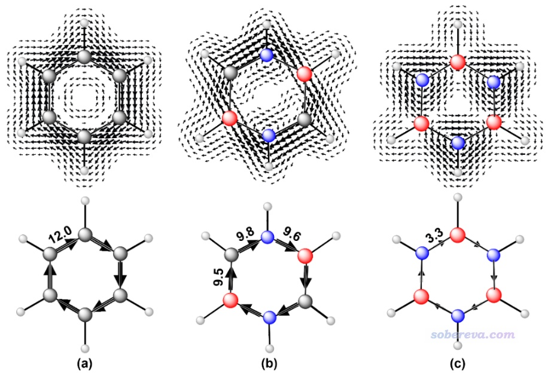

为了便于定量对比，此文还计算了六元环上各种键的电流强度（BCS）值，即在键中心位置垂直于键的平面上的感生电流的积分，结果如上图标注的数值所示，单位为nA/T。可见carborazine的感生电流强度与苯相差并不悬殊，而无机苯则相当微弱。这从定量角度上进一步验证了前面基于肉眼观看感生电流图所做出的结论。

值得一提的是，在《深入理解分子轨道对磁感生电流的贡献》（<http://sobereva.com/703>）中我给了计算感生电流的具体公式，假定只有HOMO-LUMO跃迁对感生电流有显著贡献，那么感生电流大小与HOMO-LUMO gap之间会有反比关系。在前面说过，carborazine的HOMO-LUMO gap明显小于苯和无机苯，因此基于磁属性和感生电流得到的关于carborazine的芳香性的强度会有一定程度的高估。但即便如此也不影响它具有明显芳香性的结论，而且前面从多中心键级、LOL-pi等分析角度也全都体现了carborazine有远强于无机苯的芳香性。

## 9 carborazine中的碳原子对硼和氮原子桥联的重要意义

前面从各个角度极为充分、全面、严格地论证了carborazine具有无机苯不具备的显著的芳香性，而二者的差异仅在于前者给后者的氮和硼之间引入了碳原子起到桥联作用。为什么碳原子的桥联对于提升芳香性有如此关键性的影响？此文将Multiwfn、NBO、VMD相结合绘制了前述三个体系的环上的各原子的对应2pz原子轨道的预正交自然原子轨道（PNAO）等值面的叠加图，过程可参照《使用Multiwfn绘制NBO及相关轨道》（<http://sobereva.com/134>）举一反三，如下所示。可见2pz的空间延展程度是硼 > 碳 > 氮，这和电负性增大的顺序相一致。氮和硼的轨道重叠颇差，电子明显难以离域过去。而给二者之间插入的碳原子，增加离域路径上的原子轨道重叠程度、降低相连原子的电负性不平衡性，明显可以起到了帮助电子离域过去的“中介”，从而使得carborazine能够具有无机苯不具备的显著芳香性。之前笔者在《18碳环等电子体B6N6C6独特的芳香性：揭示碳原子桥联硼-氮对电子离域的关键影响》（<http://sobereva.com/696>）介绍的文章中也使用了类似的角度进行分析。

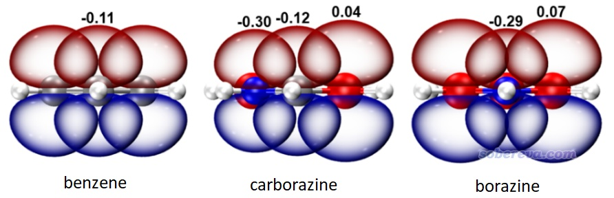

文章里还研究了其它4种苯的等电子体，以考察碳的数目和位置对芳香性的影响。它们的结构如下所示，NICS(1)ZZ也标在了图上，注意carborazine的值如前所述是-23.1 ppm。通过对比可见，环上的碳原子数多不意味着芳香性就强，例如下图第1、3个分子虽然有4个碳原子，但单从NICS(1)ZZ来看其芳香性还没只有两个碳的carborazine强。下图第4个分子和carborazine的碳原子数一样，但碳没有插入在硼和氮之间，芳香性也远不如carborazine强。而只有下图第2个分子，碳桥联了氮和硼，同时碳原子数比carborazine还更多，这才带来了稍微更强的芳香性。这个对比体现出对只有硼、氮的环上引入碳，而且能起到对它们的桥联作用时，才能显著提升芳香性。

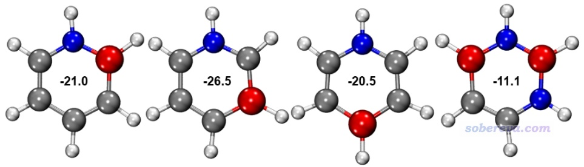

## 10 总结

本文介绍的Chem. Eur. J. 2024, e202403369一文十分全面透彻探讨了互为等电子体的苯、无机苯（borazine，B3N3H6）和尚未实验合成的carborazine（B2N2C2H6）的电子结构和芳香性的差异。此文的重点是综合运用各种分析手段，充分论证了含有碳原子桥联硼、氮原子特征的carborazine具有明显的芳香性（尽管强度一定程度弱于苯），同时还严格地证明了无机苯的芳香性极弱，甚至很大程度上体现出非芳香性分子的特征。文章对此现象的本质从电子结构层面进行了详细的分析和解释。此文的研究工作对于化学家们更好地了解由碳、氮、硼构成的物质的电子离域性和芳香性有显著的意义。

值得一提的是，此文的研究也是使用Multiwfn等程序做波函数分析深入剖析化学物质特征的非常典型的文章，可以作为波函数分析的很好的范例作为参考。此研究涉及的研究方法在前面提及的各种博文里有一些粗略、初步的介绍，通过**量子化学波函数分析与Multiwfn程序培训班（**[**http://www.keinsci.com/WFN**](http://www.keinsci.com/WFN)**）**可以一次性全面深入透彻掌握文中用到的一切波函数分析方法的背景知识和使用具体程序计算的方法，从而能顺利地复现此文的研究并举一反三探索更多的体系。
