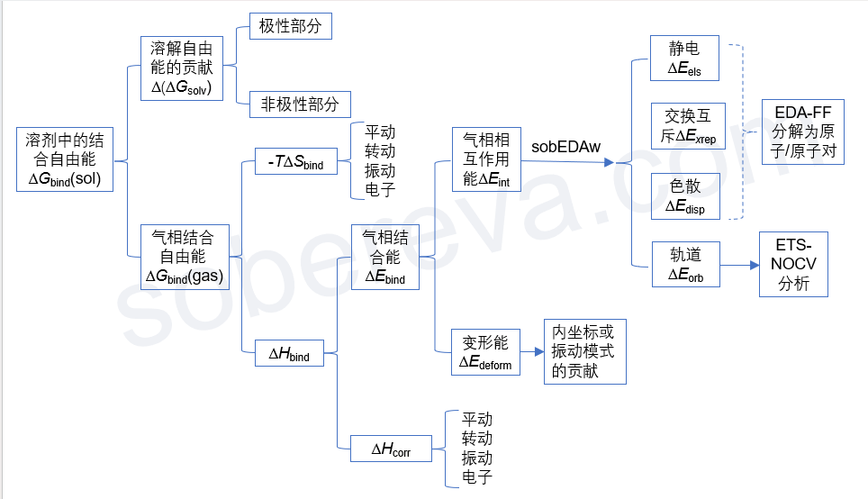

**谈谈分子间结合能的构成以及分解分析思想**  
On the components of intermolecular binding energy and idea of decomposition analysis

文/Sobereva@[北京科音](http://www.keinsci.com)

 First release: 2024-Dec-31   Last update: 2025-Dec-15

在我网上回答大量量子化学的问题的过程中，经常看到有些人搞不清楚对分子间相互作用有贡献的量之间的关系、不知道怎么将结合能分解成不同部分考察影响结果的内在因素。这使我决定作一张图，把分子间结合自由能的构成一次性梳理清楚，同时展现我的对分子间结合能的分解分析的思想，如下所示：

下面我会把图中各项进行简要的解释，便于读者理解每项是怎么回事、知道怎么计算，务必结合上图看。上图的源头是“溶剂中的结合自由能”，因为这个是包含的成份最多，内涵最复杂的量。本文仅考虑两个单体分子A、B间结合成为复合物AB的情况。

• 溶剂中的结合自由能ΔG_bind(sol)：这是指在溶剂（sol）环境下，两个分子从各自孤立状态相互接近并形成二聚体过程中的自由能的总变化。即ΔG_bind(sol) = G_AB(sol) - G_A(sol) - G_B(sol)。如《谈谈隐式溶剂模型下溶解自由能和体系自由能的计算》（<http://sobereva.com/327>）所述，溶剂下的体系的自由能G(sol)可以写为气相自由能G(gas)和溶解自由能ΔG_solv的加和，因此可以分解成两个部分：

• 溶解自由能的贡献Δ(ΔG_solv)：这体现溶剂效应对分子间结合产生的影响，即复合物的溶解自由能减去每个分子的溶解自由能。这部分可正可负，为正代表溶剂效应不利于结合，通常出现在两个单体间以静电作用为主的情况，即溶剂效应对单体的总稳定化程度比对复合物的稳定化程度更显著；为负代表溶剂效应有利于分子间结合，例如《全面揭示各种碳环与富勒烯之间独特的pi-pi相互作用！》（<http://sobereva.com/727>）所讲的情况，溶剂的疏水效应能显著促进富勒烯和碳环之间的结合。

溶解自由能可分为极性和非极性两部分，因此讨论溶剂效应对分子间结合产生的影响时可以具体讨论这两部分各自的影响是多大。隐式溶剂模型下溶解自由能的标准计算方式在前述的《谈谈隐式溶剂模型下溶解自由能和体系自由能的计算》里说了，是溶剂模型下的电子能量减去气相下的电子能量。Gaussian做考虑SMD溶剂模型的单点计算时可以直接给出非极性部分对溶解自由能的贡献，把溶解自由能减去这部分就是极性部分对溶解自由能的贡献。复合物的溶解自由能的极性（非极性）贡献减去每个单体的这部分，就是溶剂效应的极性（非极性）部分对结合自由能的贡献。

• 气相结合自由能ΔG_bind(gas)：通过G_AB(gas) - G_A(gas) - G_B(gas)得到。气相下G的计算方式见《使用Shermo结合量子化学程序方便地计算分子的各种热力学数据》（<http://sobereva.com/552>）。注意，如果你本身就是研究溶剂环境下的结合，而且溶剂效应对几何结构的影响不可忽视，那么复合物和单体的opt和freq任务都应当在溶剂模型下做，即计算气相自由能用的几何结构是在溶剂模型下优化的，自由能热校正量也是基于溶剂模型下振动分析信息得到的。

由于G=H-TS，故ΔG_bind = ΔH_bind - TΔS_bind，遂有了下面两部分。

• ΔH_bind：ΔG_bind(gas)中的焓效应部分，即复合物的焓减去各个单体的焓

• -TΔS_bind：ΔG_bind(gas)中的熵效应部分，即复合物的熵减去各个单体的熵然后乘以-T。由于分子间结合会令熵大幅降低，ΔS_bind为负，因此这部分总是不利于分子间结合，称为熵罚，而且温度（T）越大明显越不利结合。如果分子间无法形成足够强烈的相互作用令ΔH_bind足够负，那么它很可能被-TΔS_bind抵消掉导致分子间无法结合。我在北京科音初级量子化学培训班（<http://www.keinsci.com/KEQC>）里给了相关计算例子，体现出在气相标况下，水二聚体在热力学上是无法自发形成的，但是能在分子间形成两个显著的氢键的甲酰胺二聚体是能形成的。

温度对ΔH_bind的影响较小，而对-TΔS_bind影响巨大，因此分子间能否结合极大程度取决于温度。在《8字形双环分子对18碳环的独特吸附行为的量子化学、波函数分析与分子动力学研究》（<http://sobereva.com/674>）介绍的笔者的文章Phys. Chem. Chem. Phys., 25, 16707 (2023)里通过Shermo程序做了碳环、8字形分子OPP以及二者的复合物的热力学量相对于温度的扫描，并进而给出了ΔG_bind、ΔH_bind、-TΔS_bind随温度的变化，准确指出了分子间能结合的临界温度。前述的《全面揭示各种碳环与富勒烯之间独特的pi-pi相互作用！》介绍的笔者的Chem. Eur. J., 30, e202402227 (2024)也做了这样的分析。

如Shermo程序手册附录部分所讲的热力学数据计算常识所示，熵是由体系的平动、转动、振动以及电子（跃迁或简并）共同贡献的，Shermo可以分别输出，而且Shermo还能给出各个振动模式对熵的贡献。通过这些信息可以深入了解熵的构成，并对各项在复合物和单体之间求差以进一步了解ΔS_bind的内在本质。

由于焓等于电子能量与焓的热校正量之和，即H = E + H_corr，故ΔH_bind又可以分为以下两部分：

• 气相结合能ΔE_bind：即E(AB)-E(A)-E(B)，其中E(AB)、E(A)、E(B)分别是AB、A、B的气相的（即不带溶剂模型的）电子能量，并且计算用的几何结构是对它们各自分别优化后的。ΔE_bind体现出在气相下，A、B从孤立状态下结合为AB过程中的电子能量的变化。如果你不清楚什么叫电子能量，看《谈谈该从Gaussian输出文件中的什么地方读电子能量》（<http://sobereva.com/488>）。注意，平时说结合能的时候可以指ΔG_bind也可以指ΔE_bind，只有前者才能体现热力学上结合的可能性，后者只能用来讨论分子间内在的作用强度、结合的驱动力。没有前提的情况下说结合能的时候习俗上指的是更容易算的ΔE_bind，本文也是这个习俗。

• ΔH_corr：即复合物的H_corr减去各个单体的。这体现出分子间结合过程中热力学效应对焓变的贡献。理想气体近似下H=U+RT，故双分子结合的情况有ΔH_corr = ΔU_corr - RT，其中ΔU_corr是结合过程中内能的热校正量的变化。类似于熵，U_corr也是能够通过Shermo输出平动、转动、振动（包括ZPE在内）、电子跃迁的贡献从而了解ΔU_corr的内在本质的。

ΔE_bind = ΔE_int + ΔE_deform，即气相结合能可以分解为气相相互作用能和变形能，下面专门说一下这两项。

• 气相相互作用能ΔE_int：即复合物的电子能量减去各个单体的电子能量，计算用的几何结构都是优化后的复合物结构（单体的结构直接从优化后的复合物结构中抠出来，不再做优化）。

ΔE_int可以通过笔者提出的高效、普适、很流行的sobEDAw方法分解为分子间的静电相互作用、交换互斥作用、轨道相互作用、色散作用，细节这里就不说了，在《使用sobEDA和sobEDAw方法做非常准确、快速、方便、普适的能量分解分析》（<http://sobereva.com/685>）里有极其详细的说明。

其中，轨道相互作用部分还可以通过《使用Multiwfn通过ETS-NOCV方法深入分析片段间的轨道相互作用》（<http://sobereva.com/609>）介绍的ETS-NOCV方法进一步将其本质讨论得很清楚。将sobEDA/sobEDAw与ETS-NOCV结合使用可以称为EDA-NOCV分析。

《使用Multiwfn做基于分子力场的能量分解分析》（<http://sobereva.com/442>）介绍的笔者提出的EDA-FF能量分解方法可以将静电、交换互斥、色散作用都分解为原子对之间的贡献和原子的贡献，从而能对它们的本质和来源有确切的了解。但注意EDA-FF得到的这三项和sobEDAw给出的有所不同，毕竟计算原理相差很大，前者基于力场计算，而后者基于色散校正的DFT理论计算。另外，色散部分还可以按《使用Multiwfn图形化展现原子对色散能的贡献以及色散密度》（<http://sobereva.com/705>）介绍的方式深入地分析。

• 变形能ΔE_deform：在分子形成复合物的整个过程中，单体分子会从孤立状态的结构（单独做优化得到的势能面极小点结构）变成它在复合物中的结构，这会造成分子的能量增加，称为分子的变形能，可以很容易地手动自行计算。结合能中的变形能ΔE_deform是各个分子的变形能的总和，显然可以讨论各个分子各自的贡献。分子的柔性越强、分子间相互作用越强，其变形能倾向于越大。分子变形过程对应各个内坐标的变化，因此变形能可以分解为不同内坐标的贡献来具体讨论。还可以用类似《使用Dushin分解重组能和计算Huang-Rhys因子》（<http://sobereva.com/330>）中提到的分解重组能的方式，把变形能分解为极小点结构下的不同振动模式的贡献来讨论。

以上算是把分子间结合自由能里的所有构成做了详细的拆分介绍。把这些原理搞清楚了，在讨论分子间结合强弱的时候就容易分析得比较深入透彻。如果你由于缺乏基本常识，看了上文之后还是不会计算里面的项，推荐通过北京科音初级量子化学培训班（<http://www.keinsci.com/KEQC>）系统性学习一遍，自然就明白了。

下面是一些和本文主题密切相关的概念的说明。

**吸附能**（adsorption energy）：  
有时有人问什么叫吸附能、和结合能的区别是什么，这里说一下。吸附能本质就是结合能，只不过前者是后者在特定语境下的称呼，适用于描述一个相对较小的东西结合到一个相对较大的东西上的情况。比如《8字形双环分子对18碳环的独特吸附行为的量子化学、波函数分析与分子动力学研究》（<http://sobereva.com/674>）一文的情况，18碳环比OPP双环分子小得多，前者是客体，后者是主体，所以讨论二者的结合时可以用吸附能这个词，叫结合能也完全正确。而一个小分子吸附到一个固体表面上或者多孔材料中的能量变化，这时候就必须用吸附能这个词描述了。虽然此时说结合能也没本质错误，但由于固体表面/多孔材料比小分子大太多了，所以叫结合能太别扭、不符合习俗用词。和结合能完全一样，吸附能也可以用电子能量求差计算也可以用热力学量求差计算，如果用自由能求差计算，建议明确叫吸附自由能以避免有误解。

**复合能**（complexation energy）：  
和结合能完全是一码事。注意如《谈谈BSSE校正与Gaussian对它的处理》（<http://sobereva.com/46>）所说，Gaussian程序做counterpoise任务的时候会输出complexation energy，但这是没有考虑单体的变形能的，因此实质上是当前结构下的相互作用能。读者应当根据语境恰当区分、变通这些词。

**键解离能**（bond dissociation energy, BDE）：  
是对于特定化学键而言的，热化学实验可以测，从计算的角度来说它相当于对断键后产生的两个片段间计算的ΔH_bind。注意BDE的值和两个片段的选取有关，比如算一个中性体系的某个键的BDE，可以让两个片段处于中性，也可以一个是阳离子一个是阴离子，对应的BDE显然不同，因此算BDE的时候必须说清楚片段的状态是怎么选取的。

**键能**（bond energy）：  
一般是对于化学键而言的，但对于氢键、卤键等一些名字里带“键”字的鲜明的弱相互作用也可以用。键能没有唯一计算方式，既可以对应断键后的两个片段间的相互作用能，也可以对应结合能。有的文章里说的键能也可能对应的就是BDE。因此说键能的时候必须描述清楚具体怎么定义的。键能的数值显然也取决于片段状态的选取。

**配体解离能**（ligand dissociation energy）：  
衡量配合物的一个配体解离过程的能量变化，相当于一个配体与配合物的其它部分的结合能的负值。如果用自由能求差计算，也可以叫（配体）解离自由能。
