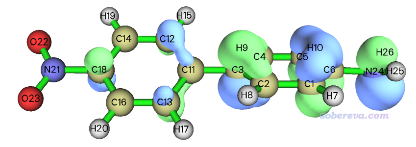
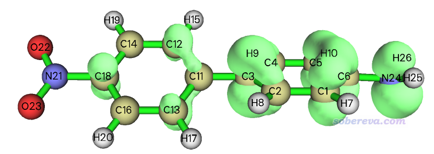
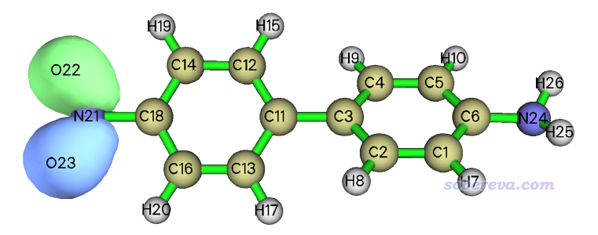
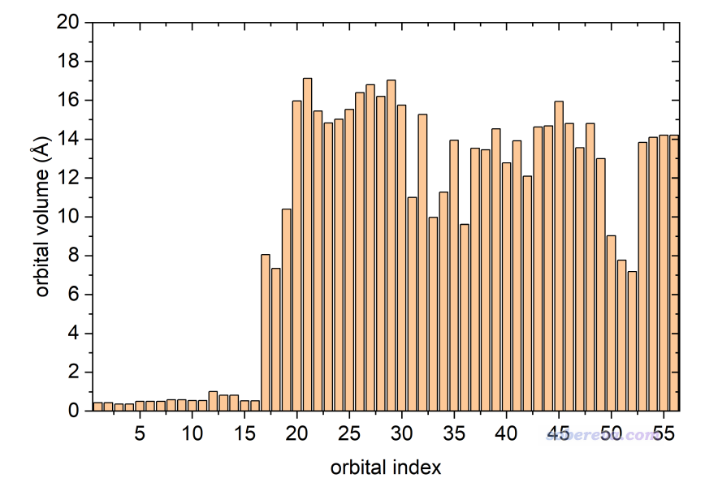

**使用Multiwfn计算轨道的体积**  
Using Multiwfn to calculate volume of orbitals

文/Sobereva@[北京科音](http://www.keinsci.com)  2025-Jan-1

## 1 前言

有人在思想家公社QQ群（<http://sobereva.com/QQrule.html>）里问怎么计算分子轨道的体积，并且贴了一张轨道等值面图。只要计算出这个等值面里包围的体积就可以达到这个目的（虽然也可以有其它方式的定义，但没这么简单直观）。这里我介绍一下怎么利用Multiwfn程序的定量分子表面分析功能来实现这个目的。定量分子表面分析功能之前在《使用Multiwfn的定量分子表面分析功能预测反应位点、分析分子间相互作用》（<http://sobereva.com/159>）有简要介绍，结合Multiwfn的极度灵活的设计，这个功能还能做很多其它的分析，正如本文所展示的。

如果读者不熟悉Multiwfn，应当阅读《Multiwfn FAQ》（<http://sobereva.com/452>）、《Multiwfn入门tips》（<http://sobereva.com/167>）、《详谈Multiwfn支持的输入文件类型、产生方法以及相互转换》（<http://sobereva.com/379>）。Multiwfn可以在<http://sobereva.com/multiwfn>免费下载，不要用上古版本。

## 2 实例

这里以Multiwfn计算下面这个D-pi-A体系的HOMO轨道的体积为例，图中的轨道等值面数值为0.05，此体系的波函数文件是Multiwfn目录下的examples\excit\D-pi-A.fchk。注意等值面包围的体积直接依赖于等值面数值的选取，横向对比时必须统一。

启动Multiwfn，然后输入  
examples\excit\D-pi-A.fchk  
5  //计算格点数据  
4  //轨道波函数  
h  //HOMO  
4  //设置格点间距  
0.25  //0.25 Bohr是精度和耗时的较好权衡。体系大的话也可以用大一些的格点间距来节约耗时但会损失一些精度  
0  //返回主菜单  
13  //处理格点数据  
11  //格点数据运算  
13  //取绝对值。轨道波函数有正有负，这一步使之都变成正值  
-1  //返回主菜单  
12  //定量分子表面分析  
1  //选择定义表面的方式  
11  //用内存中的格点数据定义等值面  
0.05  //等值面数值  
6  //开始表面分析且不考虑被映射的函数

从屏幕上可以看到以下结果，即体积为14.2 Angstrom^3，顺带着轨道等值面的面积69.0 Angstrom^2也显示出来了。

 Volume:    95.86111 Bohr^3  (  14.20515 Angstrom^3)  
 Estimated density according to mass and volume (M/V):   25.0417 g/cm^3  
 Overall surface area:         246.50998 Bohr^2  (  69.02983 Angstrom^2)

感兴趣的话，还可以选择选项-3 Visualize the surface看一下当前等值面对应的图像，体积就是这个等值面里面包围的部分

对比一下，看看下面这个第18号分子轨道的体积如何

退回到主菜单，把下面这一串命令复制到Multiwfn窗口里即可，结果是7.3 Angstrom^3，可见只有HOMO的一半，和肉眼看上去的轨道体积差异相一致。  
5  
4  
18  
4  
0.25  
0  
13  
11  
13  
-1  
12  
1  
11  
0.05  
6

## 3 批量计算

在《详谈Multiwfn的命令行方式运行和批量运行的方法》（<http://sobereva.com/612>）里专门讲了怎么用Multiwfn批处理计算。这里提供一个脚本，可以便捷地用前文的方法批量计算特定序号范围的轨道的体积。<http://sobereva.com/attach/734/orbvol.sh>是个Bash shell脚本，用来计算examples\excit\D-pi-A.fchk这个体系所有占据轨道（1到56号）的体积，内容如下所示。其中istart和iend是起始和终止的轨道序号，这俩值和被处理的波函数文件路径都可以根据实际需要修改。运行之前，Multiwfn可执行文件所在目录需要添加到PATH环境变量下使得能够通过Multiwfn命令启动之。

#!/bin/bash  
istart=1  
iend=56  
for ((i=$istart;i<=$iend;i=i+1))  
do  
cat << EOF >> orbvol.txt  
5  
4  
$i  
4  
0.25  
0  
13  
11  
13  
-1  
12  
1  
11  
0.05  
6  
-1  
-1  
EOF  
done  
echo "q" >> orbvol.txt  
echo "Running Multiwfn..."  
Multiwfn examples/excit/D-pi-A.fchk < orbvol.txt >> result.txt  
grep "Volume:" result.txt | nl -v$istart  
rm ./orbvol.txt result.txt

运行后，屏幕上看到各个轨道的体积：  
     1   Volume:     2.88332 Bohr^3  (   0.42726 Angstrom^3)  
     2   Volume:     2.89404 Bohr^3  (   0.42885 Angstrom^3)  
     3   Volume:     2.42980 Bohr^3  (   0.36006 Angstrom^3)  
     4   Volume:     2.40622 Bohr^3  (   0.35656 Angstrom^3)  
...略  
    54   Volume:    95.10824 Bohr^3  (  14.09359 Angstrom^3)  
    55   Volume:    95.86240 Bohr^3  (  14.20534 Angstrom^3)  
    56   Volume:    95.86111 Bohr^3  (  14.20515 Angstrom^3)

将轨道体积相对于轨道序号作柱形图，如下所示。可见前16号轨道的体积非常小，这是因为它们都是内核轨道。

笔者之前写过《通过轨道离域指数(ODI)衡量轨道的空间离域程度》（<http://sobereva.com/525>），里面用我提出的ODI指数考察了与本文相同的D-pi-A体系的各个轨道的离域程度，并且绘制了ODI与轨道序号之间的柱形图。将上图与ODI的柱形图相对比，可以看到两个图有明显的互补性，即ODI越低（体现轨道越离域、越能同时覆盖很多原子），轨道体积倾向于越大。如果你的目的就是想衡量轨道的离域程度，ODI相对更严格，毕竟不依赖于轨道等值面数值的选取（轨道等值面数值设得很大的话，轨道等值面就完全看不到了，体积为0）。而用轨道体积来说事的好处是可以直接与等值面图相对应，结合图像讨论非常清楚直观。

## 4 其它

本文的做法不限于计算考察分子轨道的体积，对任意轨道都可以考察，如定域化轨道、NTO轨道、双正交化轨道、NAdO轨道、AdNDP轨道等等，载入含有相应轨道的波函数文件即可，产生方法在下文说了。  
Multiwfn的轨道定域化功能的使用以及与NBO、AdNDP分析的对比  
<http://sobereva.com/380>  
用于非限制性开壳层波函数的双正交化方法的原理与应用  
<http://sobereva.com/448>  
使用键级密度(BOD)和自然适应性轨道(NAdO)图形化研究化学键  
<http://sobereva.com/535>  
使用AdNDP方法以及ELF/LOL、多中心键级研究多中心键  
<http://sobereva.com/138>

效仿本文的做法还可以计算其它任意实空间函数的等值面内包围的体积。比如计算自旋密度的等值面内的体积，只需要在主功能5里选择被计算的函数的那一步选择自旋密度即可。如果是像ELF那样处处为正的函数，计算其等值面内的体积前无需像前文那样需要先进入主功能13将其取绝对值；反之如果函数处处为负，则也需要先取绝对值。
