**谈谈pi-pi相互作用**On the pi-pi interaction

文/Sobereva@[北京科音](http://www.keinsci.com)

First release: 2025-Feb-18   Last update: 2025-Feb-19

## 0 前言

pi-pi相互作用（pi-pi interaction）是化学体系中很常见而且很重要的一种弱相互作用，本文全面谈谈这种相互作用的各方面特征，以令读者对其有充分的认识、能在自己的研究中正确分析讨论。我在互联网上广泛答疑时也时不时看到有关于pi-pi作用的非常错误的理解，比如有人被一些文章误导，竟以为pi-pi作用来自于轨道相互作用或静电相互作用，而且这种说法还广泛以讹传讹，笔者希望通过此文以正视听。此外，氢键、范德华作用等概念在结构化学书里普遍都有，但pi-pi作用鲜有提及，我也推荐相关书籍作者和结构化学教师参考此文的内容将pi-pi作用纳入书籍和教学。本文中大量涉及非常流行的波函数分析程序Multiwfn，相关信息见《Multiwfn FAQ》（<http://sobereva.com/452>）。

我有不少研究文章都和pi-pi作用有密切联系，是pi-pi作用研究的典型范例，非常推荐读者阅读并欢迎引用：  
• Theoretical Insight into Complexation Between Cyclocarbons and C60 Fullerene, *Chem. Eur. J.*, **30**, e202402227 (2024)。在《全面揭示各种碳环与富勒烯之间独特的pi-pi相互作用！》（<http://sobereva.com/727>）中有详细介绍，专门研究了不同尺寸的碳环和富勒烯之间的pi-pi作用  
• Intermolecular interaction characteristics of the all-carboatomic ring, cyclo[18]carbon: Focusing on molecular adsorption and stacking, *Carbon*, **171**, 514-523 (2021)。在《全面探究18碳环独特的分子间相互作用与pi-pi堆积特征》（<http://sobereva.com/572>）中有详细介绍，其中涉及两个18碳环之间的pi-pi作用  
• Molecular assembly with a figure-of-eight nanohoop as a strategy for the collection and stabilization of cyclo[18]carbon, *Phys. Chem. Chem. Phys.*, **25**, 16707 (2023)。在《8字形双环分子对18碳环的独特吸附行为的量子化学、波函数分析与分子动力学研究》（<http://sobereva.com/674>）中有详细介绍，其中涉及18碳环与OPP双环分子的pi-pi作用  
• Comment on “18 and 12 – Member carbon rings (cyclo[n]carbons) – A density functional study”, *Mat. Sci. Eng.: B*, **273**, 115425 (2021)。在《18碳环（cyclo[18]carbon）与石墨烯的相互作用：基于簇模型的研究一例》（<http://sobereva.com/615>）中有详细介绍，其中涉及18碳环与石墨烯的pi-pi作用

## 1 pi-pi作用的基本特征

pi-pi作用的定义和说法比较乱，这里给出我认为最严格准确的定义：“pi-pi作用是相距较近的两个片段上彼此朝向相对的pi电子之间的独特的色散吸引作用”。这里做几个注释，结合后文的实例读者会了解得更充分：

(1)pi-pi作用可以是分子间的也可以是分子内的，满足以上定义即可  
(2)诸如苯分子里面的pi电子之间的作用不叫pi-pi作用，那属于共享电子作用  
(3)两套pi电子的分布必须近乎彼此相对才可能算pi-pi作用。而诸如两套pi电子近乎肩并肩挨着就不能算pi-pi作用，像是不能说环丁二烯里面两套近乎定域的pi电子之间是分子内pi-pi作用  
(4)“相距较近”一般是在4.0-4.5埃以内。也不是说更远距离就完全没有pi-pi作用了，只不过由于色散作用随作用距离r呈-1/r^6快速衰减行为，因此距离稍微一远pi-pi作用就非常弱了，就不太值得一提了。但相互作用的片段间距离也不能太近，若显著小于相接触的原子的范德华半径之和，则显著的位阻互斥作用会远大于pi-pi吸引作用，使得pi-pi作用也相对不值得一提  
(5)pi-pi作用最常出现在碳原子间，因为碳最容易带显著的pi电子。碳的Bondi和CSD范德华半径分别为1.70和1.77埃。如果没有特殊的因素影响相互作用距离的话，在平衡结构（势能面极小点结构）下，C-C间的pi-pi作用出现在3.4-3.6埃左右是最常见的  
(6)pi-pi作用属于弱相互作用和非共价相互作用范畴。虽然名义上算作弱相互作用，但实际强度可大可小，直接取决于作用面积，详见后文  
(7)有一个词叫pi-pi堆积（pi-pi stacking），这个词往往和pi-pi作用混用。但在我来看，这个词更适合用来形容由于pi-pi作用的吸引效果使得相互作用的两个部分发生紧密结合从而产生的彼此堆积的结构特征

下图就是一个再典型不过的存在显著pi-pi作用的体系，是晕苯的二聚体。高精度理论计算的极小点结构下平面间距大约在3.45埃

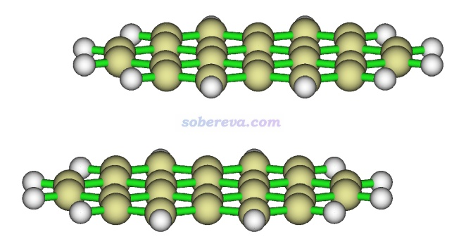

苯二聚体有不同构型，彼此垂直的T型二聚体是能量最低构型，还有一种能量与之非常接近的局部极小点构型是平行位错构型，属于pi-pi堆积结构。按照《在Multiwfn中单独考察pi电子结构特征》（<http://sobereva.com/432>）的做法绘制出的几何结构结合pi电子等值面图如下所示，两个分子的pi电子的分布非常清楚直观，可以看到彼此相对。注意并非必须两个分子的所有pi电子都彼此对着才算pi-pi作用，像下图这样哪怕只要一部分对着也同样算pi-pi作用。而如果完全没有对着、完全错开了，那就不算pi-pi作用了。更多的展现pi电子分布的图见笔者的Theor. Chem. Acc., 139, 25 (2020)一文。

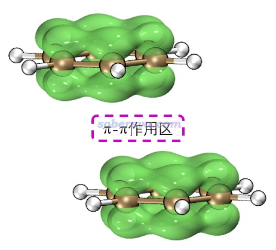

## 2 pi-pi作用的物理本质

我在《谈谈“计算时是否需要加DFT-D3色散校正？” 》（<http://sobereva.com/413>）提到过，原子间相互作用从物理本质上可以基本分为静电、色散、交换、Pauli互斥、轨道相互作用；我在《谈谈“计算时是否需要加DFT-D3色散校正？”》（<http://sobereva.com/413>）里也说过物理本质和相互作用表象之间的关系。pi-pi作用类似于氢键、卤键等，是属于表象层面的，用来描述一种具有特定特征的相互作用，其内在本质就是前面说的来自于相距较近的pi电子之间的色散作用，这一点在Grimme的一篇经典的讨论pi-pi作用本质的文章Angew. Chem. Int. Ed., 47, 3430 (2008)中通过严格的理论计算和分析对比已经论证得十分严格充分，而且也早已是量子化学领域内行人的共识。

有的文章试图从轨道相互作用解释pi-pi堆积出现的本质，这是极其有误导性的，却还广泛以讹传讹。2007年的时候wiki上的词条说pi-pi作用来自于pi共轭体系间p轨道的重叠，前述Angew文章的脚注中专门对此进行了批判，指出没有任何量子化学计算能支持这种说法。这也不难理解，本来两个分子的pi轨道之间重叠程度极低（可以用《分子间轨道重叠的图形显示和计算》<http://sobereva.com/163>介绍的方法考察），远低于形成共价键时原子轨道间的重叠程度，因此有效重叠不足。而且两个分子的pi占据轨道之间混合会产生全占据的成键和反键轨道，二者效果充分抵消了，对成键没贡献；而若一个分子的pi占据轨道和另一个分子的pi非占据轨道混合，意味着要出现分子间pi->pi*电子转移，这通常又没有明显能使体系能量变得更低的内在驱动力（不像常见的较近距离的n->pi*超共轭往往可以明显降低体系能量）。此外，按照《Multiwfn支持的分析化学键的方法一览》（<http://sobereva.com/471>）说的，用Multiwfn对pi-pi堆积的两个分子间去计算衡量两个部分之间有效共享电子对数的Mayer键级、模糊键级或离域化指数（DI），会发现数值很接近0，比如《全面揭示各种碳环与富勒烯之间独特的pi-pi相互作用！》（<http://sobereva.com/727>）介绍的文章里对18碳环与富勒烯之间算的Mayer键级仅为可忽略不计的0.04，也充分体现出pi-pi作用中的轨道相互作用成份基本可忽略不计。所以无论从哪个角度，pi-pi堆积的出现都不是轨道相互作用驱动的，顶多是在色散作用驱动下，pi-pi堆积结构出现后顺带出现了点可忽略的轨道相互作用而已。所以pi-pi作用在主流学术界被归为非共价相互作用范畴，这是完全正确的。然而有一些论文试图从轨道相互作用分析pi-pi作用的特征，还摆出一堆轨道图，比如Phys. Chem. Chem. Phys., 15, 9397 (2013)就是典型文章，切勿把这类文章太当回事，很多都是瞎讨论、尬讨论。

pi-pi堆积的体系有一个普遍特点是在极小点结构下，pi-pi作用区域的原子间通常不是正好对着，而是相互错位。下图是晕苯二聚体的俯视图，其中一个晕苯用红色显示，可以很清楚看到错位特征，即一层的碳对着另一层的六元环中心。一层层堆叠的石墨中每一层之间也同样是这样错位的。出现自发错位有不同的解释并且存在一定争议，有人认为是因为错位的结构下比严格面对面的结构下的原子间的Pauli互斥更低，例如Chem. Sci., 11, 6758 (2020)持这种观点。也有人认为是因为错位的结构下的静电相互作用能更负（静电吸引作用更强），在Phys. Chem. Chem. Phys., 24, 8979 (2022)中作者通过能量分解论证了这一点并反驳了Chem. Sci.那篇文章。静电作用引起位错的原因从逻辑上容易理解：形成pi-pi堆积的两部分都有丰富的pi电子，面对面构型下pi电子间静电互斥会较大，错开后互斥自然就没那么强了。虽然笔者更同意静电效应是位错出现的主导，但我也不否认降低Pauli互斥也可能是产生位错的另一个驱动力，尽管相对次要。

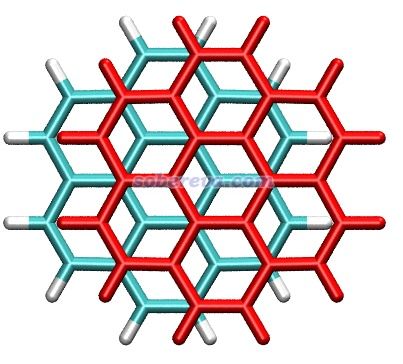

顺带一提，不止是pi-pi堆积二聚体，还有很多其它体系都是色散吸引作用驱动分子间结合，而静电作用进一步影响几何结构。《静电效应主导了氢气、氮气二聚体的构型》（<http://sobereva.com/209>）介绍的笔者的研究就是很好的例子，H2、N2的各种二聚体的相互作用能通过能量分解分析可以发现都是色散作用为主，但不同构型下的静电作用的差异则直接影响不同构型的稳定性乃至存在与否，并且笔者发现通过静电势互补原理可以给出很直观的解释。这种静电势互补的分析方法也在《全面探究18碳环独特的分子间相互作用与pi-pi堆积特征》（<http://sobereva.com/572>）介绍的笔者的论文中也用来解释为什么18碳环的pi-pi堆积二聚体是错位的。平面环状结构的18碳环具有独特的平面内和平面外两套pi电子，此文中确认了18碳环能够形成分子间彼此平行的pi-pi堆积二聚体，下图是按照《使用Multiwfn+VMD快速地绘制静电势着色的分子范德华表面图和分子间穿透图》（<http://sobereva.com/443>）绘制的二聚体极小点结构下的单体的静电势着色的分子范德华表面的叠加图，可以看到两个碳环表面静电势为正和为负的区域在错位的结构下是以互补的方式重叠的，很清晰地解释了错位的产生原因，即这种构型下的静电吸引作用比一个个碳原子彼此精确对着的时候更强。

要注意的是，有些文章作者极度夸大了静电作用对于pi-pi堆积形成的作用，不仅认为平行位错构型的出现是因为此时静电吸引作用最有利，还鼓吹pi-pi堆积结构的形成的本质就是静电吸引作用，这是大错特错！最典型的这种文章就是Chem. Sci.,3 , 2191 (2012)，这篇文章的发表严重误导了很多读者。此文虽然是在前述的Grimme的pi-pi作用的研究之后写的，而且文中还引了那篇文章，但给我的感觉是此文的作者完全没好好看那篇文章，似乎也完全不懂什么叫电子相关作用，而依然基于古老且过于简单（忽略了pi电子结构和穿透效应）的Hunter和Sanders的四极矩观点盲目、主观、武断、信誓旦旦地解释pi-pi堆积的位错结构形成的本质，而完全没有可信、严格的理论和计算数据作为依据，各种自说自话，并且还错误地解释一些文献里的理论计算数据，甚至还不承认pi-pi作用的概念。作者还执拗地认为非得是存在精确面对面堆积才能说明pi-pi作用的存在，并因为实际pi-pi堆积体系的极小点结构不是面对面堆积就被他用来否认存在pi-pi作用。此文文中给出了下图，令一些初学者不明觉厉，误以为不仅清晰解释了为什么平行位错结构比精确面对面结构更有利，还误以为这种二聚体的形成主要靠的就是静电吸引作用，完全没分清楚pi-pi堆积二聚体的形成中色散作用和静电作用的主次关系。还有不少其它文章如J. Chem. Soc., Dalton Trans., 2000, 3885也是类似地对pi-pi作用存在严重误解、给出误导性的示意图，读者看到这种文章时切勿当回事！

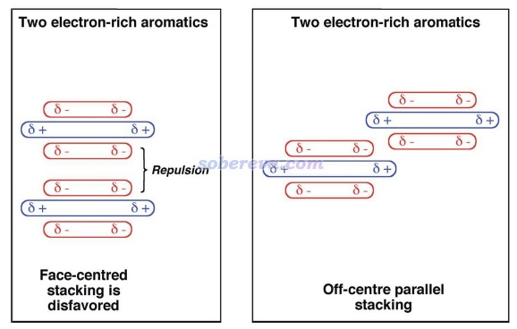

能量分解分析在pi-pi作用的研究中应用得非常普遍，对于认识其本质非常有帮助。这类方法将总的相互作用能分解成不同物理成份。例如将《使用sobEDA和sobEDAw方法做非常准确、快速、方便、普适的能量分解分析》（<http://sobereva.com/685>）介绍的笔者提出的流行的sobEDAw能量分解方法用于苯的两种二聚体构型可得到如下结果（计算级别：B3LYP-D3(BJ)/6-311+G(2d,p)并考虑counterpoise，单位为kcal/mol），可见色散项ΔE_disp远比静电作用项ΔE_els更负，轨道相互作用项ΔE_orb更是微乎其微，故色散作用对苯的分子间结合起到主导作用。特别是在平行位错的结构下的ΔE_disp比T构型下的明显负得多（同时ΔE_els的大小还变小），充分体现出平行位错结构下才有的pi-pi作用的本质是色散作用，这和上文对pi-pi作用本质的讨论相一致。平行位错结构下，色散作用对总吸引作用项的贡献百分比是：-7.6/(-7.6-0.8-1.6)*100=76%。

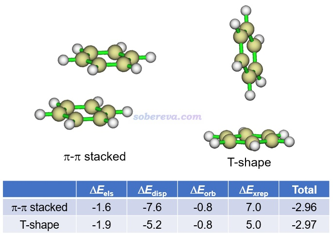

顺带一提，pi-pi堆积的结构在现实环境中一般很容易发生分子间相对滑移（除非有额外的位阻效应等阻碍），这是由于滑移导致能量变化很小。Carbon, 171, 514-523 (2021)文中做18碳环二聚体的势能面扫描、Phys. Chem. Chem. Phys., 24, 8979 (2022)中做的苯分子平行二聚体的势能面扫描都体现了这一点。并且由于滑移方向的势能面很缓，哪怕室温下也非常容易出现滑移。在Carbon, 171, 514-523 (2021)文中我给出了18碳环二聚体在100K下的4 ps的从头算动力学的轨迹叠加图（消除了下方的18碳环的整体运动以着重表现相对运动），如下所示，分子位置根据模拟时间按照蓝-白-红变化，可见在模拟过程中的确出现了显著的滑移

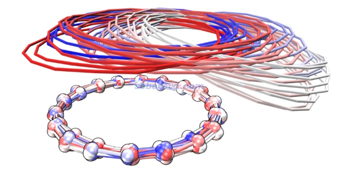

## 3 pi-pi作用的强度

pi-pi堆积的极小点结构下的每一对近距离接触的原子的pi-pi作用都是非常弱的，就是普通范德华作用的程度，但是当涉及pi-pi作用的原子很多时，就可以达到很高的强度，甚至能达到近乎化学键的程度。最强的pi-pi作用就是从微观来看无限延展的石墨中的层间pi-pi作用了。下面看一些实例，以令读者更好地理解pi-pi作用的强度特征。

Angew. Chem. Int. Ed., 47, 3430 (2008)文中计算了T型苯二聚体（下图a）、平行位错苯二聚体（下图b）、环己烷二聚体（下图c和d是两个视角）的相互作用能，并且还将它们的环数n从1逐渐加到4（分别对应下图e、f、g的结构），以考察了三种作用类型的相互作用能随环数的变化，分别对应下图的aromatic T-shaped、aromatic stacked和saturated stacked三条曲线。由图可见，当pi-pi作用涉及的原子很少时，即苯二聚体，由于pi-pi作用还不够强，因此平行位错二聚体的能量比静电吸引作用更强的苯T型二聚体略微更高，相互作用强度比起无pi-pi作用特征的环己烷二聚体没优势。但随着环数增加，pi-pi作用强度不断增大，使得具有pi-pi堆积结构的二聚体的相互作用变得显著强于不具备这种特征的二聚体。四并苯的二聚体的相互作用能已达到-16 kcal/mol（67 kJ/mol），这已经是水二聚体这种普通强度氢键作用能的3倍左右了。

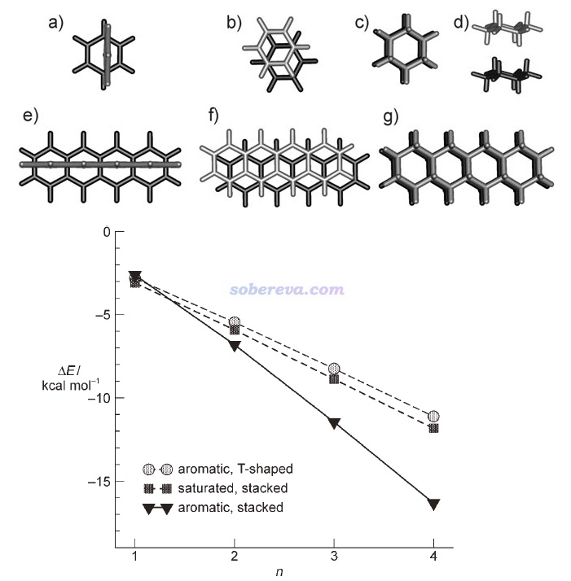

可见，前面提到的Chem. Sci.,3 , 2191 (2012)那篇文章拿两个苯及其衍生物在液体和晶体中普遍缺少平行位错构型的出现，以及平行位错的苯二聚体不是能量最低构型，以此鼓吹pi-pi作用不是一种客观存在的作用，这明显是极其狭隘的。

对本文第1节的两个晕苯的二聚体，在DLPNO-CCSD(T)级别下算出来的相互作用能达到-20 kcal/mol，也是相当强了。

前面给出的18碳环二聚体的相互作用能，在Carbon, 171, 514-523 (2021)中我用ωB97X-V/def2-QZVPP结合counterpoise校正的计算结果为-9.2 kcal/mol（-38.5 kJ/mol），达到平行位错的苯二聚体的相互作用能的大约三倍，无疑也是非常显著的pi-pi作用了。

不是只有平面区域之间才可能有pi-pi作用，例如下面三个体系的pi-pi作用区域都是有显著曲率的。下图左边的结构是Org. Lett., 17, 5292 (2015)中合成出的主-客体复合物晶体的一部分，由于客体分子与富勒烯之间的pi-pi作用面积颇大，B97D/QZVP级别计算的相互作用能达到了-50 kcal/mol，已经是弱化学键的强度了。下图右侧是碗烯的pi-pi堆积二聚体，相互作用的研究见J. Phys. Chem. A, 116, 11920 (2012)。

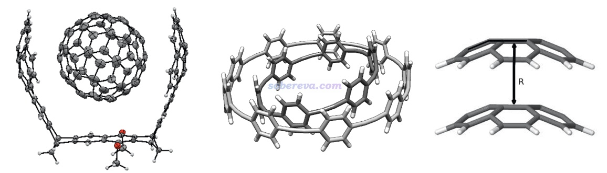

## 4 图形化展现pi-pi作用区域

《使用Multiwfn做IGMH分析非常清晰直观地展现化学体系中的相互作用》（<http://sobereva.com/621>）以及《一篇最全面介绍各种弱相互作用可视化分析方法的文章已发表！》（<http://sobereva.com/667>）中的综述详细介绍的笔者提出的IGMH方法用于图形化展现片段间相互作用效果极佳，已被广为使用。IGMH用于展现自定义片段间的pi-pi作用、判断pi-pi作用是否存在尤为好用，因此在此给出一些简单例子予以体现。其方法的原理、细节、计算操作见上面的文章。如果你不知道pi-pi作用可能出现在哪，不方便定义片段，则应当用《使用IRI方法图形化考察化学体系中的化学键和弱相互作用》（<http://sobereva.com/598>）介绍的笔者的IRI方法，可以把体系中所有相互作用区域全都展现出来，也包括化学键作用区域。

不是只有纯碳的pi区域之间才可能有pi-pi作用，pi-pi作用也可以涉及到其它原子。众所周知，DNA结构中相邻层的碱基与碱基之间是平行堆叠的，再加上碱基区域有大量pi电子，所以这也属于典型的pi-pi作用。下图是从DNA中截取的堆叠的GCGC碱基对，两层分子各定义为一个做IGMH分析的片段，两层之间的绿色的IGMH方法定义的delta_g_inter函数的0.004 a.u.等值面非常清晰、优雅地展现出了pi-pi作用的主体区域。图中还有个面积较小的等值面出现在O...O之间，虽然C=O键的O有pi电子，但这俩O的pi电子不是彼此对着的，所以这就只能算是普通的范德华作用区域了。

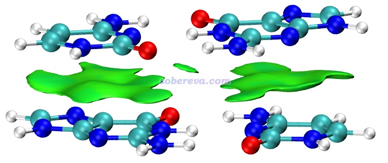

下图是《8字形双环分子对18碳环的独特吸附行为的量子化学、波函数分析与分子动力学研究》（<http://sobereva.com/674>）介绍的笔者的论文中的一张图，研究的是OPP双环分子结合两个18碳环后的复合物。图中绿色等值面直观地展现出在什么区域18碳环与OPP主体分子间有显著的pi-pi作用。可见pi-pi作用主要出现在OPP和18碳环近距离接触的体系的两端，而OPP靠中间区域离18碳环较远因此缺乏pi-pi作用。顺带一提，18碳环是极少有的同时具有平面内（in-plane）和平面外（out-of-plane）两套全局离域的pi电子的体系，当前体系中18碳环主要凭借的是平行于环方向分布的pi电子与OPP大环上的垂直于苯环的pi电子产生pi-pi作用，这是极为新颖、独特的pi-pi作用形式。如果读者对碳环类体系感兴趣，非常建议进入<http://sobereva.com/carbon_ring.html>观看笔者发表的所有碳环相关的理论研究和对应的深入浅出的评述文章。

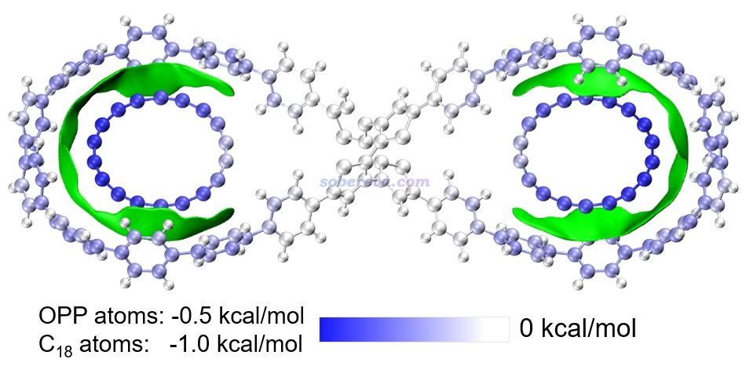

上图中还对利用Multiwfn的基于力场的能量分解（EDA-FF）功能计算了各个原子对分子间相互作用的贡献并对原子进行了着色，展现出了更丰富的信息。这种分析见《使用Multiwfn做基于分子力场的能量分解分析》（<http://sobereva.com/442>）。

在《全面揭示各种碳环与富勒烯之间独特的pi-pi相互作用！》（<http://sobereva.com/727>）介绍的文章中，笔者全面研究了碳环与富勒烯的相互作用，其中给出了下图，展示了不同尺寸的两个碳环与富勒烯形成的三聚体。并且为了直观区分富勒烯-碳环和碳环-碳环两种pi-pi作用，分别将对应的等值面用绿色和青色着色。可见此图极好地将体系中两种pi-pi作用出现的主要位置展现了出来，比起在文中只是给出个几何结构图信息丰富得多。

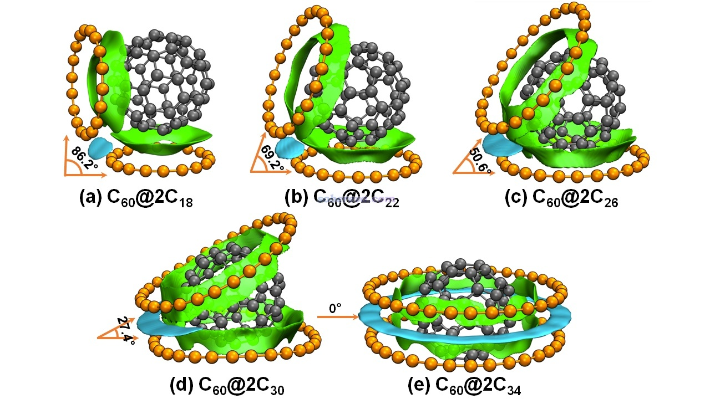

标准的IGMH图是通过sign(λ2)ρ函数对等值面着色的，ρ是电子密度。按照IGMH方法的标准的色彩刻度着色的话，ρ接近0的区域的等值面都是绿色。由于pi-pi作用区域、普通范德华作用、极弱的氢键（如C-H作为氢键给体时）等情况的作用区域的电子密度都很低（0.01 a.u.以内），因此相应的标准方式着色的IGMH等值面都会是绿色或很接近绿色。因此解释IGMH图的等值面时必须结合不同特征的弱相互作用的基本定义，不能单纯根据颜色去乱解释。比如网上有人问我“下面这个图里红圈部分是pi-pi作用吗？”，这实在是匪夷所思的问题。跨越那个等值面和右下方苯环的pi电子区域直接作用的是一个氢原子，氢原子又没pi电子，怎么可能是pi-pi作用！？而且右下方的苯环也明显不可能和左上方的苯环有pi-pi作用，一方面二者离得老远，另一方面二者的pi电子区域也根本不相互对着，显然无论如何也不可能算是pi-pi作用。

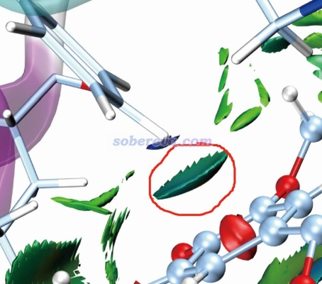

那么上图中红圈里的等值面算什么作用？明显这是pi-氢键，C-H作为氢键给体，其中氢带一定正电荷（这一点用H的原子电荷就能体现，原子电荷的相关知识见《一篇深入浅出、完整全面介绍原子电荷的综述文章已发表！》<http://sobereva.com/714>这篇综述），右下角的苯环上的pi电子令苯环上方显负电性而作为氢键受体（用静电势可直接体现，参见<http://bbs.keinsci.com/thread-219-1-1.html>里汇总的静电势相关资料和我的相关博文）。

下面再举一个IRI图展现pi-pi作用区域的例子。Multiwfn的原文之一J. Chem. Phys., 161, 082503 (2024)里给出了144-轮烯的LOL-pi函数的等值面图，如下图左侧所示，此图清晰直观地展现出了这个全局大共轭体系的pi电子的主要离域路径。根据此图展现的pi电子的分布情况，凭直觉就知道这个体系里肯定存在pi-pi作用。下图右侧是对这个体系的其中一个局部区域绘制的IRI等值面图，蓝色的等值面展现出了化学键作用区域，绿色的等值面清楚直观地展现出了pi-pi作用区域。可见这个体系非常有趣，pi-pi作用区域绵延不断贯通整个体系！也正是有分子内pi-pi作用的存在，此体系才能形成螺旋状结构，要不然就散了（如同用不能描述色散作用的理论方法优化DNA结构时结构会散掉）。

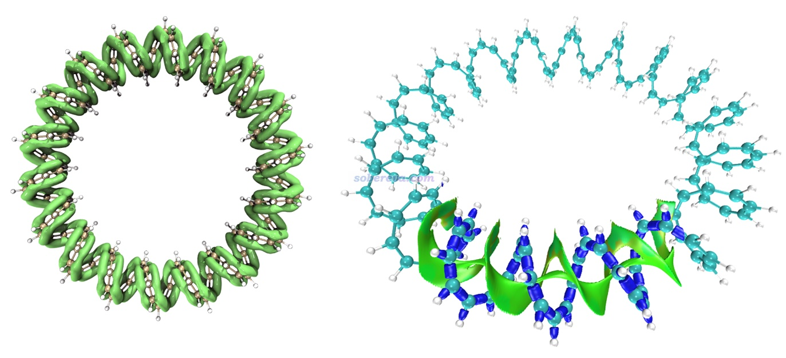

## 5 衡量pi-pi作用强度的方法

这一节说一下如何衡量pi-pi作用强度。最简单的方法就是计算pi-pi堆积二聚体的相互作用能，作用能越负说明作用越强。但如果要讨论二聚体的热力学稳定性，则需要计算结合自由能，溶剂环境中还得考虑溶剂模型。相关知识参见《谈谈分子间结合能的构成以及分解分析思想》（<http://sobereva.com/733>）。复合物AB在特定结构下，A和B的相互作用能的最常规的计算方法就是用E(AB)-E(A)-E(B)方式手动计算，做sobEDAw能量分解（<http://sobereva.com/685>）时也会顺带给你相互作用能。

以上述方法算相互作用能的一个问题是，如果两个分子之间不仅仅有pi-pi作用，还有其它作用（如氢键），那么得到的只是总相互作用能。如果想只得到pi-pi作用能，有几个办法可以用：  
(1)用《使用Multiwfn做基于分子力场的能量分解分析》（<http://sobereva.com/442>）介绍的EDA-FF能量分解方法，将两个分子的pi作用区域定义为两个片段，让Multiwfn给出基于分子力场的这两个部分的相互作用能，取其中的范德华作用能（即色散作用和交换-互斥作用之和）。如果你只需要色散部分，还有另一种做法，见《使用Multiwfn图形化展现原子对色散能的贡献以及色散密度》（<http://sobereva.com/705>）。这两种做法还都可以给出具体原子产生的贡献，并可以对原子进行着色以便通过图像直观展现和考察  
(2)如果分子间同时有pi-pi作用和氢键，且其它作用可忽略不计，可以按《透彻认识氢键本质、简单可靠地估计氢键强度：一篇2019年JCC上的重要研究文章介绍》（<http://sobereva.com/513>）介绍的方法使用Multiwfn做拓扑分析估计出氢键作用能，从总相互作用能中扣掉之作为pi-pi作用能  
(3)对体系进行恰当改造，基本保留每个分子参与pi-pi作用的部分，然后将总相互作用能近似当成pi-pi作用能。

如果是分子内的pi-pi作用能的估计，还可以参考《计算分子内氢键键能的几种方法》（<http://sobereva.com/522>）里的说明举一反三处理。

在特定条件下，pi-pi作用强度和IGMH的等值面面积有密切的正相关性。《全面揭示各种碳环与富勒烯之间独特的pi-pi相互作用！》（<http://sobereva.com/727>）介绍的文章中给出了下图，是不同原子数的碳环与富勒烯之间的相互作用能和描述pi-pi作用的IGMH等值面面积的关系，可见有挺理想的线性关系。通过这种关系，可以直接根据pi-pi作用区域的等值面面积估计对应的pi-pi相互作用能。这种面积的计算方法见《计算IGMH等值面的面积和体积的方法》（<http://sobereva.com/738>）。

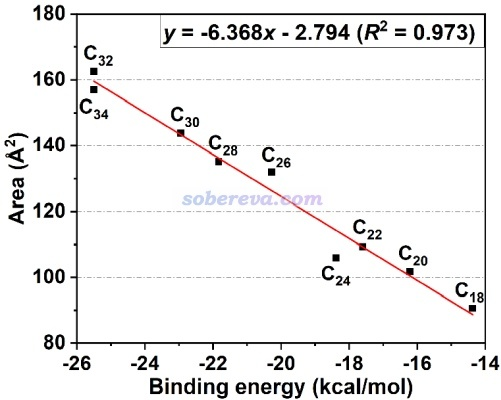

Chem. Commun., 48, 9239 (2012)提出的LOLIPOP方法值得一提。基于单个分子的波函数文件，就可以用Multiwfn非常容易地计算体系中的各个六元环的LOLIPOP指数，此值越小说明这个环发生pi-pi堆积的能力越强，原文对不同体系以苯分子作为探针分子进行了测试证实了这一点。Multiwfn手册3.100.14节有LOLIPOP的详细介绍，4.100.14节有计算实例。

## 6 不同理论方法描述pi-pi作用的能力

色散作用的更深层本质是电子的库仑相关作用，因此做量子化学或第一性原理计算时，若想描述好pi-pi作用，用的方法必须能描述好库仑相关，显然高精度后HF方法都没问题，比如CCSD(T)在计算pi-pi作用上可以算是金标准。至于低级别的后HF方法MP2则倾向于明显高估pi-pi作用，绝对不要用。

对于特别常用的DFT，描述pi-pi作用的能力基本等同于描述普通色散作用的能力，如果泛函原本描述色散作用烂（如PBE、PBE0）或者完全不能描述（如B3LYP），就必须带色散校正，参考《谈谈“计算时是否需要加DFT-D3色散校正？” 》（<http://sobereva.com/413>）、《DFT-D色散校正的使用》（<http://sobereva.com/210>）、《谈谈量子化学研究中什么时候用B3LYP泛函优化几何结构是适当的》（<http://sobereva.com/557>）。本来就带色散校正的wB97M-V、wB97X-D3等直接就能很好描述pi-pi作用。M06-2X描述pi-pi作用虽然定性正确但不算太好，加了零阻尼DFT-D3色散校正后对pi-pi作用的描述有明显改进，但还是不如B3LYP-D3(BJ)，对比测试见考虑了很多pi-pi作用体系的L7测试集的原文（J. Chem. Theory Comput., 9, 3364 (2013)）。双杂化泛函由于带有MP2项，所以都有描述pi-pi作用的能力，但一般在考虑了色散校正后才会变得足够好，如revDSD-PBEP86-D3(BJ)。

实际上DFT-D那种形式的色散校正在原理上对于描述pi-pi作用并非很理想，因为pi电子不是绕着原子核球对称分布的，而DFT-D校正能的公式依赖的只是原子间距离（这里不考虑三体校正项），没体现出pi电子在原子核周围的具体分布特征。不过这倒也不是明显问题，常用的DFT-D3、DFT-D4色散校正对于描述pi-pi作用从实际效果上来看并没有什么问题。

在半经验方法层面，专门考虑了对色散作用描述的GFN2-xTB、PM6-D3H4X'、PM6-ML在表现pi-pi作用方面优秀，见J. Chem. Theory Comput., 21, 678 (2025)里3图基于L7测试集的测试，PM6-D3和PM7只能算是定性正确。至于没专门考虑对色散作用描述的诸如PM6、AM1等方法则完全失败。

主流的分子力场，如GAFF、AMBER、CHARMM、OPLS-AA、MMFF94等，对pi-pi作用的描述虽然跟像样的量子化学方法比算不上出色，但至少也算定性正确，因为它们都有描述色散作用的能力。J. Chem. Inf. Model., 49, 944 (2009)的测试专门体现了这点（不过这篇文章也有不少漏洞和槽点）。

## 7 疏水作用与pi-pi作用的关系

众所周知，疏水效应使得水环境下非极性物质倾向于发生聚集，本质是溶剂的熵效应。两个石墨烯片段在水中会自发堆积在一起，这算疏水作用还是pi-pi作用？实际上二者都有，对于堆积结构的形成起到协同作用。疏水效应更为普遍，无论两个溶质的接触区域是否有pi电子，只要溶质是基本无极性的，在水中都有疏水作用促使它们发生结合。而对于pi电子区域暴露的两个溶质，疏水效应则在pi-pi作用的基础上进一步促进了它们的pi-pi堆积结构的出现。如《全面揭示各种碳环与富勒烯之间独特的pi-pi相互作用！》（<http://sobereva.com/727>）介绍的文章的理论计算所示，在水环境下碳环与富勒烯之间的结合自由能的大小显著大于在真空下，充分体现了这一点。

顺带一提，前述的Chem. Sci.,3 , 2191 (2012)一文居然误以为溶剂环境下pi共轭体系间出现堆积结构仅仅是因为溶剂效应，并似乎试图靠这个否认真空环境下也存在pi-pi相互作用，甚至说the terms "pi-stacking" or "pi–pi interactions" do not describe any physically meaningful interaction，实在是难以理喻！！！PS：这样的文章能通过Chem. Sci.的审稿真是离谱。

## 8 总结&判断pi-pi作用的标准

本文系统地对pi-pi作用的各个方面进行了介绍，包括其基本特征、物理本质、强度范围、图形化展现方法、考察强度的方法、理论计算方法的精度、疏水作用与它的关系。通过本文，读者应该已经对pi-pi作用有了较全面的了解，能够进行正确的分析讨论，并且能认识到哪些文章或书籍里的说法是有误导性的。我也推荐读者接下来阅读本文一开始提到的笔者的一系列和pi-pi作用有关的研究文章和对应的介绍博文。

最后再总结一下pi-pi作用的常规判断标准，便于读者能确切判断哪些作用算是pi-pi作用。通过下面第1、2条就可以进行粗略判断，3、4、5可以作为进一步检验。一般意义的pi-pi作用应当能同时满足所有条件  
(1)相互作用的两部分都有pi电子且其分布彼此相互对着。如果拿不准有没有pi电子分布、分布朝向如何，可以按照《在Multiwfn中单独考察pi电子结构特征》（<http://sobereva.com/432>）介绍的方法直接把pi电子密度等值面图画出来，一目了然  
(2)相互作用的pi电子之间离得不太远。比如明显超过5埃的直接就可以忽略了  
(3)用Multiwfn做IGMH分析（如果得不到波函数文件或体系太大难以算得动的话，可以改用极便宜且只依赖于原子坐标的mIGM），在等值面数值调到诸如0.003 a.u.这样较小的值时，在预期出现pi-pi作用的区域能明显看到等值面  
(4)两部分之间的Mayer键级或模糊键级或离域化指数非常小（远小于0.1），故而轨道相互作用可基本忽略。注：如《Multiwfn支持的分析化学键的方法一览》（<http://sobereva.com/471>）所述，Multiwfn在主功能9里计算键级之前可以用选项-1定义两个片段，之后做键级计算时会给出两个部分之间的总键级，即片段间每一对原子的键级的总和  
(5)使用sobEDAw等能量分解方法分析，色散项应当占所有吸引项总和的大部分，轨道相互作用项应当占比微小
