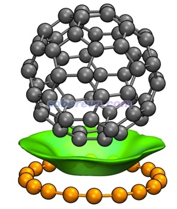
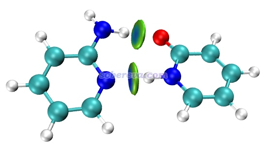
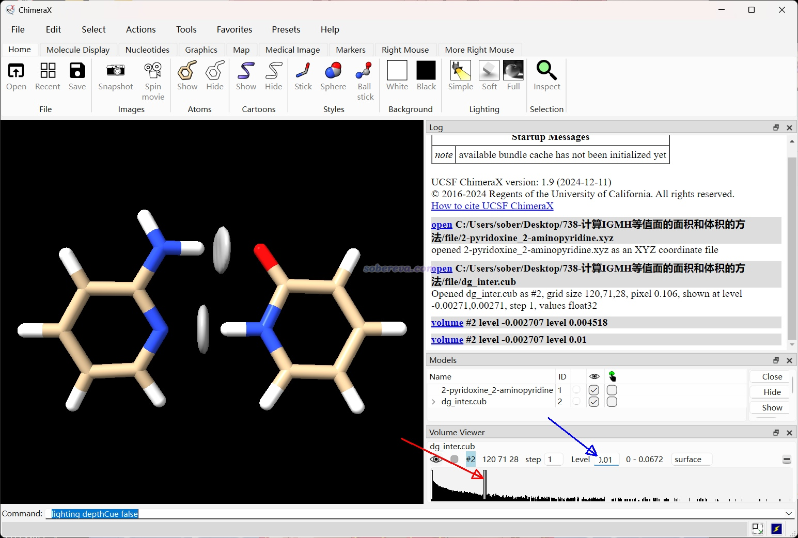
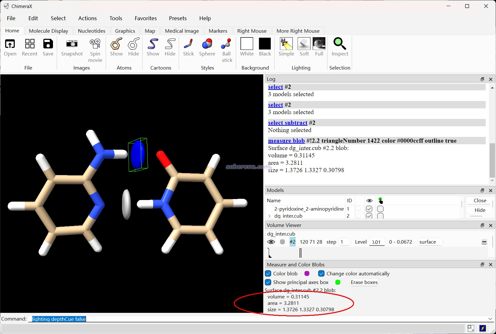

**计算IGMH等值面的面积和体积的方法** The method of calculating the area and volume of IGMH isosurface

文/Sobereva@[北京科音](http://www.keinsci.com)   2025-Feb-21

## 1 前言

《使用Multiwfn做IGMH分析非常清晰直观地展现化学体系中的相互作用》（<http://sobereva.com/621>）里介绍的笔者提出的图形化展现相互作用的方法IGMH已被广为使用，之前我写的《全面揭示各种碳环与富勒烯之间独特的pi-pi相互作用！》（<http://sobereva.com/727>）和《谈谈pi-pi相互作用》（<http://sobereva.com/737>）里涉及到了IGMH的等值面面积，至少对pi-pi作用来说它和相互作用强度有密切的正相关性。有不少读者都问我怎么得到面积，本文就专门说一下。计算面积的同时还会顺带得到等值面内包围的体积。此文说的IGMH等值面具体是指IGMH方法里定义的δg_inter函数的等值面。如果读者不熟悉IGMH，应先把<http://sobereva.com/621>看了。读者应使用Multiwfn官网<http://sobereva.com/multiwfn>上的最新版本以免和本文的情况不符。不了解Multiwfn者参看《Multiwfn FAQ》（<http://sobereva.com/452>）和《Multiwfn入门tips》（<http://sobereva.com/167>）。

下面介绍两种做法，第一种方法是使用Multiwfn的定量分子表面分析（主功能12）计算IGMH等值面面积和体积，这种情况只适合存在一个等值面，且这个等值面就是你要研究的等值面的情况。另一种方法更为普适，需要借助免费的ChimeraX程序载入Multiwfn产生的cub文件显示IGMH等值面，可以测量图中任意一个等值面的面积和体积，对于《使用IRI方法图形化考察化学体系中的化学键和弱相互作用》（<http://sobereva.com/598>）介绍的IRI函数、《谈谈范德华势以及在Multiwfn中的计算、分析和绘制》（<http://sobereva.com/551>）介绍的范德华势等各种函数也都可以这么测量。

## 2 使用Multiwfn的定量分子表面分析功能计算IGMH等值面的面积和体积

这一节以18碳环与C60富勒烯的复合物为例演示怎么直接用Multiwfn得到IGMH等值面的面积和体积。前述的《全面揭示各种碳环与富勒烯之间独特的pi-pi相互作用！》介绍的笔者的Chem. Eur. J., 30, e202402227 (2024)研究中得到的此体系的波函数文件C60-C18.wfn在<http://sobereva.com/attach/738/file.rar>里提供了。此体系的IGMH图如下所示（δg_inter函数等值面为0.002 a.u.）

首先将Multiwfn目录下的settings.ini里的iuserfunc设为91，这代表把用户自定义函数（user-defined function）设为IGMH方法的δg_inter函数。在Multiwfn手册2.7节里有可用的用户自定义函数的完整列表。之后启动Multiwfn，载入C60-C18.wfn，之后依次输入  
1000   //隐藏功能  
16  //定义片段  
2  //定义两个片段  
1-18  //18碳环里的原子序号范围  
19-78   //富勒烯里的原子序号范围  
12  //定量分子表面分析功能  
1  //设置用于定义表面的函数  
2  //某个实空间函数  
100  //用户自定义函数  
0.002  //定义表面用的等值面数值  
6  //开始分析，不考虑被映射的函数  
接下来程序开始计算δg_inter的格点数据，过一会儿，在屏幕上看到以下信息  
 Volume:    69.13431 Bohr^3  (  10.24465 Angstrom^3)  
 Estimated density according to mass and volume (M/V):  151.8505 g/cm^3  
 Overall surface area:         323.36643 Bohr^2  (  90.55182 Angstrom^2)

在后处理菜单选-3可以观看当前考察的δg_inter函数的0.002 a.u.等值面，如下所示，确实就是前面给出的笔者的论文Chem. Eur. J., 30, e202402227 (2024)里的那个等值面。其体积是上面显示的10.24 Å^3，面积是90.55 Å^2，和文中报道的一致。

顺带一提，在后处理菜单中还可以选-2将当前算出来的δg_inter的格点数据导出为surf.cub，之后可以被第三方程序可视化和分析。

还值得一提的是进入主功能12的时候可以看到选项3 Spacing of grid points for generating molecular surface用来设置格点间距，默认是0.25 Bohr，数值设得越小计算耗时越高而统计精度越高。

Multiwfn对各种实空间函数（包括从外部的.cub等格点数据文件读入的）都可以利用定量分子表面分析功能计算其等值面的面积和体积，另一个使用例子见《使用Multiwfn计算轨道的体积》（<http://sobereva.com/734>）。

## 3 使用Multiwfn结合ChimeraX获得IGMH等值面的面积和体积

这一节以2-pyridoxine和2-aminopyridine的二聚体为例演示利用ChimeraX程序得到特定的IGMH等值面的面积和体积。examples\2-pyridoxine_2-aminopyridine.wfn是Multiwfn程序包里自带的这个体系的波函数文件，在0.01 a.u.的δg_inter等值面数值下分子间的IGMH等值面图如下所示，可见有两个等值面，此例分别获得它们的面积和体积

首先照常对这个二聚体做IGMH分析。启动Multiwfn，然后依次输入  
examples\2-pyridoxine_2-aminopyridine.wfn  
20  //弱相互作用可视化分析  
11  //IGMH分析  
2  //两个片段  
1-12  //第1个片段  
c  //其它原子作为第2个片段  
4  //设置格点间距（格点分布覆盖整个体系）  
0.2  //格点间距为0.2 Bohr  
3  //导出格点数据  
当前目录下有了dg_inter.cub，是δg_inter的cub文件。

之后退回到Multiwfn主菜单，输入xyz后按回车，再输入2-pyridoxine_2-aminopyridine.xyz，当前目录下就得到了记录当前结构的2-pyridoxine_2-aminopyridine.xyz文件。

去<https://www.rbvi.ucsf.edu/chimerax/download.html>下载ChimeraX并安装。本文用的是ChimeraX 1.9。

启动ChimeraX，将2-pyridoxine_2-aminopyridine.xyz和dg_inter.cub依次拖入程序界面载入，然后左右随便拖动一下下图红箭头所示的竖杠，激活这个等值面的设置，然后再在下图蓝箭头所示的文本框里输入要用的等值面数值0.01，之后看到的等值面就是下图这样

之后选择窗口上方的Tools - Volume Data - Measure and Color Blobs，之后按住Alt键并点击你要考察面积和体积的那个等值面，那个等值面就被自动着色了，并且在界面右下角显示了其体积和面积，如下所示，分别为0.31 Å^3和3.28 Å^2。

值得一提的是，由于ChimeraX和Multiwfn的定量分子表面分析功能产生等值面的算法不同，因此得到的等值面的面积和体积会有轻微差异。例如用ChimeraX对上一节的18碳环和富勒烯之间的δg_inter=0.002 a.u.的等值面进行测量，得到的面积是89.90 Å^2，体积是10.65 Å^3，面积和Multiwfn给出的90.55 Å^2相差0.7%。

笔者之前还录过一个视频《使用Multiwfn和ChimeraX绘制自定义着色的电子定域化函数(ELF)等值面图》（<https://youtu.be/vC48iEB8PwI>、<https://www.bilibili.com/video/av85684420>）演示ChimeraX里的和等值面显示、测量相关的操作，感兴趣的读者可以看看。
