**使用CP2K过程中常用的可视化工具**

文/Sobereva@[北京科音](http://www.keinsci.com)   2025-Mar-31

### 0 前言

使用计算化学程序过程中普遍离不开可视化问题，对如今已经非常流行、十分强大、巨快、开源免费的第一性原理程序CP2K自然也不例外。最近有人在思想家公社QQ群里问“cp2k可视化一般搭配哪个程序呢？”，针对这个问题，笔者简要罗列一下我推荐的在CP2K使用过程中的可视化程序，主要面向初学者。本文只是粗略概述，这些程序在笔者讲授的北京科音CP2K第一性原理计算培训班（<http://www.keinsci.com/KFP>）中都会反复利用和详细演示具体操作。除本文说的外，还有大量其它可视化程序，比如Avogadro、gabedit、Chemcraft等，我认为对于CP2K用户来说，用好本文提到的这些就已经完全足够了。文中提到的Multiwfn可以在官网<http://sobereva.com/multiwfn>下载，相关信息见《Multiwfn FAQ》（<http://sobereva.com/452>）。

### 1 建模阶段的可视化

能够构建用于做第一性原理计算的周期性体系的程序很多，其中我十分推荐GaussView，这是绝大多数内行做量子化学计算的人都会用的可视化程序，其图形界面设计得很好，所见即所得，大多数情况用这一个程序就可以很好完成CP2K计算前的建模。GaussView可以直接读取记录周期性体系原子坐标和晶胞信息的最常见的cif文件。在GaussView里构建好结构后，可以保存成Gaussian程序的输入文件（gjf），里面有原子坐标信息和晶胞的平移矢量信息（Tv开头的行），然后用Multiwfn载入这样的gjf文件后，就可以按照《使用Multiwfn非常便利地创建CP2K程序的输入文件》（<http://sobereva.com/587>）文中说的创建CP2K输入文件了，整个过程相当方便。

许多人误以为GaussView只是结合Gaussian使用的，或者至多是用于量子化学程序算孤立体系建模的，这是大错特错！由于Gaussian本来就有计算周期性的功能（但由于功能性和效率的原因，极少有人用Gaussian算周期性体系），所以Gaussian的御用图形界面GaussView也支持周期性体系，可以直接对周期性体系添加/删除/替换原子、调整键长/键角/二面角、平移/旋转片段、把其它体系粘贴到当前体系里、测量几何参数，等等，对周期性体系和对分子体系操作一样非常灵活和顺手。并且GaussView专门有个PBC editor界面，在里面可以定义晶胞参数、重新定义晶胞、修改周期性、晶轴变换、扩胞、切晶面、判断空间群、居中体系、删除晶胞外的原子、把晶胞外的原子卷入晶胞，等等，常用的操作几乎都提供了。GaussView对于周期性体系建模相当好用，然而其这方面的价值却被很多人低估，甚至有人明明不了解还胡乱贬损。

点击下图红色箭头处的按钮就可以进入前述的PBC editor界面。红、绿、蓝边框分别是晶胞的a、b、c轴。

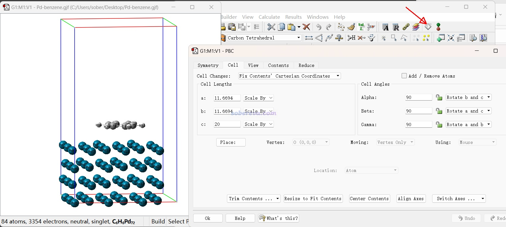

还值得一提的是，GaussView的菜单栏的Tools中的Atom selection界面很有用。用滑框选择工具选择一批原子成为黄色后，Atom selection界面里就可以看到选中的原子序号，格式和Multiwfn程序里要求的完全一致。例如在Multiwfn里创建几何优化任务的输入文件时，若你选择要冻结某些原子，就可以把序号从这里复制出来并直接粘贴到Multiwfn的窗口中，这样实现诸如slab边缘原子的冻结设置巨方便。

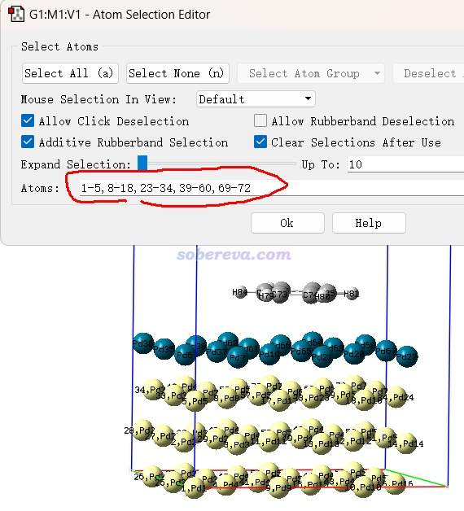

Multiwfn还可以载入CP2K的输入文件、Quantum ESPRESSO的输入文件、VASP的POSCAR等格式，主功能100的子功能2里选择保存为gjf或者cif文件后，也可以用GaussView载入并观看和编辑。顺带一提，在建模方面Multiwfn也提供了很多实用功能，很多还是GaussView没有的，见《Multiwfn中非常实用的几何操作和坐标变换功能介绍》（<http://sobereva.com/610>）。

### 2 几何优化结果的可视化

如果要看CP2K做几何优化得到的最终结构，最简单的方法是用Multiwfn载入此任务产生的restart文件，之后进入主功能0直接就看到了，例如下面的聚噻吩体系。界面上方的菜单以及图形界面右侧有一大堆选项可以调整效果，诸如视图的旋转和缩放、键的粗细、成键判断阈值、原子序号是否显示/字号/颜色、原子球大小、高亮特定原子。菜单栏的Tools列表里还有一些辅助工具，比如测量几何参数、导出所有内坐标、输出笛卡尔或分数坐标，等等。

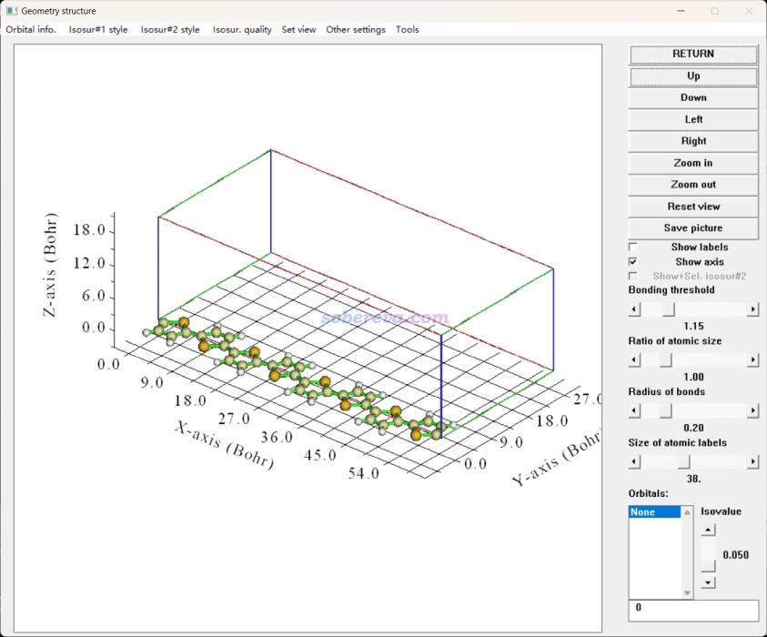

很多时候我们还关心优化的过程，尤其是当体系结构复杂时，不观看优化轨迹的话，往往都不好判断优化过程中哪里发生了何种变化，心里没数。观看优化轨迹最好的程序是VMD，在<http://www.ks.uiuc.edu/Research/vmd/>可免费下载，强烈建议用VMD 1.9.3（撰此文时1.9.4还没发布正式版，其测试版的bug巨多，强烈不建议用）。CP2K的几何优化任务默认会输出.xyz文件，这是多帧的轨迹文件，里面记录了优化过程的每一帧的坐标，不熟悉xyz格式的话看《谈谈记录化学体系结构的xyz文件》（<http://sobereva.com/477>）。把xyz文件载入VMD就可以观看优化轨迹了。即便任务没跑完，也可以载入此文件看看最新一步的结构。

xyz文件里不记录晶胞信息，因此在VMD里没法显示出晶胞边框，给观看周期性体系造成不便。对于不变胞的优化，可以用Multiwfn载入restart文件，此时屏幕上不仅显示晶胞信息，还会显示在VMD里定义晶胞的命令，如下图所示。

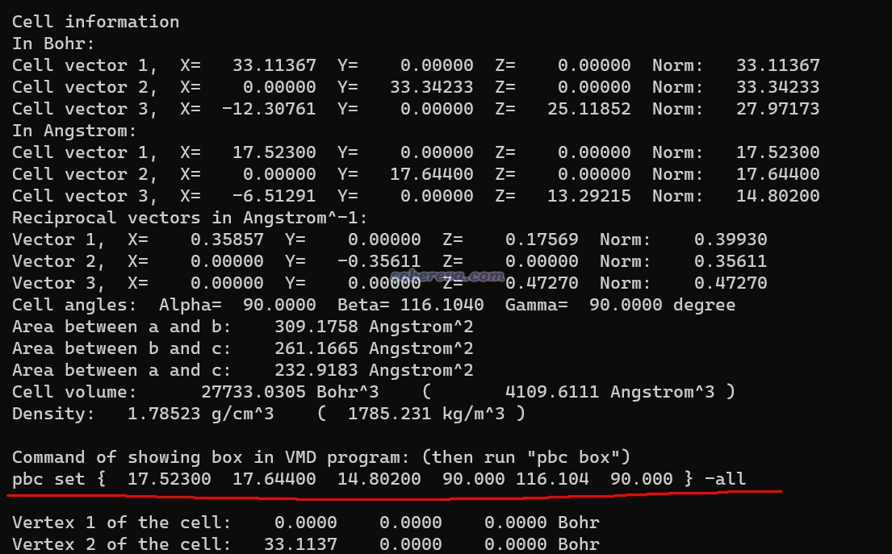

 把这命令复制到VMD的命令行窗口运行，之后再输入pbc box命令，晶胞在VMD里就显示出来了，如下所示。

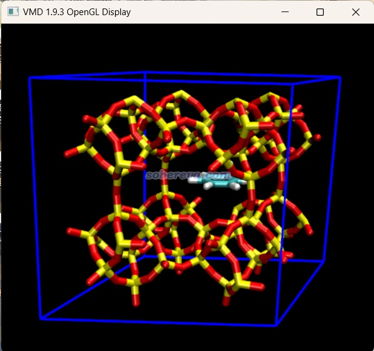

如果做的是变胞优化任务，晶胞在优化过程中不是固定不变的，此时建议让CP2K输出pdb格式的优化轨迹，里面记录了每一帧的晶胞信息。此文件载入VMD并显示盒子后，会看到随着轨迹的播放，盒子也实时变化。

上述说明不仅适用于优化极小点，对于dimer方法优化过渡态也是一样的。

VESTA（<http://jp-minerals.org/vesta/en/>）也是一个很好且免费的主要面向周期性体系的可视化工具，默认情况下的显示效果往往比VMD甚至还更好些。若想用VESTA看CP2K优化的结果，可以把restart文件载入Multiwfn，主功能100的子功能2里选择导出cif或VASP的输入文件（POSCAR），然后就能载入VESTA了。

### 3 反应路径的可视化

CP2K做NEB类任务需要对给定的初始结构之间插点。CP2K虽然能够自动插点（点=image），但没法在计算前进行预览。利用《sobNEB：产生CP2K的NEB的插点的方便的工具》（<http://sobereva.com/660>）里介绍的笔者的sobNEB程序插点的话，可以直接产生traj.xyz轨迹文件，放到VMD里通过播放动画或者多帧叠加显示，就可以直观判断初始的NEB的image是否合理了。

NEB类任务计算过程中是好多副本一起算的，每个副本都会在计算过程中输出它所负责的那个image优化过程的xyz轨迹文件。要想观看最终收敛的NEB轨迹，需要自己把这些副本输出的轨迹的最后一帧合并在一起作为新的xyz轨迹，放到VMD里就可以观看最终的反应路径动画了。手动做比较麻烦，建议用脚本实现。北京科音CP2K第一性原理计算培训班（<http://www.keinsci.com/KFP>）里专门给了个shell脚本自动做这件事情，运行后就会在当前目录下产生[项目名]_traj.xyz文件，里面记录了NEB最新一步的轨迹（即便任务还没跑完，也可以看最新的NEB轨迹是什么样），同时还会产生[项目名]_ene.txt，里面记录了最新一步的各个点的能量。下面是培训里的一个实例，对载入的[项目名]_traj.xyz文件做多帧叠加显示，直观显示了Na的迁移轨迹

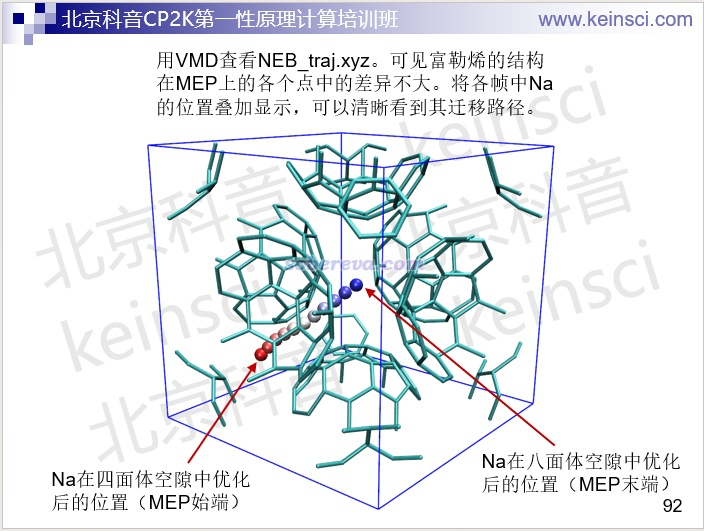

### 4 振动分析的可视化

CP2K做完振动分析后往往需要观看振动矢量了解振动的特征。推荐做法是用《使CP2K计算的振动模式可以被GaussView观看的程序：MfakeG》（<http://sobereva.com/656>）里介绍的笔者开发的MfakeG工具，把记录振动模式信息的.mol后缀的molden文件转化成仿Gaussian输出文件，之后载入GaussView就可以用Results - Vibrations选项观看振动模式了，例如下图的草酸晶体的例子

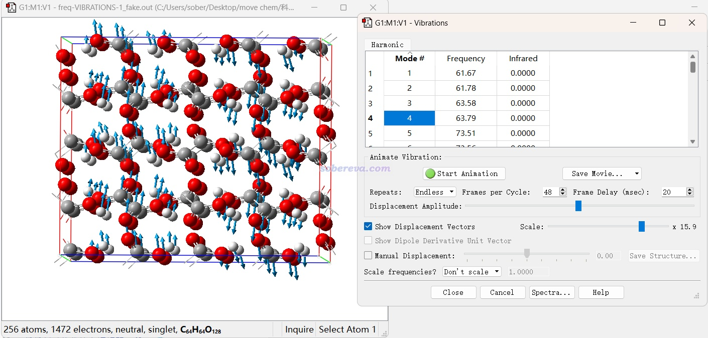

还有一种做法是使用免费的可视化程序Jmol（<https://jmol.sourceforge.net>），也可以载入CP2K产生的molden文件观看振动模式。不过我还是觉得GaussView用起来舒服。

如果要基于CP2K的振动分析观看振动光谱，推荐用Multiwfn。Multiwfn具有非常强大的绘制各种光谱的功能，见《使用Multiwfn绘制红外、拉曼、UV-Vis、ECD、VCD和ROA光谱图》（<http://sobereva.com/224>）和《使用Multiwfn绘制NMR谱》（<http://sobereva.com/565>）。Multiwfn可以载入CP2K做振动分析产生的输出文件按博文所述绘制红外光谱，如果要求计算了拉曼还可以绘制拉曼光谱。此外，Multiwfn还可以载入常规TDDFT和XAS-TDDFT任务的输出文件分别绘制UV-Vis光谱和X光吸收光谱，还可以考虑旋轨耦合效应，例如下图是CP2K+Multiwfn绘制的NaAlO2晶体的Al的K-edge XAS。Multiwfn还可以载入CP2K的NMR任务的输出文件绘制NMR谱。这些在北京科音CP2K第一性原理计算培训班（<http://www.keinsci.com/KFP>）里有非常系统的讲解和丰富的例子。

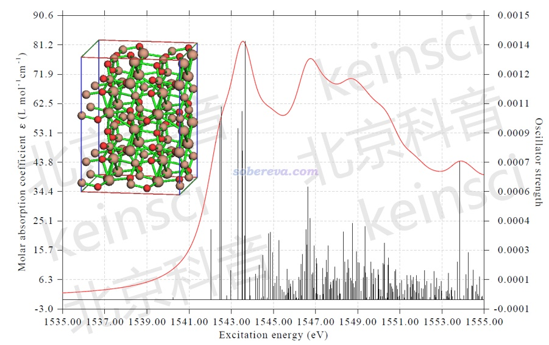

### 5 动力学轨迹可视化

CP2K的第一性原理动力学（叫从头算动力学也行）是CP2K的杰出强项之一。和GROMACS、AMBER、NAMD等经典力场动力学程序的情况一样，VMD也是观看其动力学轨迹的不二的选择。例如培训里有个模拟质子轰击石墨烯层的例子，VMD载入轨迹后并多帧叠加显示、根据帧号着色，直观展现了模拟过程中质子的运动轨迹：

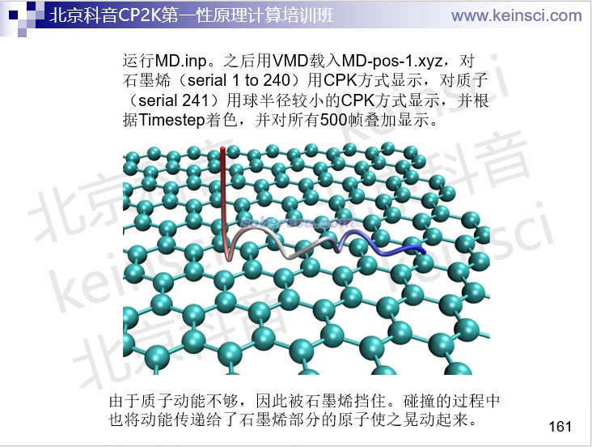

还可以自己写VMD脚本从CP2K产生的记录原子速度的xyz文件中把速度信息读入VMD，并根据速度着色，展现出质子的动能是如何传递到石墨烯板上并扩散开来的。下图黄色是打入的质子，越蓝的石墨烯原子的速度越大。

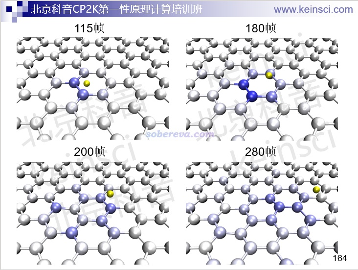

VMD不仅可以观看动力学过程中结构的变化，还可以绘制等值面图观看电子结构的变化，例如下图这个例子，直观展现了水合电子是怎么在模拟过程中出现的。

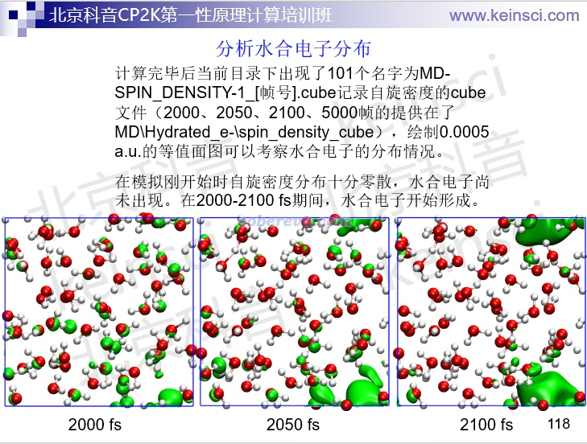

通过写VMD tcl脚本，还可以实现很复杂的分析，如下面幻灯片里讲的高温下正癸烷的裂解产物分析。PS：做动力学的，不会写分析脚本的话，稍微做深一点就会寸步难行。

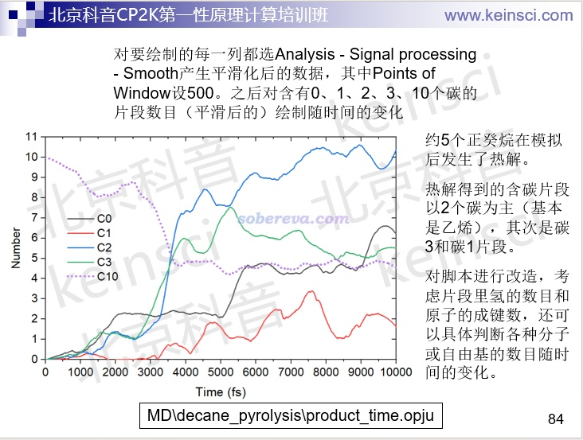

北京科音分子动力学与GROMACS培训班（<http://www.keinsci.com/KGMX>）专门用约100页幻灯片特别完整、详细讲VMD的使用，并且还额外用近100页幻灯片深入讲VMD脚本的编写，如果想系统学习VMD的话这是极佳的途径。

笔者偶尔看到有人用OVITO程序可视化CP2K产生的轨迹，我没用过那个程序，也完全不理解为什么有人不用VMD而用OVITO，明明VMD已经可以完美地满足一切需求。笔者在答疑时看到有一些CP2K用户还被OVITO坑了：OVITO根据边缘原子位置自动确定了盒子边框，有人以为那就是实际的晶胞边界，导致对结果产生了严重误解。

### 6 电子结构的可视化和分析

Multiwfn可以基于CP2K的输出文件绘制效果非常理想的能带结构图，如CrO2体系：

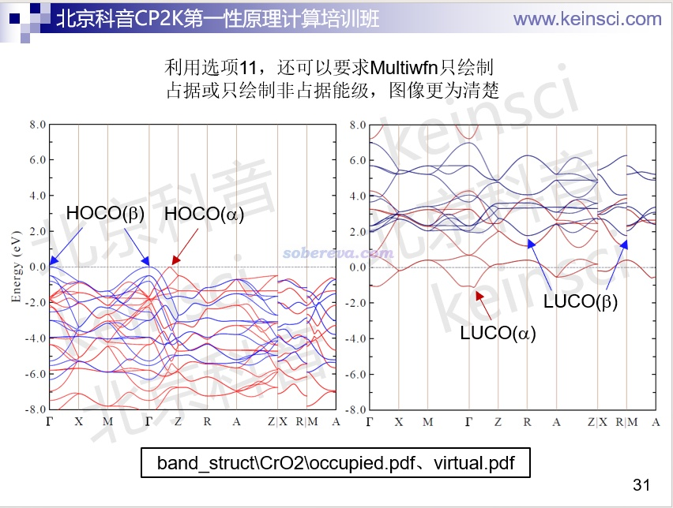

《详谈使用CP2K产生给Multiwfn用的molden格式的波函数文件》（<http://sobereva.com/651>）中介绍了怎么用CP2K产生molden文件。Multiwfn将之载入后，就可以在《使用Multiwfn绘制态密度(DOS)图考察电子结构》（<http://sobereva.com/482>）讲的基础上举一反三绘制效果很好的DOS、PDOS、OPDOS、LDOS图，下图是WO3体系：

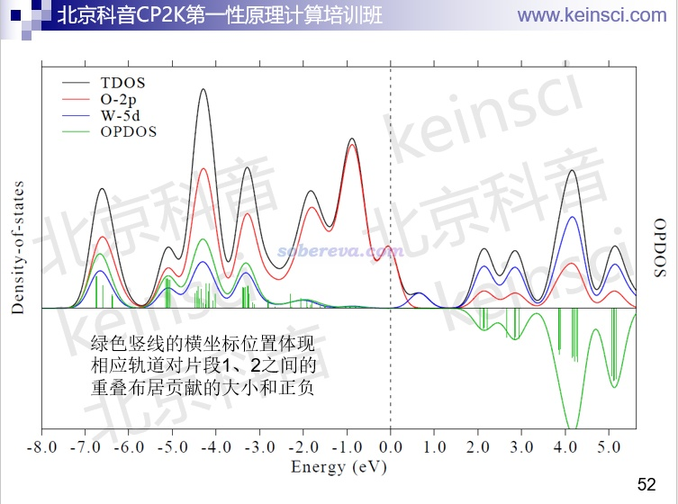

Multiwfn还能基于CP2K的molden文件观看轨道，做法可参考《使用Multiwfn观看分子轨道》（<http://sobereva.com/269>）。还支持对特定k点看轨道：

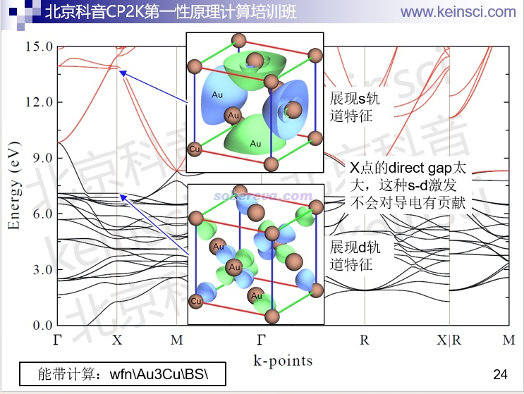

Multiwfn还能对周期性体系做超级丰富的波函数分析，其中很多都是以图形方式展现的，比如可以基于《在Multiwfn中单独考察pi电子结构特征》（<http://sobereva.com/432>）和《使用Multiwfn考察周期性体系的芳香性》（<http://sobereva.com/722>）讲的做法计算LOL-pi格点数据，之后可以在Multiwfn里直接观看等值面；也可以导出成cube文件后，载入VMD或VESTA程序绘制，如下所示，极为生动直观地展现了一个COF体系的pi电子共轭路径

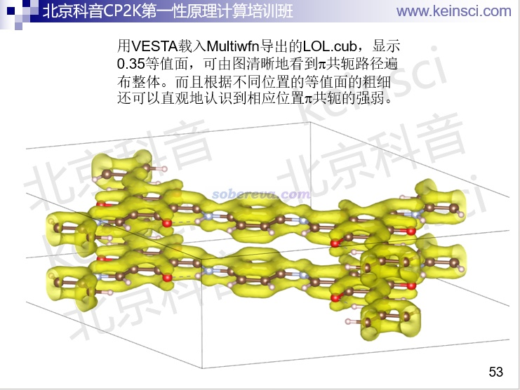

再比如下图是Multiwfn载入CP2K对硅表面计算产生的molden文件，做轨道定域化后直接显示出轨道等值面图，直观展现了体系不同位置的电子结构特征。相关信息见《Multiwfn的轨道定域化功能的使用以及与NBO、AdNDP分析的对比》（<http://sobereva.com/380>）。

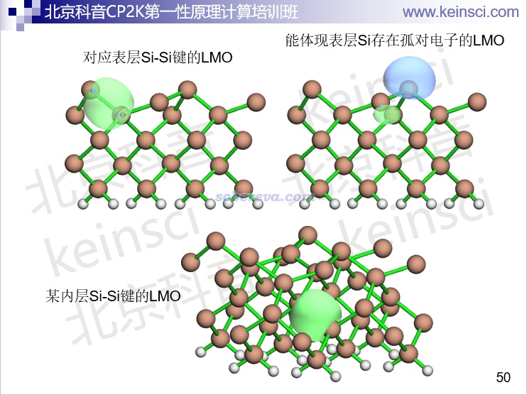

为避免此章太长，Multiwfn可以针对周期性体系做的巨量的可视化分析这里就不一一提及，很多分析我都写过博文，感兴趣的读者请阅读：  
使用Multiwfn结合CP2K的波函数模拟周期性体系的隧道扫描显微镜（STM）图像  
<http://sobereva.com/671>（<http://bbs.keinsci.com/thread-37740-1-1.html>）  
使用Multiwfn对周期性体系做键级分析和NAdO分析考察成键特征  
<http://sobereva.com/719>（<http://bbs.keinsci.com/thread-47176-1-1.html>）  
使用Multiwfn结合CP2K做周期性体系的atom-in-molecules (AIM)拓扑分析  
<http://sobereva.com/717>（<http://bbs.keinsci.com/thread-46927-1-1.html>）  
使用Multiwfn结合CP2K对周期性体系做电荷分解分析（CDA）  
<http://sobereva.com/716>（<http://bbs.keinsci.com/thread-46878-1-1.html>）  
使用Multiwfn做IGMH分析非常清晰直观地展现化学体系中的相互作用  
<http://sobereva.com/621>（<http://bbs.keinsci.com/thread-28147-1-1.html>）  
使用IRI方法图形化考察化学体系中的化学键和弱相互作用  
<http://sobereva.com/598>（<http://bbs.keinsci.com/thread-23457-1-1.html>）  
使用Multiwfn结合CP2K通过NCI和IGM方法图形化考察固体和表面的弱相互作用  
<http://sobereva.com/588>（<http://bbs.keinsci.com/thread-21742-1-1.html>）  
使用Multiwfn绘制分子和固体表面的距离投影图  
<http://sobereva.com/589>（<http://bbs.keinsci.com/thread-21754-1-1.html>）  
使用Multiwfn图形化展现原子对色散能的贡献以及色散密度  
<http://sobereva.com/705>（<http://bbs.keinsci.com/thread-44723-1-1.html>）  
使用Multiwfn做Hirshfeld surface分析直观展现分子晶体和复合物中的相互作用  
<http://sobereva.com/701>（<http://bbs.keinsci.com/thread-43178-1-1.html>）  
使用CP2K结合Multiwfn对周期性体系模拟UV-Vis光谱和考察电子激发态  
<http://sobereva.com/634>（<http://bbs.keinsci.com/thread-28006-1-1.html>）  
使用Multiwfn计算分子和晶体中孔洞的直径  
<http://sobereva.com/643>（<http://bbs.keinsci.com/thread-30696-1-1.html>）  
使用Multiwfn计算晶体结构中自由区域的体积、图形化展现自由区域  
<http://sobereva.com/617>（<http://bbs.keinsci.com/thread-25241-1-1.html>）  
使用CP2K结合Multiwfn绘制密度差图、平面平均密度差曲线和电荷位移曲线  
<http://sobereva.com/638>（<http://bbs.keinsci.com/thread-28225-1-1.html>）

此外，用VMD载入CP2K产生的Hartree势（静电势的负值），还可以实现对晶体表面静电势的可视化，一个COF体系的例子如下所示。静电势在研究静电主导的相互作用方面有重要意义，参见《静电势与平均局部离子化能相关资料合集》（<http://bbs.keinsci.com/thread-219-1-1.html>）里面的资料。

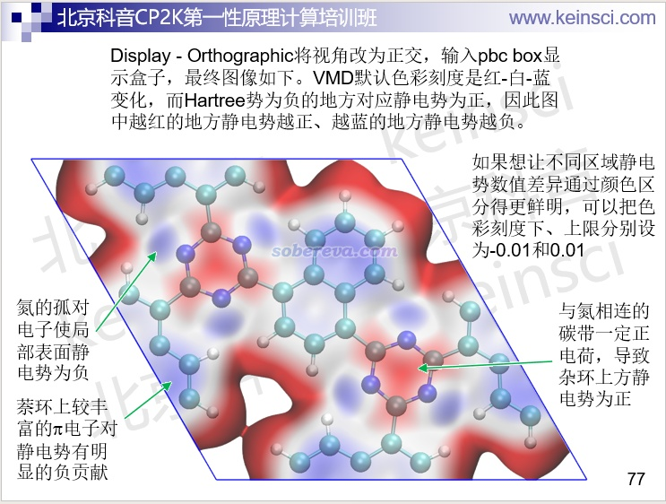

和静电势同等重要的是笔者提出的范德华势，适用于考察范德华作用主导的相互作用，可以由Multiwfn计算，见《谈谈范德华势以及在Multiwfn中的计算、分析和绘制》（<http://sobereva.com/551>）。
