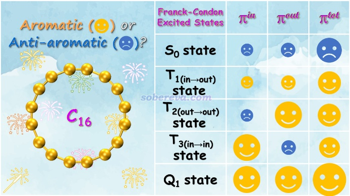
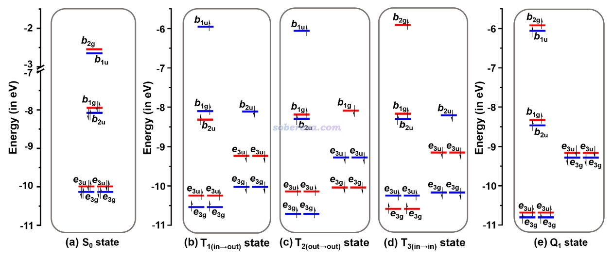
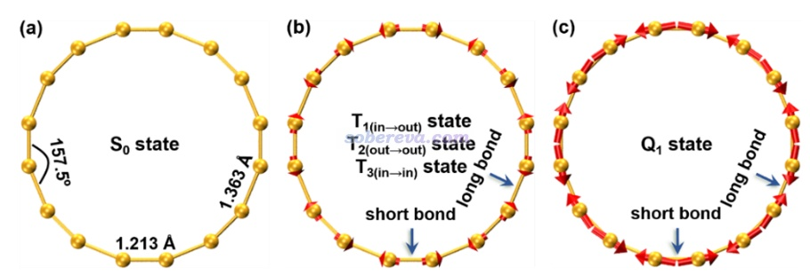
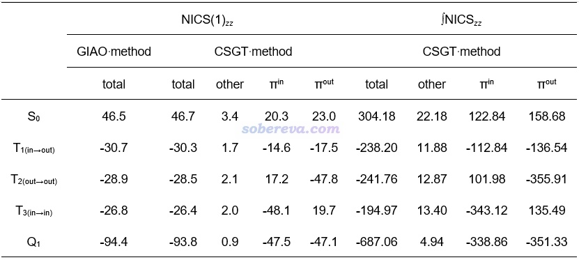
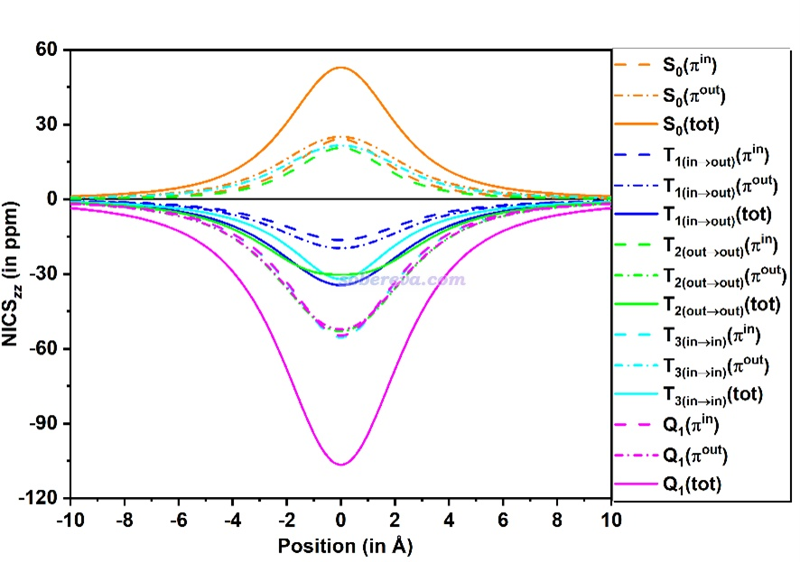
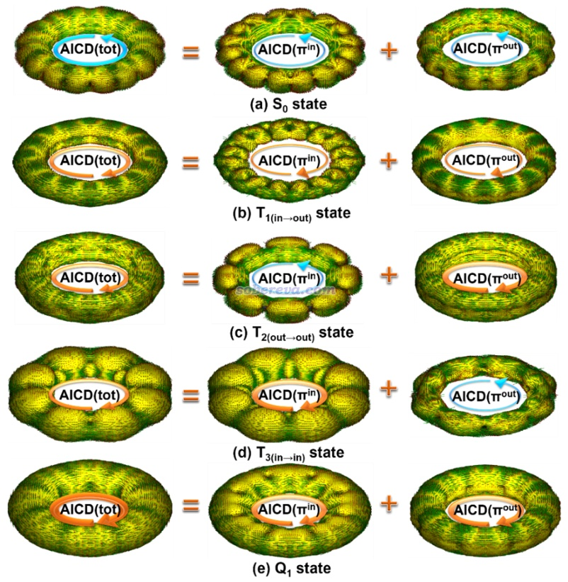
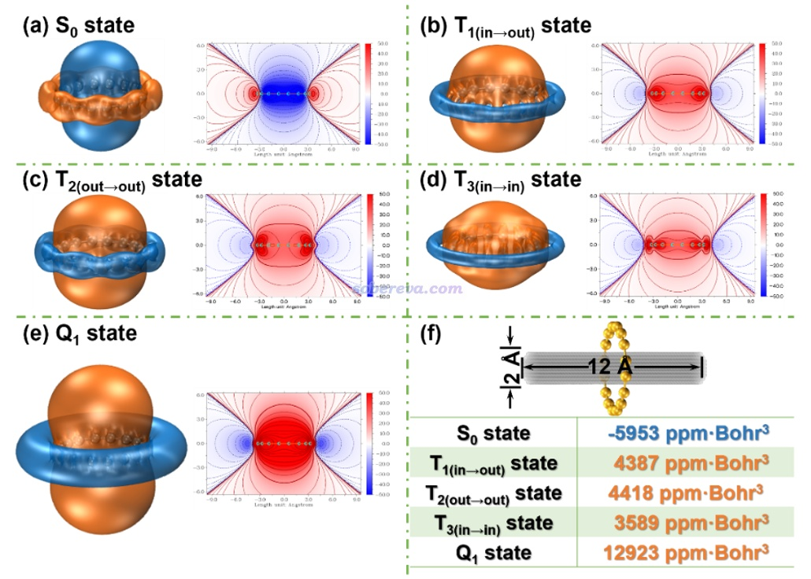

**全面揭示16碳环（cyclo[16]carbon）非常奇特的激发态芳香性！**

文/Sobereva@[北京科音](http://www.keinsci.com)   2025-Apr-30

## 0 前言

18碳环（cyclo[18]carbon, C18）是由18个sp杂化的碳原子相连构成的环状物质，它以其独特的几何和电子结构，自2019年在凝聚相中观测到后引发了化学界的巨大关注。在2023年的时候16碳环（下文简称C16）也被以类似方式制备了出来，见Nature, 623, 977 (2023)。C16和C18一样都有in-plane和out-of-plane两套pi电子，即pi(in)和pi(out)，详见Carbon, 165, 468 (2020)里的介绍。C18每套pi电子有18个电子，满足Huckel的4n+2规则因此基态具有双芳香性，笔者已在Carbon, 165, 468 (2020)文中通过详尽的波函数分析严格、全面证实了这一点。C16每套pi电子有16个电子，满足Huckel 4n规则因此理应基态具有双反芳香性。然而，激发态芳香性和基态芳香性往往是具有极大差别的。根据Baird规则，笔者意识到若让C16的pi(in)电子和pi(out)电子都被激发的话，极有可能处于五重态激发态的C16将和C18基态一样具有显著的双芳香性，而C16的三重态激发态则可能同时内在兼具芳香性和反芳香性！显然，研究非同寻常的C16的基态和激发态芳香性特征是一个极为新颖、有趣的课题。

基于以上思路，北京科音自然科学研究中心的卢天和江苏科技大学的刘泽玉等人共同深入全面研究了16碳环的单重态基态（S0）、最低三个三重态激发态（T1、T2、T3）和最低五重态激发态（Q1）的芳香性，成果近期发表在了知名的Chemistry - A European Journal期刊上，非常欢迎阅读：  
Yang Wu, Jingbo Xu, Xiufen Yan, Mengdi Zhao, Zeyu Liu*, Tian Lu*, Interesting Aromaticity of Franck-Condon Excited States of Cyclo[16]carbon, *Chem. Eur. J.*, **31**, e202404138 (2025) DOI: [10.1002/chem.202404138](https://doi.org/10.1002/chem.202404138)  
可以通过此链接免费在线阅览：<https://onlinelibrary.wiley.com/share/author/SB6H76ATMQF2RNABQAM2?target=10.1002/chem.202404138>

此文的Table of Contents如下，体现了此文的关键性结果

**笔者此前还对碳单环体系及其衍生物的各方面特征做过十分广泛的理论研究，发表的大量相关论文和深入浅出的介绍博文汇总见**[**http://sobereva.com/carbon_ring.html**](http://sobereva.com/carbon_ring.html)**（不断更新）。**

下面将对这篇Chem. Eur. J.文章的主要内容进行浅显易懂的介绍，便于读者更容易理解文章的研究结果，同时额外附上不少分析和计算细节以帮助读者能够将文中的研究手段举一反三运用到自己的研究中。原文里还有很多细节信息和讨论，故请阅读下文后阅读原文。此文不仅研究C16芳香性本身，文章在分析思想和方法学方面对于其它分子的芳香性研究也很有借鉴意义。

## 1 一些研究和计算细节

介绍结果之前，有一些研究和计算细节值得说明。

C16的基态和激发态势能面的极小点结构是不一样的，因此激发态极小点结构下的激发态芳香性与基态极小点结构下激发态的芳香性也是不同的，而且可以相差很大。此文专注于研究C16基态极小点结构下的基态、三重态和五重态芳香性，这避免了引入激发态势能面上结构的弛豫造成的芳香性改变。而若把结构弛豫效应考虑进去会导致分析讨论变得复杂，也无法“干净”地体现电子激发的改变本身对电子结构的直接影响。激发态势能面上的基态结构对应的那个位置被称为Franck-Condon（FC）点，因此此文研究的C16的激发态芳香性被称为Franck-Condon激发态芳香性。

此文对C16做的计算主要使用Gaussian 16程序在ωB97XD/def2-TZVP级别下做，这在<http://sobereva.com/carbon_ring.html>中汇总的笔者的巨量和碳环有关的文章中都被证实可以很稳健地描述碳环类体系的几何和电子结构。文中对C16还做了衡量静态相关常用的T1诊断，对S0、T1、Q1态结果分别为0.015、0.017、0.013，都是较小的值，体现出使用更复杂昂贵的多参考方法研究C16不是必须的。

此文计算C16的T1/T2/T3和Q1态时用的是ΔSCF方法结合UKS计算，而不是算激发态常用的TDDFT方法，这是因为在TDDFT下没法算磁性质来考察芳香性，而且也没法要求算五重态；而用ΔSCF不仅没有这个局限性，而且还能考虑轨道弛豫效应，因此原理上比TDDFT更理想。

ΔSCF方式算Q1时直接把自旋多重度设成5做DFT计算即可，通过用Multiwfn程序查看Gaussian计算得到的轨道的等值面图，可以发现这就是想要研究的pi(in)→pi(in)*结合pi(out)→pi(out)*的激发，星号代表空轨道，电子跃迁时自旋都发生了beta→alpha的翻转（后同）。算三重态情况略复杂。根据能量顺序，最低三个三重态对应的电子激发的情况是这样的：  
T1：pi(in)→pi(out)*，简称T1(in-out)  
T2：pi(out)→pi(out)*，简称T2(out-out)  
T3：pi(in)→pi(in)*，简称T3(in-in)  
• 直接把自旋多重度设为3做计算得到的是T1(in-out)。  
• 想得到T3(in-in)，除了自旋多重度设3外，还需要用Gaussian的guess(read,alter)关键词，读取S0计算的chk文件当初猜，并在坐标末尾空一行写49 50来交换初猜轨道的顺序，以令默认处于占据的49号轨道pi(out)和默认处于非占据的50号轨道pi(in)轨道交换。  
• 想得到T2(out-out)更为折腾，我实际发现若直接通过guess(read,alter)调换轨道顺序做UKS计算试图得到这个态，总收敛到T3(in-in)。最后解决办法是先用ROKS结合轨道调换设置收敛到期望的T2(out-out)波函数，然后把fch文件用Multiwfn的主功能6的选项37将ROKS轨道split成为UKS波函数形式，之后导出fch并转成chk。最后UKS计算时将自旋多重度设成3并结合guess=read读取这个chk文件里的波函数当初猜即可。

T4态应当对应pi(out)→pi(in)*。实际发现由于变分坍塌问题难以得到这个态，并且可以预计这个态的芳香性和T1(in-out)并不会有显著区别，因此文中就没有研究T4。

## 2 电子结构和激发能

ΔSCF方式得到的上述激发态的激发能为  
T1(in-out)：2.082 eV  
T2(out-out)：2.106 eV  
T3(in-in)：2.114 eV  
Q1(in-in;out-out)：4.295 eV  
可见三个最低三重态的能量差很小，本来也是因为pi(in)和pi(out)能级分布特征极为接近，这从笔者的Carbon, 165, 461 (2020)的图2展示的MO-PDOS图就可以清楚地看出来。Q1态由于涉及两个电子的激发且分别来自pi(in)和pi(out)、彼此正交，因此激发能是T态的大约两倍。

此文研究的不同电子态的轨道的能级，以及对应的S0极小点所属的D8h点群下的不可约表示，如下所示。红色和蓝色分别对应pi(in)和pi(out)轨道

由上图可以看出T和Q态存在显著的自旋极化，使得alpha和beta电子的前线轨道能级明显不匹配。并且根据不可约表示的匹配关系，可以看出激发特征是  
T1(in-out): b1g→b1u  
T2(out-out): b2u-b1u  
T3(in-in): b1g→b2g   
Q1(in-in;out-out)：pi(in) b1g→b2g、pi(out) b2u→b1u

## 3 不同电子态的原子受力

优化出来的C16基态结构的长、短C-C键的键长分别为1.363和1.213 Å，而C18为1.344和1.221 Å，前者的键长交替（bond length alternation, BLA）值0.150 Å明显大于后者0.123 Å。芳香性倾向于令共轭环上的键长平均化，因此从几何结构上虽然无法判断C16的基态是否有明显的反芳香性，但至少足矣看出C16的芳香性远弱于C18。倘若C16的激发态的芳香性显著强于其基态，那么在相应的Franck-Condon结构下，激发态的原子受力理应倾向于让BLA减小。基于这个考虑，文中计算了C16的不同激发态的Franck-Condon结构下的受力，并借助VMD的作图命令画成了图，如下所示，箭头长度正比于原子受力大小

可见被激发到Q1态后原子受力显著，极为倾向于让较长的C-C键变得更短、让较短的C-C键变得更长，从而减小BLA，这直接暗示出Q1具有很显著的芳香性。T1/2/3态的原子受力情况极其接近、难以区分，故在上图没有区分给出，由图可见虽然此时的受力也有令BLA减小的特征，但远不如Q1态显著，故从原子受力角度直接体现出T1态有比基态显著得多的芳香性但又远不如Q1态。此文的Franck-Condon结构的受力分析给激发态芳香性的分析提供了全新的视角。

## 4 不同电子态的NICS

NICS是最常用，而且很稳健、普适的衡量芳香性和反芳香性的定量指标，对基态和激发态都能用，因此本文也使用了NICS考察了不同激发态的芳香性。关于NICS及其各种变体的介绍详见《衡量芳香性的方法以及在Multiwfn中的计算》（<http://sobereva.com/176>）、《使用Multiwfn计算FiPC-NICS芳香性指数》（<http://sobereva.com/724>）的相关部分，其中通常来说最可靠的是NICS(1)ZZ。NICS(1)ZZ的计算结果如以下表格左半边所示，比0负得越多说明芳香性越强、比0正得越多说明反芳香性越强。可见用GIAO和CSGT方式得到的总值差不多，而CSGT还可以分解成不同轨道的贡献便于更好地了解本质，见《基于Gaussian的NMR=CSGT任务得到各个轨道对NICS贡献的方法》（<http://sobereva.com/670>）。本文将CSGT的NICS(1)ZZ分解成了pi(in)、pi(out)和其它部分。

从以上数据可见，C16的基态确实是显著的反芳香性，因为S0的NICS(1)ZZ明显为正，并且pi(in)和pi(out)对反芳香性的贡献基本一样。而Q1具有极强的芳香性，总NICS(1)ZZ达到了惊人的-94.4 ppm，基本上均等地来自pi(in)和pi(out)的贡献。相比之下，Carbon, 165, 468 (2020)中报道的具有基态双芳香性的C18的NICS(1)ZZ才只不过-23.7 ppm，被视为芳香性代表的基态苯分子的NICS(1)ZZ也只有-29.9 ppm。基态是反芳香性的C16在特定的激发态下竟有如此强的芳香性，实在令人吃惊！

C16的T1、T2、T3的芳香性相差不大，从NICS(1)ZZ的数值来看都算得上是很显著芳香性。基于CSGT的NICS(1)ZZ分解，可见它们的芳香性的本质十分不一样。T1(in-out)的芳香性同时来自于pi(in)和pi(out)电子，贡献程度相仿佛。T2(out-out)的芳香性完全由pi(out)系统的电子贡献，而未被激发的pi(in)电子则和S0态一样产生反芳香性贡献，并且由于pi(out)对芳香性的贡献远大于pi(in)贡献的反芳香性，因此T2(out-out)整体是显著芳香性的。T3(in-in)和T2(out-out)的情况类似，只不过pi(in)和pi(out)产生的作用几乎正好反过来。

Baird规则是经典的预测处于S1和T1激发态的环状体系的芳香性的规则，例如S0态是芳香性的苯在S1和T1态是反芳香性的。当前研究的C16的Q1态可以称为双重Baird芳香性，这是极为独特的特征。T2(out-out)和T3(in-in)态都算是Baird芳香性与Huckel芳香性的混合，前者占主导。具有双芳香性的T1(in-out)则不属于Baird芳香性，因为没有牵扯到单套pi系统内的电子激发，它的状态类似于两套pi系统都处于单自由基状态。

为了更进一步确认UKS方式算的C16不同电子态的NICS(1)ZZ的结果的合理性，文中还用Dalton程序在CASSCF级别下做了NICS(1)ZZ计算，这算是对于可能存在较显著静态相关的体系算NICS(1)ZZ能用的最稳健的方法了（尽管未充分考虑动态相关）。计算使用CAS(12,12)活性空间，利用《利用Multiwfn令Dalton计算时使用其它程序产生的轨道作为初猜》（<http://sobereva.com/740>）介绍的方法，将Gaussian做对称破缺UHF计算产生的波函数经由Multiwfn转化出的UNO轨道作为CASSCF的初猜轨道。计算出的结果是S0、T1、Q1态的NICS(1)ZZ分别为33.6、-29.1、-95.6 ppm，可见结论和UKS方式算的没有什么区别，进一步确认了UKS计算的C16不同自旋态的NICS(1)ZZ已经很可靠了，没什么可质疑的。

**注：在笔者讲授的北京科音高级量子化学培训班（**[**http://www.keinsci.com/KAQC**](http://www.keinsci.com/KAQC)**）中的“CASSCF、多参考方法的原理与应用”一节里还专门讲了如何用Dalton做CASSCF计算以及在CASSCF级别下做NICS，并重复了上述计算的全过程，把关键性要点都讲得特别细致透彻。如果你也有做类似计算的需求，欢迎参加此培训！**

NICS_ZZ指数的数值依赖于计算位置的选取，这是它的一个不足，只考虑距离环中心1埃位置的NICS(1)ZZ对芳香性的展现有可能不够全面。《使用Multiwfn绘制一维NICS曲线并通过积分衡量芳香性》（<http://sobereva.com/681>）介绍了对NICS在垂直于环方向进行扫描的方法，下图是C16的不同电子态的这种曲线图，从这个图上可以看出无论NICS_ZZ的计算位置取在哪，前面基于NICS(1)ZZ的分析结论都是不变的，更进一步巩固了结论的可靠性。

对上面这种曲线进行积分还能得到∫NICS指数，能够比NICS(1)ZZ更严格地衡量芳香性。此文对前述的电子态计算了∫NICS，对芳香性的判断结论与NICS(1)ZZ完全一致，并且发现NICS(1)ZZ与∫NICS之间有非常理想的线性相关性。

## 5 AICD和ICSS分析

《使用AICD 2.0绘制磁感应电流图》（<http://sobereva.com/294>）介绍的AICD图是通过磁场作用下的感生电流角度直观展现芳香性特征的很好、很常用的方法，在笔者的大量的与18碳环相关的芳香性和衍生体系的研究文章中也都使用了此方法，如Carbon, 165, 468 (2020)、Inorg. Chem., 62, 19986 (2023)、Chem. Eur. J., 29, e202300348 (2023)、Chem. Eur. J., 29, e202300348 (2023)、ChemPhysChem, 25, e202400377 (2024)。此文对C16的前述电子态都绘制了AICD图，并分解成了pi(in)和pi(out)电子贡献，结果如下所示，外磁场与环平面垂直并且指向图的外侧。为了看得清楚，AICD等值面上的小箭头的整体效果用手画的大箭头表示了出来。

可见相对于NICS(1)ZZ，上图更直观地展现了不同激发态的芳香性本质。例如Q1态的图上确实可以清晰看出这个电子态下体系同时在环平面内和环平面外产生了很显著的满足左手定则的（顺时针）感生电流，体现出了很鲜明的双芳香性特征。而比如T2(out-out)，则可明确看出其pi(out)电子具有和Q1态一样的很强的顺时针感生电流、贡献显著的芳香性，而其pi(in)电子则具有和S0态一样的一般强度的逆时针感生电流、贡献一定反芳香性，从AICD(tot)图整体来看顺时针环电流更明显，故是芳香性的。

《通过Multiwfn绘制等化学屏蔽表面(ICSS)研究芳香性》（<http://sobereva.com/216>）介绍的ICSS_ZZ图对芳香性的展现远比NICS_ZZ及其一维扫描更全面直观，但计算耗时也高得多。文中绘制了不同电子态的ICSS_ZZ等值面图（等值面数值为± 12 ppm）和截面填色图，如下所示，橙色和蓝色分别对应于磁屏蔽和去屏蔽区域。可见S0态在环内是去屏蔽的，而环的外围是磁屏蔽的，这是典型的反芳香性体系具有的特征。而Q1则在环内和环外分别展现了极强的磁屏蔽和去屏蔽，再次体现出其超强的芳香性。相比之下，T1、T2、T3态虽然也和Q1的特征一样，能看出整体是具有明显芳香性的，但在环外的去屏蔽区域的等值面比Q1窄得多，而且环内屏蔽区域的等值面在垂直于环方向的延展程度不及Q1、填色图中环内红色区域也远不及Q1的鲜艳，因此这些三重态的芳香性都显著弱于Q1。有趣的是，由于三个T态对芳香性、反芳香性有所贡献的pi电子不一样，导致它们的ICSS_ZZ等值面的具体形状有可查觉的不同。例如T2(out-out)由分布在环的上、下方的pi(out)电子贡献其芳香性部分，这使得其环内屏蔽区域的等值面在垂直于环方向上的延伸幅度明显大于T3(in-in)。

此文还对ICSS_ZZ在环内的柱形区域进行了积分以便定量对比，积分区域如上图(f)部分的灰色区域所示，数值也罗列在图上了。可见不同态之间的ICSS_ZZ积分结果的差异和NICS(1)ZZ、∫NICS的非常类似，例如Q1的芳香性都是T态的三倍左右。

## 6 总结

本文介绍的Chem. Eur. J. (2025) DOI: 10.1002/chem.202404138一文通过严谨的量子化学计算、原子受力，以及各种基于磁属性芳香性判断方法，充分、严格、全面地揭示了C16的基态、最低三个三重态激发态、最低五重态激发态的芳香性特征，不同芳香性衡量方法的结论高度吻合，并且文中还对造成芳香性差异的电子结构本质进行了具体讨论。由于C16具有两套独立的pi电子体系，导致其激发态芳香性特征与一般芳香性或反芳香性分子具有显著差异。表面上看起来芳香性差不多的T1、T2、T3态，其芳香性的内在构成截然不同。而具有双Baird芳香性的Q1态的芳香性则强得令人印象十分深刻，NICS(1)ZZ接近-100 ppm，远远强于苯分子的芳香性。希望这篇内容新颖的文章能够令读者对碳环体系和激发态芳香性产生兴趣，并在研究芳香性方面获得启发。
