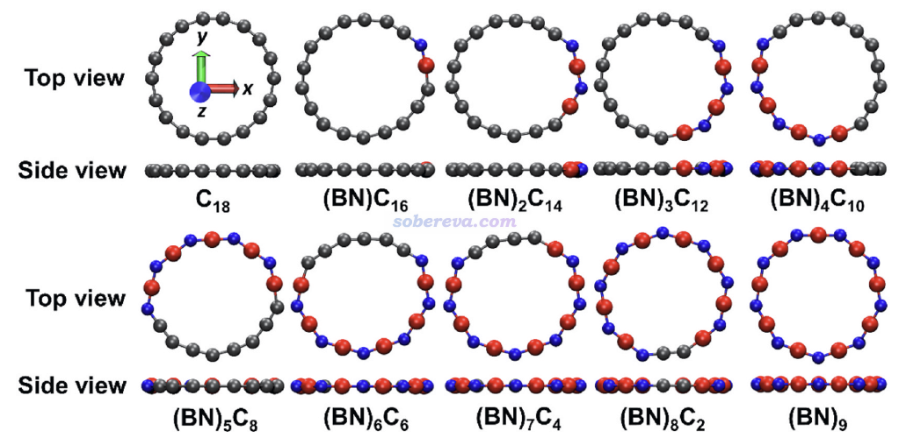
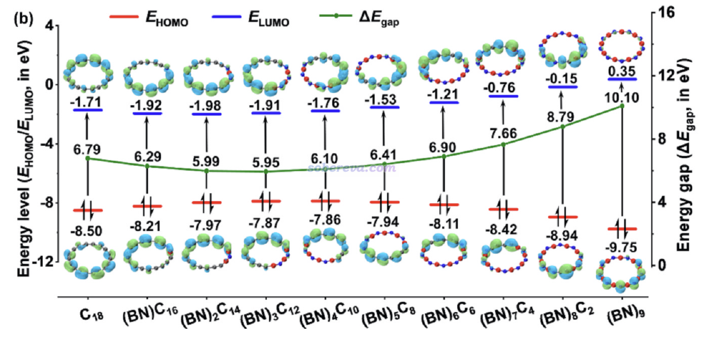
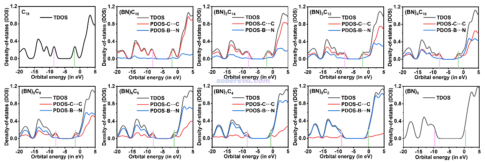
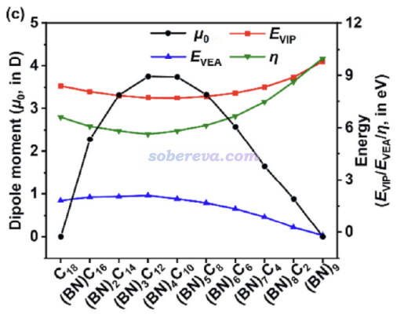
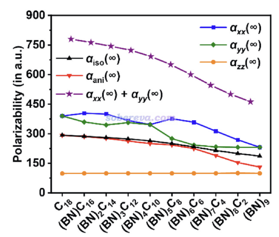
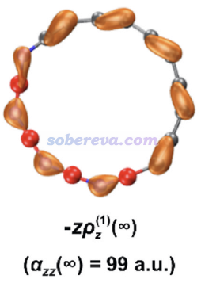
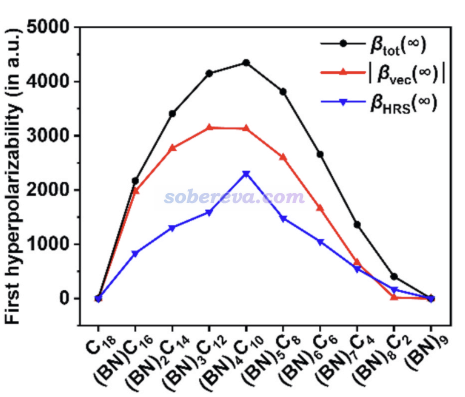
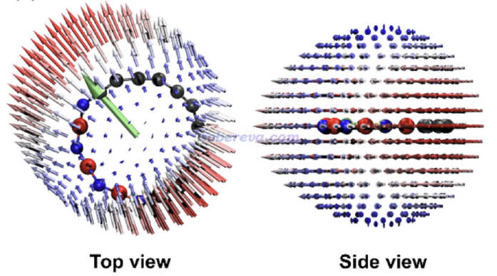
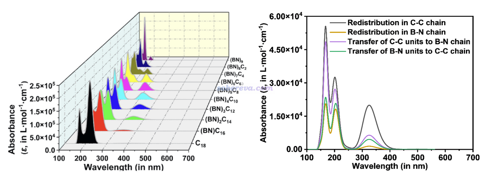
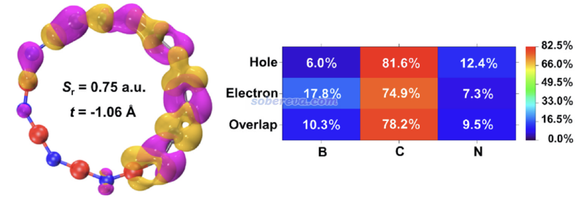

**从18碳环的硼氮取代物中理论筛选出具有优异光学性质的分子：一篇CEJ期刊文章介绍**

文/Sobereva@[北京科音](http://www.keinsci.com)   2025-May-31

## 0 前言

18碳环（cyclo[18]carbon）自从于2019年在凝聚相实验中被观测到后，引发了化学家们非常广泛的兴趣，目前已有巨量量子化学研究文章发表，笔者对18碳环及相关体系的理论研究工作汇总见<http://sobereva.com/carbon_ring.html>。完全由氮、硼原子交替构成的环B9N9，以及18碳环部分由硼、氮取代的结构，也已被研究过，例如《18碳环等电子体B6N6C6独特的芳香性：揭示碳原子桥联硼-氮对电子离域的关键影响》（<http://sobereva.com/696>）介绍的笔者的Inorg. Chem., 62, 19986 (2023)文章。而硼氮替换如何影响碳环的光学性质，之前尚未有系统的研究。

近期，江苏科技大学的刘泽玉等人和北京科音自然科学研究中心的卢天，共同在知名的Chemical Engineering Journal (CEJ)刊物上发表文章，全面揭示了硼氮掺杂对碳环的光学性质的影响，并发现恰到好处的掺杂能够获得具有出色非线型光学性质的物质。此文的研究也对硼氮掺杂改性大共轭碳材料提供了十分有益的启示。非常欢迎阅读以及引用此文：

Xiaohui Chen, Zhibo Xie, Jiaojiao Wang, Wenwen Zhao, Xiufen Yan, Zeyu Liu,* Cai Ning,* Tian Lu,* Obtaining (BN)4C10 with excellent optoelectronic properties by screening boron-nitrogen substituted cyclo[18]carbon, (BN)nC(18-2n) (n = 1–9), *Chem. Eng. J.*, **515**, 163236 (2025) <https://doi.org/10.1016/j.cej.2025.163236>

在2025年6月29日之前可以通过<https://authors.elsevier.com/c/1l44R4x7R2o3f3>免费阅读此文。

下面，本文就对这篇Chem. Eng. J.文章的研究工作的主要内容进行深入浅出的介绍，并对不少细节和要点做一些附加说明，以便读者更顺利地了解文章的最关键的内容，以及能在其它研究中借鉴此文的研究方式。更具体的研究结果和更多的讨论请阅读原文。下文的图片皆来自原文的正文或补充材料。

## 1 (BN)nC(18-2n)的几何结构

此文研究的对像是不同数目硼氮（BN）单元取代的18碳环，通式为(BN)nC(18-2n)，其中n=1-9，各个BN单元连续排布。因此，此文研究了从氮化硼环B9N9到18碳环的完整过渡过程。在ωB97XD/6-311+G(2d)下优化出的体系的极小点结构如下所示，红色、蓝色、灰色分别对应硼、氮、碳，结构均为纯平面。ωB97XD在<http://sobereva.com/carbon_ring.html>列举的各种碳环及衍生物的研究中都被证实可以很合理描述18碳环及其硼、氮掺杂体系的电子和几何结构。

## 2 (BN)nC(18-2n)的电子结构

下图展示出了不同的硼氮取代的18碳环的HOMO、LUMO能级和HOMO-LUMO gap，通过Multiwfn结合VMD按照《用VMD绘制艺术级轨道等值面图的方法）（<http://sobereva.com/449>）方法绘制的等值面图也给出了。可见随着BN单元数n的增加，LUMO先轻微减小然后再明显增大，而HOMO先轻微增加再明显减小，这使得HOMO-LUMO gap在n=3时达到了最小值。

如《使用Multiwfn基于完全态求和(SOS)方法计算极化率和超极化率》（<http://sobereva.com/232>）里的公式所示，激发能出现在计算极化率的SOS公式的分母部分，而HOMO-LUMO gap越小很大程度暗示激发能整体越小，因此由此可以预期HOMO-LUMO gap最小的(BN)3C12或相邻的(BN)2C14、(BN)4C10具有最大的极化率，这与后文的实际计算结果一致。

当n不很接近9时，从上图可以看到HOMO、LUMO几乎都出现在碳的部分，这和下图（原文中图S1）所示的基于《使用Multiwfn绘制态密度(DOS)图考察电子结构》（<http://sobereva.com/482>）介绍的方法绘制的PDOS图相吻合，碳构成的片段的PDOS总是主导最高占据能级和最低非占据能级。

以上信息直接暗示出电子激发最容易的区域、反应活性最高的区域、对（超）极化率贡献最大的部分，都是(BN)nC(18-2n)中的共轭碳链部分（至少对于n不很接近9时）。

从18碳环开始，随着取代的BN单元数逐渐增加，HOMO-LUMO gap先轻微下降然后逐渐显著上升的本质原因何在？文中认为原因在于以下几点：  
• 有显著芳香性的体系的gap倾向于比芳香性更弱的相似物的更大，例如《深度揭示互为等电子体的苯、无机苯和carborazine的芳香性的显著差异》（<http://sobereva.com/731>）中提到的，具有很强芳香性的苯的gap比芳香性更差的carborazine的gap明显更大就是这种情况。18碳环有明显的芳香性，这在Carbon, 165, 468 (2020)中笔者已经充分论证过了。当18碳环的C-C逐渐被BN单元所取代后，芳香性被逐渐破坏，导致gap减小。  
• 当BN单元数变得略多时，上面的效应弱化，而导致gap增大的一个因素变成了主导，使得(BN)3C12具有最小的gap。这个因素是随着BN单元数增加、环上的碳链区域变短，导致pi共轭区域的长度逐渐减小，从而令gap变大。这类似于一维无限深势阱，当势阱越窄，相邻能级差会越大。在《正确地认识分子的能隙(gap)、HOMO和LUMO》（<http://sobereva.com/543>）里给出过共轭聚合物的例子，也是共轭空间范围越窄，gap越大。  
• 另一方面，当BN单元数已经很多并进一步增加时，体系也越来越接近B9N9，自然gap也越来越接近B9N9。缺乏pi共轭的B9N9的gap显著大于18碳环，因此gap在BN单元数增加的后期提升得很快。

再来看永久偶极矩（μ0）、垂直电离能（VIP）、垂直电子亲和能（VEA）、电子硬度（η）随BN单元数的变化，如下所示。可见VIP和VEA的变化趋势分别与HOMO能量和LUMO能量正相反，因为按照Koopmans定理，VIP和VEA分别近似等于HOMO和LUMO能量的负值（虽然这个近似的精度往往很烂，但可以解释趋势）。硬度定义为VIP-VEA，数值越小电子软度越大，一定程度暗示反应活性越高，在Koopmans近似下等于HOMO-LUMO gap。可见硬度的变化趋势确实和HOMO-LUMO gap一样，也在(BN)3C12处达到了最小值。

由于18碳环和B9N9都是中心对称的，所以它们的永久偶极矩都为0。如上所示，在BN单元增加的过程中偶极矩先增大后减小。有趣的是，HOMO-LUMO gap最小的(BN)3C12正好拥有最大的偶极矩。

## 3 (BN)nC(18-2n)的（超）极化率

此文的（超）极化率使用Gaussian 16在ωB97XD/aug-cc-pVTZ级别下计算，数据的提取和相关物理量通过《使用Multiwfn分析Gaussian的极化率、超极化率的输出》（<http://sobereva.com/231>）介绍的方式实现。此级别下计算的各个(BN)nC(18-2n)体系的静态极化率如下，分子在XY平面上。曾经笔者在Carbon, 165, 461 (2020)中全面深入研究了18碳环的光学性质，并指出了18碳环在平面内具有巨大的极化率。当前研究进一步体现出，随着不具备pi共轭特征的BN单元越多、pi共轭的碳链区域越短、电子分布在外场驱动下能够轻易转移的范围越狭窄，平面内的总极化率（αxx+αyy）逐渐显著减小，最终的B9N9的平面内总极化率远小于18碳环的。另外由图可见，垂直于分子平面方向的极化率αzz基本不依赖于BN单元数，且B9N9和18碳环的基本没区别，分别为98和99 a.u.，体现出这两种等电子体虽然元素不同，但电子结构层面的差异并不会明显造成在垂直于环平面方向上电子被外电场极化能力的差异。下图的αani是极化率的各向异性，可见随着从18碳环逐渐变向B9N9，αani逐渐减小，这是因为B9N9不具备18碳环那样的在环上的全局pi共轭，因此在不同方向上的极化率差异明显更不显著。

文中使用《使用Multiwfn极为方便地绘制(超)极化率密度和三维空间对(超)极化率的贡献》（<http://sobereva.com/683>）的方法绘制了极化率密度，其中下面这张图展现了(BN)4C10的垂直于环平面的极化率分量的极化率密度的±0.12 a.u.等值面，等值面包裹的区域是对αzz有主要贡献的区域。可见主要贡献的部分是氮的孤对原子，以及碳链部分的pi电子很丰富的较短的C-C键。注意BN取代的18碳环和原本的18碳环一样都具有C-C键键长交替的特征。

(BN)nC(18-2n)的第一超极化率的总值（βtot）、在偶极矩方向的投影的大小|βvec|，以及《使用Multiwfn计算与超瑞利散射(HRS)实验相关的量》（<http://sobereva.com/499>）介绍的超瑞丽散射（βHRS）实验测量的βHRS在下图给出了。由于18碳环和B9N9是中心对称的，二者的β皆精确为0。从18碳环开始，随着BN单元数的增加，各种β都是先增大后减小。这体现出BN单元数可以对体系的非线型光学（NLO）性质起到充分的调控作用，这个发现给设计具有特定性能的NLO材料提供了一种新思路。其中，(BN)4C10具有最大的βtot和βHRS，并且数值相当大，这是本文理论筛选出的具有关键价值的分子！

文章还使用《使用Multiwfn通过单位球面表示法图形化考察（超）极化率张量》（<http://sobereva.com/547>）介绍的方法用Multiwfn结合VMD对上述最具特殊性的(BN)4C10绘制了单位球面表示法图像。其中的小箭头展现出无论两个电磁场同时向什么方向打向此体系，耦合作用产生的诱导偶极基本上都是顺着绿色箭头出现的，这也正是顺着碳链pi共轭的主体方向。

此外，文章还考察了外场频率对极化率和第一超极化率的影响，证实了外场频率越大，各种(BN)nC(18-2n)的第一超极化率都会明显越大，即具有正的频率-色散效应。

## 4 (BN)nC(18-2n)的电子吸收光谱

文章全面考察了不同的(BN)nC(18-2n)的电子吸收光谱，如下图左侧所示，可见它们在可见光范围内都没有明显的吸收，说明是无色物质。随着BN单元数的增多，光谱明显平滑地从18碳环向B9N9逐渐过渡，变化细节见原文的讨论。对于前述很有特点的(BN)4C10，此文在补充材料里给出了按照《使用Multiwfn绘制电荷转移光谱(CTS)直观分析电子光谱内在特征》（<http://sobereva.com/628>）介绍的CTS方法将总光谱特征进行分解的图，如下图右侧所示。可见在300多nm部分的峰主要来自于碳链区域内的电子重排的贡献，而200nm左右的吸收的成份更为复杂，同时牵扯到碳链和BN单元部分。

上面这个300多nm的峰对应于激发波长为323.8 nm的S0-S7激发，由于它没有主导性的单一分子轨道跃迁，因此文中按照《使用Multiwfn做空穴-电子分析全面考察电子激发特征》（<http://sobereva.com/434>）介绍的极为普适的方法对其绘制了空穴和电子分布图，如下所示，紫色和黄色分别对应于空穴和电子分布。可见此激发的空穴和电子确实主要分布在碳链部分，仅有极少部分分布在氮和硼上，因此可以基本指认为碳链部分的局域激发。值得一提的是，按照《谈谈计算第一超极化率的双能级公式》（<http://sobereva.com/361>）和《使用Multiwfn对第一超极化率做双能级和三能级模型分析》（<http://sobereva.com/512>）里说的双能级分析，S7是关键态，对(BN)4C10的第一超极化率有最大贡献，他是激发能最低的振子强度明显的态（f=0.603），而且这种激发会带来很显著的偶极矩的变化（Δμ=2.27 Debye）。

文中还研究了溶剂效应如何影响（超）极化率和电子光谱，结果见原文。

## 5 总结

本文介绍的近期发表的Chem. Eng. J., 515, 163236 (2025)一文通过严谨的量子化学计算并结合Multiwfn做波函数分析，非常全面、系统地探究了理论设计的硼氮取代的18碳环，即(BN)nC(18-2n) n=1-9。此文展现了硼氮单元数目是如何影响体系的电子结构、（超）极化率和电子光谱特征的。本文的工作还筛选出了具有优秀非线型光学性质的(BN)4C10，并对它的电子激发和光谱特点进行了具体的分析。论文还专门有一节4. Prospects for molecular crystal of (BN)4C10，其中展望了由(BN)4C10构成的分子晶体的各方面特征以及可能的制备方式。本文的研究对于硼氮掺杂的碳环材料的潜在应用提供了重要的理论指导，同时本文的研究方式对于其它同类的研究也是很有价值的参考。欢迎读者仔细阅读原文了解更多信息。
