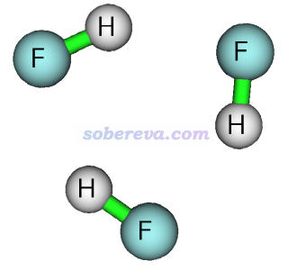
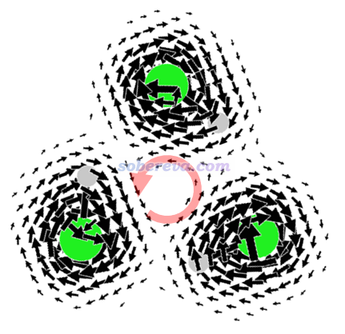
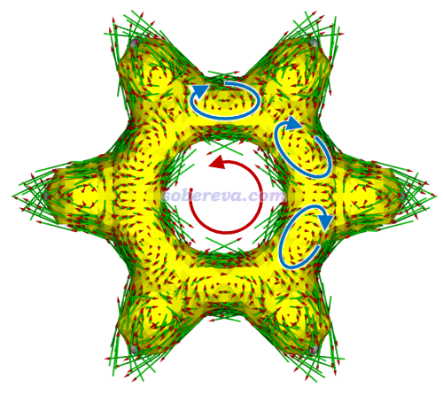
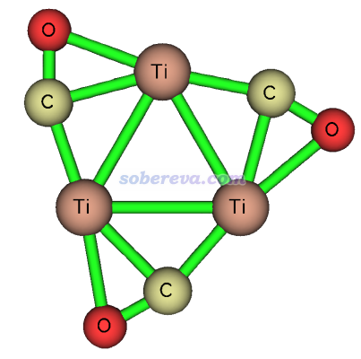
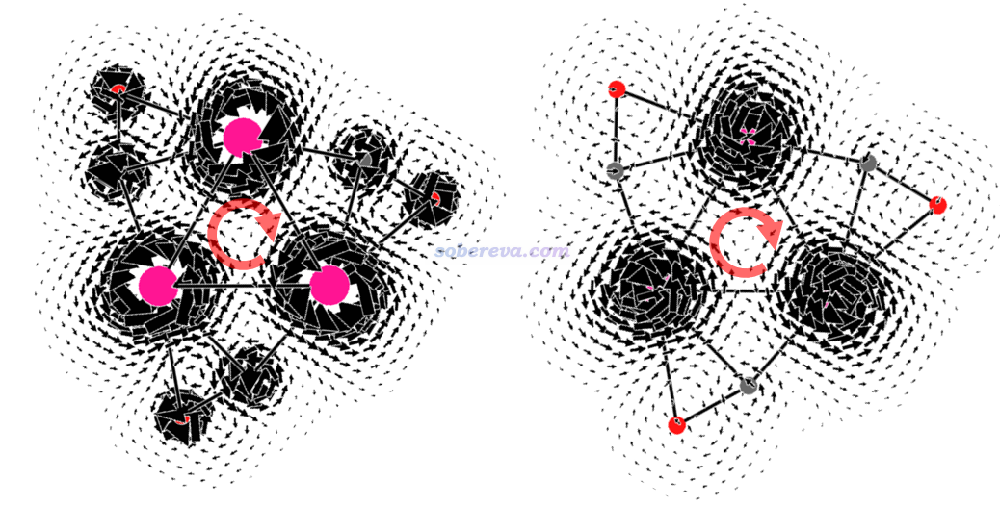
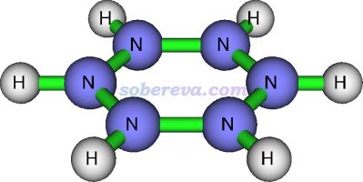
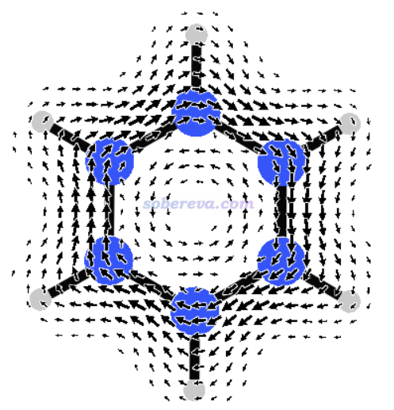
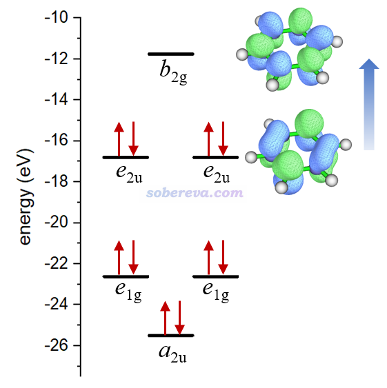
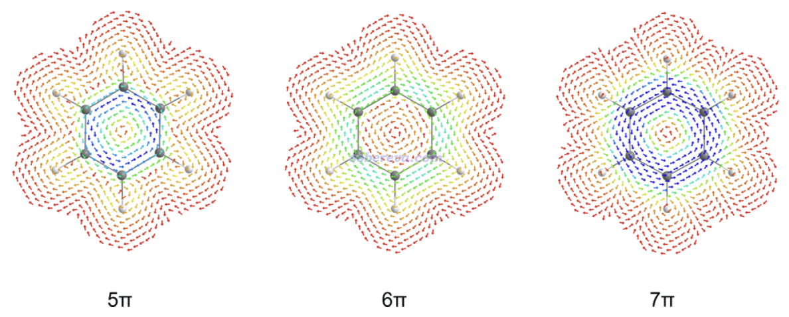
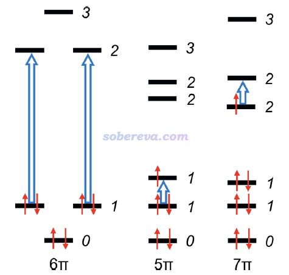

**使用NICS和磁感生电流考察芳香性时的一些易被忽视的重要问题**

文/Sobereva@[北京科音](http://www.keinsci.com)   2025-Jun-11

### 0 前言

NICS和磁感生电流是非常常用的磁响应性质一类的考察芳香性的方法，在《衡量芳香性的方法以及在Multiwfn中的计算》（<http://sobereva.com/176>）里有简要介绍并里面附了大量我写过的相关博文，而在“量子化学波函数分析与Multiwfn程序培训班”（<http://www.keinsci.com/WFN>）的“芳香性与离域性分析”一节里有极为全面深入的介绍。很多人对这两个方法在衡量芳香性方面的认识局限在：  
(1)NICS(1)ZZ约为0说明环是非芳香性，明显为负说明环是芳香性且越负芳香性越强，明显为正说明环是反芳香性且越正反芳香性越强。注意NICS的形式很多，这里仅以最常用的NICS(1)ZZ举例  
(2)感生电流的方向如果满足左手定则（diatropic电流），电流越大芳香性越强；如果与左手定则方向相反（paratropic电流），电流越大反芳香性越强。电流大小一般通过对键截面上的电流密度做积分来衡量，称为bond current strength (BCS)  
但实际上，仅光凭以上知识讨论芳香性或反芳香性，在一些情况下会得到不正确甚至严重错误的结论。在本文笔者介绍一些大多数人都普遍没有注意到的用NICS和感生电流讨论芳香性方面的重要问题。把这些问题都彻底搞清楚了，基于磁属性研究芳香性时就不惧审稿人comment了。

本文中的计算用的几何结构，若无专门提及，皆是B3LYP/6-31G*下优化的无虚频结构。

### 1 NICS、感生电流与HOMO-LUMO gap的关系

感生电流和NICS计算公式都涉及到对占据轨道和空轨道的循环，并且空轨道与占据轨道能量之差出现在分母项中，这一点看《深入理解分子轨道对磁感生电流的贡献》（<http://sobereva.com/703>）里的公式1、2、3便知。总的来说，HOMO-LUMO gap越大，空轨道与占据轨道整体能量差越大，导致NICS和感生电流越接近0。因此，如果两个体系的gap相差较大，不应直接凭NICS或BCS判断二者的芳香性强弱，还应该把gap差异对结果的影响考虑进去。在《深度揭示互为等电子体的苯、无机苯和carborazine的芳香性的显著差异》（<http://sobereva.com/731>）里介绍的笔者的Chem. Eur. J., 30, e202403369 (2024)一文中就注意到了这一点，文中研究的carborazine的HOMO-LUMO gap（7.30 eV）明显小于苯（11.20 eV）和无机苯（12.18 eV），因此文中提到：It is noteworthy that the aromaticity of carborazine compared to benzene and borazine is more or less quantitatively overestimated by the value of BCS and NICS。

4n电子的Huckel反芳香性体系的HOMO-LUMO gap比4n+2的Huckel芳香性体系的整体更小，Chem. Soc. Rev., 44, 6597 (2015)认为这是前者的BCS比后者更大的原因。例如反芳香性的环丁二烯和芳香性的苯在B3LYP/6-31G*级别算的HOMO-LUMO gap分别为3.692和6.800 eV，使用《使用SYSMOIC程序绘制磁感生电流图和计算键电流强度》（<http://sobereva.com/702>）介绍的SYSMOIC算出来的环丁二烯的BCS为-0.7941（长C-C键）和-0.7499 a.u.（短C-C键），而苯的C-C键的BCS大小则小得多，只有0.4216 a.u.。

如《正确地认识分子的能隙(gap)、HOMO和LUMO》（<http://sobereva.com/543>）所说，HF成份越低的泛函算出来的HOMO-LUMO gap越低，因此若发现HF成份低的泛函算出来的NICS和BCS的绝对值较大，大概率也是上述原因（但并非HF成份越低的泛函算出来的总是越大，因为泛函的差异还影响到其它方面）。

### 2 NICS的环尺寸的依赖性

原理上，感生电流比NICS判断芳香性更合理，因为NICS对环尺寸有依赖性。虽然有的文章说NICS的环尺寸依赖性弱，但那往往只是对较小的环之间对比做的结论，再加上本身不同体系的芳香性就有所不同，令那种说法更不确切。

电流对特定位置产生的磁场可以用Biot–Savart方程得到。如果是环形电流，则在环中心产生的磁场为μ0*I/(2*R)，其中μ0是真空磁导率，I是电流大小，R是环的半径，更多信息见<https://en.wikipedia.org/wiki/Biot%E2%80%93Savart_law>。因此，对芳香性的情况，当感生电流相同时，对应芳香性的环形路径整体半径越大、原子距离环中心整体越远，在环中心产生的磁屏蔽效果就越弱、NICS的绝对值越小。如果认为感生电流I的大小是芳香性强弱的准确体现，那么显然用NICS对比环尺寸明显不同的体系的芳香性的大小就是不甚严格的，因为对越大的环会越低估芳香性。所以，如果要基于磁属性对比明显不同大小的环的芳香性，建议用感生电流而非NICS说事。对于反芳香性，也有和上面完全类似的情况。

### 3 感生电流对积分截面的依赖性

对应芳香性的环上，如果只考虑对芳香性有贡献的电子的感生电流，原理上来说在垂直于键（更确切来说是垂直于电流方向）的各个截面上积分电流密度得到的BCS都应该是相同的。但实际得到的BCS没有这么理想化，环上的各个键的BCS往往不完全相同，在于：  
(1)积分的数值误差、有限的积分截面尺寸  
(2)积分截面可能并不严格垂直于电流方向  
(3)在一些键上存在方向彼此相反的感生电流的抵消作用，此效应对于多环芳烃等并环的情况尤为明显  
(4)环周围的原子的感生电流产生的干扰，以及环上原子的定域化的电子（内核电子、sigma电子、孤对电子等）产生的局部感生电流添乱，这导致计算的BCS对键上的积分截面位置的选取可能存在不可忽视的依赖性  
(5)基组不够完备，导致感生电流计算不够准确。对D2h点群的环丁二烯（反芳香性）极小点结构，用SYSMOIC在B3LYP/6-31G*下计算的短和长C-C键的BCS分别为0.7499和0.7941 a.u.，而基组用完备得多的def2-QZVP计算结果分别为0.7116和0.7111 a.u.，可见后者明显更等价

若发现要考察芳香性的环上的各个键的BCS不等价性不可忽视，可以取感生电流较明确、被上述的(4)干扰小的键的BCS作为环电流值衡量芳香性，或者对环上的键的BCS取平均作为环电流值（适合碳环、环丁二烯等情况）。此外，也可以尝试计算BCS时只考虑对芳香性有贡献的电子所占据的分子轨道，例如用感生电流研究pi芳香性时就只考虑pi轨道。

### 4 感生电流判断芳香性和反芳香性方面相对于NICS的优势

NICS很有可能给出关于芳香性错误的结论，不如观看和积分感生电流，以及观看《通过Multiwfn绘制等化学屏蔽表面(ICSS)研究芳香性》（<http://sobereva.com/216>）里介绍的ICSS图来得靠谱，这一节给出几个例子。

JCTC, 6, 1131 (2010)发现NICS用于考察氟化氢三聚体(HF)3的芳香性有问题。在wB97XD/def-TZVP下优化出的此体系的结构如下所示。凭基本常识就知道这个体系是非芳香性的，但是B3LYP/def2-TZVP算出来的NICS(0)ZZ为13.52 ppm，仿佛有显著反芳香性似的。不过NICS(1)ZZ为-0.04 ppm，这倒是正确体现出此体系并没有反芳香性。

为什么(HF)3的NICS(0)ZZ那么正？这可以从此体系所在平面上的感生电流图上理解，如下图所示（磁场垂直于屏幕向外）。可见此体系并没有形成环绕整体的感生电流，但由于存在环绕各个HF的sigma键的dia电流，导致在环中央区域呈现出等效的para电流的特征（红色箭头所示），使得环中央是去屏蔽的，因而NICS(0)ZZ为正。而由于这种效应在垂直于体系平面方向上衰减很快，因此NICS(1)ZZ几乎为0。这也体现出，对于小环体系，由于sigma键的感生电流产生的磁场离环中心太近，NICS(0)ZZ用来衡量芳香性是极差的做法。但对于18碳环及其等电子体B6N6C6这样的大环倒不是什么问题，因为局域的电子对应的局部的感生电流造成的磁场在环中心处都基本衰减没了，这也是为什么《18碳环等电子体B6N6C6独特的芳香性：揭示碳原子桥联硼-氮对电子离域的关键影响》（<http://sobereva.com/696>）介绍的文章中用了NICS(0)ZZ讨论。

实际上对于苯分子也有类似情况。下图是苯分子的pi以外的电子产生的感生电流图，可见由于局域的sigma电子产生的局部dia电流的存在，在环中心也有等效的para电流（红色箭头所示）并使得环中心产生磁去屏蔽效应。不过由于苯的pi电子造成的全局的dia电流在环中心产生的磁屏蔽效应远强于para电流的磁去屏蔽效应，因此苯的NICS(0)ZZ还是负值。

我极其推荐阅读《使用Multiwfn绘制一维NICS曲线并通过积分衡量芳香性》（<http://sobereva.com/681>）中的讨论，了解sigma和pi电子对NICS_ZZ的贡献在垂直于环方向上的变化特征。

《18个氮原子组成的环状分子长什么样？一篇文章全面揭示18氮环的特征！》（<http://sobereva.com/725>）里介绍的我的ChemPhysChem, 25, e202400377 (2024)文章中，对18氮环的最稳定构型计算了NICS(0)ZZ，为3.42 ppm，也是表面上体现出了轻微的反芳香性。然而通过ICSS等值面图和AICD感生电流图，都充分确认了此体系没有芳香性或反芳香性特征，详见博文里的图。这也是个很好地体现NICS(0)ZZ展现（反）芳香性不靠谱的例子。

NICS亦有可能把非芳香性体系误判成芳香性的。Theor. Chem. Acc., 134, 8 (2015)指出NICS衡量很多过渡金属团簇的芳香性也是不合理的。其中一个例子是如下所示的Ti3(CO)3。基于PCCP, 13, 4576 (2011)的SI里给出的BP86/6-311+G(d)级别下优化的结构，我用PBE0/def2-TZVP算出的NICS(0)ZZ和NICS(1)ZZ分别是-141.1和-11.7 ppm，乍看起来明显芳香性。

下图左侧和右侧分别是Ti3(CO)3的分子平面上和分子平面上方1埃处的感生电流，数值过大的部分截掉了，粉色大圆球是Ti，磁场垂直屏幕向外。由图可见，无论是在分子平面上还是在其上方1埃处，都有显著的环绕Ti原子的para电流，很大程度等效带来了在环中心及其上方的dia电流的效果（红色箭头所示），即令环中心及其上方一定区域都是磁屏蔽的，这是NICS(0)ZZ和NICS(1)ZZ都为负值的原因。然而从图上并没有看到环绕整体的连贯的感生电流，因此Ti3(CO)3就是非芳香性的。可见此例不仅NICS(0)ZZ，连NICS(1)ZZ都误判了芳香性。

### 5 显著且连贯的dia感生电流未必能证明有明显的芳香性

从上一节看到，感生电流判断芳香性比个别位置的NICS更为严格且直观，但即便是感生电流，也未必总能正确衡量芳香性，这里以[N6H6]2+体系为例进行说明，更多讨论见ChemistrySelect, 2, 863 (2017)。下图展示了此体系的平面构型

此构型并不是极小点，而是有很多破坏平面的虚频，并且其能量甚至比其开环后的线型结构的还要高，因此明显没有芳香稳定化作用。用Multiwfn计算出它的多中心键级几乎为0（0.00035），也进一步体现出没有pi共轭。如果用《在Multiwfn中单独考察pi电子结构特征》（<http://sobereva.com/432>）的做法绘制它的LOL-pi图，也会看到各个氮都有定域的孤对电子，根本没有像苯的pi电子一样在环上充分离域。然而，下图所示的[N6H6]2+平面构型的分子上方1埃处的感生电流（磁场垂直于屏幕向外）则是完全顺时针的dia电流，和具有显著芳香性的苯的情况看起来完全一样！

为什么[N6H6]2+的平面构型不是极小点？这是因为如下图的轨道占据情况所示，尽管此体系表面上有10个pi电子，看似满足Huckel的4n+2芳香性规则因而芳香性会使此构型被稳定化，但e2u对称性的轨道的反pi特征显著（对于苯来说是没有占据的），因此pi共轭作用很弱，再加上如此众多的孤对电子间的强烈互斥作用，显然令其极不稳定。

为什么[N6H6]2+的平面构型像普通芳香性体系一样有显著的贯穿整个环的dia电流？这需要利用《深入理解分子轨道对磁感生电流的贡献》（<http://sobereva.com/703>）里介绍的知识，没看过者强烈建议认真阅读。此文说了，感生电流可视为由各种占据轨道向各种空轨道跃迁所贡献，上图蓝色箭头标注的跃迁是此结构下对感生电流贡献最大的跃迁（因为这种跃迁能最小），其中非占据的b2g轨道比占据的e2u轨道轨道多一个节面，这种跃迁是平动允许的，因此对dia电流有贡献。这和造成苯分子的dia电流的机制是完全相同的，只不过苯分子的dia电流主要是e1g到e2u跃迁所贡献的。

由此例可见，光靠是否存在全局的dia感生电流判断芳香性并不总是可靠！因为这种电流是否存在，和体系是否真的有芳香性特征并没有内在的必然联系，而与它关系真正最直接、最紧密的是轨道的对称性特征！

可能大多数人觉得，有芳香性的体系有满足左手定则的dia电流的原因在于：某个环有芳香性意味着环上有明显离域的电子，因此在外磁场的作用下会像经典电磁学描述的导体一样在环上产生dia电流。但实际上真正本质并非如此，不能忽视关键性的量子力学效应！一般的芳香性体系有dia电流实际上是一个表象，在于它们的轨道对称特征和跃迁正好能满足产生显著dia电流的条件，而能产生显著dia电流的并非只有芳香性体系。因此，要这样认为：有显著的贯穿整个环的dia电流是这个环具有芳香性的必要非充分条件。

由于磁屏蔽特征是感生电流的进一步衍生属性，[N6H6]2+的平面构型既然都和苯一样具有相同感生电流特征了，其自然NICS(0)ZZ和NICS(1)ZZ也都为负，分别为-178.1和-24.6 ppm。

此例彰显出判断芳香性最好不要光基于磁属性，即便这种判断芳香性的做法极为流行。同时结合多中心键级等基于电子结构的方法，以及结合芳香稳定化能或离域化能这种能量层面的方法，结论会更可靠、更有说服力。本节的[N6H6]2+的例子也体现出，形式上满足4n+2规则的体系未必真的有芳香性，若电子都没法在环上充分离域、不构成共轭体系，满足4n+2也仍是非芳香性的。

### 6 显著且连贯的para感生电流未必能证明有明显的反芳香性

J. Org. Chem., 88, 14831 (2023)通过一系列分子指出，即便环上存在显著且连贯的para电流，也未必能可靠地证明这个环就有明显的反芳香性。这一节就用其中最简单的体系，苯+1电荷的阳离子自由基（具有5个pi电子）和-1电荷的阴离子自由基（具有7个pi电子）来说明这一点，这种体系的（反）芳香性没法基于经典的Huckel规则判断。

如下所示，JOC文中给出了苯阳离子、中性苯、苯阴离子的分子平面上方1 Bohr处的感生电流，磁场垂直于屏幕向外，计算用的是对各自状态优化的几何结构，电场强度越大箭头越蓝、越小越红。可见，苯阳离子和苯阴离子在碳环上方的电流都是逆时针的para电流，与中性苯的情况相反，乍看起来苯的阴、阳离子都是显著反芳香性的。

然而，JOC这篇文章计算了苯的阴、阳离子的芳香稳定化能（用到的反应见文章的SI），发现这两个体系是有芳香稳定化作用的，因此从能量角度来说是有芳香性的。我还通过Multiwfn在文中给的苯离子的极小点结构下在B3LYP/6-31G*级别计算了六中心键级，苯的阳离子和阴离子的结果分别为0.044和0.045，只有中性苯的0.086的约一半。具体来说，苯阳离子和阴离子的六中心键级分别几乎来自于alpha和beta电子的贡献（且和中性苯的相应自旋电子的贡献差不多），而另一个自旋几乎没贡献。也就是说，相对于苯，离子状态下电子数改变1的那个自旋的电子对芳香性没明显贡献，而电子数未变的自旋的电子对芳香性的贡献基本保持不变。

由于从能量和电子结构角度都确认了苯的阴、阳离子是芳香性的，那么为什么它们的感生电流是para的，显得像普通反芳香性体系一样？JOC文中给了下面的图对感生电流进行了解释。由于Jahn-Teller效应，阳离子（5π）和阴离子（7π）体系的对应于苯的二重简并的pi轨道发生了轻微分裂。图中蓝色大箭头标注了对感生电流产生主导的跃迁。对苯离子体系的情况，由于能级分裂造成的能量差较小，明显小于1→2的跃迁，因此对阳离子和阴离子分别是1→1和2→2跃迁对感生电流产生了主导性的贡献。由于这种跃迁涉及的两个轨道的节面数相同，是转动允许的，因此如《深入理解分子轨道对磁感生电流的贡献》所述，贡献的是para电流。

由本节和上一节的例子可见，虽然感生电流对大多数体系判断芳香性是合理的，而且比起只看个别位置的NICS_ZZ可靠不少，但在极个别体系上还是能暴露出其局限性。因此若有可能，除了基于磁属性分析外，还是建议再结合一两种靠谱的手段，特别是可靠又容易计算的多中心键级，来衡量芳香性，减少误判芳香性、被审稿人怼的可能（本来芳香性这方面的“说法”和“观点”就相当多）。

但也没必要盲目用过多的方法衡量芳香性，否则一方面太冗余，另一方面本身有的芳香性指标就不那么靠谱、普适，纳入讨论反倒无益于揭示芳香性的真相。有文章认为键的均衡化、出现dia和para的感生电流，属于芳香性的二阶（次级）特征，而能量的稳定化和电子的离域，才算是芳香性的一阶（即最关乎本质的）特征，这个观点我是认可的。
