**深入探究18碳环与碱金属离子复合物的结构、相互作用与光学性质**

文/Sobereva@[北京科音](http://www.keinsci.com)  2025-Aug-30

## 1 前言

18碳环自从2019年在NaCl覆盖的Cu表面上被合成并观测到后，由于其独特的几何和电子结构，引发了理论化学家们的巨大关注并做了大量研究，研究也已逐渐扩展到其它尺寸的碳环以及碳环的衍生物、复合物。独特的18碳环与不同碱金属离子形成的结构是什么样，具有什么性质，是明显非常有意思、很值得探究的问题。

近期，北京科音自然科学研究中心的卢天和江苏科技大学的刘泽玉等人对18碳环与Li+、Na+、K+、Rb+、Cs+形成的复合物的各方面特征做了极为全面的研究，包括几何结构、结合强度、电荷分布、相互作用物理本质、光学吸收、非线性光学性质等。此研究对于将碳环类物质用于碱金属离子储存材料、构建光电材料等方面都有显著的指导意义。非常欢迎阅读此论文以及引用：

Yang Xiao, Xia Wang, Xiufen Yan, Zeyu Liu,* Mengdi Zhao,* Tian Lu*, Structure and Optical Properties of Alkali-Metal Ion (Li+, Na+, K+, Rb+, and Cs+) Endohedral Cyclo[18]carbon, *ChemPhysChem*, **26**, e202500009 (2025) <https://doi.org/10.1002/cphc.202500009>

此文章可以通过此链接免费阅读：<https://onlinelibrary.wiley.com/share/author/YZFCSBHKXAUFBD5NNJBU?target=10.1002/cphc.202500009>

此文还被选为期刊的当期封面文章：

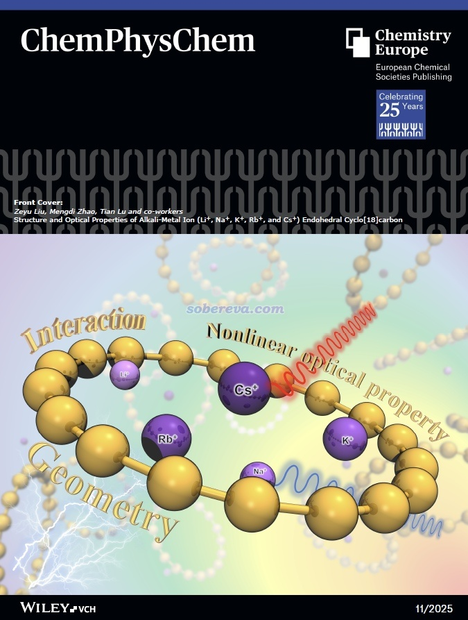

同作者之前对碳环类体系已经做过十分广泛、全面的理论研究并发表过大量研究论文，完整汇总见<http://sobereva.com/carbon_ring.html>，里面还包含许多论文的评述、解读和附加讨论，欢迎查看。

下面，本文将对前述研究工作的内容的关键部分做简要介绍，使得读者快速、容易地理解文章主要内容，并对一些研究细节做附加说明。更具体的分析讨论请读者看完本文后阅读原文。此文研究的体系用M+@C18来表示，其中M+为Li+、Na+、K+、Rb+、Cs+。同作者还另有两篇论文与本文关系很大，《理论设计由18碳环与锂原子构成的电场可控的光学开关》（<http://sobereva.com/630>）介绍的论文中考察了Li@C18，研究的侧重点是外场诱导Li原子在环内外的切换带来的效应，而《一篇文章深入揭示外电场对18碳环的超强调控作用》（<http://sobereva.com/570>）介绍的论文中考察了Na+和Mg2+与18碳环的复合物，讨论了这两种离子对18碳环产生的外电场效应。

## 2 M+@C18的几何结构

此文通过Gaussian 16使用在ωB97XD/ma-TZVP级别下优化了各种M+@C18的无虚频结构（坐标在文章的补充材料里提供了），如下所示。俯视图和侧视图都给出了，同时考虑了M+在环内和环外两种结合构型。可见除了半径最大的Cs+结合在环内的情况时体系不是纯平面外，所有结构都是纯平面的。只有正电荷密度最高且半径最小的Li+、Na+结合在环内时令碳环的结构的变形肉眼可见，其它情况碳环依然保持像孤立状态一样的圆形。

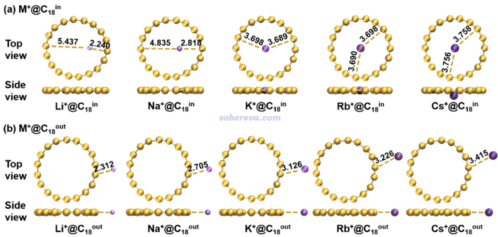

文章使用ORCA程序在明显更高级的ωB97X-V/def2-QZVPP级别下对这些结构又计算了电子能量，并且结合上述级别的振动分析得到的自由能热校正量，计算了M+结合在碳环内和碳环外的自由能之差ΔG，并根据ΔG=-RTlnK计算了常温下的平衡常数K，如下所示。可见随着碱金属原子序数的增大，碱金属离子明显越来越倾向于结合在环内。这是因为周期越靠后的碱金属离子结合在环内时与碳环的色散作用越强，而结合在环外时这种效应虽然也有但没那么显著，毕竟结合在环内时碱金属离子能和所有碳原子较近接触，而结合在环外时只能接触一部分，且色散作用随作用距离衰减又很快。由于碱金属离子结合在碳环内的比率占绝对主导，因此后文不再考虑结合在环外的构型。

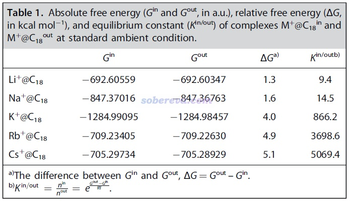

此文还计算了M+的原子电荷，确认了M+@C18中M几乎完全带一个正电荷，即18碳环上的电子向M+的转移/离域微乎其微，18碳环几乎完全处于电中性。而且还发现M+与碳环中碳原子的Wiberg键级数值甚微（尤其是半径大、极化作用弱的K+、Rb+、Cs+的情况），体现出M+与碳环之间的轨道相互作用甚微。如果你不了解键级的话，可参考《Multiwfn支持的分析化学键的方法一览》（<http://sobereva.com/471>）中的相应部分。

## 3 M+与18碳环的结合作用

利用Multiwfn程序，此文使用了我提出的非常流行的可视化展现片段间相互作用的IGMH方法以展现M+与18碳环的相互作用，IGMH方法定义的δg_inter=0.001 a.u.函数的等值面见下图，等值面的着色变化使用IGMH方法的标准色彩刻度。IGMH方法的介绍见《使用Multiwfn做IGMH分析非常清晰直观地展现化学体系中的相互作用》（<http://sobereva.com/621>）。由此图可以十分直观地看出不同碱金属离子与碳环的最主要作用区域。Li+和K+由于半径较小，因此在环内吸附时只与一部分碳原子有明显的相互作用，而K+、Rb+、Cs+与碳环的作用区域基本没区别，都是能同时与所有碳原子等同地作用。这些图的作用区域的等值面颜色都为绿色，体现出这些区域的电子密度都很低，这主要在于M+与碳原子之间共价作用甚微。

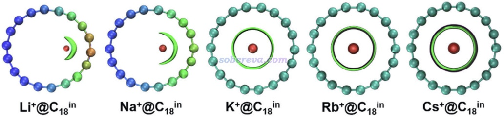

文章表S3给出了不同M+与18碳环的基于电子能量计算的相互作用能（ΔE_int）、结合能（ΔE_bind），以及标况下的结合自由能（ΔG_bind），如下所示，单位是kcal/mol。它们之间的关系介绍和相关讨论见《谈谈分子间结合能的构成以及分解分析思想》（<http://sobereva.com/733>）。从相互作用能来看，M+与碳环结合强度是Li+ >> Na+ > K+≈Rb+≈Cs+。后三者与碳环作用强度相仿佛这一点和上面的IGMH图展现的情况一致。ΔE_bind和ΔE_int之间相差片段的变形能，可见只有Li+和Na+的情况造成18碳环在结合M+时有不可忽视的变形能，这和之前给出的结构图相对应，即只有Li+@C18和K+@C18中碳环偏离圆形是肉眼能明显察觉的。由于结合时的熵罚效应，标况下的ΔG_bind没有ΔE_bind那么负，但它们对于不同M+@C18的变化趋势是一致的。ΔG_bind都为明显负值，体现出标况气相下碱金属离子与碳环的结合在热力学上是充分自发的。

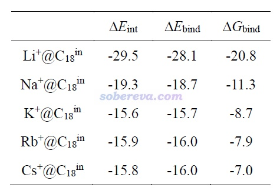

为了进一步剖析为什么不同的碱金属离子与18碳环结合作用存在差异，文中做了能量分解，结果如下所示。能量分解的相关常识见《使用sobEDA和sobEDAw方法做非常准确、快速、方便、普适的能量分解分析》（<http://sobereva.com/685>）及里面提及的文章。可见Li+、Na+与碳环相互作用之所以显著强于更重的碱金属离子，关键在于它们的诱导项明显更大，即对碳环的极化作用明显更强。而K+、Rb+、Cs+由于原子半径明显更大、正电荷密度更小，因此极化能力弱得多，诱导项没那么负。还可以看到，周期越靠后的碱金属离子与碳环的色散作用越强，这在于同一族里周期表越靠后的元素极化率整体越大。然而，由于交换-互斥项也是随着碱金属离子周期越往后越大，和色散项产生了很大程度抵消，这导致K+、Rb+、Cs+和碳环的相互作用强度恰好都相仿佛。至于静电作用项，无论是哪种M+@C18，其起到的作用都微乎其微，这主要在于M+@C18体系中18碳环不仅净电荷基本为0，而且18碳环也不具备明显的极性。18碳环的极性问题在笔者的Carbon, 171, 514 (2021)论文里有专门的讨论。

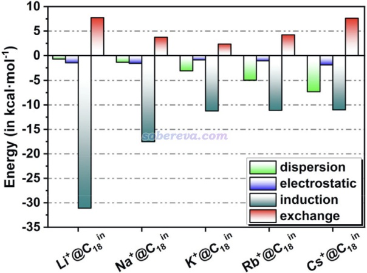

## 4 M+@C18的光学吸收

此文对不同的M+@C18通过TDDFT在ωB97XD/ma-TZVP级别下计算了UV-Vis光谱，如下图所示。可见每个体系只有两个有明显光学活性的电子激发，碱金属离子的种类对于吸收光谱并没什么明显影响，都是仅在紫外区域有显著的吸收，这一点和孤立的18碳环很像，孤立的18碳环的电子光谱在Carbon, 165, 461 (2020)中笔者专门做了详细的研究。

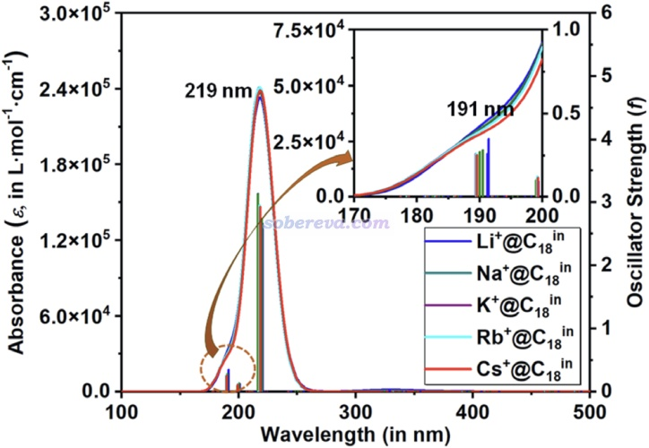

文中还使用我提出的电荷转移光谱（CTS）方法考察了电子光谱的本质特征，在补充材料的图S1给出了。CTS方法的介绍见《使用Multiwfn绘制电荷转移光谱(CTS)直观分析电子光谱内在特征》（<http://sobereva.com/628>）。由CTS图可以看出M+@C18的电子光谱几乎完全来自于碳环部分的局域激发，而碳环与M+之间的电荷转移激发只对光谱起到了微量的贡献。因此，碱金属离子的存在并不会对碳环的电子光谱的本质产生显著影响，只不过其带来的外势会多多少少对碳环的光谱造成一些定量层面的影响。

为了更清楚展现M+@C18有光学活性的电子激发的本质特征，此文按照《使用Multiwfn做空穴-电子分析全面考察电子激发特征》（<http://sobereva.com/434>）介绍的方法绘制了此类体系的振子强度明显大于0的两个激发态的空穴和电子等值面，在下图里分别对应绿色和蓝色，这种分析远比看分子轨道图像来考察充分全面得多（当前这些激发每个都有4对MO跃迁有显著贡献，因此观看MO很不方便考察）。可见空穴和电子都分布在碳环部分，而且空穴和电子的等值面都同时环绕C-C键轴，因此电子激发同时具有平面内和平面外pi-pi激发特征。更仔细看的话还会发现这些激发的空穴主要分布在较短的C-C键上，而电子主要分布在较长C-C键上，即这些激发具有较短C-C键的pi电子向较长C-C键的非占据pi轨道跃迁的特征。

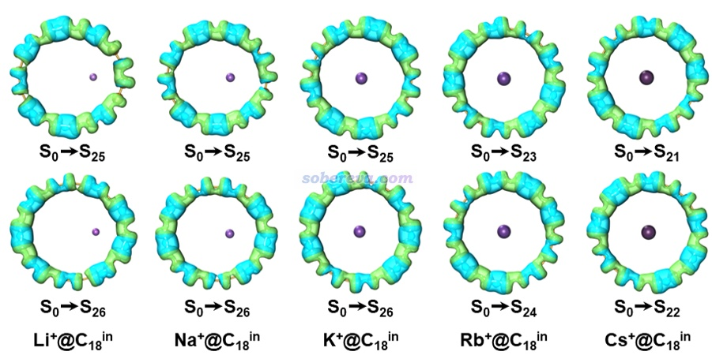

## 5 M+@C18的（超）极化率

极化率和超极化率是描述化学体系对外电场响应的关键的量，超极化率特征直接决定了体系用于非线性光学材料的可能性。此文用ωB97XD基于CPKS方法解析计算了M+@C18的极化率（α）和第一超极化率（β），并计算了半数值的第二超极化率（γ），所考察的具体指标都可以用《使用Multiwfn分析Gaussian的极化率、超极化率的输出》（<http://sobereva.com/231>）介绍的方法基于Gaussian的polar任务的输出文件用Multiwfn获得。由于超极化率的准确计算对基组的弥散函数要求很高，为了得到尽可能准确结果，此文使用了很大的对每个角动量带两层弥散的d-aug-cc-pVTZ基组，对于此基组没定义的元素则使用d-aug-cc-pVTZ-PP赝势基组。

静态外场下计算的（超）极化率的结果如下图所示

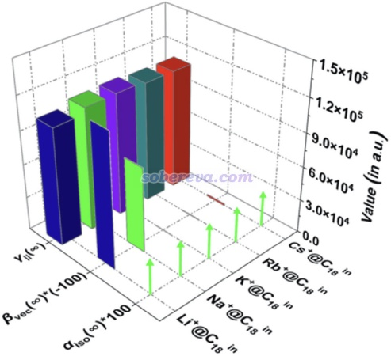

由上图可见，碱金属离子的类型对体系的极化率和第二超极化率并没什么影响，但是第一超极化率的差异特别明显。Li+的βvec很显著，Na+略逊一些但也很大，这是因为如之前的结构图所示，只有这两个体系在环平面内偏离中心对称性明显。K+@C18和Rb+@C18的βvec都精确为0，这是因为它们都是精确的中心对称体系。Cs+@C18虽然βvec不为0但数值也很小，这是因为它仅仅在垂直于碳环的方向上轻微偏离中心对称性。

动态外场下的（超）极化率的计算结果如下图所示，可见外场波长越短、频率越高，对应的（超）极化率越大，即当前体系有明显的频率-色散效应。

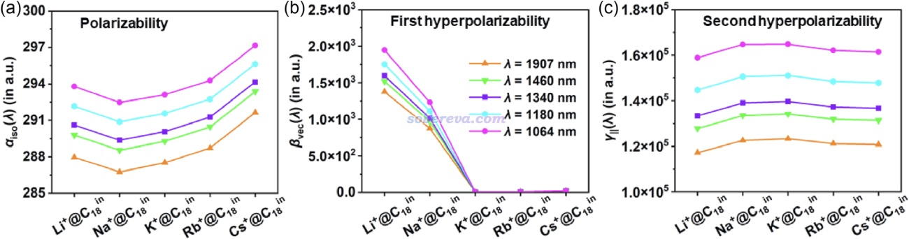

为了对M+@C18的（超）极化率的本质特征了解得更充分，此文对Li+@C18还按照《使用Multiwfn极为方便地绘制(超)极化率密度和三维空间对(超)极化率的贡献》（<http://sobereva.com/683>）和《使用Multiwfn计算（超）极化率密度》（<http://sobereva.com/305>）介绍的方法绘制了（超）极化率密度图，如下所示。可见在所有图中Li上面几乎都没有等值面出现，直接体现了Li+对于（超）极化率没有任何贡献，这主要也是在于它没有价电子，只剩电子被束缚得很紧的内核部分，自然对外场的响应微乎其微。

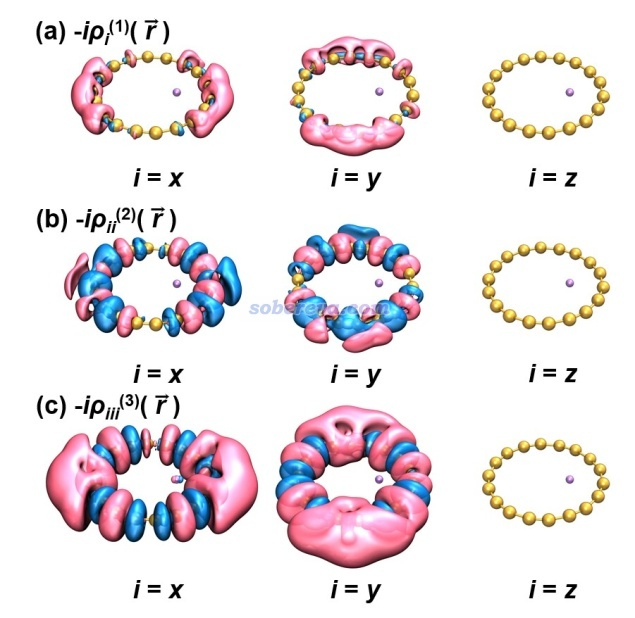

文中还对Li+@C18绘制了单位球面表示法的图像，这对于考察（超）极化率的各向异性很有价值，绘制方法和分析方式见《使用Multiwfn通过单位球面表示法图形化考察（超）极化率张量》（<http://sobereva.com/547>）里的介绍。如下图可见，对于极化率和第二超极化率来说，分子平面内的分量远大于垂直于分子平面的分量，这来自于环平面内碳环具有大范围全局pi共轭特征；另外，在分子平面内Li+@C18对外场的响应几乎是精确各向同性的。第一超极化率在垂直于环平面方向上精确为0，而在环平面内的分量则十分显著，完全平行于碳环被拉长的方向，这也正是体系偶极矩的方向。

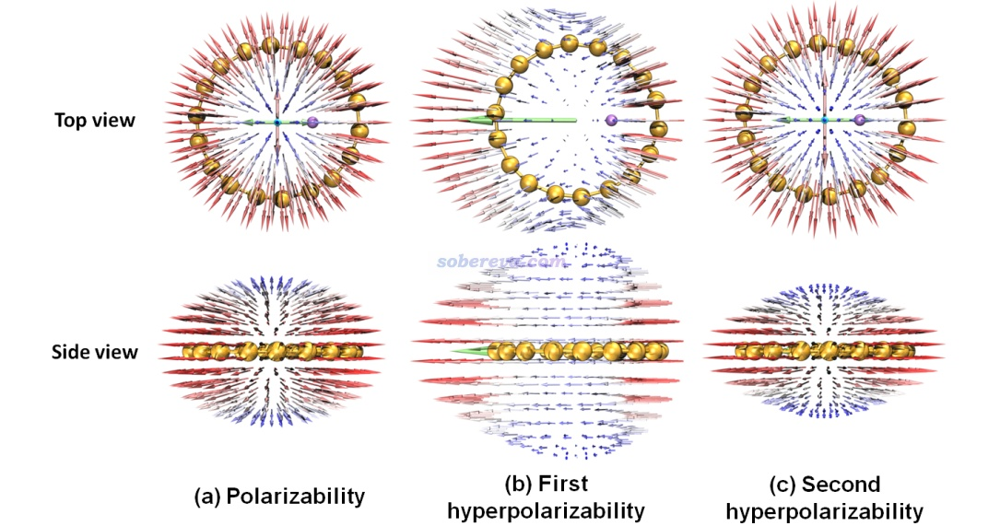

## 6 其它

为了回应审稿人要求考察计算结果受泛函影响的要求，文中还给出了下图，全面对比了ωB97XD的结果和计算（超）极化率常用的BHandHLYP和CAM-B3LYP的计算结果。可见泛函的选择虽然会产生一些定量影响，但不同泛函算出来的不同的量之间的差异趋势是完全相同的，无疑当前文中的结论是可靠的。

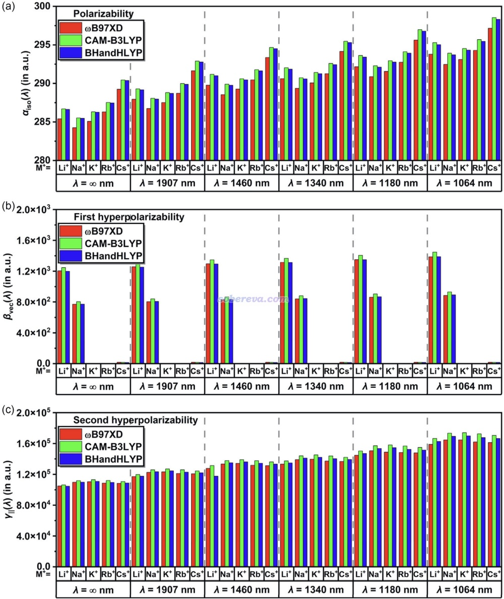

极化率同时由电子和核振动共同贡献，通常只讨论前者，因为绝大多数情况下它占主导，而后者的贡献虽然通常较小但也值得了解。此文对不同的M+@C18也计算了振动极化率，如下所示，振动对极化率的贡献的比例确实相当小，仅有百分之几，极化率几乎都来自于电子分布对外场的响应。

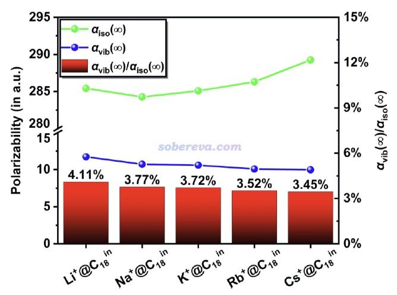

## 7 总结

从以上信息可以看到，通过量子化学计算与波函数分析手段，ChemPhysChem, 26, e202500009 (2025)这篇文章对18碳环与不同碱金属离子的复合物做了十分全面的理论研究，既拓展了化学家们对18碳环的认识，也对18碳环及衍生物在未来的潜在应用提供了很有价值的参考，文中的研究方式也值得在其它类似的研究中借鉴。如果你对碳环相关的非线性光学特征感兴趣，建议阅读《全面揭示各种尺寸的碳单环体系的独特的光学性质》（<http://sobereva.com/608>）、《从18碳环的硼氮取代物中理论筛选出具有优异光学性质的分子：一篇CEJ期刊文章介绍》（<http://sobereva.com/742>）、《深入揭示18碳环的重要衍生物C18-(CO)n的电子结构和光学特性》（<http://sobereva.com/640>）了解更多信息。
