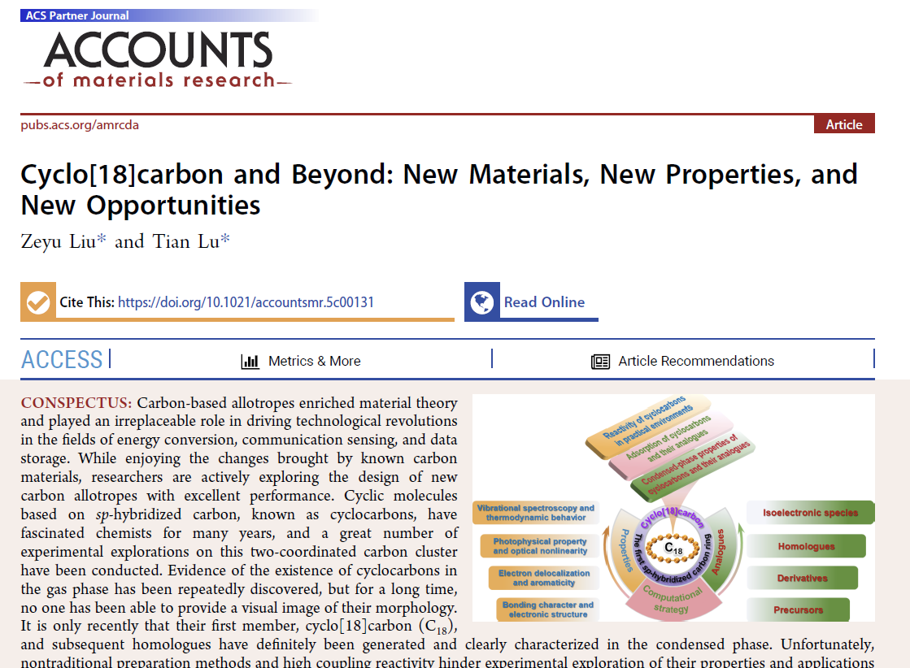

**18碳环及衍生物的十分全面系统的研究综述已在Acc. Mater. Res.期刊发表！**

文/Sobereva@[北京科音](http://www.keinsci.com)  2025-Aug-29

  
  

自2019年18碳环（cyclo[18]carbon）首次在凝聚相中的观测被报道后，目前已经有约200篇和碳氮环有关的研究文章诞生。北京科音的卢天和江苏科技大学的刘泽玉等人到目前为止已经共同发表了20多篇和碳环有关的纯理论研究文章，内容充分涵盖了碳环的各个方面，包括化学键、电子离域、基态与激发态的芳香性、分子振动特征、环张力能、光学吸收，非线型光学性质、弱相互作用、外电场的影响、硼-氮掺杂效应、引入外部基团效应，等等，研究汇总见[**http://sobereva.com/carbon_ring.html**](http://sobereva.com/carbon_ring.html)，此网页中还包含了笔者对很多研究论文写的深入浅出的介绍和重要的附加说明、讨论。

这些研究工作无疑非常值得进行系统性的总结。近期，卢天和刘泽玉在美国化学会的Accounts of Materials Research期刊上共同发表了名为**Cyclo[18]carbon and Beyond-New Materials, New Properties, and New Opportunities**的文章，访问地址：[**https://doi.org/10.1021/accountsmr.5c00131**](https://doi.org/10.1021/accountsmr.5c00131)，目前可以免费阅览，欢迎阅读和引用！此综述对于希望一次性较为完整、系统地了解碳单环各方面主要特征的研究者来说极具价值，也非常适合作为踏入碳环研究领域的人第一篇阅读的文章。此文除了对作者的理论研究工作做系统总结外，对于碳环研究的历史、实验方面的背景信息也都做了介绍，并且还对未来碳环体系的进一步研究指出了方向。

由于此期刊对篇幅的严格限制，因此此文着重综述作者的包含18碳环在内的碳单环体系以及其衍生物方面的工作，而碳环与其它物质（如小分子、富勒烯、碱金属离子、超碱原子、8字形双环主体分子）形成的复合物的大量研究工作将在未来另文综述。
