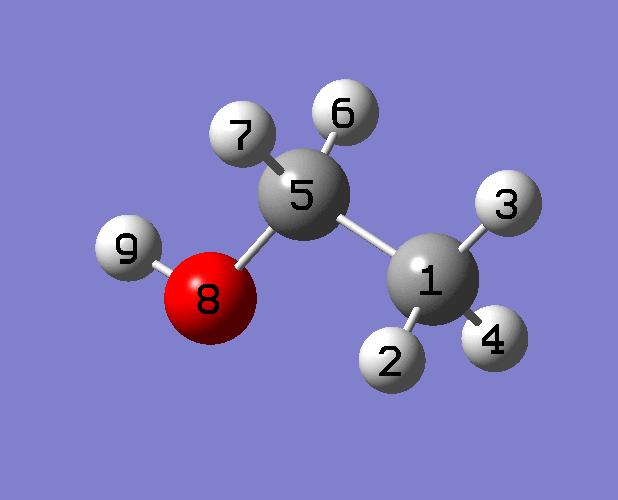

**Potential energy distribution (PED)计算软件GAR2PED使用简介**Introduction to the use of potential energy distribution (PED) calculation software GAR2PED  
  
文/Sobereva @[北京科音](http://www.keinsci.com)  
First release: 2010-DEC-8  Updated: 2013-Apr-15

  
  

## PED简介：

每种特征基团都有其特有的振动方式，比如甲基有对称伸缩、摇摆、对称弯曲等，这些基团的振动模式一般在不同分子中都有保守性。然而，它们在分子中并非孤立的，会与分子环境发生耦合，各种振动模式相互混合导致原有振动频率和振动模式都发生变化。基团特征振动模式不会明显受与之距离较远原子的影响，与基团相连的原子若与基团内原子质量差异大或振动模式力常数差异大，基团振动模式仍然保持较好独立性。然而，当与基团相连的原子质量相近且振动模式力常数亦相近，振动的耦合就相当明显，这种情况下分析分子简正振动模式往往有很大困难，从复杂的振动向量上无法直接指认出振动模式的归属、究竟属于哪个基团、哪类振动。PED(Potential energy distribution)是将简正振动模式分解的分析方法，可以获得每种基团特征振动模式产生的贡献，比较它们的百分比可以容易地了解简正振动模式的本质特点，由哪种特征振动模式所主导。基本原理如下：  
  
存在这样的关系：Λ=L^(T)FL。其中F是力常数矩阵，L是F的本征向量矩阵，它的第N列就是第N个简正振动向量。L^(T)是L的转置。Λ是对角矩阵diag(λ1,λ2...)。即是说，将内坐标变换为简正振动坐标Q后，力常数矩阵成为对角矩阵，其元素λ_N就是简正振动模式N的力常数。根据谐振势模型，V(Q_N)=0.5*Q_N^2*λ_N。将λ_N明确写成分量加和形式，即  
λ_N=Λ(N,N)=∑[i]∑[j]L^(T)(N,i)F(i,j)L(j,N)=∑[i]∑[j]F(i,j)L(j,N)L(i,N)  
其中，只有i=j的贡献才是最主要的。因此，通过比较每个内坐标i的力常数对λ_N的贡献量F(i,i)L(i,N)^2就可以了解哪个内坐标对第N种简正振动模式有主要贡献，一般通过百分比来表达，即η(i,N)=F(i,i)L(i,N)^2/(∑[j]F(j,j)L(j,N)^2)*100%。若不用内坐标，而改成以基团特征振动向量作为基，得到的就是各个基团各种特征振动模式对简正振动模式的贡献百分比。  
  
做PED分析软件有不少，如VEDA、MOLVIB、BIOVIBAN、VIBRATZ、RAMVIB、nmodes、FCART01等。这里介绍的GAR2PED可以免费获得，下载地址：<http://www.ccl.net/cca/software/SOURCES/FORTRAN/gar2ped/gar2ped.tar.Z>  
  
GAR2PED是读取Gaussian的Freq任务的archive信息（即末尾输出的很紧凑的那部分）来计算PED等信息的工具。由Martin和Alsenoy于1995年开发，最重元素支持到Br。程序最初给Gaussian94用，由于现在的Gaussian功能已经扩充了，以及有了Gview，GAR2PED输出的很多信息已经意义不大，这个程序目前的用处主要就是计算PED了。程序可以兼容最新的Gaussian09。  
  

## 编译：

GAR2PED用Linux下的一些编译器不好编译。用CVF6.5编译则很简单，把所有.f文件（除了pullarc.f）加入工程里然后编译，结果命名为gar2ped.exe。再把工程清空，将pullarc.f放进工程里，编译结果命名为pullarc.exe。  
  
注意！如果用于Windows版Gaussian结果分析，要把pullarc的line29的1\\1\\改为1|1|。因为Windows版Gaussian的archive部分每项使用|分隔而不是\来分隔。  
  
我用CVF6.5编译好的Windows版（pullarc.exe编译前已改为1|1|），下载地址：[/usr/uploads/file/20150609/20150609192457_70016.rar](http://sobereva.com/usr/uploads/file/20150609/20150609192457_70016.rar)。  
  
  

## 运行方法（对于我编译的版本而言）

对于Windows版Gaussian：将Gaussian的Freq任务（无需#P。另外不要把opt和freq任务和在一起执行）的运行结果命名为比如叫test.log，放在pullarc.exe所在目录下，运行pullarc test。pullarc程序会读取test.log，如果屏幕上正确显示出archive信息的第一行，就输入y，将得到test.xyz（分子结构的笛卡尔坐标）和test.arch。然后把test.arch里面的|全都替换成\。  
  
对于Linux版Gaussian：同上，但是先把输出文件的archive部分的开头1\1\改成1|1|，然后执行pullarc test，就能得到test.xyz和test.arch。之后把test.arch中的开头的1|1|改回1\1\，  
  
（实际上，pullarc的目的就是把archive部分提取出来，并截掉开头的空格。如果是在笛卡尔坐标下计算的，pullarc的工作完全可以手动完成，用Ultraedit很方便；但如果是在内坐标下计算的，就必须用pullarc处理，因为它生成的test.xyz将会被gar2ped读取。）  
  
之后运行gar2ped test，就会读入test.arch并计算一些信息。如果想算PED，在问skip internal part的时候输入n进入设定PED的界面（见后文）。  
  
输出的test.out是GAR2PED运行结果，如果做了PED则包括PED信息。另外输出的一堆test.nomo.N.xyz是指第N个简正振动模式动画每一帧坐标，用VMD打开就可以观看动画。test.nomos.xyz是所有简正振动模式向量。test.xyznew是根据当前力常数矩阵按牛顿法优化的下一步分子结构。test.apt.xyz是GAPT电荷。这些信息除了PED外其实基本上在Gaussian的输出文件里都有，也基本都一致。  
  
  

## 设定和计算PED：

进入设定PED的界面后要依次定义3N-6或3N-5（线性）个坐标，每个简正振动模式将分解为这些坐标的贡献。注意不要输入错，否则要全部重来。随时按-1可以看到还剩几个坐标没有定义。

  
这里的示例分子是HF/6-31G* freq得到的乙醇，需要设定21个坐标：  
(1) 按1，加入了所有8个键伸缩项。  
(2) 按3，并输入1,2,3,4,5（原子序号），加入了5个甲基特征变形运动模式，它们是由甲基中键角振动耦合而成的。注意这不包括甲基键伸缩模式，这在刚才按1的时候已经添加了。  
(3) 按4，并输入5,1,8,6,7，加入了5个sp3亚甲基变形运动模式。  
(4) 按13，并输入5,9,8，加入C-O-H弯曲振动模式。  
(5) 按2，并输入1,5，加入甲基-亚甲基的扭转项。注意输入扭转项时是指输入A-B-C-D当中B、C两个原子序号，而不是A、D的。  
(6) 按2，并输入5,8，加入羟基-亚甲基的扭转项。  
此时输入-1，得知21个振动坐标都设好了，输入0退出。  
  
将基本振动模式输入顺序汇总以便接下来对照：  
1~8 stretch  
9~13 -CH3 deformation vibriation  
14~18 X-CH2-Y deformation vibration  
19 X-O-H bend  
20 CH3-CH2- torsion  
21 HO-CH2- torsion  
  
输出结果如下  
     POTENTIAL ENERGY DISTRIBUTION  
  
               FREQ      INTENS          CONTRIBUTIONS .. COORD(%;>5%)  
  
       1.      270.30     27.82      20( 82.)  21( 14.)  
       2.      317.09    126.55      21( 89.) -20(  8.)  
       3.      447.79     12.22      15( 78.) -13( 11.)  
       4.      886.86      0.25      16( 40.) -12( 33.)  18( 13.) -13( 11.)  
       5.      978.16      6.25       4( 43.)   7( 24.)  13( 19.) -12(  7.)  
       6.     1133.06     59.55       4( 33.) -13( 21.)  19( 19.)  -7( 11.)  12(  
  7.)  
       7.     1217.27     26.23       7( 65.) -13( 11.)  -4(  6.)  19(  6.)  
       8.     1298.71      7.13      16( 56.)  12( 22.) -18( 10.)  13(  7.)  
       9.     1395.55    121.66      19( 57.) -17( 14.)  -7(  9.)  13(  8.)  15(  
  5.)  
      10.     1423.79      0.10      18( 86.)  12(  9.)  
      11.     1549.79      0.12       9( 81.)  17( 14.)  
      12.     1613.59     17.15      17( 54.)  -9( 12.)  -4( 12.)  19( 11.)  11(  
  7.)  
      13.     1628.88      2.87      10( 69.)  11( 23.) -12(  6.)  
      14.     1645.91      3.05      11( 58.) -10( 19.) -17(  6.)  14(  6.)  
      15.     1686.01      3.67      14( 90.)  
      16.     3175.48     78.26       5( 49.)   6( 49.)  
      17.     3200.29     82.58       6( 48.)  -5( 48.)  
      18.     3211.82     20.60       2( 43.)   3( 28.)   1( 28.)  
      19.     3276.06     48.90       2( 55.)  -1( 22.)  -3( 22.)  
      20.     3288.53     53.85       3( 49.)  -1( 49.)  
      21.     4114.50     41.15       8(100.)  
  
根据振动模式的主要成分可以指认它的特征。这个表显示了每种简正振动模式由哪些刚才设定的特征振动模式所组成，特征振动模式编号顺序就是刚才输入时的顺序，其中只有贡献大于5%的才会被输出。建议同时对照Gview的振动模式的动画来考察，以检验结果合理性。  
  
例如前两个简正振动模式分别对应CH3-CH2-（第20号）和HO-CH2-（第21号）基团扭转，因为它们的成分占主导地位，同时它们之间也有一定耦合。  
  
第三个当中第15个特征振动模式占78%，查看之前汇总列表得知它主要属于亚甲基变形振动，再从振动模式动画上看，得知它是X-CH2-Y角变形运动。  
  
第四个当中，第16和第12号特征振动模式分别占40%和33%，说明这是甲基和亚甲基变形运动强烈耦合的振动模式。12的前面是负号，说明这两种基本振动模式相位在简正振动模式中是相逆的。  
  
第五个当中，键伸缩振动占了43%+24%=67%，还掺入少量甲基变形运动。通过振动模式动画得知这是亚甲基相连重原子的对称伸缩。  
  
其它振动模式的分析依此类推，不再累述。简正振动模式编号从16开始进入了3000cm-1区域，都是氢伸缩振动了，例如第20个简正振动模式当中，1号和3号特征振动模式都贡献49%，但相位相反，说明是甲基或亚甲基的氢不对称伸缩，从动画上看是甲基的不对称伸缩。
