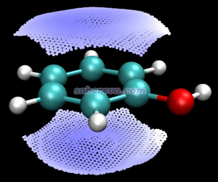
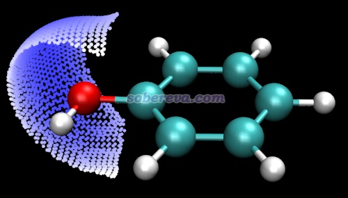
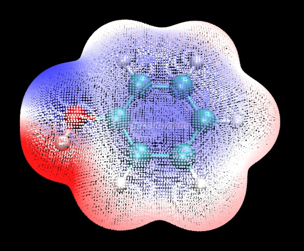

**使用Multiwfn结合VMD绘制分子局部区域表面静电势的方法**

The way of plotting electrostatic potential for local region of molecular surface using Multiwfn in combination with VMD

文/Sobereva@[北京科音](http://www.keinsci.com)  2025-Aug-31

  
  
《使用Multiwfn+VMD快速地绘制静电势着色的分子范德华表面图和分子间穿透图》（<http://sobereva.com/443>）介绍的方法已经是如今非常主流的绘制分子表面静电势的方法。最近有人问“请问用Multiwfn画分子表面的静电势分布时，怎么画某个区域或某个原子的静电势分布呢？”，针对这个局部区域表面静电势的绘制问题，我在本文介绍一下做法。阅读本文之前建议先阅读《使用Multiwfn结合VMD分析和绘制分子表面静电势分布》（<http://sobereva.com/196>）了解利用Multiwfn的输出文件手动在VMD中绘制整个体系表面静电势的基本操作过程，里面的步骤在下文里也会用到。  
  
读者务必使用2025-Aug-14及以后更新的Multiwfn版本，否则不具有本文提到的一些特性。如果对Multiwfn不了解，看《Multiwfn FAQ》（<http://sobereva.com/452>）了解相关知识。本文用的VMD是1.9.3版，用其它版本后果自负。  
  
本文以非常常见的分子苯酚为例进行演示，将要分别绘制对应苯环的所有碳原子区域和氧原子区域的分子表面静电势图。不了解给Multiwfn用的波函数文件怎么产生的话看《详谈Multiwfn支持的输入文件类型、产生方法以及相互转换》（<http://sobereva.com/379>）。  
  
启动Multiwfn，载入苯酚的波函数文件，即Multiwfn自带的examples目录下的phenol.wfn，然后输入  
12  //定量分子表面分析  
0  //开始分析。当前的分子表面默认对应电子密度为0.001 a.u.的等值面，即Bader定义的真空下的范德华表面  
  
分析结束后可以看到整个分子表面的静电势的最小值和最大值分别为-0.042242和0.083100。之后作图我们用-0.05到0.05 a.u.的色彩刻度范围。  
 Global surface minimum: -0.042242 a.u. at   1.464068   3.342877  -0.000761 Ang  
  Global surface maximum:  0.083100 a.u. at  -1.948624   3.093517   0.021792 Ang  
  
在Multiwfn的后处理菜单中输入  
12  //对特定片段做定量分子表面分析  
1-6  //苯环上碳原子的序号  
现在屏幕上显示了对这个局部分子表面区域做表面静电势分析得到的各种指标。关于Multiwfn是怎么把分子表面划分出对应特定原子片段的，看Multiwfn手册3.15.2.2节  
y  //导出locsurf.pqr文件  
5  //把分子结构导出为pdb文件  
mol.pdb  //导出的文件名  
  
pqr格式是知名的pdb格式的变体，locsurf.pqr里的每个原子对应于分子表面上的一个顶点。如Multiwfn在屏幕上的提示所示，pqr文件的倒数第三列按照格式定义本来是用来记录原子电荷的，而当前这一列用来记录被映射的函数值，即以a.u.为单位的静电势。locsurf.pqr中的残基号那一列为1和为0分别对应这个表面顶点属于和不属于自定义的片段。  
  
将mol.pdb载入VMD，VMD Main窗口中Graphics - Representation里把Drawing Method设成CPK。再把locsurf.pqr载入VMD，Graphics - Representation里把显示它用的选择语句设成resid 1，然后Drawing Method设Points（如果之前开了GLSL记得关闭），Size设10左右，Coloring Method用Charge，在Trajectory标签页里把色彩刻度范围设成-0.05到0.05。Graphics - Colors - Color Scale里把Method设BWR，现在看到下图。如果想弄出来色彩刻度轴，参考<http://sobereva.com/443>的说明。  
  

  
由上图可见，苯环的分子范德华表面中碳原子对应的区域是淡蓝色，说明此处静电势略负，这来自于丰富的pi电子对静电势的负贡献。  
  
下面绘制对应于氧原子的局部范德华表面的静电势。在Multiwfn主功能12的后处理菜单选择11 Output surface properties of each atom，然后后输入y导出locsurf.pqr。这个文件内容和之前的locsurf.pqr唯一差异是现在残基号直接对应于相应表面顶点对应的原子序号。  
  
重新按上文方式绘制，只不过把之前用的locsurf.pqr改成本次的locsurf.pqr，并且把显示表面顶点的那个representation的选择语句改成serial 12，因为氧原子是12号原子。现在看到下图。可见这部分区域中间部分的蓝色很深，这来自于氧原子带显著的负电荷，同时其孤对电子离这部分区域较近。  
  

  
下文是按照<http://sobereva.com/443>的做法绘制的整个分子表面的静电势填色图。相较之下，明显上文的做法可以把自己真正感兴趣的区域的静电势专门展现清楚，而不受到其它区域的视觉干扰。  
  

  
最后提醒一下，按照本文的方式绘制局部分子表面的静电势图，发文章时记得要按照Multiwfn启动时的提示对Multiwfn的原文进行正确引用。
