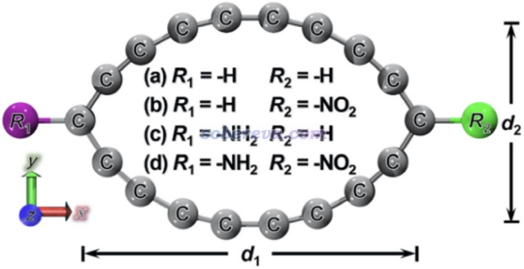
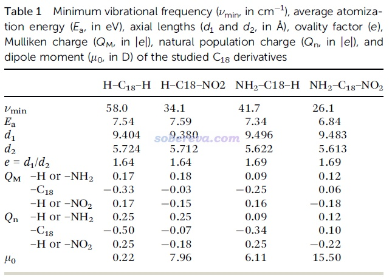
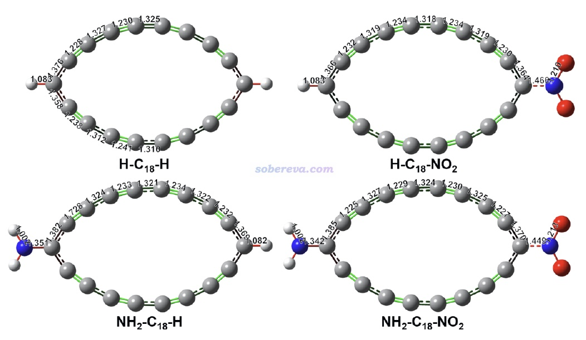
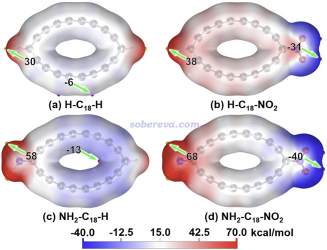
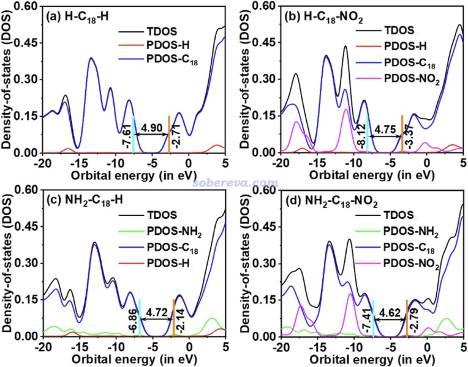
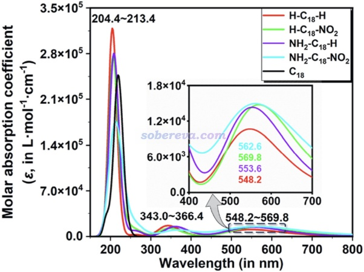
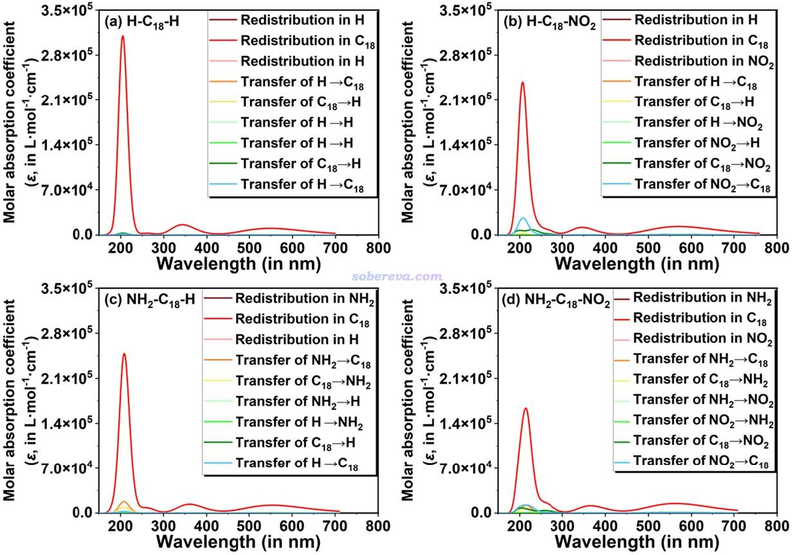
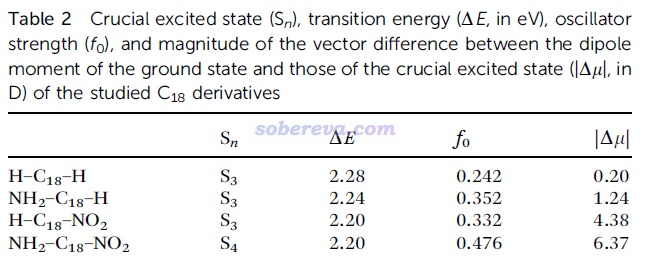
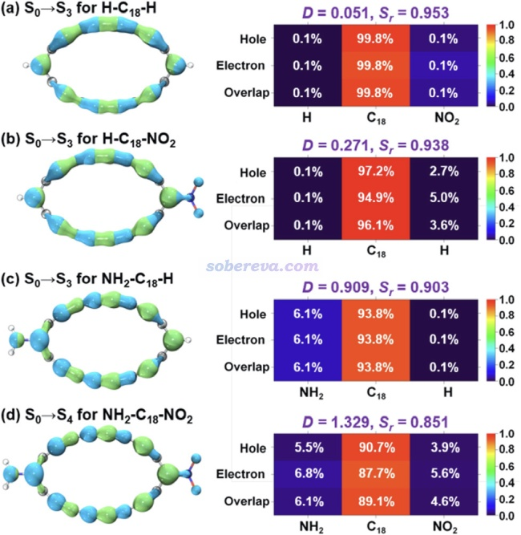
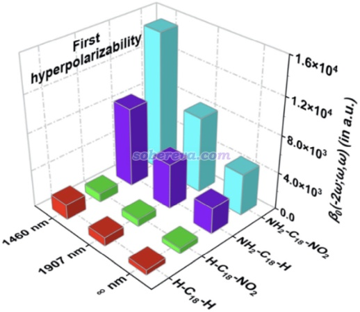

**理论设计基于18碳环的donor-π-acceptor型非线型光学材料：探究18碳环作为新的pi-linker的潜力**

文/Sobereva@[北京科音](http://www.keinsci.com)   2025-Aug-31

## 0 前言

D-pi-A型分子普遍具有较大的第一超极化率，其中D（donor）是电子给体，A（acceptor）是电子受体，pi是指具有全局pi共轭特征的片段，可以称为linker或者bridge。2019年首次通过STM观测到的由18个碳原子构成的环状体系，18碳环（cyclo[18]carbon），同时具有平面内和平面外两套全局pi共轭特征，这点在《18碳环及衍生物的十分全面系统的研究综述已在Acc. Mater. Res.期刊发表！》（<http://sobereva.com/749>）介绍的综述中有充分说明，如果你对18碳环缺乏了解十分推荐阅读此文。显然，18碳环的这种特征使得它也很有希望作为pi-linker构建具有显著第一超极化率的独特的D-pi-A型分子。基于这个idea，北京科音自然科学研究中心的卢天和江苏科技大学的刘泽玉等人对18碳环与不同donor、acceptor相连接构成的D-pi-A型分子的特征，尤其是光学性质，做了充分全面的理论研究。此工作近期已经发表在Phys. Chem. Chem. Phys.期刊上，欢迎阅读和引用：

Jingbo Xu, Jiaojiao Wang, Xiaohui Chen, Wenwen Zhao, Xiufen Yan, Zeyu Liu,* Tian Lu,* Aihua Yuan,* Design of donor–π–acceptor type cyclo[18]carbon derivatives for infrared nonlinear optical materials: a theoretical perspective, *Phys. Chem. Chem. Phys.*, **27**, 11993 (2025) <https://doi.org/10.1039/d5cp00736d>

下文将会对这篇研究文章的主要内容进行介绍并添加一些附加信息，使读者更好地理解文章的研究思想和主要结果，图片、表格来自于文章正文或补充材料。同作者之前发表过大量其它的和18碳环及其衍生物、复合物有关的研究工作，十分推荐阅览<http://sobereva.com/carbon_ring.html>里的汇总，其中有很多篇研究工作都与18碳环及相关体系的光学性质有关。

## 1 18碳环衍生物的几何结构

此文研究的将18碳环作为pi-linker构建的示意图如下所示，共考虑四种情况：(1)两侧都连接氢 (2)一侧连氢一侧连硝基 (3)一侧连氨基一侧连氢 (4)一侧连氨基一侧连硝基。其中(4)对应最典型的D-pi-A形式的体系。而连氢的话，在电子激发时氢不会起到明显的给/吸电子效应，它的作用主要是让相连的碳从原本在碳环中的sp杂化状态变成sp2杂化。

此文用Carbon, 165, 468 (2020)论证过描述碳环十分可靠的ωB97XD/def2-TZVP级别对上述体系做了几何优化，得到的无虚频的笛卡尔坐标在文中的补充材料里都提供了。各体系的碳环部分的长、宽（上图的d1和d2）在下表给出了，可见无论碳环连的是什么基团，环的形状都没什么区别，都是椭圆形。

各个体系的结构图如下（补充材料图S2），键长以埃为单位标注了，并根据键长对键进行了着色。由图可见，这些18碳环衍生物的C-C键长度是交替变化的，这个特征和孤立状态的碳环一致。

## 2 18碳环衍生物的电子结构

前面的表格里QM和Qn分别是体系的各个部分的Mulliken和NPA电荷，原子电荷的相关知识见《一篇深入浅出、完整全面介绍原子电荷的综述文章已发表！》（<http://sobereva.com/714>）介绍的笔者写的综述。可见无论哪种原子电荷计算方法，H-C18-H和NH2-C18-H中，18碳环都能获得电子，故带有明显的负电。而在H-C18-NO2和NH2-C18-NO2中，由于吸电子能力更强的-NO2从18碳环上吸了一些电子，导致18碳环部分的净电荷恰好接近0。

前面表格里的μ0是体系的基态的永久偶极矩。有趣的是H-C18-H的偶极矩并不为0，因为此体系并不是精确中心对称的（哪怕用很严收敛限优化也是如此），仔细看前面图中标注的键长可以看出这点来。H-C18-NO2和NH2-C18-H的偶极矩都较大，而D-pi-A特征最鲜明的NH2-C18-NO2具有特别大的偶极矩，高达15.5 Debye。

按照《使用Multiwfn+VMD快速地绘制静电势着色的分子范德华表面图和分子间穿透图》（<http://sobereva.com/443>）绘制的4个18碳环衍生物的范德华表面静电势填色图如下所示，由此可以清楚直观地看出它们的电荷分布特征的差异。颜色越红、越蓝分别体现出其附近的原子带正电、负电越显著。并且表面静电势最大点和最小点的位置和数值也都标注了出来。可见虽然NH2-C18-NO2的碳环中部并不怎么带净电荷，但左右两端由于连接的基团的给/吸电子特征存在巨大差异，因而形成了显著的正负电荷分离现象，这也是为什么它有最大的偶极矩。

下图是基于《使用Multiwfn绘制态密度(DOS)图考察电子结构》（<http://sobereva.com/482>）介绍的方法绘制的18碳环衍生物的TDOS和PDOS图，HOMO、LUMO位置以及相应的gap都标注了。在相同计算级别下，单独的18碳环的HOMO和LUMO能级分别为-8.45和-1.70 eV，对应HOMO-LUMO gap为6.75 eV，而当前研究的18碳环衍生物的gap在4.62-4.9 eV范围。可见接上基团，令两端的碳从sp杂化变成sp2杂化从而一定程度破坏平面内的芳香性会使得gap有所缩窄。PDOS曲线体现出HOMO、LUMO轨道几乎都是C18部分贡献的，但氨基，特别是硝基，对于其它前线轨道也有明显贡献，这暗示出一些低阶电子激发态会牵扯到它们。

## 3 18碳环衍生物的电子激发特征和电子光谱

本研究使用TDDFT在ωB97XD/def2-TZVP级别下做了电子激发计算，算了最低50个态，并模拟了电子光谱，如下所示。可见当前研究的18碳环衍生物的吸收分为三个部分：500多nm的可见光区的弱吸收、300多nm的近紫外区的弱吸收、200nm左右的更远紫外区的强吸收。如Carbon, 165, 461 (2020)的计算研究所示，独立的18碳环是没有可见光吸收的，而当前研究表面给它恰当接上H、氨基、硝基后能够令体系显色。基团的种类一定程度影响最大峰位置和峰高度，但影响程度很有限。

为了更好地理解这些体系的吸收光谱的内在本质，文中按照《使用Multiwfn绘制电荷转移光谱(CTS)直观分析电子光谱内在特征》（<http://sobereva.com/628>）介绍的方法绘制了电荷转移光谱，如下所示。可见不管接上什么基团，>300 nm区域的吸收几乎完全都是18碳环片段上的局域激发，而氨基和硝基则对于200nm左右的吸收有少量贡献，使得对应的电子激发有一些电荷转移特征，但仍以18碳环区域的激发为主。

能量最低同时振子强度又显著的电子激发态被称为crucial state（关键态），对于当前研究的体系来说对应于可见光区的吸收。各个体系的关键态的信息如下所示，包括激发能、振子强度、激发态偶极矩相对于基态偶极矩的变化的大小

为了更好地了解这些激发的本质特征，文中按照《使用Multiwfn做空穴-电子分析全面考察电子激发特征》（<http://sobereva.com/434>）介绍的方法对各个体系的关键态绘制了空穴（蓝色等值面）、电子（绿色等值面）分布图和热图，如下所示，图中还标注了两种衡量电子激发特征的定量指标，在434博文里也都详细介绍了。可见尽管这些激发主要都来自于碳环部分的pi电子，而结合定量指标D和Sr，还是能看出差别的。四个体系中，NH2-C18-NO2的关键态具有最显著的电荷转移特征，而且从蓝色和绿色等值面上可以看到是NH2向NO2方向整体一定程度转移电子。而H-C18-H的电荷转移特征几乎没有，空穴和电子几乎都是相对于体系中心对称分布的。H-C18-NO2的情况较接近H-C18-H，而NH2-C18-H的情况较接近NH2-C18-NO2。

电子激发态特征和第一超极化率之间有密切联系，通过SOS公式关联起来，在《使用Multiwfn基于完全态求和(SOS)方法计算极化率和超极化率》（<http://sobereva.com/232>）里有详细介绍。SOS简化后可以得到双、三能级公式，见《使用Multiwfn对第一超极化率做双能级和三能级模型分析》（<http://sobereva.com/512>）和《谈谈计算第一超极化率的双能级公式》（<http://sobereva.com/361>）。双能级公式用来讨论影响第一超极化率的本质因素十分有用且流行。双能级公式指出静态第一超极化率与关键态的振子强度呈正比、与激发态相对于基态的偶极矩变化的大小呈正比、与激发能的三次方呈反比。根据前面表格里的关键态信息可见，相对于其它三个18碳环衍生物，NH2-C18-NO2的关键态具有最大的振子强度、最大的偶极矩变化，而激发能和它们则差不多，根据双能级公式可以预期NH2-C18-NO2有最大的第一超极化率。但双能级公式只适合用来解释和定性预测第一超极化率，更严格的结论、准确的数值还是需要依赖于用严格的方法定量计算，见下一节。

## 4 18碳环衍生物的非线型光学性质

此文使用Gaussian 16在ωB97XD/aug-cc-pVTZ(-f,-d)级别下以CPKS方法解析地计算了前述四种18碳环衍生物的二次谐波生成（SHG）形式的静态和动态的第一超极化率，β(-2ω;ω,ω)。aug-cc-pVTZ(-f,-d)基组是常用的aug-cc-pVTZ基组去掉非氢原子的f和氢原子的d极化函数，根据笔者以前的充分的测试，这种简化可以节约很多计算时间而并不会令计算精度下降太多。文中具体考察的量包括第一超极化率的总大小（βtot）、平行于偶极矩的分量（βvec）、各笛卡尔分量（βX、βY、βZ），这些量都可以通过Multiwfn基于Gaussian输出文件直接产生，见《使用Multiwfn分析Gaussian的极化率、超极化率的输出》（<http://sobereva.com/231>）。

文中计算出的静态（∞ nm）和1460、1907 nm下的动态第一超极化率的总大小如下图所示。可见H-C18-H的β相当小，光是把一个H替换成硝基也没什么变化，但替换成氨基则能令β显著增大，而同时连上氨基和硝基构成典型D-pi-A体系后β变得颇大，这体现出氨基和硝基在提升电场响应性质方面的显著的协同作用。从下图还可以看到随着外场波长的减小，即外场频率的增大，对应的β有大幅提升，即这些体系具有很显著的频率-色散效应。

NH2-C18-NO2的静态的βtot为4462 a.u.，算是颇大了，同样是D-pi-A型分子的p-nitroaniline (NH2-C6H4-NO2)的实验气相值只有1400 a.u.。可见18碳环作为pi-linker有独特价值，是个颇好的pi-linker。

文中还使用《使用Multiwfn通过单位球面表示法图形化考察（超）极化率张量》（<http://sobereva.com/547>）介绍的方法直观考察了各个体系的第一超极化率的各向异性，并基于《使用Multiwfn计算（超）极化率密度》（<http://sobereva.com/305>）介绍的方法考察了不同区域、片段对第一超极化率的贡献，请感兴趣的读者阅读原文中的讨论。

为了考察溶剂效应对光学性质的影响，文中还在IEFPCM隐式溶剂模型描述的环己烷环境下也做了计算，发现环己烷会导致光谱略微红移、振子强度略微下降，但整体特征不变。环己烷还会造成绝大多数情况β的显著增加，但不同体系的β大小的趋势并未改变。

## 5 总结

本文介绍的Phys. Chem. Chem. Phys., 27, 11993 (2025)文章首次对18碳环与H、氨基、硝基构成的分子的几何结构、电子结构和光学性质做了充分的理论研究，研究证实18碳环可以作为很理想的pi-linker构造典型的D-pi-A体系以获得具有显著非线性光学性质的分子，文中构建的NH2-C18-NO2的第一超极化率已达到了很大的值。此文的研究工作显著拓宽了化学家们对碳环的衍生物的认识，对于未来利用碳环作为骨架构造非线性光学材料提供了重要的参考。值得一提的是，目前从小到大很多碳环皆已实验合成，以不同尺寸的碳环作为pi-linker，有望获得具有不同非线性光学性能的分子。
