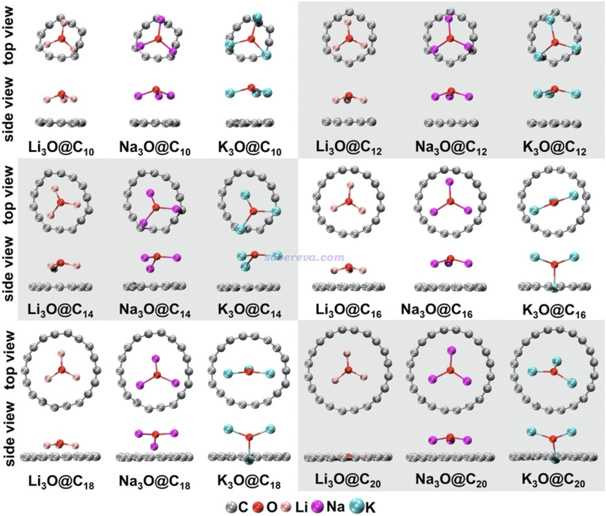
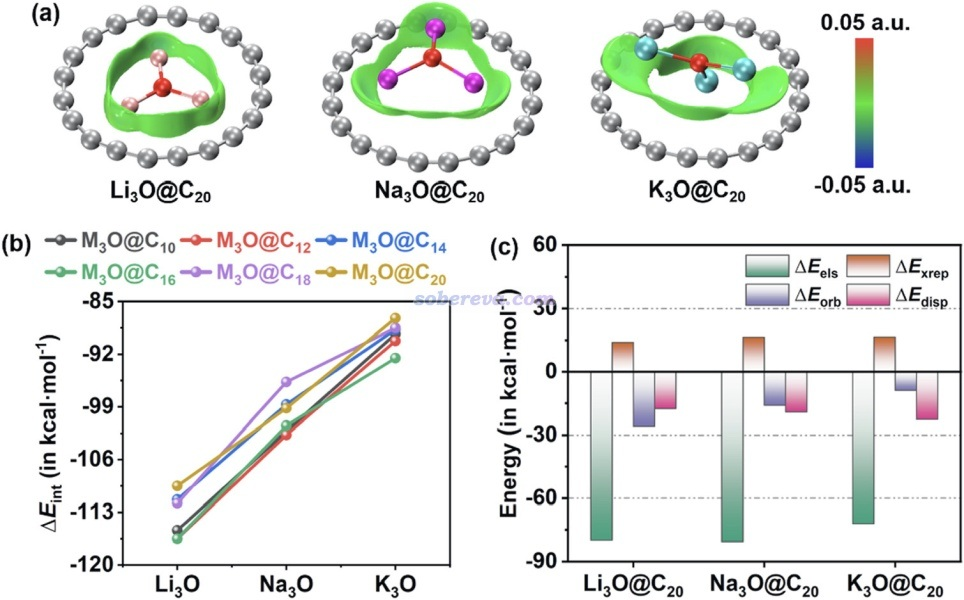
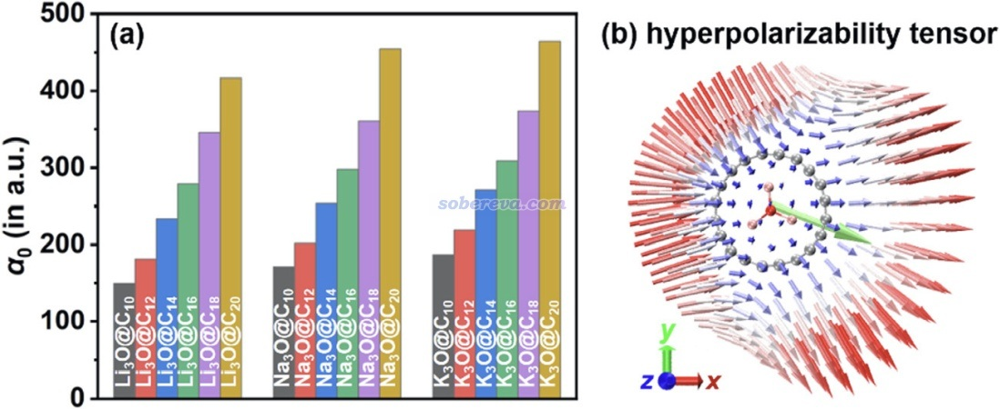
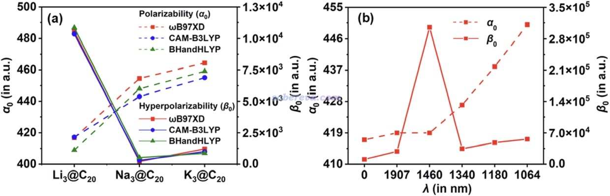
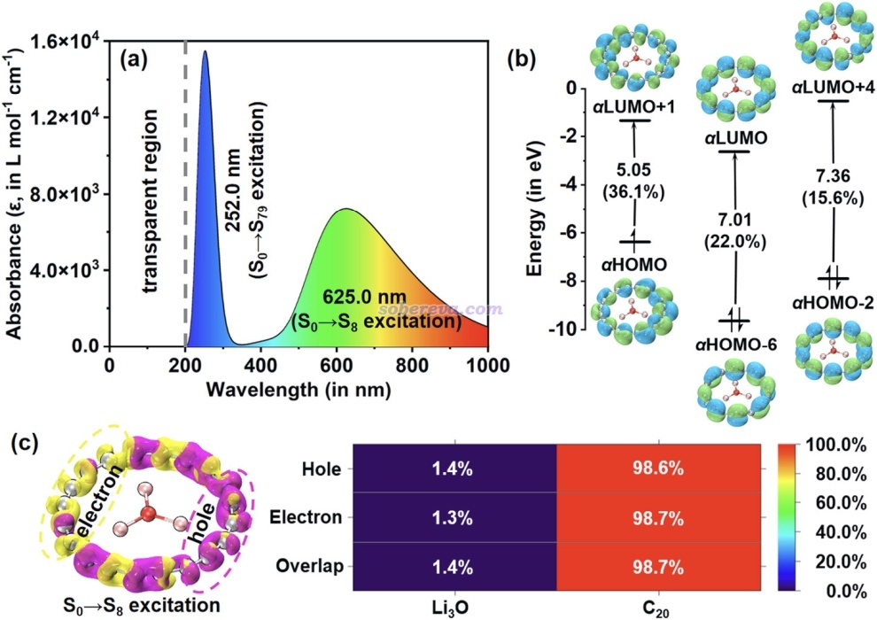

**将超碱原子M3O与碳单环体系相结合设计具有优秀光学性质的复合物**

文/Sobereva@[北京科音](http://www.keinsci.com)  2025-Oct-31

碳原子形成环状的体系如今受到越来越多的关注，自2019年合成的18碳环（cyclo[18]carbon）开始，目前已经有越来越多的碳单环体系被合成，小到C6，大到C48、C50碳环的合成都已经被报道，碳环的复合物、衍生物在未来极可能成为有重要实际应用价值的一类体系。北京科音自然科学研究中心（<http://www.keinsci.com>）的卢天和江苏科技大学的刘泽玉等人近年来对碳环类体系做了大量的理论研究工作，汇总见<http://sobereva.com/carbon_ring.html>，近期发表的综述见Acc. Mater. Res., 6, 1220 (2025) <https://doi.org/10.1021/accountsmr.5c00131>。

超碱原子是具有M3O化学组成的三角形的簇，M是碱金属原子。M3O的电离能比碱金属原子还要更小，早已被用于设计具有显著非线性光学性质的体系，典型的如卢天、丁迅雷等人在J. Comput. Chem., 38, 1574 (2017)中构造的M3O@Si12C12型体系。将M3O和碳环相结合能够获得具有何种特征的体系，无疑十分值得探索。最近卢天和刘泽玉等人共同理论研究了C2n（n=5-10）碳环与超碱原子M3O（M=Li,Na,K）形成的复合物，十分全面系统地考察了这些复合物的几何结构、电子结构、分子间相互作用、光学吸收、非线型光学性质。研究成果已经发表在英国皇家化学会RSC旗下的J. Mater. Chem. C期刊上，欢迎阅读和引用：  
Wenwen Zhao, Jiaojiao Wang, Xiufen Yan, Tian Lu,* Zeyu Liu,* Obtaining excellent optical molecules by screening superalkali-doped cyclo[2n]carbons, M3O@C2n (M = Li, Na, and K, n = 5–10), *J. Mater. Chem. C* , **13**, 17862 (2025) <http://doi.org/10.1039/d5tc01675d>

此研究表明M3O与碳环可以组成静电吸引作用主导的盐型复合物[M3O]+@[C2n]-，体系的极化率随着原子序数的增加、碳环尺寸的增加而增大，并且具有显著的各向异性。而第一超极化率的变化不具有很强的规律性，筛选发现其中Li3O@C20具有显著的第一超极化率，且只在>200 nm的近紫外和可见光范围具有吸收。本研究对基于碳环构造具有特殊非线型光学特征的体系给予了新的启示，充分体现了将超碱原子置入碳环或其衍生物是一种可行的设计非线性光学材料的思路！

具体内容请阅读原文，以下仅对文中的部分图片进行展示。

不同超碱原子M3O与不同碳环形成的复合物的势能面极小点结构：

<http://sobereva.com/621>介绍的IGMH方法展现的M3O与C20碳环之间的相互作用特征、不同M3O@C2n复合物的相互作用能，以及<http://sobereva.com/685>介绍的sobEDAw方法做的能量分解

不同M3O@C2n复合物的各向同性极化率，以及按照<http://sobereva.com/547>介绍的方法图形化展现的Li3O@C20的第一超极化率张量

M3O@C20的极化率和第一超极化率随碱金属原子的变化，以及极化率和第一超极化率随外场频率的变化

Li3O@C20的电子光谱、可见光范围的关键激发态S0-S8的轨道跃迁特征，以及按照<http://sobereva.com/434>介绍的方法展现的空穴和电子分布。

