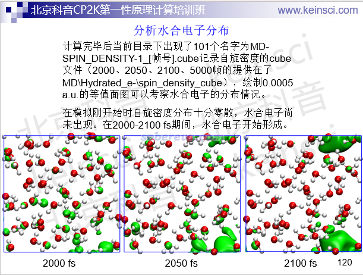
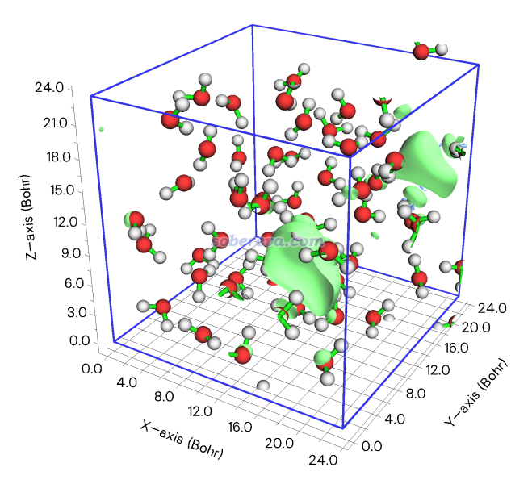
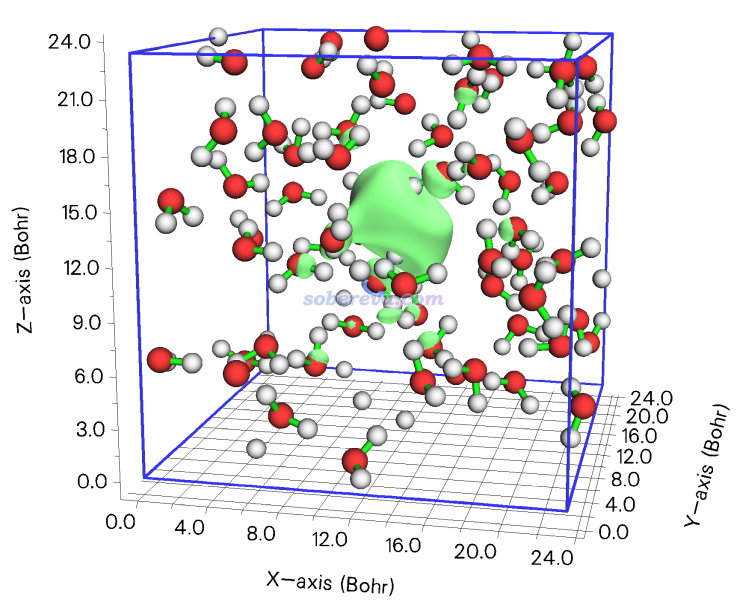

**Multiwfn的格点数据平移功能介绍**  
Introduction to grid data translation function in Multiwfn

文/Sobereva@[北京科音](http://www.keinsci.com)  2025-Nov-19

## 1 前言

很多人在对周期性体系绘制三维函数（如电子密度差）的等值面时，容易遇到一个情况是发现感兴趣的等值面在晶胞的边缘，导致等值面被截断，无法观看完整。虽然VMD程序在显示格点数据等值面的时候可以要求把周期镜像显示出来，从而试图让位于晶胞边缘的等值面看起来完整，但等值面在晶胞边界的位置会不连贯，有个突变，因而还是不好看。还有一个解决方法是先用《Multiwfn中非常实用的几何操作和坐标变换功能介绍》（<http://sobereva.com/610>）里提供的功能令晶胞进行平移使得感兴趣的区域在盒子中央，然后再重新计算格点数据，但这个过程不仅麻烦而且还花费重算一次的时间。

为了完美地解决以上问题，在2025-Nov-19更新的Multiwfn中增加了一个新功能，可以令格点数据连带着原子坐标在盒子的第1、2、3个轴上分别平移特定百分比，从而将感兴趣的等值面移到便于观察的地方，整个过程瞬间完成。下面就通过两个实际例子演示一下。Multiwfn可以在官网<http://sobereva.com/multiwfn>免费下载，不了解Multiwfn者建议看《Multiwfn FAQ》（<http://sobereva.com/452>）。记录格点数据最常用的格式是cube，不了解的话建议看《Gaussian型cube文件简介及读、写方法和简单应用》（<http://sobereva.com/125>）。

## 2 实例

北京科音CP2K第一性原理计算培训班（<http://www.keinsci.com/KFP>）里我讲CP2K做水合电子的AIMD模拟的幻灯片中，给了三个时刻的自旋密度等值面的图片，如下所示。由图可见从2000 fs时开始形成水合电子，到了2100 fs时水合电子已经完全形成。然而2100 fs时的等值面在盒子最边上，看起来很不舒服。这个问题靠前述的Multiwfn的格点数据平移功能即可解决。

2100 fs时刻CP2K产生的这个体系的自旋密度的cube文件MD-SPIN_DENSITY-1_2100.cube在<http://sobereva.com/attach/754/file.rar>中。我们先看一下等值面图，用VMD、VESTA、Multiwfn等观看都可以。此例用Multiwfn载入cube文件后，进入主功能0，把等值面数值设为0.001，并且点击show data range复选框要求显示格点数据盒子边框后就可以看到下图

显然，为了让等值面位于盒子中央便于观看，应该对体系在第1个轴（当前对应X轴）的负方向平移30%左右；在第2个轴（当前对应Y轴）的正方向平移约50%；在第3个轴（当前对应Z轴）上用不着平移。

关闭图形窗口回到Multiwfn主菜单，依次输入  
13  //处理内存中的格点数据的功能  
19  //平移格点数据  
-0.3  //在第1个轴负方向平移30%  
0.5  //在第2个轴正方向平移50%  
[回车]  //不在第3个轴方向上平移

此时屏幕上看到如下提示，显示了在各个方向上平移了多少个格点，以及平移矢量。注意这里都是按正值显示（由于周期性，前面输入-0.3等同于输入了0.7）。  
 Translate along the 1st axis by   62 grids  
 Translate along the 2nd axis by   45 grids  
 Translate along the 3rd axis by    0 grids  
 Translation vector:    8.630404    6.264003    0.000000 Angstrom

当前程序检测到在平移后有些原子露在了盒子外面，问你是否把它们卷到盒子里，这里输入y要求卷入。

现在格点数据就处理好了。可以选择选项0把格点数据导出为新的.cub文件，也可以直接选选项-2观看等值面，现在看到的图如下。可见等值面已完全在盒子中央了，非常容易考察水合电子的形态。

## 3 注意事项

此功能对任何函数的格点数据都可以用。格点数据可以是从cube、CHGCAR等Multiwfn支持的记录格点数据的文件中读取的，也可以是Multiwfn的主功能5等功能基于波函数文件直接计算出来并存在内存中的。

本文介绍的功能对于盒子是非正交的情况也可以照常用，平移的方向对应于实际三个轴的方向，只不过Multiwfn目前无法正确显示这种情况的等值面，应当用VMD、VESTA等程序显示。

前面的例子中，格点数据对应的盒子（即均匀分布的格点所处的范围）和做周期性第一性原理计算对应的盒子（对晶体体系来说也相当于晶胞）是完全一致的。如果格点数据的盒子范围和周期性计算用的盒子范围不对应，比如计算格点数据的区域只是整个体系中的一小块，那么使用本文的功能就没任何意义。

如果你的体系本来就没周期性，本文的功能虽然也能使用，但并没有任何实际意义。

**如果本文的功能给你的研究带来了便利，发表文章时请引用Multiwfn启动时提示的原文。**
