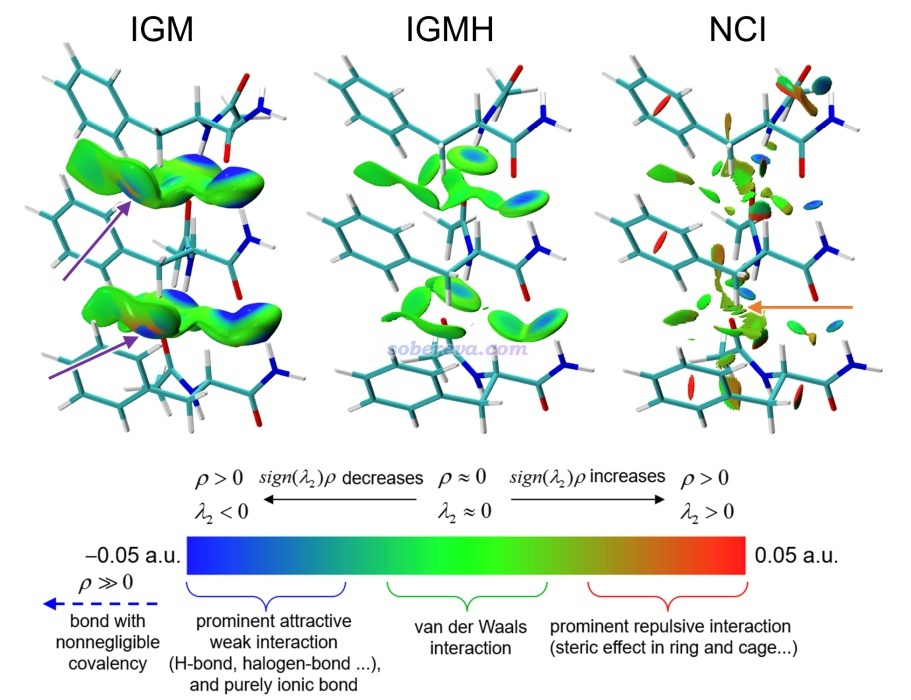
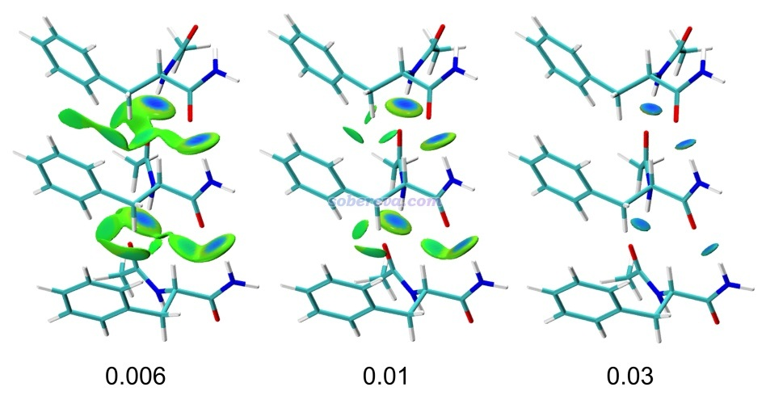
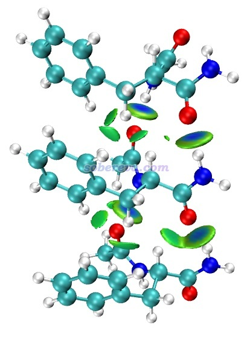
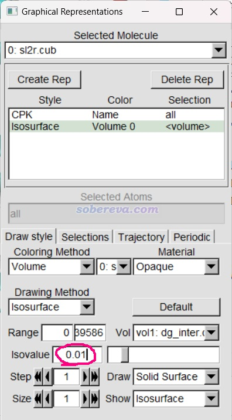
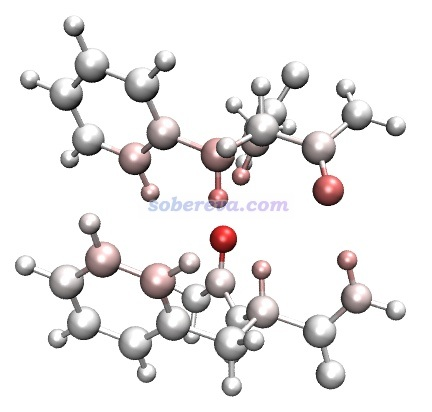
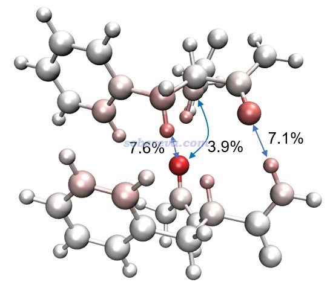
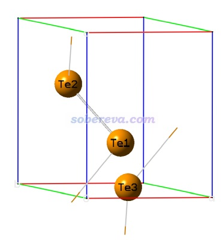
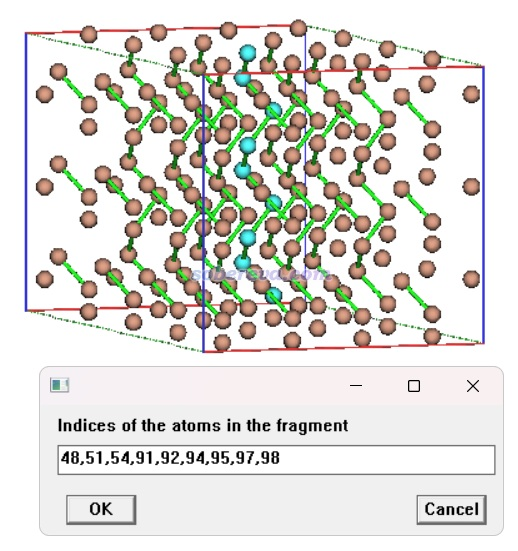
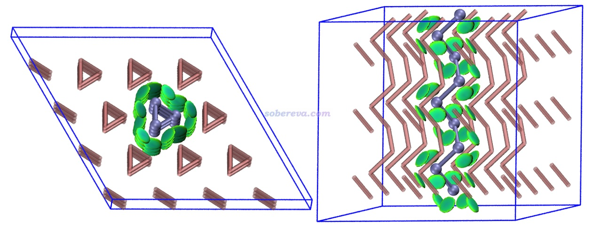
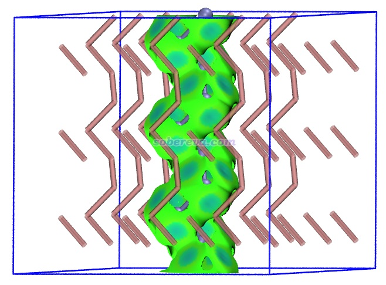

**使用mIGM方法基于几何结构快速图形化展现弱相互作用**  
Using mIGM method to rapidly graphically represent weak interactions based on geometry

文/Sobereva@[北京科音](http://www.keinsci.com)   2025-Nov-24

## 0 前言

弱相互作用的图形化分析方法日趋流行，其中笔者提出的IRI和IGMH方法如今已经被使用得相当普遍，另外还有NCI、aNCI、IGM等方法。笔者专门有两篇综述文章对其进行了非常全面、完整的介绍，如果还没读过的话强烈建议阅读：  
Angew. Chem.上发表了全面介绍各种共价和非共价相互作用可视化分析方法的综述  
<http://sobereva.com/746>  
一篇最全面介绍各种弱相互作用可视化分析方法的文章已发表！  
<http://sobereva.com/667>

近期笔者提出了一种新的弱相互作用可视化方法称为mIGM（modified independent gradient model）并已实现在了Multiwfn程序中。如下一节所示，mIGM有重要、独特的价值。mIGM的原文如下，非常欢迎阅读和引用。**使用Multiwfn做mIGM分析时请将此文与Multiwfn程序启动时提示的程序原文一起引用**。

**Tian Lu, Graphically revealing weak interactions in dynamic environments using amIGM method, *Struct. Bond.*, 190, 297 (2026) DOI: [10.1007/430_2025_95](https://doi.org/10.1007/430_2025_95)**  
注1：此文同时作为Computational Methods for the Analysis of Non-Covalent Interactions书的一章出版  
注2：mIGM方法是我提出amIGM方法时的重要副产物，所以文章标题上写的是amIGM  
注3：如果没有权限访问，也可以看ChemRxiv上的预印版<https://doi.org/10.26434/chemrxiv-2025-zts13>，内容和正式版没明显区别。引用时请引用正式版

## 1 mIGM方法介绍

IGMH在前述综述里以及《使用Multiwfn做IGMH分析非常清晰直观地展现化学体系中的相互作用》（<http://sobereva.com/621>）中都有充分的介绍，这里就不再多说了。mIGM方法是IGMH的变体，把IGMH中基于波函数计算的实际电子密度替换为准分子密度（promolecular density），准分子密度只需要元素和原子坐标信息就可以由Multiwfn构造出来。

mIGM分析的优点是仅依赖于几何结构而不需要波函数信息，且速度远快于IGMH。IGM方法虽然也有这方面的优点，但mIGM的图像效果明显好于IGM。因此IGM方法可以完全被淘汰了。

mIGM显然不如基于波函数计算的IGMH严格，但对于图形化考察弱相互作用的目的，多数情况下其结果不比IGMH差多少（但对于片段带显著净电荷的情况有可能差得多一点）。当然，对于不大的体系、不难获得波函数文件的情况，还是建议优先用IGMH。

由于以上特点，mIGM很适合这三种情况：  
(1)需要快速得到结果的场合，尤其适用于很大体系和大批量分析  
(2)作为IGMH分析前的快速预览目的  
(3)不便于得到Multiwfn支持的波函数文件的情况。例如Multiwfn不支持QE、VASP、M$等完全基于平面波的第一性原理程序产生的波函数文件，这些程序的用户可以把优化完的几何结构保存成cif格式作为Multiwfn做mIGM分析的输入文件）。甚至一点都不会理论计算的人也可以直接拿较准确实验得到的pdb、cif文件做mIGM分析。

这里以苯基丙氨酸三聚体为例对比一下不同弱相互作用可视化方法的结果，先来看IGMH、IGM、NCI方法的情况。下面这张图是mIGM原文里的图，给出了sign(λ2)ρ着色的不同方法定义的等值面，IGMH和IGM分析中把每个分子被定义为了一个片段。可见IGMH图像很理想，等值面光滑、形状优雅，很好地展现出了普通范德华作用为主和氢键作用为主的相互作用区域。IGM的图很糟，等值面过于肥大，往往离原子核太近，并进而导致在箭头所示的局部区域出现不合理的橙色着色。NCI方法无法区分分子内和分子间相互作用，而且等值面显得零散、稀碎，在一些地方还有很难看的锯齿（把格点间距降到很小可以避免，但巨幅增加耗时和格点数据尺寸）。

下面再来看mIGM的图。这里给出的是sign(λ2)ρ着色的mIGM的δg_inter函数分别为0.006、0.01、0.03 a.u.的等值面，sign(λ2)ρ的色彩变化方式同前。可见效果很好，与IGMH图的效果十分接近。并且mIGM和IGMH一样，等值面的数值设得越大可以着重展现越强的相互作用。0.03的等值面中只出现了相对较强的分子间氢键作用，数值中等的0.01图中还能看到较显著的范德华作用区域，数值最小的0.006图中还把特别弱的范德华作用区域也展现了出来。

接下来就给出Multiwfn做mIGM分析的两个简单例子。第一个例子重复上面苯基丙氨酸三聚体的图，第二个例子以碲晶体为例演示将mIGM用于周期性体系。实际上mIGM和IGMH、IGM分析过程几乎完全相同，唯一差异仅仅是在Multiwfn主功能20里选择mIGM而非IGMH或IGM。因此如果你之前就看过<http://sobereva.com/621>会了IGMH分析，或看过《通过独立梯度模型(IGM)考察分子间弱相互作用》（<http://sobereva.com/407>）会了IGM分析，用mIGM其实都没有需要额外学的。

**读者务必使用2025年11月23日及以后更新的Multiwfn版本**，否则情况和下文所述不符。Multiwfn可以在官网<http://sobereva.com/multiwfn>免费下载。不了解Multiwfn者建议看《Multiwfn入门tips》（<http://sobereva.com/167>）和《Multiwfn FAQ》（<http://sobereva.com/452>）。本文例子用的VMD是1.9.3版，可以在<http://www.ks.uiuc.edu/Research/vmd/>免费下载。

## 2 mIGM分析实例1：苯基丙氨酸三聚体

为了做mIGM分析，需要给Multiwfn提供记录了几何优化后的苯基丙氨酸三聚体结构信息的文件。Multiwfn支持什么格式详见《详谈Multiwfn支持的输入文件类型、产生方法以及相互转换》（<http://sobereva.com/379>）。常见的xyz、pdb、cif、mol2等大量格式都可以作为输入文件。Multiwfn目录下的examples\phenylalanineresiduestrimer.xyz是优化后的三聚体的结构文件。顺带一提，如果想方便地得到里面各个分子的序号的话，可以将之载入Multiwfn，进入主功能0，选菜单栏的Tools - Select fragment，然后输入某分子中任意原子序号，则这个分子中所有原子序号都会给出，可以复制出来之后粘贴到Multiwfn窗口里用来定义片段。

启动Multiwfn，依次输入  
examples\phenylalanineresiduestrimer.xyz  
20 //弱相互作用可视化分析  
-10 //mIGM分析  
3 //定义3个片段  
1-29 //第1个片段的原子序号（对应第1个分子）  
30-40,52,53,56,57,63-65,77-87 //第2个片段的原子序号（对应第2个分子）  
c //其它原子作为第3个片段（对应第3个分子）  
4 //自定义格点间距。如果你对于定义格点的意义和方式不了解的话，建议参看《Multiwfn FAQ》（<http://sobereva.com/452>）中的Q39  
0.2 //格点间距设0.2 Bohr，这足以得到足够光滑的mIGM图像，想要效果更好点可以用0.15

一瞬间就算完了，之后选3把格点数据导出成cube文件，当前目录下就产生了dg_inter.cub、dg_intra.cub、dg.cub、sl2r.cub。对于展现片段间相互作用，只需要保留分别对应sign(λ2)ρ和δg_inter格点数据的sl2r.cub和dg_inter.cub文件即可，其它的可以删掉。

将sl2r.cub和dg_inter.cub挪到VMD目录下，并且把Multiwfn自带的examples目录下的IGM_inter.vmd脚本文件挪到VMD目录下。启动VMD，之后在文本窗口输入source IGM_inter.vmd，脚本就会被执行，然后看到下图

当前默认用的δg_inter等值面数值是0.01，如果想改的话，在VMD Main窗口进入Graphics - Representation，在下面标注的文本框里输入数值后按回车即可

如果想把图像效果设得像上一节展示的mIGM原文的图那样，在Graphics - Representation窗口中选中显示体系结构的那个Representation（后文简写为Rep），把Drawing Method从CPK改为Licorice，并把Bond Radius恰当设小。然后选中显示等值面的那个Rep，把Material改成AOShiny。

在Multiwfn做mIGM分析的后处理菜单还可以选择选项6在mIGM框架内计算分别衡量原子和原子对儿对特定两个片段间相互作用贡献程度的δG_atom和δG_pair指数。这两个指数在<http://sobereva.com/621>和IGMH原文中都有介绍，在IGMH分析的官方教程<http://sobereva.com/multiwfn/res/IGMH_tutorial.zip>中有计算例子。mIGM和IGMH框架下计算的这些指数显然在定量数值上会有所不同，但能说明的问题一致。

这里对前面的图中中央和上方两个分子之间的相互作用计算δG_atom和δG_pair指数。在之前的Multiwfn的mIGM分析的后处理菜单中依次输入  
6  //计算δG_atom和δG_pair指数  
2,3  //对片段2、3之间计算  
3  //用Ultrafine格点计算这些指数

马上就算完了，从屏幕上的提示可见δG_atom和δG_pair指数已经被导出到了当前目录下的atmdg.txt文件中。然后再输入y导出atmdg.pdb，此文件中原子的beta因子对应的是δG_atom指数，可以在VMD中通过对原子着色来直观显示。

把atmdg.pdb载入VMD，背景设成白色，Graphics - Colors - Color Scale里把Method设为BWR（蓝-白-红方式变化），Graphics - Representation里把Coloring Method设为Beta，Trajectory标签页里把Color Scale Data Range下限和上限分别设为-5和5，此时看到的图如下。完全白色对应于δG_atom为0，暗示是对于相互作用没贡献的原子。越红对应δG_atom越大，暗示对分子间相互作用的重要性越大。提醒：δG_atom只是以粗糙方式定义的，切勿视为对片段间相互作用能的确切贡献量，它只适合直观区分不同原子对相互作用可能的重要性、令你能快速判断哪些原子很值得关注。真正要确切得到各个原子对相互作用能的贡献，应当用Multiwfn中的EDA-FF方法，介绍见《使用Multiwfn做基于分子力场的能量分解分析》（<http://sobereva.com/442>）。

在atmdg.txt中可以看到片段2、3上原子的δG_atom指数和归一化后的δG_atom%指数，由高到低排序：

 Atomic delta-g indices of fragment  2 and percentage contributions  
 Atom   57 :    0.458233  (  22.76 % )  
 Atom   87 :    0.215283  (  10.69 % )  
 Atom   79 :    0.187531  (   9.31 % )  
 Atom   39 :    0.157183  (   7.81 % )  
...略  
 Atomic delta-g indices of fragment  3 and percentage contributions  
 Atom   58 :    0.314871  (  15.64 % )  
 Atom   69 :    0.297674  (  14.78 % )  
 Atom   67 :    0.227089  (  11.28 % )  
 Atom   44 :    0.178482  (   8.86 % )  
...略

还可以看到两个片段的原子之间的由大到小排序的δG_pair指数和归一化后的δG_pair%指数：

 Atomic pair delta-g indices and percentage contributions (zero terms are not shown)  
   57   67 :    0.153236  (   7.61 % )  
   87   58 :    0.142887  (   7.10 % )  
   57   55 :    0.077699  (   3.86 % )  
   53   58 :    0.071819  (   3.57 % )  
...略

可以把上面的一些δG_pair%指数自行通过ps标注在图上，如下所示。

提示：当前atmdg.pdb里只记录了2、3片段的原子，为了确认比如δG_pair指数最大的57、67号原子对应图上哪两个，可以同时把完整结构文件phenylalanineresiduestrimer.xyz载入VMD，选择语句输入serial 57 67并设为VDW方式显示，并把Sphere Scale改小到0.3，这样就能直接在图上看到57和67号原子了。

## 3 mIGM分析实例2：碲晶体

碲晶体是由一条条碲原子链有序堆积构成的。作为mIGM方法分析周期性体系的例子，这一节使用mIGM直观展现碲晶体中的一条链与周围的链之间的相互作用。

<http://sobereva.com/attach/755/Te.cif>是碲晶体的原胞。由于如下所示，其原胞太小，无法在图上展现清楚链之间的相互作用，因此做mIGM分析之前需要先把它扩成足够大的超胞。这会用到《Multiwfn中非常实用的几何操作和坐标变换功能介绍》（<http://sobereva.com/610>）里介绍的功能。

启动Multiwfn，载入Te.cif，然后输入  
300  //其它功能（Part 3）  
7  //几何相关操作  
19  //扩胞  
4  //第1个轴方向扩成原先的4倍  
4  //第2个轴方向扩成原先的4倍  
3  //第3个轴方向扩成原先的3倍

此时可以选择0观看一下当前的结构，会看到晶胞大小已经足够大了。我们要把其中最接近晶胞中央的一条链作为第1个片段。为了获得其原子序号，在Multiwfn图形窗口顶端选择Tools - Select fragment，并且输入中央一条链上任意一个原子的序号比如98，就会返回整条链上的原子序号，并且整条链都被高亮显示了，如下所示

点右上角的Return按钮关闭图形窗口，接着在Multiwfn中输入  
-10  //从几何操作界面中返回  
0  //返回到主菜单  
20  //弱相互作用可视化分析  
-10  //mIGM分析  
2  //定义两个片段  
48,51,54,91,92,94,95,97,98  //第1个片段的原子序号  
c  //其它原子作为第2个片段  
2  //中等质量格点。对于周期性来说，这个选项代表格点间距约0.25 Bohr，格点均匀分布在整个晶胞中。如果想让等值面更平滑，可以选择高质量格点，对应0.15 Bohr格点间距，此时产生的cub文件会是中等质量格点的1/(0.15/0.25)^3=4.6倍

很快就算完了，后处理菜单选2导出cube文件，再把sl2r.cub和dg_inter.cub用IGM_inter.vmd脚本在VMD中作图，默认的0.01等值面如下所示，两种视角都给出了。为了让中间的链和其它的链在图上便于区分，对中间的链设置了两个Rep，选择语句都是serial 48 51 54 91 92 94 95 97 98，着色方式都设为ColorID并选iceblue颜色，其中一个Rep用CPK风格显示，另一个Rep用DynamicBonds风格显示并且把Distance Cutoff改大到3以令碲原子间的键能被显示出来。之后再创建一个DynamicBonds风格的Rep，选择语句写not serial 48 51 54 91 92 94 95 97 98，用Name着色，材质设EdgyGlass。此外，在文本窗口中输入pbc box把格点数据的盒子边框（当前对应晶胞边框）显示出来。

由上图可清晰地看出中间的碲链的每个原子都在好几个方向与周围的链有相对明显的相互作用。还可以把等值面数值改小到0.003以让相互作用展现得更全面，此时图像如下所示，可以看到在有的区域等值面颜色相对发蓝，暗示这些区域的相互作用比绿色区域的更为显著，甚至有可能有一定共价作用成份。这点可以用《Multiwfn支持的分析化学键的方法一览》（<http://sobereva.com/471>）介绍的Mayer键级在一定程度上论证。如mIGM原文中所提到，用CP2K在PBE/DZVP-MOLOPT-SR-GTH级别下对此体系计算并产生波函数文件，然后用Multiwfn计算原子间Mayer键级，上图中相对近距离接触的两个碲（二者连线穿越上图中偏蓝的等值面）之间的键级为0.137，不是非常接近0，因此暗示了很轻微的共价作用。

## 4 总结

本文介绍并示例了Struct. Bond., 190, 297 (2026)中提出并在相互作用可视化分析综述Angew. Chem. Int. Ed., 2025, 64, e202504895 (2025)中讲到的mIGM方法。使用Multiwfn做mIGM分析速度极快，只需要原子坐标信息就能算，对于分析弱相互作用来说它通常是非常流行的IGMH方法的很好的近似，因此很有实用性，推荐大家在IGMH算不动或者波函数文件不便于得到的时候使用mIGM。此外，mIGM的提出使得IGM完全失去使用价值了，不用再考虑了。

mIGM分析是基于准分子密度的，这样的近似密度描述分子间相互作用大多能接受，因为分子间相互作用区域电子密度颇低，而且弱相互作用的共价性大多微弱因此对作用区域密度影响较小。而mIGM如果用于描述化学键作用的话就太糙了，因为化学键的形成会导致实际电子密度在成键区域显著偏离准分子密度，此时应当用IGMH（若不需要区分片段内和片段间相互作用则应当用IRI）。

虽然mIGM分析已经很快了，但如果体系巨大或者格点间距设得很小导致格点数很多，计算还是会花一定时间。此时推荐使用《通过格点屏蔽巨幅降低IGMH可视化分析片段间相互作用的耗时》（<http://sobereva.com/756>）介绍的方法，对mIGM也同样适用，往往可以节约好几倍的格点数据计算耗时。

由于mIGM非常快，因此对不太大的体系算分子动力学过程产生的几百、几千帧结构都比较容易。基于这一点，我在Struct. Bond., 190, 297 (2026)中还将mIGM扩展到了用于可视化研究动态环境中的平均弱相互作用的情况，称为amIGM方法。这个方法远远比《使用Multiwfn研究分子动力学中的弱相互作用》（<http://sobereva.com/186>）中介绍的目的相似的aNCI方法好用，**在《使用amIGM方法图形化直观展现动态过程中的平均弱相互作用》（**[**http://sobereva.com/759**](http://sobereva.com/759)**）中对amIGM做了非常详细的介绍并且给出了丰富的在Multiwfn中计算的例子，非常欢迎阅读！**
