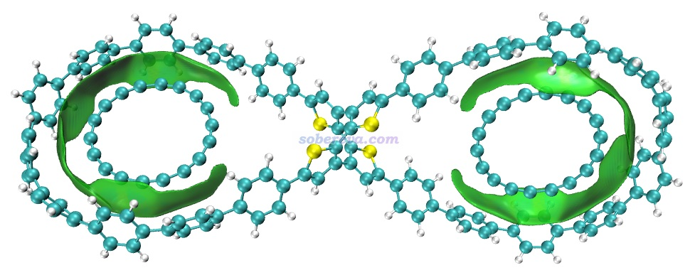

**通过格点屏蔽巨幅降低IGMH可视化分析片段间相互作用的耗时**  
Significantly reducing computational cost of IGMH visual analysis for interfragment interactions via grid screening

文/Sobereva@[北京科音](http://www.keinsci.com)  2025-Nov-24

## 1 说明

《使用Multiwfn做IGMH分析非常清晰直观地展现化学体系中的相互作用》（<http://sobereva.com/621>）中介绍的笔者提出的IGMH方法已经被广泛用于直观分析考察化学体系中的相互作用。这种分析最主要的组成部分是计算δg、δg_inter、δg_intra、sign(λ2)ρ的格点数据，这也是这种分析最耗时的过程。对于大体系，特别是在CPU比较弱的机子上，IGMH计算格点数据的分析耗时往往挺高。

大多数人用IGMH方法主要是作图分析考察片段间相互作用，这种情况实际上只需要对片段间重叠的区域计算δg_inter和sign(λ2)ρ格点数据就行了，其它区域的格点完全都不需要计算。考虑到这一点，从2025-Nov-24更新的Multiwfn版本开始，支持了一种巨幅节约IGMH图形化考察片段间相互作用耗时的做法，具体来说是这样的：在Multiwfn的settings.ini文件中现在有一个参数名为IGMvdwscl，一个片段的表面是由其中各个原子的范德华半径乘以这个系数对应的原子球叠加构成的表面。在做IGMH或mIGM或IGM分析过程中计算格点数据的那一步，如果某个格点出现在两个或多个片段的表面之间的重叠区域内，则这个格点就会被计算，否则会被直接忽略。利用这个策略，往往可以令IGMH格点数据计算过程耗时降低好几倍甚至更多。能节约百分之多少耗时具体取决于你设的格点数据分布的盒子范围包含了多少可以被忽略的格点。显然，用了这个策略后就只能对δg_inter函数的等值面作图了，而不能对δg和δg_intra等值面作图，因为只有δg_inter的等值面才肯定会落在片段间重叠区域。

IGMvdwscl默认为0，代表不启用这种节约耗时的策略。如果要启用此策略，就恰当设其数值，设得越大降低耗时效果越低，设得越小越有可能截断δg_inter等值面。一般建议用2.0，既足够安全，节约耗时的效果又足够显著。

## 2 实例

在《8字形双环分子对18碳环的独特吸附行为的量子化学、波函数分析与分子动力学研究》（<http://sobereva.com/674>）文中介绍了我研究的OPP双环分子与两个18碳环形成的超分子复合物，文中给出了IGMH图，OPP、第一个碳环、第二个碳环各定义为一个片段。以这个体系为例，我们对比一下用和不用前述加速策略的耗时，在拥有24个物理核心的i9-13980HX CPU上Multiwfn用24核并行计算。这个体系的波函数文件2C18_OPP.wfn在这个压缩包里：<http://sobereva.com/attach/756/2C18_OPP.7z>。体系总共260个原子，5504个GTF（碳环用的6-311G*基组，OPP双环分子用的6-31G*）。

启动Multiwfn，载入2C18_OPP.wfn，然后输入  
20  //弱相互作用可视化分析  
11  //IGMH分析  
3  //定义三个片段  
243-260   //第1个片段原子序号  
225-242  //第2个片段原子序号  
c  //其它原子作为第3个片段  
4  //自定义格点间距或格点数，格点覆盖整个体系  
0.2  //0.2 Bohr

格点数据计算总耗时达到600秒，虽然不算太长，但也得在屏幕前等好一阵，对于明显更大的体系或者更弱的CPU没准要花一个小时。对导出的格点数据用VMD作图，0.002等值面的图如下所示。

注意在Multiwfn计算完格点数据后在屏幕上还显示了三种函数的全空间积分值，对应相应格点数据数值的总和乘上格子体积：

 Integral of delta-g over whole space:        231.384179 a.u.  
  Integral of delta-g_inter over whole space:    1.184764 a.u.  
  Integral of delta-g_intra over whole space:  230.199414 a.u.

下面看看使用节约耗时策略后的情况。把settings.ini里的IGMvdwscl设为2，重新启动Multiwfn并重复前面的操作，计算格点数据之前会有以下提示，说明90.96%的格点都被忽略掉了。

 Prescreening grids with IGMvdwscl parameter:  2.00  
 Percent of screened grids:     90.96%

计算总共耗时仅为90秒，只有之前耗时的15%！当前看到的格点数据积分值如下，可见δg_inter函数的积分值几乎没变，充分说明了当前没有忽略掉δg_inter主要分布区域的格点。

 Integral of delta-g over whole space:         41.955223 a.u.  
  Integral of delta-g_inter over whole space:    1.179150 a.u.  
  Integral of delta-g_intra over whole space:   40.776072 a.u.

用导出的格点数据再次绘制sign(λ2)ρ着色的δg_inter图，会看到得到的图和上面的没有任何差别！另外，使用这种降低耗时的策略也完全不会影响δg_inter与sign(λ2)ρ之间的散点图。

由此例可见，将IGMvdwscl设为2是非常安全的巨幅加速IGMH可视化展现片段间相互作用的策略，推荐使用！这个策略对《使用mIGM方法基于几何结构快速图形化展现弱相互作用》（<http://sobereva.com/755>）介绍的mIGM方法同样奏效，只不过mIGM方法本身耗时就远远低于IGMH，对于本文的例子一瞬间就算完，因此这个策略对mIGM不会带来可查觉的收益。

至于IGMH、mIGM、IGM分析的后处理菜单中的计算δG_atom和δG_pair指数的功能，和本文介绍的加速策略无关，IGMvdwscl的设置不影响其耗时和结果。
