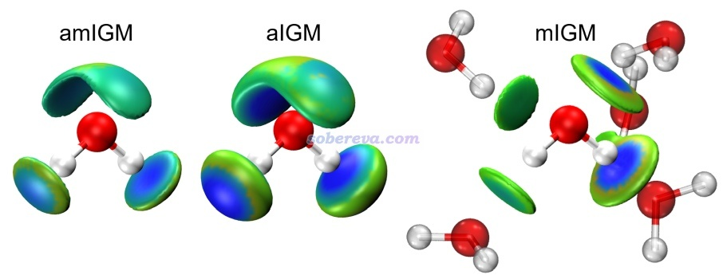
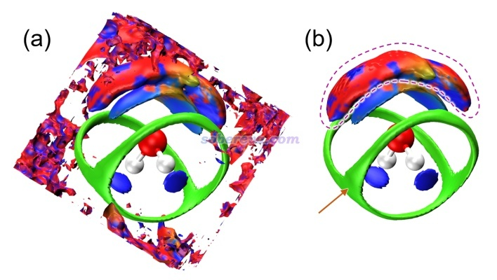
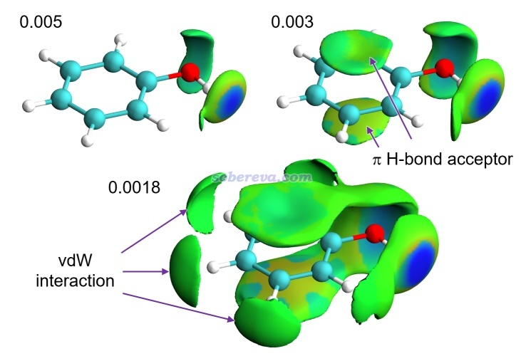
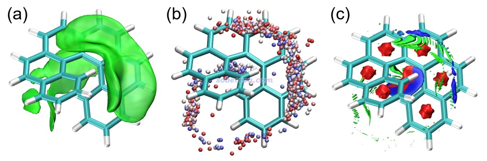
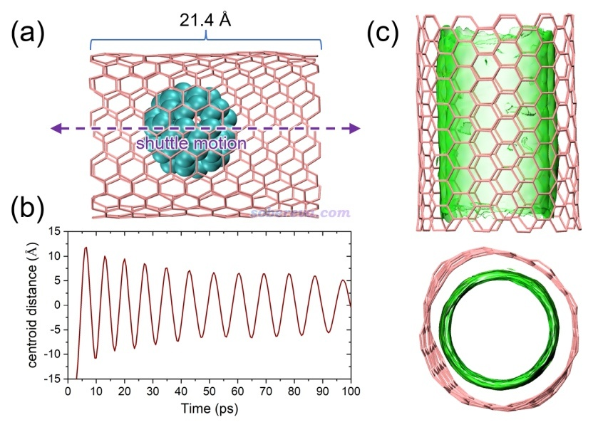
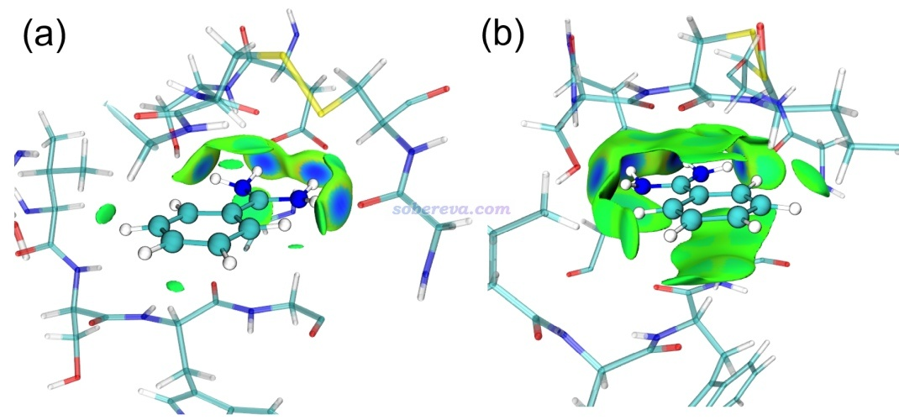
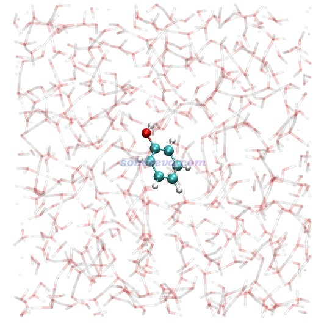

**使用amIGM方法图形化直观展现动态过程中的平均弱相互作用**  
Using amIGM method to graphically and intuitively represent averaged weak interactions in a dynamic process

文/Sobereva@[北京科音](http://www.keinsci.com)   2025-Dec-9

## 0 前言

mIGM是笔者在Struct. Bond., 190, 297 (2026) DOI: 10.1007/430_2025_95中提出的能够非常快速、直观地展现自定义片段间相互作用的方法，实用性极强，在《使用mIGM方法基于几何结构快速图形化展现弱相互作用》（<http://sobereva.com/755>）中做了专门介绍并演示了怎么通过Multiwfn程序实现，如果没看过此文的话一定要先看看。在同一篇论文里，基于mIGM方法笔者还进一步提出了amIGM方法，全称为averaged mIGM，此方法可以展现动态环境中的片段间的平均弱相互作用。amIGM方法远远比我以前在《使用Multiwfn研究分子动力学中的弱相互作用》（<http://sobereva.com/186>）中介绍的与它用处类似的aNCI方法好用，因此aNCI方法完全可以弃了！

下面第1节将介绍amIGM并与其它方法对比，第2节介绍一些计算要点，第3节将会示例如何通过Multiwfn程序做amIGM分析重现amIGM原文中的图。读者请务必使用2025-Dec-8及以后更新的Multiwfn版本。如果你对Multiwfn不了解，强烈建议看《Multiwfn FAQ》（<http://sobereva.com/452>）和《Multiwfn入门tips》（<http://sobereva.com/167>）。

**使用Multiwfn做amIGM分析发表文章时应同时引用上面提到的amIGM原文以及Multiwfn启动后提示的程序原文，也推荐一起引用我发表的包含amIGM在内的相互作用可视化分析方法综述Angew. Chem. Int. Ed., 137, e202504895 (2025)，此文的介绍见**[**http://sobereva.com/746**](http://sobereva.com/746)**。**

## 1 amIGM方法介绍

### 1.1 amIGM方法的特点

这里假定读者已经了解mIGM方法，也看过了《一篇最全面介绍各种弱相互作用可视化分析方法的文章已发表！》（<http://sobereva.com/667>）和《Angew. Chem.上发表了全面介绍各种共价和非共价相互作用可视化分析方法的综述》（<http://sobereva.com/746>）这两篇综述以及《使用Multiwfn做IGMH分析非常清晰直观地展现化学体系中的相互作用》（<http://sobereva.com/621>）了解了sign(λ2)ρ着色的δg_inter等值面是怎么一回事。mIGM、IGMH、IRI、NCI等方法都是对于单一几何结构做的分析，然而现实中分子是在不断运动的，因此分子间相互作用也是随时间变化的，有很多情况光是用一帧或几帧结构进行分析是明显无法全面描述动态环境中出现的相互作用的情况的。amIGM方法将mIGM扩展到了动态环境中的弱相互作用的分析上，对分子动力学模拟得到的几百甚至几千帧结构进行计算，其等值面能够展现模拟过程中存在的分子间的平均的相互作用，具体实现细节可以看前述Struct. Bond.原文中的第4节。

amIGM与mIGM间的关系高度类似于aNCI（也叫aRDG）和NCI间的关系，amIGM相较于aNCI有以下关键性优点：  
(1)amIGM可以自定义片段、只展现特定片段间的相互作用。而aNCI会同时把所有弱相互作用都展示出来，经常导致图像非常混乱。虽然可以靠Multiwfn的格点数据屏蔽功能做后处理来一定程度上屏蔽掉不想要的aNCI等值面，但不仅麻烦而且原理明显不如amIGM优雅  
(2)可以通过调节amIGM的等值面数值决定是只展现较显著的弱相互作用，还是也把不太显著的弱相互作用一同展现。而aNCI没法做这个区分  
(3)amIGM的等值面明显不像aNCI那么容易在边缘出现很严重的难看的锯齿  
(4)aNCI经常会出现一些没任何意义、不对应实际弱相互作用的垃圾等值面，而amIGM没这个问题  
相比之下，aNCI没有继续用的价值。Multiwfn里还支持我之前提出的aIGM，是把IGM扩展到研究动态环境，但其等值面和IGM一样非常臃肿，远不如amIGM好，因此也没有使用价值。原理上也可以把依赖于波函数的IGMH方法扩展成aIGMH，但用起来必定十分昂贵（无论是AIMD产生巨量数目的波函数文件还是aIGMH分析过程），所以笔者并没有对其效果进行检验以及在Multiwfn中实现。

### 1.2 amIGM的实际效果

下面列举amIGM的一些应用例子，令读者能充分了解amIGM的价值，图都来自于amIGM原文。

下面的amIGM和aIGM图是对标况的水盒子进行动力学模拟后得到的平均的sign(λ2)ρ着色的平均的δg_inter等值面图，用于展示一个水分子和周围的水分子间的相互作用，周围的不断运动的水的结构没有画出来。这里sign(λ2)ρ使用标准的色彩变化方式和范围，和《使用mIGM方法基于几何结构快速图形化展现弱相互作用》（<http://sobereva.com/755>）里第一张图相同，后同。由下图可见amIGM图很好地把这个水分子作为氢键给体和作为氢键受体的特征展现了出来，等值面精确出现在氢键会出现的范围，非常对称，而且形状优雅、易于观看，并且淡蓝色还明确体现出其作用强度比普通范德华作用更大。aIGM的等值面虽然和amIGM相似，但过于鼓囊、肥大，丑多了，而且O-H冲着的等值面还蓝得过头了（显得化学键作用似的）。

上面的mIGM图是对动力学过程中随便取的一帧算的，可见中心水分子周围四个等值面虽然各对应一个氢键，但与水分子的C2v对称性明显不符，显然无法像amIGM那样如实地描述液态水中的平均的相互作用。

作为对比，下面给出aNCI方法的图，做法在<http://sobereva.com/186>里有。下图左边部分是aNCI直接出的图，可见有一大堆红蓝相间的零碎的等值面，严重扰乱视觉。用Multiwfn做格点数据屏蔽后得到右图，依然明显不理想。虚线标注的那一大坨红蓝相间的等值面完全意义不明，箭头所示的绿色分叉的等值面的存在也难以理解，说不清楚是什么玩意儿。可见aNCI远不如amIGM。

下面这张图是amIGM方法展示的水中的苯酚与周围的水之间的相互作用，三张图分别对应不同数值的δg_inter等值面。可见0.005的图把苯酚与水之间的氢键作用区域很清楚地展现了出来，数值更小的0.003的图还同时把水与苯酚之间形成pi-氢键的位点展现了出来，数值最小的0.0018的图还同时把苯酚与水之间范德华作用为主的区域明确地展现了出来。

范德华势是笔者之前提出的弱相互作用的重要分析方法，在《谈谈范德华势以及在Multiwfn中的计算、分析和绘制》（<http://sobereva.com/551>）中对螺烯吸附He原子体系用范德华势等值面图的分析方法很好地解释了动力学模拟得到的He的密度分布。下图(b)是模拟过程中He的位置的叠加图（每隔一定帧数绘制一次，按照帧号由小到大颜色按照蓝-白-红变化）。下图(a)是amIGM等值面图，由于螺烯与He的范德华作用极弱，所以平均的δg_inter的等值面数值用的是非常小的值。可见amIGM图很清晰直观地展现了在模拟过程中螺烯在哪些区域与He原子有相对明显的相互作用，和(b)图能很好地对应上，充分说明了amIGM的合理性。下图(c)图是aNCI图，可见效果十分不堪入目，乱七八糟！

下面是富勒烯在碳纳米管体系中的动力学模拟，(a)是体系示意图，(b)是模拟过程中富勒烯质心位置，可见由于动能-势能反复交换，富勒烯在碳管中反复穿梭做活塞运动。(c)是对这个动力学过程绘制的amIGM图，两种视角都给出了。可见等值面均匀、完整覆盖了碳管内壁，充分体现出整个模拟过程中富勒烯与碳管在这些区域的作用相当充分和均匀。

我在《使用Multiwfn做aNCI分析图形化考察动态过程中的蛋白-配体间的相互作用》（<http://sobereva.com/591>）中曾示例如何用aNCI方法考察苄脒阳离子配体与胰蛋白酶间的动态平均的弱相互作用，下图是这个体系的amIGM分析的结果。(a)是0.006 a.u.等值面，(b)是更小的0.003 a.u.等值面，注意蛋白质部分的结构是动力学轨迹中随便取的一帧绘制的。由(a)图可清晰地看到配体的两个氨基与蛋白质有四处鲜明的氢键作用（作用中心区域的等值面明显发蓝）。(b)图的等值面范围更大，可以进一步看到配体在很多区域和蛋白质间也有显著的范德华主导的相互作用，对应绿色等值面区域。

## 2 amIGM分析的输入文件和一些要点

这一节专门说一下用于Multiwfn做amIGM分析用的输入文件如何合理地准备，以及计算必须知道的要点。

做amIGM需要用户提供跑分子动力学得到的xyz轨迹文件，对此格式不了解的话看《谈谈记录化学体系结构的xyz文件》（<http://sobereva.com/477>）。VMD可以载入GROMACS、AMBER、CP2K、LAMMPS等诸多程序跑动力学得到的轨迹文件，选择File - Save coordinate并且选xyz格式，就可以得到xyz轨迹文件。

标准的xyz文件里每个原子的名字都是元素名，给Multiwfn做amIGM分析的文件应当满足这一点，因为只有判断对了元素，amIGM分析的结果才是合理的。如果原子的名字不是元素名，Multiwfn会根据名字猜元素（自动去掉其中的数字，然后试图匹配各个元素名以确定元素，比如N2会被判断为氮，CA会被判断为钙），若猜错了则准分子密度无法正确构造，会导致amIGM结果虚假甚至离谱。自己用文本编辑器打开xyz文件看一下便知是否记录的是元素名，也可以看Multiwfn载入xyz文件后看屏幕上提示的化学组成是什么（即各种元素都是多少个原子）确认Multiwfn是否判断对了元素。  
注：pdb格式专门定义了一列用于记录元素名，当前目录下如果有和载入的xyz文件名相同但后缀是pdb的文件，Multiwfn就会优先从pdb文件记录元素的那一列里读取元素名。如果pdb里对某些原子没有提供元素名，对这些原子Multiwfn仍会根据xyz文件里的原子名去猜。

做amIGM分析和mIGM一样需要定义片段。一般只定义两个片段，这种情况下，第1个片段必须对应轨迹中坐标被固定的部分，amIGM图会展示它与第2个组（运动的部分）的相互作用。例如之前展示的例子中，纯水盒子的模拟中一个水要被固定并作为第1个组；苯酚+水的轨迹中苯酚要被固定并作为第1个组；配体+蛋白质的轨迹中配体是被固定的并作为第1个组；富勒烯+碳纳米管的轨迹中碳纳米管要被固定并作为第1个组...再比如，如果研究固体表面吸附分子，表面要被固定并作为第1个组。被固定的部分在动力学模拟过程中可以用冻结（freeze）将坐标严格固定住，也可以用位置限制势结合足够大的力常数将坐标基本固定住。也可以动力学时先不做固定，等动力学跑完之后用VMD的Extensions - RMSD trajectory tool插件或者用GROMACS的trjconv命令结合-fit rot+trans做叠合（align）将第1个组对应的部分消除平动转动（但如果在align处理后第1个组的结构在整个轨迹中还是有较大变化，比如某个要考察相互作用的基团反复翻转，就不适合做amIGM分析了，至少对这个区域而言）。

模拟的体系里面的原子数不要太多，够用就行了，要不然amIGM分析起来慢，轨迹文件也大。比如考察水中的苯酚与水的相互作用，只要模拟的盒子比苯酚稍微大一圈，往盒子里充满水，进行动力学模拟就行了，不要把盒子尺寸弄得过大而导致填充的水太多。做amIGM分析用的动力学轨迹也可以是从完整轨迹中抠出来的一部分。比如考察水中的蛋白质与配体间的相互作用，做动力学的时候肯定是蛋白质+配体+溶液的模型，而做amIGM分析用的轨迹文件只需要包含蛋白质+配体部分即可，水的部分应该去除以避免严重浪费时间。当蛋白质较大的时候，为了避免耗时过高，还应当借助VMD的选择语句（见《VMD里原子选择语句的语法和例子》<http://sobereva.com/504>）只把配体以及与配体有明显相互作用的氨基酸残基抠出来成为一个簇并保存成轨迹文件。

用于amIGM分析的凝聚相体系（如水中的苯酚）的动力学模拟最好在NVT下进行（以避免控压导致的原子位置改变对结果可能产生的不良影响），在此之前应先做NPT平衡相模拟使得盒子尺寸达到充分的平衡。

amIGM分析用的轨迹文件记录的帧显然应该涵盖你希望考察弱相互作用的模拟阶段。比如你希望考察稳定状态下蛋白质与配体的相互作用，显然应该取结构已经达到稳定的阶段。而如果模拟过程中配体反复在两种明显不同的构象A-B之间变化，我建议对轨迹做簇分析，把处于A构象的那些帧和B构象的那些帧分别提取成两个轨迹文件，分别做amIGM分析，从而能考察这两个构象与蛋白质相互作用的区别。

amIGM分析耗时和考虑的轨迹帧数呈线性正比。显然考虑的帧数越多，amIGM的结果原理上越好、其图像越能如实表现出模拟过程中的片段间平均的弱相互作用。一般建议至少考虑200帧。如果发现效果不够好，比如等值面不够连贯、不能如预期般充分完整展现平均相互作用，则应当考虑更多帧。这一点类似于计算空间分布函数（sdf），采样越充分越好。

再说一下amIGM分析用的格点。读者请先阅读《Multiwfn FAQ》（<http://sobereva.com/452>）的Q39了解格点设置的基本知识。格点数据所处的盒子范围固定的情况下，格点间距越小，amIGM等值面越平滑、格点数越多、耗时越高、Multiwfn导出的cube文件越大，通常0.2 Bohr格点间距就已经够用了，要更好一点可以用0.15 Bohr。盒子的范围应该囊括并尽量刚好囊括感兴趣的弱相互作用可能出现的区域，避免该有的等值面不出现或被截断，以及避免浪费格点用于描述无意义的区域。

Multiwfn的amIGM分析过程中会自动使用节约耗时的策略，如果一个格点与第1个片段在第1帧中的任意一个原子的距离在其scaled范德华半径内，而且这个格点与其它片段的任意原子的距离在整个轨迹中至少有一次在其scaled范德华半径内，这个格点才会被考虑，否则在计算过程中会被忽视。这里scaled范德华半径是指范德华半径与Multiwfn的settings.ini中的amIGMvdwscl参数的乘积。amIGMvdwscl默认为2.0，足够稳妥又能显著节约耗时。但如果极个别情况下发现等值面看起来像是被截断了，应将amIGMvdwscl设得更大或者设为0关闭此策略。

## 3 amIGM计算实例

本节将会具体演示如何绘制出来1.2节展示的各种amIGM图，用到的xyz轨迹文件都给出了，除了螺烯+He原子的体系外都是我用GROMACS程序跑出来的。GROMACS做动力学模拟的方法在北京科音分子动力学与GROMACS培训班（<http://www.keinsci.com/KGMX>）里讲授得极为详细，学过一遍后这些轨迹文件肯定都能自己跑出来。螺烯+He原子的体系是我用xtb程序跑的，在北京科音高级量子化学培训班（<http://www.keinsci.com/KAQC>）的“从头算分子动力学”部分专门全面系统讲了怎么用xtb跑动力学并给了很多例子，其中就包括这个例子。

值得一提的是，虽然amIGM分析可以支持周期性，但这些xyz文件里并没有加入Multiwfn可以识别的盒子信息（如果加入的话，需要在注释行写入盒子的三个矢量，诸如Tv_1: 7.426 0.0 0.0 Tv_2: 3.6 6 6.40 0.0 Tv_3: 0.0 0.0 10.0）。因为这些例子中计算格点数据的区域都没有离模拟用的盒子边界太近，因此不需要考虑周期性。

### 3.1 水中的苯酚与水的相互作用

这个例子的轨迹文件phenol_wat.xyz在此压缩包里：<http://sobereva.com/attach/759/phenol_wat.7z>。体系共1342个原子，在模拟过程中苯酚在盒子中央被固定。NVT下模拟了1 ns（之前已经过了平衡相模拟），每1 ps保存一帧，故xyz轨迹文件共1001帧。模拟控温在298.15 K。第1帧的结构如下所示，苯酚原子（1-13号原子）用CPK方式显示，水用透明棍状方式显示。

启动Multiwfn，载入phenol_wat.xyz，然后输入  
20  //弱相互作用可视化分析  
-12  //amIGM分析  
2  //定义两个片段  
1-13  //作为第1个片段的苯酚的原子序号  
c  //其它原子作为第2个片段  
[回车]  //考虑所有帧  
11  //围绕接下来指定的片段往各方向延展一定距离来定义计算格点数据的空间范围  
1-13  //苯酚片段的原子序号  
3 A  //延展距离为3埃，对此例够大了  
[回车]  //用默认的0.2 Bohr格点间距。这个格点间距对应的图像质量足够好了，想要等值面的边缘锯齿更少可以降低到0.15 Bohr，但耗时多一倍多

在双路7R32服务器上96核并行计算的总共耗时约100秒。在后处理菜单选3将平均的sign(λ2)ρ和平均的δg_inter格点数据分别导出为当前目录下的avgsl2r.cub和avgdg_inter.cub，然后放到VMD目录下。再把Multiwfn的examples目录下的aIGM.vmd脚本放到VMD目录下。之后启动VMD，在命令行窗口输入source aIGM.vmd执行脚本，就会马上显示出amIGM图。在VMD里进入Graphics - Representation界面可以看到两个显示方式（简称为Rep）。选择Isosurface对应的Rep后可以在界面里改Isovalue值，在Trajectory标签页里可以改色彩刻度范围。将Isovalue设为比如0.003，并且将CPK显示方式的Rep的Selected Atoms设为serial 1 to 13后，看到的图像就和1.2节展示的这个体系的图像一样了，一些箭头、文字自行ps上去即可。

如aIGM.vmd脚本的内容可以看到，默认的等值面数值是0.008，默认的色彩刻度范围是-0.05到0.05，都可以自己改。色彩刻度范围设得越小，等值面上不同特征的相互作用区域的颜色差异越大。

### 3.2 螺烯与被吸附的He原子的相互作用

这个例子的通过xtb程序用GFN0-xTB方法跑出来的轨迹文件helicene-He.xyz在此压缩包里：<http://sobereva.com/attach/759/helicene-He.7z>。体系共43个原子，控温在10 K做了2500 ps动力学，从中均匀取了1000帧。轨迹跑完后，用VMD自带的RMSD Trajectory tool工具对螺烯部分做了align来消除其平动和转动，因此虽然在模拟过程中没有对螺烯做固定，经过这么处理后，整个轨迹中螺烯的位置、朝向都没变。并且本身螺烯是刚性的，结构波动程度甚微。

启动Multiwfn，载入helicene-He.xyz，然后输入  
20  //弱相互作用可视化分析  
-12  //amIGM分析  
2  //定义两个片段  
1-42  //作为第1个片段的螺烯的原子序号  
c  //其它原子作为第2个片段  
[回车]  //考虑所有帧  
11  //围绕接下来指定的片段往各方向延展一定距离来定义计算格点数据的空间范围  
1-42  //螺烯片段的原子序号  
2 A  //延展距离设2埃  
[回车]  //用默认的0.2 Bohr格点间距

在双路7R32服务器上96核并行计算的总共耗时约40秒。按前例在VMD中显示出等值面后，再把等值面数值设为很小的0.00004，图像就和第1.2节所示的这个体系的图一样。

### 3.3 富勒烯与碳纳米管的相互作用

这个例子的GROMACS程序结合GROMOS力场跑出来的轨迹文件CNT_C60.xyz在此压缩包里：<http://sobereva.com/attach/759/CNT_C60.7z>。体系共456个原子，一开始把富勒烯放在距离碳纳米管管口一定距离处。模拟过程控温在200 K。模拟共100 ps，每0.5 ps保存一帧，故轨迹共201帧。轨迹跑完后，用VMD的RMSD Trajectory tool工具对碳纳米管部分做了align来消除其整体运动。

启动Multiwfn，载入CNT_C60.xyz，然后输入  
20  //弱相互作用可视化分析  
-12  //amIGM分析  
2  //定义两个片段  
1-396  //作为第1个片段的碳纳米管的原子序号  
c  //其它原子作为第2个片段  
[回车]  //考虑所有帧  
11  //围绕接下来指定的片段往各方向延展一定距离来定义计算格点数据的空间范围  
1-396  //碳纳米管片段的原子序号  
0  //延展距离设为0，因为等值面只在纳米管内壁区域出现  
0.15  //用0.15 Bohr格点间距

按照之前的做法在VMD里作图，等值面数值设0.0001，就可以看到1.2节给出的此体系的图像。

### 3.4 配体与蛋白质的相互作用

这个例子的动力学模拟是用GROMACS程序结合GROMOS力场对完整蛋白质+配体+溶剂做的，在NPT预平衡后在NVT系综下模拟了1 ns，每1 ps保存一帧，共1001帧，模拟过程中将配体部分做了冻结。随后用VMD将轨迹中配体与相邻的蛋白质残基截出来构成团簇，共161原子，轨迹文件cluster.xyz在此压缩包里：<http://sobereva.com/attach/759/cluster.7z>。由于这个xyz文件里的原子名不是元素名，因此此压缩包里还提供了cluster.pdb，里面记录了各个原子的元素信息，从而使得Multiwfn能正确识别元素。这些文件的产生方式在《使用Multiwfn做aNCI分析图形化考察动态过程中的蛋白-配体间的相互作用》（<http://sobereva.com/591>）的第2、3节有详细说明（那篇文章里文件名叫cluster），因此这里不再累述。

把cluster.xyz和cluster.pdb放在相同目录下。启动Multiwfn，载入cluster.xyz，如屏幕上的提示所示元素信息从cluster.pdb中读取了，显示的化学组成H72 C53 N16 O18 S2完全正确。然后依次输入  
20  //弱相互作用可视化分析  
-12  //amIGM分析  
2  //定义两个片段  
144-161  //作为第1个片段的配体的原子序号  
c  //其它原子作为第2个片段  
[回车]  //考虑所有帧  
11  //围绕接下来指定的片段往各方向延展一定距离来定义计算格点数据的空间范围  
144-161  //配体的原子序号  
3 A  //延展距离设为3埃  
0.15  //用0.15 Bohr格点间距

在双路7R32服务器上96核并行计算的总共耗时110秒。按照之前的做法在VMD里作图，等值面数值设0.006或0.003，并恰当在VMD里设置配体和周围残基的显示方式，就可以看到1.2节给出的此体系的图像。

## 4 总结

本文充分介绍了笔者在Struct. Bond., 190, 297 (2026)中提出的amIGM分析方法，并通过四个例子演示了amIGM在Multiwfn中的分析操作。由本文可见，amIGM分析可以非常生动直观地展现动力学过程中的分子间的平均的弱相互作用，而且分析步骤操作简单，因此非常推荐大家将之应用于实际问题的研究中。amIGM的图像效果远好于aNCI，而耗时相仿佛，因此aNCI就不需要再考虑了。
