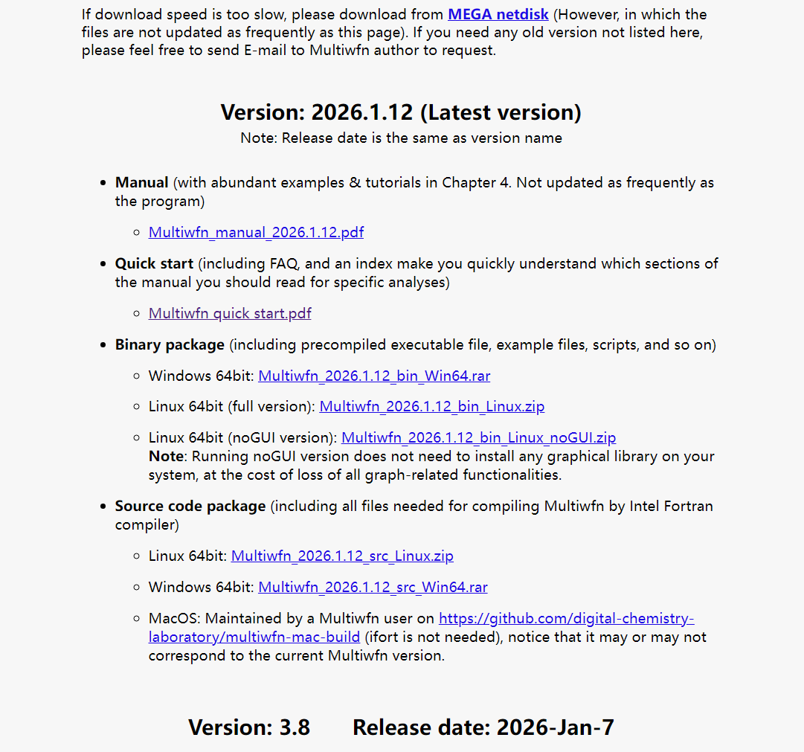

**Multiwfn 3.8正式版发布！以及未来版本号命名规则的说明**

文/Sobereva@[北京科音](http://www.keinsci.com)   2026-Jan-13

Multiwfn 3.7是于2020年8月14日发布的，之后笔者开始开发Multiwfn 3.8。在过去的5年多里Multiwfn 3.8的开发版（development version）在Multiwfn官网<http://sobereva.com/multiwfn>上频繁更新（甚至有时一天就更新两次），累积已经被更新了好几百次，名字都叫Multiwfn 3.8(dev)，官网的下载页面上和Multiwfn启动后屏幕上的提示都非常明确地显示了更新日期（last update），显然不说更新日期而只说Multiwfn 3.8(dev)是毫无意义的。

**Multiwfn 3.8已经于2026年1月7日正式在官网上发布！**相对于3.7的海量更新见后文。每次更新后在官网的Update history页面都能看到更新内容。大部分这些更新都早已体现在笔者在计算化学公社论坛（<http://bbs.keinsci.com/forum.php>）和思想家公社QQ群（<http://sobereva.com/QQrule.html>）中笔者的答疑里、体现在笔者过去五年多来写过的好几十篇Multiwfn相关博文里（汇总见《Multiwfn入门tips》<http://sobereva.com/167>）、体现在过去很多届的北京科音量子化学波函数分析与Multiwfn程序培训班（<http://www.keinsci.com/WFN>）的课程内容里，以及体现在2025年8月发表的Multiwfn最新介绍文章J. Chem. Phys., 161, 082503 (2024) DOI: 10.1063/5.0216272里。

为了在未来令Multiwfn既便于频繁更新同时也便于用户区分版本、免得需要提及开发版的更新日期，**未来Multiwfn的版本**不再采用频繁更新的开发版累积到一定程度后发布正式版的形式，而是**以更新日期直接命名**。例如Multiwfn在2026年1月12日发布的版本（目前已发布）直接就叫Multiwfn 2026.1.12，对应的Windows版可执行程序压缩包名字为Multiwfn_2026.1.12_bin_Win64.rar，解压后得到的目录为Multiwfn_2026.1.12_bin_Win64，因而直接根据压缩包名和目录名就可以区分具体版本。

在未来官网上的Multiwfn的手册不会像程序版本更新频率那么高，比如仅修复一个bug不会同步更新手册。

目前的官网上的下载页面截图：

根据Google学术，Multiwfn如今已被学术文章引用约四万次，在此顺带感谢广大Multiwfn用户过往对程序开发的支持，以及在发表的文章中**正确引用Multiwfn启动后提示的两篇程序介绍原文（2012年JCC文章和2024年JCP文章，应同时引用）**。

附：Multiwfn 3.8相对于3.7的所有新功能、改变/改进、bug修正、手册更新。方框里是相应日期的Multiwfn 3.8(dev)版所做的改变

## ******** NEW FUNCTIONS ******

[2026-Jan-7] Option 8 has been added to the CHELPG and MK charge fitting interfaces. If it is switched to "Yes", then additional constrains are applied so that the fitted atomic charges will exactly reproduce the electric dipole moment calculated based on wavefunction.  
[2025-Nov-20] Subfunction 19 is added to the grid data processing function (main function 13). This function is able to translate grid data along different axes by specific distances, so that interesting region can be approximately centered in the box for ease of inspection. See Section 3.16.15 of manual for details.  
[2025-Aug-3] Now Multiwfn is able to analyze wavefunctions of very high levels such as CCSD(T), CCSDT, MP5, etc. generated by AUTOCI module based on json file of ORCA 6.1. See updated Section 4.A.8 of Multiwfn manual for example.  
[2025-Jul-10] Option 19 has been added to post-processing menu of main function 4. This option enables showing extrema of a function on a contour line. For example, positions of maxima and minima of electrostatic potential can be highlighted on a contour line of electron density. See Section 4.4.12 of manual on illustration of this option.  
[2025-Apr-13] The electron density polarization analysis based on electron excitations proposed in J. Phys. Chem. A, 124, 633 (2020) has been implemented as subfunction 17 of main function 18. This method is able to provide very valuable insight into the nature of electron density polarization under an external perturbation (e.g. point charge), and can be used to study substitution effect, mechanism of electrophilic/nucleophilic reactions, atomic polarizability, and so on. See Section 3.21.17 of Multiwfn manual for introduction and Section 4.18.17 for example.  
[2025-Feb-14] (IMPORTANT) The modified IGM (mIGM) recently proposed by Tian Lu has been supported. This is a new variant of IGM aiming at visually studying interactions in chemical systems. mIGM only depends on atomic coordinates like IGM, and its computational cost is basically the same as IGM. At least for studying weak interactions, the isosurfaces and coloring effect of mIGM is nearly the same as IGMH. Therefore, when IGMH cannot be used due to high computational cost or unavailability of wavefunction, mIGM is the best alternative! See Section 3.23.10 of Multiwfn manual for introduction and Section 4.20.12 for example.  
[2025-Feb-14] (IMPORTANT) The averaged modified IGM (amIGM) recently proposed by Tian Lu has been supported. amIGM extends mIGM analysis to fluctuation environment, and thus can visually reveal interactions involved in molecular dynamics simulation. amIGM is significantly better than aNCI method: amIGM allows users to define fragments to specifically study interactions between them, and users do not need to screen out unwanted isosurfaces. Also the isosurfaces of amIGM is smoother than aNCI, and sometimes aNCI is fully failed when amIGM works reasonably. amIGM analysis cost is only two or three times of aNCI. See Section 4.20.13 for example of performing amIGM analysis. aIGM and aNCI methods are useless now because amIGM is always the better choice.  
[2025-Feb-4] New aromaticity indices, HOMAc and HOMER, which were proposed in Phys. Chem. Chem. Phys., 25, 16763 (2023) and J. Org. Chem., 90, 1297 (2025), respectively, have been supported. They are reparameterized versions of HOMA. HOMAc performs better than HOMA in determining S0 state aromaticity, and HOMER is able to characterize aromaticity in T1 state (HOMA is fully failed for this case). HOMAc and HOMER can be calculated by subfunctions 6a and 6b in main function 25, respectively. See Section 3.28.7 of Multiwfn manual for more information.  
[2024-Nov-13] Fractional Occupation Number Weighted Electron Density (FOD) proposed by Grimme in Angew. Chem. Int. Ed., 54, 1 (2015) has been supported as the 90th user-defined function. This is an important and convenient method to visualize electron static correlation in local regions and quantify static correlation of the whole system. See introduction and analysis example of FOD in Section 4.A.7.1 of Multiwfn manual.  
[2024-Oct-21] Stress tensor defined by Bader now can be outputted for any position in main function 1, and can be outputted for critical points by option 7 in topology analysis module. Stress tensor stiffness and stress tensor polarizability are shown together, and they are also available as the 116th and 117th user-defined functions, respectively, see corresponding part of Section 2.7 of Multiwfn manual for details. In addition, stiffness of electron density is available as the 115th user-defined function.  
[2024-Aug-27] Crystal overlap Hamilton populations (COHP) now can be plotted via main function 10, see Section 3.12.6 of Multiwfn manual for introduction and Section 4.10.7 for example.  
[2024-Jul-13] The FiPC-NICS aromaticity index proposed in Inorg. Chem., 53, 3579 (2014) has been supported in subfunction 13 of main function 25, see Section 3.28.13 of Multiwfn manual to gain basic knowledge about it and see Section 4.25.13.3 for calculation example.  
[2024-Jun-29] Promolecular wavefunction now can be generated by combining atomic .wfn files, see Section 6.6.5 of Multiwfn manual for details.  
[2024-Jun-24] Subfunction 33 has been added to fuzzy analysis module, which is used to calculate fragment overlap matrix (FOM) for one or two fragments (See Section 3.18.4 of manual for details). The result is outputted to FOM.txt, which can be loaded in the newly added option 4 in BOD/NAdO module to perform analysis. Compared to the tranditional way of performing fragment-based BOD/NAdO analysis (i.e. exporting AOM.txt in fuzzy analysis module first, and load it into BOD/NAdO module), this new way is much cheaper if the two fragments totally have small number of atoms when the system is large, because only AOMs of these atoms will be evaluated before building the FOM.  
[2024-Jun-14] The interfragment delocalization index (IFDI) proposed in Phys. Chem. Chem. Phys., 24, 11486 (2022) has been supported as option 44 of main function 15 (fuzzy analysis module). IFDI is useful in quantifying overall extent of electron delocalization, see updated Section 3.18.5 of Multiwfn manual for description. This option also outputs fragment localization index (FLI) together.  
[2024-May-23] Modified LOBA (unpublished, proposed by Tian Lu) has been supported to calculate oxidation states, which is much better choice than LOBA. See Section 3.10.100 for introduction and Section 4.8.4 of manual for example and relevant discussions.  
[2024-May-16] Subfunction 13 of fuzzy analysis module now is able to calculate atomic and homomolecular C6 dispersion coefficients using Tkatchenko-Scheffler method, see Section 3.18.12 of manual for introduction and Section 4.15.4 for example.  
[2024-May-13] Conceptual density functional theory module (main function 22) now is able to calculate Fukui potential and dual descriptor potential, see Section 3.25.1 of Multiwfn manual for introduction of these functions and Section 4.22.4 for example.  
[2024-May-10] MBIS atomic space now is available in fuzzy analysis module (choosing option -1 and select it in main function 15).  
[2024-Apr-16] The electrophilic descriptor (ε) proposed in Int. J. Quantum Chem., 124, e27366 (2024) now can be calculated in main function 22 (conceptual density functional theory module). ε is found to correlate well with Mayr's electrophilic index. See Section 3.25.1 of Multiwfn manual for introduction and the last part of Section 4.22.1 for calculation example.  
[2024-Apr-13] Analysis of atomic contribution to dispersion energy, as well as dispersion density (JCTC, 20, 1923 (2024)), have been supported. See Section 3.24.4 of Multiwfn manual for introduction and 4.21.4 for examples. This function is particularly useful in visually studying dispersion effect.  
[2024-Mar-23] Orbital probability density now is available as real space function 44, which can be directly chosen in real space function list. This makes users easier to study probability density of the orbital of interest.  
[2024-Mar-23] In main function 0, if you want to visualize orbital probability density instead of orbital wavefunction, you can directly select “Other settings” - “Choose plotting wavefunction or density”, and then choose “Density”.  
[2024-Feb-29] In subfunction 2 of main function 100, now one can select option 37 to export present grid data in VASP grid data format.  
[2024-Feb-13] In Hirshfeld surface analysis, contact area between very element pair now can be obtained simultaneously, see "Obtain contact area between very element pair" in the updated Section 4.12.6 of manual for example.  
[2023-Aug-26] (IMPORTANT)Very reliable, robust, universal and easy-to-use energy decomposition analysis methods sobEDA and sobEDAw proposed in J. Phys. Chem. A, 127, 7023 (2023) have been supported. These analyses rely on both Multiwfn and Gaussian programs. See very detailed tutorial: <http://sobereva.com/soft/sobEDA_tutorial.zip>.  
[2023-Aug-13] All existing structure and geometry related analyses have been collected as main function 26 for ease of choice.  
[2023-Aug-10] (Hyper)polarizability density and spatial contribution to (hyper)polarizability now can be very easily plotted by subfunction 3 of main function 24. They are very useful in studying nature of (hyper)polarizability. See Section 3.27.3 for introduction and Section 4.24.3 for example. Note that in older version in fact they can also be calculated manually using custom operation feature of Multiwfn, while this new function makes the analysis significantly easier.  
[2023-Aug-7] NICS-2D scan plane map now can be very easily and flexibly plotted by Multiwfn in combination with Gaussian, see Section 3.28.14 of manual for introduction and Section 4.25.14 for examples.  
[2023-Aug-7] NICS-1D scan curve map now can be very easily and flexibly plotted by Multiwfn in combination with Gaussian, see Section 3.28.13 of manual for introduction and Section 4.25.13 for examples.  
[2023-Jul-14] Minimal Basis Iterative Stockholder (MBIS) charge now can be calculated via option 20 in main function 7. Frank Jensen is acknowledged for his contribution to this module.  
[2023-Jun-11] Subfunction 21 is added to main function 200, which can perform Lowdin orthogonalization between occupied orbitals, see Section 3.200.21 of manual for detail.  
[2023-Mar-26] (IMPORTANT) Main function 11 of Multiwfn now is able to exactly predict color based on theoretically simulated or experimentally determined UV-Vis absorption spectrum, see Section 3.12.7 for introduction and 4.11.14 for example.  
[2023-Feb-11] Exact DOS map now can be generated based on k-point information outputted by CP2K. (In CP2K input file, use PRINT_LEVEL medium, add ENERGIES T and OCCUPATION_NUMBERS T in &DFT/&PRINT/&MO. Load the CP2K output file after booting up Multiwfn, input cp in main menu, then choose option 5)  
[2023-Feb-11] Very nice band structure map now can be extremely easily plotted based on .bs file exported by CP2K (Loading .bs file when Multiwfn boots up, then input cp in main menu, then choose option 2). In addition, this function also prints LUCO, HOCO, band gap information.  
[2023-Jan-21] Spectrum plotting module (main function 11) now can plot Raman spectrum for CP2K based on output file of vibrational analysis task. See Section 3.13.2 of manual for detail.  
[2023-Jan-16] Spectrum plotting module (main function 11) now can plot NMR spectrum for CP2K based on .data file generated by NMR task. See Section 3.13.5 of manual for detail.  
[2022-Nov-21] Spatial delocalization index (SDI) now can be calculated, it is able to character spatial delocalization extent of any real space function, and can quantify orbital delocalization character like ODI. see Section 3.200.19 of manual for detail and Section 4.200.19 example.  
[2022-Jun-16&2024-May-14] Directional UV-Vis spectrum now can be plotted, which greatly helps to understand intrinsic nature of optical absorption of systems with clear anisotropic character.  
[2022-Jun-25] Diameter of cavity of molecules and crystals now can be easily and accurately calculated, and they can be graphically illustrated. See Section 4.100.21.4 of manual for example.  
[2022-Jun-11] New option "9 Multiply all grid data by Hirshfeld weights of a fragment" has been added to post-processing menu of main function 5, which can be used to only make isosurface around interested fragment visible.  
[2022-May-14] The USI (ultra-strong interaction) index and BNI (bonding and noncovalent interaction) index proposed in J. Phys. Chem. A, 126, 2437−2444 (2022) has been added as user-defined functions 819 and 820 respectively. They are new tools for studying chemical bonds.  
[2022-Apr-19] Atomic dipole moments and quadrupole moments calculated by Multiwfn now can be very easily and intuitively visualized in VMD program via a script provided in Multiwfn package, this is important for studying anisotropic distribution of electron density within atomic space. See introduction and example in Section 4.15.5 for detail.  
[2022-Apr-13] Subfunction 5 of main function 18 now is able to calculate transition magnetic dipole moment between ground state and excited states, as well as among various excited states. See Section 3.21.5 of Multiwfn manual for detail.  
[2022-Mar-18] Plane-averaged curve can be calculated and plotted based on loaded grid data by subfunction 18 of main function 13.  
[2022-Mar-8] Scripts for automatically invoking ORCA and Multiwfn to extremely easily calculate RESP, RESP2 and 1.2*CM5 atomic charges are provided. Please search RESP_ORCA.sh, RESP2_ORCA.sh and 1.2CM5_ORCA.sh in Multiwfn manual for detail.  
[2022-Feb-25] Subfunction 19 of main function 100 has been significantly rewritten and improved. Now it can be used to generate wavefunction file (.wfn or .mwfn) based on fragment wavefunction files in any format.  
[2022-Feb-17] Option 25 has been added to subfunction 7 of main function 300. If you load a crystal system in Multiwfn, you can use this option to very easily extract a cluster containing a selected molecule and a shell of neighouring molecules, see updated Section 4.12.6 of manual for example. This cluster model can be used in IGMH analysis, Hirshfeld surface analysis, and so on for visually studying weak interaction in molecular crystal.  
[2022-Feb-14] (IMPORTANT) Hole-electron analysis and NTO analysis have fully supported CP2K for characterizing electronic excitation of periodic systems. Just use .molden file containing all occupied and virtual orbitals as well as the TDDFPT output file as input file. See Section 3.21.A on how to prepare the file.  
[2022-Feb-14] UV-Vis spectrum plotting function (main function 11) has supported CP2K TDDFPT output file.  
[2022-Jan-12] Local Hartree-Fock exchange energy (Hartree-Fock exchange energy density) has been supported as the 999th user-defined function, see corresponding part in Section 2.7 of Multiwfn manual for detail.  
[2021-Dec-22] Plotting promolecular and deformation properties using main functions 3, 4 and 5 have been supported for periodic systems.  
[2021-Nov-19] Subfunction 7 of main function 300 newly supports two new subfunctions: "Translate system along cell axes by given distances" and "Translate system to center selected part in the cell".  
[2021-Nov-3] Relative Shannon entropy density has been supported as user-defined function 49, generation of promolecular wavefunction is needed before using it, see corresponding part of Section 2.7 of manual for detail. Its analytic gradient and Hessian are also available, so topology analysis for it via main function 2 can be conducted accurately and efficiently.  
[2021-Oct-30] Labels of ELF basins (such as C(F1), V(O4), V(Li2,Li3,Li5), etc.) can be automatically assigned by new option 12 in basin analysis module when the real space function used to partition the basin is ELF. See updated Section 4.17.2 of manual for example of using this option. This option is particularly useful when you employ ELF to conduct bond evolution theory (BET) analysis, in which you need to assign basin labels for many structures in IRC path.  
[2021-Jul-10&2021-Sep-1] Electric hexadecapole moment and electronic spatial extent <r^2> now can also be evaluated analytically by subfunction 5 of main function 300.  
[2021-Jul-25] (VERY IMPORTANT) Extended Transition State - Natural Orbitals for Chemical Valence (ETS-NOCV) has been supported! This is a popular and quite useful method that can provide deep insight into orbital interactions. See Section 3.26 of manual for detailed introduction of this analysis and Section 4.23 for rich examples of applying ETS-NOCV on studying various kinds of interactions.  
[2021-Jul-15] Subfunction 17 has been added to main function 100. It is used to generate Fock/KS matrix based on orbital energies and expansion coefficients of input file, then the matrix can be exported as plain text file. See Section 3.100.17 of manual for detail.  
[2021-Jun-27 & Aug-11] (IMPORTANT) Molecular planarity parameter (MPP) and span of deviation from plane (SDP) now can be calculated. They are rigorous, meaningful, and universal metrics of molecular planarity. In addition, relative position of atoms with respect to the fitting plane can be colored for intuitive visualization. See my paper J. Mol. Model., 27, 263 (2021) DOI: 10.1007/s00894-021-04884-0 for detailed description of these novel methods of quantifying and visualizing molecular planarity. Brief introduction is given in Section 3.100.21 of manual, calculation example is given in Section 4.100.21.2.  
[2021-Jun-21] Nucleophilic and electrophilic superdelocalizabilities proposed by Schüürmann in Environ. Toxicof. Chem., 9, 417 (1990) now can be calculated by option 8 of subfunction 16 of main function 100. They are useful as molecular descriptors for building QSAR relationship. The implementation in Multiwfn is slightly different to the original one, see Section 3.100.16.5 of Multiwfn manual for detail.  
[2021-Jun-3] Atomic polarizability using Tkatchenko-Scheffler method can also be calculated, see Section 3.18.12 for introduction and Section 4.15.4 for example.  
[2021-May-14] Subfunction 7 of main function 300 newly supports three new subfunctions: (1) Reorder atoms according to various rules (2) Making longest axis parallel to a vector or Cartesian axis (3) For molecular crystals, making molecules truncated by cell boundary as whole molecules.  
[2021-May-8] A new option "Export all internal coordinates" has been added to "Tools" drop-down box in the menu of main function 0. It can export all bonds, angles and dihedrals of present system to int_coord.txt in current folder.  
[2021-May-6] The method proposed in J. Comput. Chem., 37, 2279 (2016) has been supported in subfunction 16 of main function 100 to calculate various quantities defined in the framework of conceptual density functional theory when HOMO and/or LUMO are (quasi-)degenerate. See Section 3.100.16.4 of manual for introduction and Section 4.100.16.3 for example.  
[2021-May-5] Atomic effective volumes in a molecule and atomic free volume now can be calculated by Fuzzy analysis module under various fuzzy partitions. These volumes have been employed for estimating atomic C6 dispersion coefficients, see Section 3.18.12 of manual for detail about this new function, example is provided in Section 4.15.4.  
[2021-Apr-24] Input file for uESE/xESE code (<http://iqcc.udg.edu/~vybo/ESE/>) now can be directly generated. See end of Section 3.9.14 of Multiwfn manual for detail. uESE and xESE are new solvation models for accurately evaluating solvation energies, they perform notably better than the very popular SMD model for ionic and neutral solutes, respectively.  
[2021-Mar-29] (IMPORTANT) Calculating IFCT terms for a batch of excited states and then plotting charge-transfer spectrum (proposed by me in Carbon, 187, 78 (2022)) is supported by Multiwfn. This is extremely useful for unveiling nature of UV-Vis spectrum. See Section 3.21.16 for introduction and Section 4.18.16 for example.  
[2021-Feb-10] CP2K input file now can be generated via subfunction 2 of main function 100 (it can also be entered by inputting cp2k in main menu). This function is quite flexible and convenient. To use this function, usually you should load a file containing geometry and cell information, see Section 2.9.3 of manual for detail.  
[2021-Feb-5] Molecular surface distance projection map now can be plotted by subfunction 8 of main function 300, see Section 3.300.8 of manual for introduction and Section 4.300.8 for example. This map is very useful in graphically characterizing molecular structure and identifying possible steric effect.  
[2021-Jan-30] (IMPORTANT) Averaged independent gradient model (aIGM) analysis proposed by Tian Lu has been supported as subfunction 12 of main function 20. See Section 3.23.9 for introduction. aIGM is an extension of IGM to fluctuation environment, it can nicely reveal averaged interaction during molecular dynamics simulation.  
[2021-Jan-23 ~ 2021-Feb-8] (VERY IMPORTANT) Many wavefunction analyses for periodic systems based on .molden file generated by CP2K program have been supported, see Section 2.9.2 of Multiwfn manual for detail. For example, Multiwfn is able to easily perform RDG(NCI) analysis, calculate Mayer bond order, calculate CM5 charge for periodic systems.  
[2021-Jan-10] A set of geometry operation functions have been collectively added as subfunction 7 of main function 300. Functions: Translate selected atoms, make center of selected atoms at origin, rotate selected atoms around a Cartesian axis or a bond, make a bond parallel to a Cartesian axis, make electric dipole moment parallel to a Cartesian axis, mirror invert, generate randomly displaced geometries, etc. See Section 3.300.7 for introduction of this new module.  
[2020-Dec-11] In the function of decomposing Wiberg bond order as NAO pair contribution, now user is allowed to define two fragments, then NAO shell interactions between the two fragments will be given. See updated Section 4.9.4 for example.  
[2020-Nov-28] BOD and NAdO analyses now can be used to analyze interaction between two specific fragments to gain deep insight into their interaction, see Section 4.200.20.3 of manual for example.  
[2020-Oct-31] A general module for evaluating orbital energies is available as subfunction 6 of main function 300. In this module, one can load Fock/KS matrix from an external file, then the energies of the orbitals in memory will be calculated as expectation of the Fock/KS operator. See Section 3.300.6 of Multiwfn for detail, and see Secton 4.300.6 on illustration of using this module to evaluate energies of natural transition orbitals (NTO).  
[2020-Oct-30] Pipek-Mezey orbital localization now supports carrying out based on Becke population. It can be selected by option -6 in main function 19. Result of this method is similar with Pipek-Mezey localization based on Mulliken or Lowdin population, but fully compatible with diffuse functions. See Section 3.21 of manual for more information.

## ******** IMPROVEMENTS AND CHANGES ******

[2025-Dec-7] Now the electronic excitation analyses that rely on orbital wavefunctions and configuration coefficients, such as hole-electron, IFCT, CTS, NTO analysis, etc. can be exactly carried out in combination with TDDFT calculation of ORCA since version 6.1.1. See Section 3.21.A.2 of Multiwfn manual for details, and it is suggested to check blog article "Method of performing hole-electron and relevant analyses via Multiwfn in combination with TDDFT calculation of ORCA" (<http://sobereva.com/758>).  
[2025-Nov-23] (IMPORTANT) Speed of mIGM/IGMH/IGM analysis has been significantly improved for periodic systems!  
[2025-Nov-23] A trick now is available for significantly reducing cost of IGMH analysis between fragments. See updated manual section 4.20.11 for details.  
[2025-Nov-11] In the color selection interface, now one can choose user-defined color 1, 2, 3, which can be customized by user1RGB, user2RGB, user3RGB in settings.ini.  
[2025-Aug-14] In the post-processing menu of main function 12, after choosing "Output surface properties of each atom" or "Output surface properties of specific fragment", locsurf.pqr instead of locsurf.pdb now is exported. In the .pqr file, residue index corresponds to attribution of surface facets, while atomic charge field (the third last column) corresponds to the mapped function value in a.u.  
[2025-Jul-29] New option "13 Invert gradient vectors" has been added to post-processing menu of plotting gradient line map in main function 4.  
[2025-Jul-14] Subfunction 5 of main function 300 was originally designed for calculating dipole and multipole moments based on wavefunction. Now, if .chg or .pqr file is used as input, it can also calculate these quantities but based on the atomic charges recorded in the file.  
[2025-Jun-10] The first-hyperpolarizability two-level and three-level analysis module in Multiwfn is greatly improved, the usage becomes significantly more convenient. See updated Section 4.24.2.2 of Multiwfn manual for application example.  
[2025-Apr-26 to 28 & Jun-4] (IMPORTANT) Now in the GUI window of Multiwfn, one can use the left mouse button to drag the system to freely rotate it. In addition, with holding the Ctrl key and dragging the system horizontally and vertically using left mouse button, one can rotate the system along the screen and zoom in/out the system, respectively. With holding the Shift key and dragging the system using left mouse button, the system can be translated in the drawing region. These improvements make changing viewpoint significantly easier! Note that for Linux version, before dragging the system to change viewpoint, one should click drawing region once to make icon become a hand.  
[2025-Apr-5] Turbomole coordination file has been supported as input file, which can provide atomic information and cell information to Multiwfn. See Section 2.5 of Multiwfn manual.  
[2025-Apr-5] When exporting Dalton input file (.dal and .mol) by option 19 of subfunction 2 of main function 100, if basis function information is currently available, then the wavefunction will be written into the .dal file, which can be directly used as initial guess. So, you can use e.g. Gaussian or ORCA to obtain orbital wavefunctions, and use them as initial guess for subsequent Dalton calculations! See "Using Multiwfn to take orbitals generated by other programs as initial guess in Dalton calculations" (<http://sobereva.com/740>) for detailed information.  
[2025-Jan-5] Computational speed of averaged IGM (aIGM) has been increased by an order of magnitude.  
[2024-Dec-2] Attractors/basins now can be saved and loaded in basin analysis module. Specifically, once attractors/basins have been generated by option 1 in basin analysis module, one can choose the new option -45 to export grid data as basinana.cub and export attractor/basin information as basinana.txt. In the next time of using Multiwfn to perform the basin analysis, if these two files are found in current folder when choosing option 1, you can input y to ask Multiwfn to directly load the grid data and attractors/basins, therefore fully avoid the time cost for regeneration of the attractors/basins.  
[2024-Oct-10] Multiwfn now is able to plot VCD spectrum based on ORCA output file (use %freq doVCD true end when performing frequency analysis), and Multiwfn has better compatibility with ORCA 6 in plotting electronic spectrum.  
[2024-Sep-10] For molden files generated by ORCA since 6.0, when pseudopotential is used, users no longer need to manually modify the molden file to specify correct (effective) nuclear charges, because Multiwfn will load [Pseudo] field from the file, which provides this information.  
[2024-Aug-15] Default font for plotting curve, plane and isosurface maps has been changed, which looks much better than before. In addition, a new parameter "ttfontfile" has been added to settings.ini, by which one can specify the font file (.ttf) used for plotting the maps.  
[2024-Jul-29] Spectrum plotting module has supported ORCA 6.0.  
[2024-Jul-12] f-type spherical-harmonic basis functions have been supported in exporting NBO .47 file.  
[2024-Jun-25] The code for generating LI and DI based on AOM has been parallelized.  
[2024-Jun-16] User-defined functions -1 (trilinear interpolation from grid data) and -3 (3D cubic B-spline interpolation from grid data) have supported periodic boundary condition. See newly added comment about these functions in corresponding part of Section 2.7 of manual.  
[2024-Jun-10] Fuzzy analysis module now is able to calculate AOM, LI and DI for periodic wavefunctions. Fuzzy bond order in main function 9 now is available for periodic systems (using Hirshfeld partition). NAdO, BOD and AV1245 analyses have supported periodic wavefunctions.  
[2024-Jun-9] OPDOS between all nearest atoms now can be plotted in main function 10 by option 00 (which is visible if you have not defined any fragment).  
[2024-Jun-4] Charge decomposition analysis (CDA) has supported periodic wavefunction.  
[2024-Jun-4] Biorthogonalization now supports periodic wavefunction.  
[2024-Jun-1] Search of critical points by option 3 in main function 2 now loop all image atoms. Images of critical points and topology paths at cell boundary are shown by default now. AIM_PBC.bat and AIM_PBC.txt have been added to examples\scripts\ folder, which play the same role of AIM.bat and AIM.txt but work specifically for periodic systems, not only unique but also image atoms, critical points and topology paths at cell boundary are exported by Multiwfn via this script, making visualization effect of topology analysis in VMD more satisfactory.  
[2024-May-24] Fuzzy analysis module (main function 15) now supports integrating real space functions in Hirshfeld/Hirshfeld-I/MBIS atomic spaces for periodic wavefunctions.  
[2024-May-22] LOBA analysis now is available for periodic wavefunctions to study oxidation state of periodic systems.  
[2024-May-22] Orbital composition now can be derived by Hirshfeld method for periodic wavefunctions. In addition, for periodic systems Hirshfeld method now can be used for producing the orbital compositions used in PDOS map plotting, IFCT analysis, CTS analysis, evaluation of atomic contributions to hole and electron.  
[2024-May-21] (IMPORTANT) Hirshfeld, Hirshfeld-I, CM5, and MBIS atomic charges now have well supported periodic systems, based on evenly distributed integration grids. Two kinds of input file can be used: (1) Periodic wavefunction representing valence electrons, namely .molden file from GPW calculation of CP2K, only gamma point is possible. See Section 2.9.2.1 of Multiwfn manual on how to generate it. (2) Grid data file of valence electron density, usually the .cube exported by GPW calculation of CP2K (k-points can be considered). Note that you need to manually edit it to fill actual nuclear charge of every atom.  
[2024-May-10] Calculation of MBIS charges has supported elements heaver than Ar (up to Rn currently), and the case of employing pseudopotential has been supported. Population and width of shells (represented by Slater funtions) now can be outputted (in the MBIS charge calculation interface, choose option -2).  
[2024-Apr-4] User-defined functions -1 and -3 (interpolation based on grid data) now are compatible with main function 5, that means you can use this function to calculate grid data based on interpolation from an external grid data covering larger area.  
[2024-Mar-29] In the post-processing menu of IRI analysis, a new option "9 Screen out covalent bond regions (set IRI to 100 for regions with sign(lambda2)rho < -0.1 a.u.)" is added. After choosing this option to modify grid data and then plot IRI map by VMD as usual, chemical bonds will not visible. Therefore, IRI analysis can fully replace the role of RDG/NCI analysis.  
[2024-Mar-22] Calculation efficiency of MBIS charge has been significantly improved, now it can easily calculate large system. Thanks Frank Jensen for contributing the new code.  
[2024-Feb-25] In the module of conceptual density functional theory, now condensed local hyper-softness is also printed in option "2 Calculate various quantitative indices". The way of calculating local hyper-softness (see J. Math. Chem., 62, 461 (2024) for introduction) is illustrated in Section 4.22.3 of manual.  
[2024-Feb-21] Scaled energy density density is added as the -11th user-defined function. Integral of this function over the whole space is exactly identical to the electronic energy printed by quantum chemistry code because actual virial ratio is introduced in its definition. See corresponding description in Section 2.7 of manual for detail. The value of this function is illustrated by deriving atomic contributions to total energy in Section 4.17.9 of manual.  
[2024-Feb-20] These functions in electron excitation analysis module (main function 18) now have supported periodic systems: "Calculate interfragment charge transfer via IFCT method", "Calculate Mulliken atomic transition charges", "Charge-transfer spectrum (CTS) analysis"  
[2024-Feb-19] In domain analysis module (subfunction 14 of main function 200), the integrand now can also be chosen as the grid data recorded in a .cub file, you will be asked to input the path of .cub file.  
[2024-Feb-18] Initial charges of PEOE charge calculation now can be manually set by providing a file named PEOEinit.txt in current folder, see Section 3.19.7 of manual. The default rule of setting initial charge of deprotonated carboxyl group is changed.  
[2024-Feb-16] Slight improvement on Hirshfeld surface analysis: (1) Parallelize fingerprint map analysis to reduce computational cost. (2) In main function 12, when choose surface definition to Hirshfeld surface, mapped function will be automatically switched to electron density (older versions defaults to d_norm), and user will no longer be explicitly asked to choose the way of providing density of isolated atoms during analysis. (3) Color scale of local fingerprint map now is consistent with that of full fingerprint map (4) Becke surface now is constructed by Becke weight based on covalent radii instead of averaged radii of each row as older versions. Section 3.15.5, 4.12.5 and 4.12.6 of manual have been updated.  
[2023-Dec-25] In quantitative molecular surface analysis module, skewness is automatically printed after calculation, which is a measure of the asymmetry of real space function distribution over molecular surface. See updated Section 3.15.1 of Multiwfn manual for detail.  
[2023-Nov-10] Grid data interpolation functions (user-defined functions -1 and -3, corresponding to trilinear and B-spline interpolations, respectively), now support non-orthogonal grid data. Older version only supports orthogonal grid data.  
[2023-Sep-28] Output file of SOC-TDDFT calculation of CP2K now can be used as input file for plotting UV-Vis spectrum via main function 11, thus the influence due to spin-orbit coupling on UV-Vis spectrum can be properly taken into account.  
[2023-Aug-12] Energies of NAdO orbitals now can be calculated. In the BOD/NAdO interface, just select the newly added option -1, and choose a way of providing Fock/KS matrix, then energies will be automatically calculated during generation of NAdOs. Example has been added to Section 4.200.20.3.  
[2023-Aug-7] In main function 4 (plotting plane map), mode 8 is added to define a plotting plane above or below a fitting plane of specific atoms, this mode is very useful to study function distribution above or below a ring. See Section 3.5.2 of manual for introduction of this mode.  
[2023-Jul-28] Element van der Waals radii now can be customized via "vdwrfile" in settings.ini. It affect the atomic sizes in GUI window and some analysis results.  
[2023-Jun-4] Calculation speed of STM map (subfunction 4 of main function 300) for periodic system has been significantly improved.  
[2023-May-23] Option 21 of topology analysis module has been extended, now it is able to calculate gradient and curvature of electron density along arbitrary given direction.  
[2023-May-18] Local electron attachment energy proposed in J. Phys. Chem. A, 120, 10023 (2016) has been supported as -27th user-defined function. See Section 4.12.13 for example of its analysis on molecular surface.  
[2023-May-11] Option 2 of subfunction 17 of main function 13 has been largely extended. Now it can obtain statistic information of present grid data in spherical, cylindrical or rectangle region and within specific value range defined by users (Old versions only support rectangle region). See Section 4.13.8 for application example.  
[2023-Apr-23] Input file of Quantum ESPRESSO now can be used as input file, which can provide atom and cell information.  
[2023-Apr-17] When picking out AdNDP orbitals via option 10 in AdNDP module, now user can input e.g. 3,5,10-13,26-30 to pick out candidate orbitals with noncontinuous indices.  
[2023-Mar-24] For generating NBO .47 file, d type of spherical-harmonic type of basis functions are allowed to be present in the inputted wavefunction.  
[2023-Mar-20] The function of plotting (local) integral curve and plane-averaged curve (Section 3.16.14 of manual) is extended. When plotting a curve, position and value of minima and maxima of the curve are automatically reported on screen. In addition option 11 is added, by which user can evaluate curve value at a given X position.  
[2023-Feb-22] For flexibility consideration, main real space functions now can also be invoked as user-defined function. If you set "iuserfunc" in settings.ini to 10000+i, then the ith real space function will be chosen as the user-defined function.  
[2023-Feb-15] Fermi level now can be rigorously determined according to inputted temperature based on Fermi-Dirac distribution, see Section 3.300.9 of Multiwfn manual for detail.  
[2023-Feb-11] (IMPORTANT) Calculation speed of grid data for periodic systems is improved markedly! In main function 0, the speed of visualizing orbital wavefunction of periodic systems is also improved significantly (at least one order of magnitude for large systems).  
[2023-Jan-28] Subfunction 97 of main function 1000 (see Section 4.A.8 of Multiwfn manual) now can generate natural orbitals based on post-HF density matrix with ROHF reference (previously only RHF and UHF references are supported)  
[2023-Jan-28] "Loading bonding connectivity from mol/mol2 file" has been added to "Other settings" in menu bar of GUI window. When you find the automatically determined bonding relationship is not well satisfied, you can use this option to load connectivity from a provided .mol or .mol2 file.  
[2022-Dec-18] Parallel efficiency for calculating grid data has been significantly improved on computer with dozens of CPU cores. Thanks to Igor S. Gerasimov for providing hint.  
[2022-Dec-1] Spectrum plotting module (main function 11) now is able to plot NMR and UV-Vis spectra based on output file of BDF program. Electron excitation analysis module (main function 18) now supports BDF output file. Thanks Cong Wang for contributing relevant code.  
[2022-Nov-27] Option -1 has been added to subfunction 5 of main function 18. By this option, you can request Multiwfn to skip calculation of transition dipole moments between excited states while only calculate them between ground state and excited states, and hence saving quite a lot of time when the system is large.  
[2022-Oct-15] MOPAC input file (.mop) now can be used as input file for providing atom information.  
[2022-Aug-12] Subfunction 2 of main function 100 now can export GROMACS .gro file if present system is periodic.  
[2022-Jul-28] Windows version of Multiwfn now can invoke significantly larger memory than before, thus avoiding crash when deal with huge system.  
[2022-Jul-16] IRIscatter.gnu has been provided in "examples\scripts" folder, by which you can plot colored scatter map between IRI and sign(λ2)ρ via gnuplot. See Section 4.20.4 of manual for example of use.  
[2022-Jul-15] Some improvements on fuzzy analysis module: (1) For integrating a real space function via option 1, atomic grid has been replaced with molecular grid, this improves integration accuracy significantly for some functions (e.g. Laplacian of electron density) when Hirshfeld or Hirshfeld-I partition is used. (2) Option -6 is added to the interface, which enables using considerably more accurate but more expensive molecular grid instead of the default atomic grid for evaluating atomic overlap matrix (AOM) (3) Accuracy of AOM is notably enhanced when diffuse functions are heavily employed when Hirshfeld(/-I) partition is used. (4) When "ispecial" in settings.ini is set to 3, then all MOs will be taken into account in AOM calculation even if current wavefunction is single-determinant.  
[2022-Jul-4] Minima of van der Waals potential now can be accurately located by topology analysis module, see Section 4.2.10 of manual for example.  
[2022-Jun-22] Analytic gradient and Hessian of norm of electron density gradient, reduced density gradient (RDG), interaction region indicator (IRI), and information entropy density are available in Multiwfn now. Therefore, their topology analysis becomes faster and more accurate than before.  
[2022-Jun-19] Steepest ascent and steepest descent methods have been supported by topology analysis module to only locate maxima and minima, examples of using this method to locate maxima of ELF and IRI/RDG are added to Section 4.2.2 and Section 4.2.11 of manual, respectively.  
[2022-Jun-19] (IMPORTANT) Searching critical points of electrostatic potential by topology analysis module (main function 2) becomes significantly faster and more robust, relevant examples have been added as Section 4.2.9 in manual.  
[2022-Jun-13] Cost of generating density matrix for multiconfigurational wavefunction of large systems is significantly reduced.  
[2022-May-24] Better compatible with wavefunctions in which some ghost atoms do not have any basis function.  
[2022-May-18] For plotting IR spectrum generated by xtb program, now users should use the "vibspectrum" file outputted by "--ohess" task as input file of Multiwfn. xtb older than 6.5 is no longer formally supported.  
[2022-May-16] Source code of Multiwfn have been compatible with gfortran and can link other blas/lapack libraries instead of MKL.  
[2022-Apr-21] Spin-flip TDDFT of ORCA is supported by electron excitation analyses (main function 18). Currently only a few functions, including generating natural orbitals of excited state, hole-electron analysis and related analyses, are formally supported, other functions were not tested. See introduction of input file in Section 3.21.A of manual for details.  
[2022-Apr-20] User-defined functions 1101 and 1102 have been added, they correspond to DFT exchange-correlation potential of alpha and beta spins for open-shell system, respectively (exchange-correlation potential in older version only supports closed-shell case via user-defined function 1100).  
[2022-Apr-8] Color of interbasin surfaces generated by topology analysis module now can be set by "interbasin_RGB" in settings.ini.  
[2022-Mar-28] More options are added to "Set camera" droplist in menu bar of 3D GUI to flexibly control viewpoint, such as rotation angle along screen.  
[2022-Mar-22] Improvements of domain analysis module: (1) Option 12 is added to post-processing menu, it can export X,Y,Z and grid data value of all grids in a selected domain to a plain text file. (2) When use option 1 or 2 to integrate domain(s), now one can select to directly use the grid data recorded in memory as the integrand. (3) Periodicity can be taken into account (determined by option "4 Toggle considering periodicity during domain analysis" in domain analysis interface). (4) Option 4 is added to post-processing menu, which can sort domain indices according to volume of domains, so that important domains (often largest ones) can be more easily studied.  
[2022-Mar-15] (IMPORTANT) After performing interfragment charge transfer (IFCT) analysis, CT(%) and LE(%) are directly shown on screen, this is quite convenient for determining type of electron excitation.  
[2022-Mar-1] Calculation cost of option "Calculate hole-electron Coulomb attractive energy" in post-process menu of hole-electron analysis has been largely reduced.  
[2022-Feb-25] Calculation speed of real space functions is markedly improved if general contracted basis set is used (e.g. ANO series, MOLOPT series of CP2K).  
[2022-Feb-25] At the end of the .wfn file exported by Multiwfn, $MOSPIN field is outputted to explicitly indicate spins of recorded orbitals. This design is the same as Molden2aim code.  
[2022-Feb-17] "Toggle between perspective and orthographic views" option has been added to "Set perspective" drop-down list in menu of GUI of showing 3D objects.  
[2022-Feb-11] The quality of fingerprint plot has been significantly improved! See updated Section 4.12.6 of Multiwfn manual.  
[2022-Feb-7] A new option "Perform integration for subregion of some domains according to range of sign(lambda)*rho" has been added to post-processing menu of domain analysis module (subfunction 14 of main function 200), see updated Section 3.200.14 of manual for detail. It may be useful in studying interactions by integrating specific real space function in the regions of interest.  
[2022-Jan-16] When setting frequency scale factor (via option 14 in main function 11), now user can input lower and upper limits of frequencies, only the frequencies within the range will be scaled by the inputted scale factor.  
[2022-Jan-2] .sdf molecular structure file format has been supported.  
[2021-Dec-27] Multiple frame .mwfn file has been supported.  
[2021-Dec-20] In the interface of plotting transition density matrix, new options 10 and 11 are available for changing label size and number of decimal places of Z-axis labels; in addition, option 7 has been extended, now it can also set stepsize between labels of Z-axis.  
[2021-Dec-15] To screen uninterested IRI isosurfaces in extremely low electron density regions, "IRI_rhocut" parameter is added to settings.ini and has default value of 5E-5 a.u. IRI is set to an arbitrarily large value (5) in the regions where electron density is equal or smaller than this parameter so that IRI isosurfaces will not appear at commonly adopted isovalue. This treatment is automatically disabled during topology and basin analyses to avoid causing artificial extrema.  
[2021-Dec-7] Calculation of PEOE and EEM charges has supported considering periodic boundary condition.  
[2021-Dec-4] In the atmdg.pdb file exported by option 6 in the post-process menu of IGM and IGMH analysis modules, the "Occupancy" field now records percentage atom δg indices, which exhibits percentage controbution of various atoms to interfragment interaction. In VMD, you can color atoms according to this property to vividly exhibit importance of each atom, see updated IGM example in Section 4.20.10 of Multiwfn manual.  
[2021-Nov-21] After performing IGM or IGMH analysis, integrals of δg, δginter and δgintra over the whole space are outputted on screen. The integral of δginter is particularly useful in quantitatively analyzing interfragment interaction strength.  
[2021-Nov-8] (IMPORTANT) The formula used in IGM and IGMH analyses has been improved to make the result more reasonable (the definition of the IGM type of gradient norm has slightly changed), all data related to IGM and IGMH analyses are affected and somewhat different to previous version. In previous version the δg distribution somewhat violates structure symmetry, this problem is resolved by this update. This update also makes isosurfaces in IGMH map notably smoother.  
[2021-Nov-8] When outputting atom δg indices and atom pair δg indices to atmdg.txt in IGM or IGMH analysis module, percentage contributions are also outputted together, this is useful to examine relative importance of various atoms and atom pairs for the studied interfragment interaction.  
[2021-Nov-3] Analytic gradient for Shannon entropy density, Fisher information density and second Fisher information density (user-defined functions 50, 51, 52, respectively), as well as analytic Hessian for Shannon entropy density and Fisher information density, have been implemented. So their topology analysis becomes more accurate and efficient than before (older version only supports topology analysis based on numerical gradient and Hessian for them).  
[2021-Oct-22 & 2021-Nov-17] The option -5, which is used to export basins generated by basin analysis module, has been significantly extended. Via this option, now it is able to easily plot nice ELF isosurface map colored by basin types (monosynaptic, disynaptic and others) via VMD software. In addition, this option now allows to export grid data of function value in the region of specific basins as cube file, so that you can then visualize isosurface via e.g. VMD only for the selected basins. See the newly added example in Section 4.17.10 of manual.  
[2021-Oct-20] Main function 25 is added, it is a collection of all methods for measuring electron delocalization and aromaticity supported by Multiwfn.  
[2021-Oct-18] In main function 0, a new option "Toggle showing all boundary atoms" has been added to "Other settings" in menu bar. If a file containing cell information is used as input file, this option is able to show all atoms at boundary of the cell, so that crystal structure can be visualized more clearly.  
[2021-Oct-10] More options have been added to GUI of main function 5, in which you can save current plotting settings to isosur.ini and load the settings from it next time.  
[2021-Oct-10] When loading .gro/pdb/pqr file, residue names and indices will also be loaded, and when saving present system to .pdb/pqr file, these information will be kept.  
[2021-Sep-27] Functions related to (hyper)polarizability analysis have been collectively moved to a new main function 24.  
[2021-Sep-27] VASP POSCAR file now can be created by option 27 of subfunction 2 of main function 100.  
[2021-Sep-27] Subfunction 30 has been added to main function 6. This is particularly useful in obtaining EDDB grid data based on EDDB code of D. W. Szczepanik. After loading the .fchk file exported by EDDB code, entering this function, and selecting option 1 (exchange orbital energies in eV with occupation numbers), then occupation numbers will correspond to eigenvalues of Natural Orbital for Bond Delocalization (NOBD). Then if you use main function 5 to calculate grid data of electron density as usual, the resulting grid data will directly correspond to EDDB.  
[2021-Sep-20] In DOS plotting module, the lines representing energy levels now can be shown at bottom of the curves, making the line+curve graph evidently clearer. The examples in Section 4.10 of manual has been updated to exhibit this improvement. In addition, the lines of TDOS corresponding to unoccupied MOs are shown by gray to distinguish them with the occupied MOs.  
[2021-Sep-13] The function "Viewing free regions and calculating free volume in a box" (subfunction 1 of mainfunction 300) now fully supports non-orthogonal box/crystal, and two additional switching functions have been supported for smoothing grid data (note that the default one is different to the previous version). Correspondingly, Sections 3.300.1 and 4.300.1 of manual have been updated.  
[2021-Sep-11] When exporting .47 file using subfunction 2 of main function 100, Fock matrix will also be exported now.  
[2021-Sep-9] (IMPORTANT) Energies of biorthogonalized orbitals and localized orbitals now can be directly evaluated based on the Fock matrix generated by energies and coefficients of MOs, see updated example in Section 4.100.12 and Section 4.19.1, respectively. That means you no longer need to prepare a file containing Fock matrix (such as .47 file) when evaluating the energies of the orbitals, and thus it is much more convenient than before.  
[2021-Sep-8] In fuzzy analysis module and basin analysis module, after choosing corresponding option to ask Multiwfn to output basin/atomic multipole moments, atomic or basin electronic spatial extent <r^2> will be outputted together, which is a useful metric of spatial extent of electron distribution within basins or atoms.  
[2021-Sep-6] Functionality of subfunction 11 of main function 200 is slightly improved.  
[2021-Sep-3] Via main function 11, UV-Vis and ECD spectra now can be plotted based on EOM-CCSD and (DLPNO-)STEOM-CCSD output file of ORCA.  
[2021-Aug-25] The interface of option 25 of main function 6 (modifying orbital coefficients), has been improved. Now one can choose GTFs or basis functions more easily and flexibly.  
[2021-Aug-23] The equation of ghost-hunter index employed by previous version is found to be erratic (the equation in its original paper is wrong, the virtual MO energy εa should be -εa,) and thus the result is not physically sound, this problem has been fixed in the code. The Section 3.21.7, which describes ghost-hunter index, has been largely rewritten  
[2021-Aug-23] ORCA input and output files now can be used as input file to provide atom information for Multiwfn.  
[2021-Aug-22] The "iloadGaugeom" parameter in settings.ini has been set to 1 by default.  
[2021-Jul-15] In conceptual DFT analysis module (main function 22), after choosing option -1 and then input 2 to change to ORCA, then if you choose option 1 to generate ORCA input files of various electron states, Multiwfn will directly ask you if invoking ORCA to run them to yield .wfn files and meantime automatically delete other files. To make this feature take effect, you should set "orcapath" in setting.ini to actual path of ORCA executable file.  
[2021-Jul-14] A new option "5 Use built-in contour values suitable for special purpose" has been added to contour line setting interface in post-process menu of main function 4. Via this option, you can directly adapt built-in contour values recommended for plotting specific functions (orbital wavefunction, density difference, ELF/LOL).  
[2021-Jul-7] In the text box at bottom right side of main function 0, or in the interface of orbital composition analysis, or after choosing the real space function "4 Value of orbital wavefunction", now you can input orbital label to choose MO. For example, "h" stands for HOMO, "l+2" stands for LUMO+2, "la" stands of LUMO of alpha, "hb-3" stands for HOMO-3 of beta, etc. This feature is available for R/U/RO(HF/KS) wavefunctions.  
[2021-Jul-5] In the function "Visualize (hyper)polarizability via unit sphere and vector representations" (subfunction 3 of main function 300), alpha_vec.tcl and gamma_vec.tcl now can be generated when choosing option 1 and option 3, respectively. If they are run in VMD, anisotropy of polarizability and second hyperpolarizability can be clearly visualized according to length of arrows in X, Y and Z directions. See Section 3.300.3 for detail and updated Section 4.300.3 for example.  
[2021-Jul-5] Option 29 has been added to main function 26, it is used to exchange information between two orbitals, you can use this feature to reorder orbitals.  
[2021-Jul-4] Conceptual density functional theory analysis module (subfunction 16 of main function 100) has been moved to new main function 22 due to its high importance.  
[2021-Jul-2&10] Spectrum plotting module (main function 11) now is fully compatible with ORCA 5.0. The function for generating ORCA input file (you can enter it by inputting "oi" in main menu) now is compatible with ORCA 5.0; at the meantime, r2SCAN-3c and wB97X-2-D3(BJ) are added as new options.  
[2021-Jun-30] (IMPORTANT) A new parameter "ESPrhoiso" has been added to settings.ini. When calculating ESP grid data by Multiwfn's own code, ESP will be evaluated only for the grids around isosurface of electron density of this value for significantly saving computational time. This parameter can also be directly specified via argument, this is why you can find that in the ESPiso.bat and ESPiso.sh scripts in "examples\drawESP\" folder, "-ESPrhoiso 0.001" has been added to the running command. This update makes plotting ESP colored vdW surface map by Multiwfn in combination with VMD (as introduced in Section 4.A.13 of manual) faster than previous version by one order of magnitude!  
[2021-Jun-24] (IMPORTANT) Mixed type of grid (uniform + atomic center grid) now has been supported to calculate basin overlap matrix (BOM) of AIM basins in basin analysis module, the quality of the resulting BOM is significantly better than previous version especially for core orbitals. Specifically, in main function 17, if the real space function used to generate the basins is electron density, after entering option 4 to evaluate LI/DI, or after entering option 5 (or 6) to output BOM (or atomic overlap matrix), Multiwfn will ask you to choose type of integration grid for evaluating BOM.  
[2021-Jun-23] (IMPORTANT) In topology analysis module, if the function to be analyzed is electron density and bond paths have been generated, after choosing option 0 to view summary of found critical points, now you can directly see the two atoms connecting to each BCP from console window.  
[2021-Jun-19] In the GUI of topology analysis module, a new option has been added to menu: "CP labelling settings" - "Labelling only one CP". After choosing it and input a CP index, e.g. 19, then only label of CP 19 could be shown when "CP labels" check box has been selected. This improvement makes finding a specific CP from topology map much easier for large systems.  
[2021-Jun-18] CHGCAR, CHG, ELFCAR, and LOCPOT files generated by VASP now can be used as input. They provide atomic information, cell information and grid data for Multiwfn. Evidently, Multiwfn can also be used as a converter to convert them to cube file (using option 0 of main function 13 to export .cub).  
[2021-May-28] Option 37 has been added to main function 6, it can transform restricted wavefunction (R/RO) to equivalent unrestricted wavefunction, in other words, splitting the single set of orbitals of restricted wavefunction to alpha and beta orbitals.  
[2021-May-28] The CDA module now supports using SCPA method instead of Mulliken method to calculate composition of complex orbitals, just changing the "iCDAcomp" in settings.ini to 2.  
[2021-May-11] Via subfunction 2 of main function 100, now Multiwfn is able to Gaussian input file in internal coordinate (only Cartesian coordinate is supported before).  
[2021-Apr-30] When visualizing/exporting electric/magnetic transidion dipole moment density in hole-electron analysis module, now one can choose to export norm of the vector, namely choosing "4: Norm, sqrt(x^2+y^2+z^2)".  
[2021-Apr-29] (IMPORTANT) In suboption 10 of option -1 in topology analysis module, now user is able to ask Multiwfn to only search for CPs between two specific fragments. This is particularly useful for searching intermolecular CPs (the cost may be significantly lower than searching CPs for the whole complex). See part 4 of Section 4.2.6 of manual for practical example.  
[2021-Apr-24] For convenience, the 1.2*CM5 charge, which is well-suited for OPLS-AA forcefield, now can be directly obtained by option -16 of main function 7.  
[2021-Mar-30] In the option "3 Show atom or fragment contribution to hole and electron and plot the contributions as heat map" of hole-electron analysis, now user can directly choose to use Hirshfeld partition to compute hole and electron composition.  
[2021-Mar-29] POSCAR file of VASP now can be used as input file.  
[2021-Mar-29] IFCT analysis has supported Hirshfeld partition for hole and electron to derive IFCT terms, the procedure is much easier than using the Becke partition in previous version. See updated Section 4.18.8.1.  
[2021-Mar-16] .cif file now can be exported by subfunction 2 of main function 100 if cell information has been loaded from input file.  
[2021-Mar-16] Sphericity index now is automatically printed during quantitative molecular surface analysis. It is a good metric of sphericity of the surface. See end of Section 3.15.1 of manual for detail.  
[2021-Mar-7] Output file of frequency analysis task of CP2K program now can be used as input file for plotting IR spectrum in main function 11.  
[2021-Feb-21] Operations on perspective in GUI window become much faster for large systems.  
[2021-Feb-20] δginter defined in the independent gradient model based on Hirshfeld (IGMH) has been added as 91th user-defined function, therefore you can easily obtain its value at critical points, plotting it as curve or plane map, etc. Before using it, you should enter option 16 of main function 1000 (a hidden function) to define two fragments.  
[2021-Feb-14] (IMPORTANT) .cif file now can be loaded to provide atom information and cell information.  
[2021-Feb-10] Quantum ESPRESSO input file now can be created via option 26 of subfunction 2 of main function 100.  
[2021-Feb-4] CP2K input file now can be loaded to provide atom information and cell information.  
[2021-Feb-3] Suboption 4 has been added to option -4 of basin analysis module (main function 17). This new option is used to export all atoms and attractors to a .gjf file, which can be loaded into GaussView, this feature makes visualization of attractors very convenient. See end of Section 4.17.2 for detail.  
[2021-Jan-31] The functions for processing grid data (main function 13) have been fully compatible with non-orthogonal grid.  
[2021-Jan-29] Energy decomposition analysis based on molecular forcefield (EDA-FF) now can be employed to arbitrarily large systems since the excessive memory consuming for storing huge matrices has been fully avoided.  
[2021-Jan-28] A fully automatic shell script for calculating 1.2*CM5 charges based on Gaussian and Multiwfn is provided and described in Section 4.7.9. 1.2*CM5 is a charge model well compatible with OPLS-AA forcefield, see J. Phys. Chem. B, 121, 3864 (2017).  
[2021-Jan-16] Barzilai-Borwein steep descent algorithm has been supported in topology analysis module, it is a robust algorithm dedicated to search minima for any real space function. It can be activated using suboption 12 of option -1 in topology analysis module.  
[2021-Jan-15] Center positions of positive charges (nuclear charges) and negative charges (electronic charges) are printed by subfunction 5 of main function 300.  
[2021-Jan-14] (IMPORTANT) d-band center now can be calculated via DOS plotting module, it is a very popular quantity in studying chemisorption of molecule on transition metal surface. See Section 4.10.6 for example on how to calculate it.  
[2021-Jan-10] Text size of ticks, axis name and legend in DOS plotting module now can be set by option 21 of post-process menu.  
[2021-Jan-10] "ibasinlocmin" parameter has been added to settings.ini. During generation of basins in main function 17, when grid data is found to be non-negative everywhere, minima (repulsors) will be located instead of maxima (attractors)  
[2021-Jan-1] Calculation speed of orbital-weighted Fukui function and dual descriptor has been significantly improved.  
[2020-Dec-25] The subfunction 11 of main function 18 now is able to decompose transition electric dipole moment between two excited states into contributions from various basis functions and atoms, see Section 3.21.11 of manual.  
[2020-Dec-23] In the spectrum plotting module, the option "17 Other plotting settings" has been significantly extended, in which one can set number of decimal places in axes, set type of labels (float, exponent, scientific), set text size of axis name / ticks / legends, and set position of legends.  
[2020-Dec-22] IRI (Interaction region indicator) analysis has adopted a new form of IRI function, whose graphical effect is better. The corresponding VMD plotting script is also updated. Hence the result is marginally different to version 3.7.  
[2020-Dec-11] In option 15 of main function 11 (plotting spectrum), one can input 0 and then input a X position, then 10 transitions having largest contribution to this position will be shown, This is quite convenient to make clear major contributors at specific spectrum positions (e.g. peak positions of important absorptions). See updated Section 4.11.2 for example.  
[2020-Dec-8] A few potentials of kinetic energy funtionals have been supported as user-defined function 1210, see Section 2.7 for detail.  
[2020-Dec-2] Contour line map now can be filled by colors between the lines, one can obtain very pretty map using this new drawing style. User should normally draw contour line map via main function 4, then select option 9 in the post-processing menu. See updated Section 4.4.9 of manual for illustration.  
[2020-Nov-6] AdNDP module, subfunction 16 of main function 200, and subfunction 13 of main function 18, now export the newly generated orbitals in .mwfn format instead of .molden format, since .mwfn format has evident advantages.  
[2020-Oct-14] In the orbital localization module and biorthogonalization module, if orbital energy is needed to calculate, in the step of loading Fock matrix, now one can ask Multiwfn to directly load it from ORCA output file. The keyword "%output Print[P_Iter_F] 1 end" must be specified in the ORCA input file to request ORCA to print Fock matrix at each SCF iteration.  
[2020-Oct-14] In the conceptual density functional theory module (subfunction 16 of main function 100), after selecting option 2 or 3, if N/N-1/N+1.wfn cannot be found in current folder, user will be asked to input path of wfn/wfx/fch/mwfn file of corresponding state (older version can only use .wfn file in current folder).  
[2020-Sep-17&20] Algorithm of LOLIPOP module becomes more reasonable, the result is thus slightly different to older versions. In addition, option 6 is added to this module to export the actually considered points to pt.xyz file so that user can then use VMD to visualize distribution of the points. Option 5 is also added, by which user can select which side of the ring will be considered in the LOLIPOP calculation. New LOLIPOP example has been added to Section 4.100.14 of manual to illustrate the new features.  
[2020-Sep-14] Calculation speed of IGMH analysis has been significantly improved when .fch/.molden/.gms file is used as input file.  
[2020-Sep-12] Even after using some analysis functions involving real space functions (e.g. main functions 2, 4, 5, 7, 9, 12, 17...), all virtual orbitals will still be retained when you use input file containing basis function information. (In old versions, virtual MOs higher than LUMO+10 are automatically removed after using these functions)  
[2020-Sep-11] (IMPORTANT) Multicenter bond order (MCBO, also known as multicenter bond index) calculation function has been significantly improved!!!!! Due to implementation of the new algorithm developed by Tian Lu, the cost for large rings has been reduced by several orders of magnitude, and the cost now grows only linearly with the number of ring members, hence one can very quickly calculate MCBO for a ring consisting of even dozens of atoms! In addition, the upper limit of ring members has been removed.  
[2020-Aug-21] "gbw2chk.sh" script has been added to "examples\scripts folder", it is used to convert all ORCA .gbw files to .chk file of Gaussian with same name, so that Gaussian can use converged wavefunction of ORCA as initial guess. The ORCA, Multiwfn and Gaussian must have been installed on local machine. The "chk2gbw.sh" works similarly but for .chk->.gbw conversion.

## ******** IMPROVEMENTS ON MANUAL ******

[2024-Nov-11] The extremely efficient implementation of multi-center bond order (MCBO) proposed by Tian Lu and employed in Multiwfn since version 3.7 has been explicitly documented at the end of Section 3.11.2. Note that this is the first and the key algorithm making MCBO can be used for a ring containing arbitrary number of atoms.  
[2024-Jul-27] Section 4.200.14.3 has been added to manual to show how to integrate electron density difference in its isosurfaces using domain analysis module.  
[2023-Aug-11] All sections related to delocalization and aromaticity analyses have been collected as Sections 3.28 (introduction) and 4.25 (examples).  
[2023-Aug-10] All sections related to (hyper)polarizability analysis have been collected as Sections 3.27 (introduction) and 4.24 (examples).  
[2021-Aug-9] A new Section 4.2.8 is added to illustrate how to perform topology analysis for density difference. The deformation density of H2O is taken as the example.  
[2021-Jul-14] A new Section 4.4.11 is added to illustrate how to plot a very clear and pretty color-filled contour line map for exhibiting 4pz atomic orbital of Kr atom.  
[2021-May-28] A new Section 4.16.4 is added. This section illustrates how to correctly perform CDA analysis based on ROKS wavefunction for open-shell system to avoid explicitly distinguish alpha and beta spins during discussing CDA result and analyzing orbital interaction diagram.  
[2021-May-20] Example of plotting fluorescene spectrum using main function 11 is given in Section 4.11.11. The process of plotting phosphorus spectrum is also mentioned.  
[2020-Nov-30] Section 4.17.9 has been added to manual to illustrate how to correctly calculate atomic energy (contribution of atomic basin to total electronic energy).

## ***** BUG FIXED *****

[2025-Nov-23] Fixed a bug in loading IR intensities for ORCA 5 or 6 when both IR and Raman are calculated.  
[2025-Jul-12] In very rare cases, NAdO analysis cannot be correctly performed for open-shell system.  
[2025-Mar-31] In very rare cases, one basin population given by option "12 Assign ELF basin labels" in basin analysis module is wrong.  
[2024-Oct-17] (IMPORTANT) Transition magnetic dipole moment between excited states produced by subfunction 5 of main function 18 was not correct.  
[2024-Oct-17] For ROHF wavefunctions, if any orbital occupancy was set to non-integer value by subfunction 26 of main function 6, Multiwfn will crash when return to main menu.  
[2024-Jul-12] The contraction coefficients of pure type D shells in the .47 file exported by Multiwfn are all zero.  
[2024-May-29] Atomic .wfn files in "atomwfn" folder cannot be utilized under Ubuntu.  
[2023-May-4] Fixed a bug when loading GAMESS-US output file with more than 100 basis function shells. Fixed a bug when loading Firefly output file with nonzero "TOTAL NUMBER OF CONTAMINANTS DROPPED".  
[2023-Mar-25] <Net Charge> of exported .wfx file may be incorrect if net charge of present system is not 0.  
[2022-Jun-13] (IMPORTANT) Natural orbitals of excited state generated by subfunction 13 of main function 18 is not fully correct, because the cross term involved in the calculation of density matrix of excited state was missed.  
[2022-Jun-13] Printed wall clock time cost is incorrect or even negative if the calculation span the zero hour of the day.  
[2022-Apr-11] NMR plotting function is incompatible with ORCA output file when "NUCLEI" in %EPRNMR is used to request to only print shielding for specific atoms.  
[2022-Mar-22] Domain analysis does not work normally if number of grids in a domain is larger than 1000000.  
[2022-Mar-11] Stepsize of generating topology path cannot be changed via corresponding option in "-2 Set path generating parameters" in topology analysis module.  
[2022-Feb-11] An issue of calculating local contacting surface area in Hirshfeld surface analysis is fixed. In old versions, the sum of areas of all kinds of local contact surface is (unexpectedly) not equal to the total Hirshfeld surface area.  
[2022-Jan-5] The option "1 Calculate the first and second moments of the function" in subfunction 11 of main function 200 does not work normally under Linux possibly due to bug of Intel Fortran compiler. This problem has been overcome.  
[2021-Nov-4] After printing/exporting overlap matrix by subfunction 7 of main function 6, the diagonalized overlap matrix is not restored, making some of subsequent analyses wrong.  
[2021-Nov-2] Multiwfn crashes after selecting a symmetrization method in subfunction 9 (generate and export transition density matrix) of main function 18.  
[2021-Nov-1] When plotting NMR spectrum via main function 11 for output file of ORCA, if limitation of elements is set in ORCA input file (e.g. calculating chemical shifts only for hydrogens), Multiwfn will crash when loading data. This incompatibility has been resolved.  
[2021-Oct-22] When using NMR spectrum plotting function (main function 11), if the input file is output file of Gaussian or ORCA NMR task at MP2/double-hybrid functional level, the SCF shielding tensor is loaded, this is inappropriate; in the new version, MP2/double-hybrid functional shielding value is loaded instead in this case.  
[2021-Sep-30] When there are very large coefficients in NBO plot file, sometimes no space occurs between two neighbouring values and the file cannot be loaded.  
[2021-Sep-1] (IMPORTANT) The result of AIM basin integration in basin analysis module is slightly inaccurate, this bug was introduced since Multiwfn 3.5.  
[2021-Sep-1] .mwfn file cannot be successfully loaded when linearly dependent basis functions are presented (in this case the number of orbitals is smaller than number of basis functions)  
[2021-Jul-2] In the spectrum_curve.txt exported by main function 11, the outputting format is inappropriate when the value is extremely small.  
[2021-Jun-2] Fixed a problem: In the output.txt exported by aNCI function, the column of the 4th and 5th columns should be altered, so that it can be normally plotted by RDGscatter.gnu via gnuplot  
[2021-May-26] Fixed a bug: mwfn file containing g functions cannot be properly treated in some analyses.  
[2021-Mar-16] Fixed a bug of calculating size of planar system ("size" command in subfunction 21 of main function 100)  
[2021-Feb-25] PDOS map based on Hirshfeld or Becke partition cannot be normally plotted if there is no fragment containing more than one atom.  
[2021-Feb-2] The option "4 Set the range of axes" in "Fingerprint map analysis" interface of main function 12 does not work properly.  
[2020-Dec-16] Fixed a bug of loading NBO output information in AdNDP module when number of atoms exceeds 99.  
[2020-Dec-9] The NBO plot file generated by ORCA in combination with NBO cannot be properly loaded.  
[2020-Oct-28] In topology analysis module, correspondence between atom and nuclear critical point cannot be correctly identified for some highly polar hydrogens. This issue sometimes severely affects option 8 of option -5 in this module.  
[2020-Oct-24] Many subfunctions in electron excitation analysis module does not properly work for output file of electron excitation calculation with specific state solvation model in Gaussian.  
[2020-Oct-23] The "Select fragment" function in main function 0 do not always work normally when .mol and .mol2 are used as input files.  
[2020-Oct-14] The "Centroid distance between the two orbitals" reported by subfunction 11 of main function 100 used incorrect unit (Bohr rather than Angstrom as it should be).  
[2020-Sep-22] For unrestricted wavefunctions, subfunction 34 of main function 6 is unable to correctly set occupation of inner-core MOs.  
[2020-Sep-12] In the AdNDP module, the program crashes when entering the GUI interface for the second time to visualize AdNDP orbitals  
[2020-Sep-4] In the spectrum plotting function (main function 11), the option used to modify oscillator strength does not work if there is only one system.  
[2020-Aug-20] When invoking Multiwfn via command line, the value after -nt or -uf argument cannot be properly parsed if the value is not a single digit.
