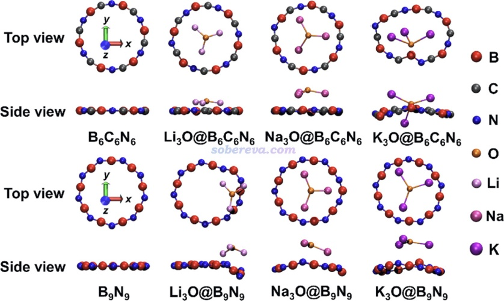
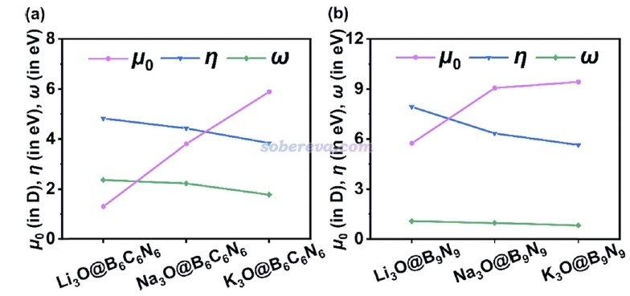
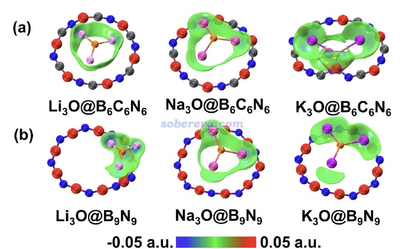
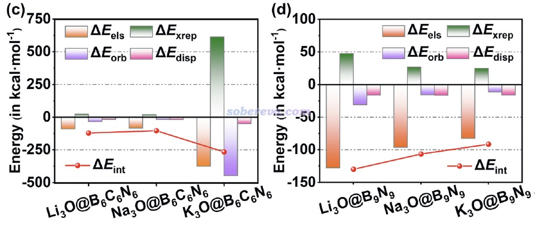
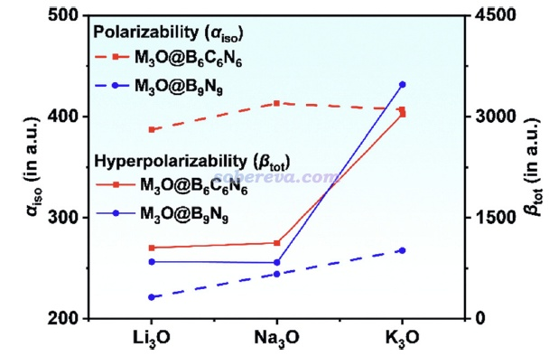
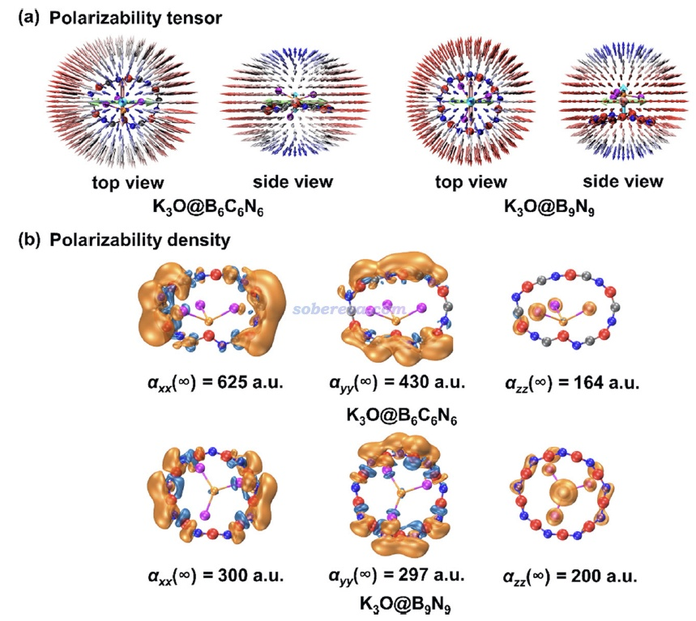
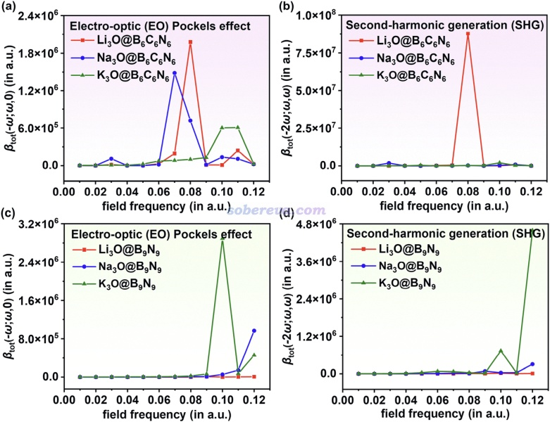
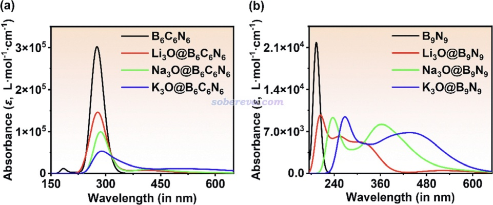

**基于18碳环的等电子体和超碱原子M3O设计具有独特光学性质的材料**  
Designing unique optical materials using superalkali M3O (M = Li, Na, and K) and isoelectronic species of cyclo[18]carbon

文/Sobereva@[北京科音](http://www.keinsci.com)   2026-Feb-28

2019年18碳环（cyclo[18]carbon）首次在凝聚相体系中被制备和观察到后，碳环体系引起了理论化学家门的极大兴趣。北京科音自然科学研究中心的卢天和江苏科技大学的刘泽玉共同发表了一系列文章对碳环及衍生体系的光学性质进行探索，在《18碳环及衍生物的十分全面系统的研究综述已在Acc. Mater. Res.期刊发表！》（<http://sobereva.com/749>）介绍的综述文章中包含了这方面的全面总结。另外，在<http://sobereva.com/carbon_ring.html>中完整罗列了以上作者至今在碳环方面的全部理论研究工作和相关评述。

此前《将超碱原子M3O与碳单环体系相结合设计具有优秀光学性质的复合物》（<http://sobereva.com/753>）介绍的上述作者的J. Mater. Chem. C, 13, 17862 (2025)一文中专门深入探索了具有M3O（M=Li,Na,K）化学组成的超碱原子与不同尺寸碳环形成的复合物的光学性质。18碳环具有两种很有代表性的等电子体，B9N9和B6N6C6，在《18碳环等电子体B6N6C6独特的芳香性：揭示碳原子桥联硼-氮对电子离域的关键影响》（<http://sobereva.com/696>）介绍的Inorg. Chem., 62, 19986 (2023)一文中有深入介绍和理论分析，指出了它们与18碳环特征的共性和差异，尤其是B6N6C6有略弱于18碳环但仍然显著的全局电子离域特征，而B9N9则缺乏这样的离域性。B9N9和B6N6C6与超碱原子是否也能形成稳定的复合物？如果可以，会具有怎样的几何结构、电子结构和光学性质？这种复合是否能构成有独特价值的杂化材料？无疑这些问题是很值得探究的。上述作者近期专门对这些问题通过量子化学计算和波函数分析做了全面的探究，成果发表在Phys. Chem. Chem. Phys.期刊上，欢迎阅读：

Xiaohui Chen, Xiufen Yan, Tian Lu,* Zeyu Liu,* Designing hybrid materials with advanced optical properties using superalkali M3O (M = Li, Na, and K) and isoelectronic species of cyclo[18]carbon (B6C6N6 and B9N9), *Phys. Chem. Chem. Phys.*, **28**, 3975 (2026) DOI: [10.1039/D5CP04608D](https://doi.org/10.1039/D5CP04608D)

<https://pan.baidu.com/s/1JBZR3RjVJjmoynxLwkaaZg>

具体内容和研究细节请阅读上述原文，以下仅对文中的部分图片进行展示，对关键内容进行简要提及。

以下是B9N9、B6C6N6自身以及与不同超碱原子M3O (M = Li, Na, K)形成的复合物的稳定结构。由于B9N9缺乏B6C6N6那样的pi共轭维持平面性，因此与M3O的相互作用导致了骨架结构发生明显的扭曲

原子电荷计算体现出所有被研究的复合物里M3O部分都带有约1个单位的正电荷，因此M3O与B9N9和B6C6N6形成的复合物形成了类似盐的结构，阴阳离子之间的结合很大程度靠静电吸引作用贡献。正是由于M3O有极低的电离能，而B9N9和B6C6N6具有一定作为电子受体的能力，因此电子转移非常充分，恰好转移约一个电子。

文中计算了偶极矩（μ）、亲电指数（ω）、化学硬度（η）。偶极矩随碱金属M序数的增大主要来自于M的半径逐渐增大使得M3O的中心与B9N9和B6C6N6的环中心偏离逐渐加大。ω的数值体现出B6C6N6与M3O形成的复合物的亲电性明显强于B9N9所形成的。随着M序数的增大，复合物的化学硬度有逐渐降低的趋势，体现出整体的电子结构愈发容易受到外界扰动，这与后文给出的极化率的整体变化趋势相似。

文中使用了《使用Multiwfn做IGMH分析非常清晰直观地展现化学体系中的相互作用》（<http://sobereva.com/621>）介绍的IGMH方法展现了M3O与B9N9和B6C6N6之间的相互作用情况，如下所示。等值面非常鲜明地展现了主要作用区域，且作用区域电子密度很低（绿色），体现出两部分之间的作用明显属于非共价相互作用，因而没有像共价作用那样电子密度在作用区域的显著聚集。

文中使用了《使用sobEDA和sobEDAw方法做非常准确、快速、方便、普适的能量分解分析》（<http://sobereva.com/685>）中介绍的sobEDAw能量分解方法考察了M3O与B9N9和B6C6N6之间的相互作用能的成份，如下所示。相互作用能ΔE_int的跨度从85.9到262.3 kcal/mol。总的来说随着M序数的增大，相互作用强度是减弱的，但唯独K3O@B6C6N6复合物的相互作用强度极大，达到了262.3 kcal/mol，这在于如前面给出的结构图所示，K3O的一部分插入了B6C6N6环中央，使得二者之间结合得格外紧密。除了这个体系外，能量分解结果都显示复合物是主要靠静电作用（ΔE_els项）结合的，而轨道相互作用（ΔE_orb）和色散作用（ΔE_disp）的贡献相对来说甚微，做实了前面关于复合物形成机制的推测。

极化率和超极化率是化学体系对外电场的关键响应属性，文中通过CPKS方法结合wB97XD泛函进行了研究。下图α_iso是各个复合物的各向同性极化率，可见B6C6N6形成的复合物的极化率明显大于B9N9所形成的，并且除了结构特殊的K3O@B6C6N6外都随着M的序数增大而增加。M3O@B6C6N6与M3O@B9N9的第一超极化率总大小（β_tot）以及随M序数的变化趋势相仿佛，并且与J. Mater. Chem. C, 13, 17862 (2025)中研究的M3O@C18的大小相似。

文中还通过《使用Multiwfn通过单位球面表示法图形化考察（超）极化率张量》（<http://sobereva.com/547>）和《使用Multiwfn计算（超）极化率密度》（<http://sobereva.com/305>）介绍的方法对被研究的体系的静态外电场下的（超）极化率的鲜明的各向异性特征和体系的不同区域产生的贡献做了具体的分析，详见原文的相关讨论。例如K3O@B6C6N6和K3O@B9N9的极化率张量的单位球面表示以及极化率贡献密度的不同分量图像如下所示。

为了考察（超）极化率对外场频率的依赖性，从而研究频率-色散效应和共振效应，文中对电光效应对应的β_tot(-ω;ω,0)和二次谐波生成效应对应的β_tot(-2ω;ω,ω)做了它们随外场频率ω的变化的扫描，如下所示，不同体系明显的共振现象在图中的峰值波长处清晰呈现了出来。

优秀的光学材料必须在工作频带范围内有足够的透明性，为了检验前述体系这方面的特征，文中通过TDDFT方法对它们模拟了光学吸收谱，如下所示。可见B6N6C6和B9N9与M3O构成的复合物的光学吸收特征截然不同，前者基本只在紫外区域有吸收、对可见光来说基本透明，而后者吸收范围宽得多，特别是Na3O@B9N9和K3O@B9N9的吸收范围明显涉及可见光区。但两类复合物的共性都是随着M序数的增加吸收峰逐渐红移。

总结一下，本研究证实超碱原子与无机纳米环相复合是设计高性能非线型光学材料的有效策略，两个部分可以由电荷转移导致的阴阳离子对间的静电作用稳定地结合，M金属和纳米环的选取可以对光学特征进行有效的调控，这些体系都具有显著的光学各向异性特征。特别是M3O@B6N6C6系列在可见光区保持近乎透明，因而是优秀的可见光非线性光学分子的候选者。
