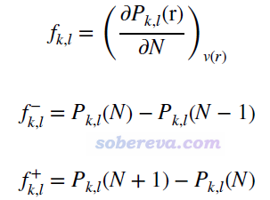
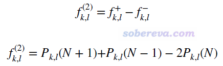
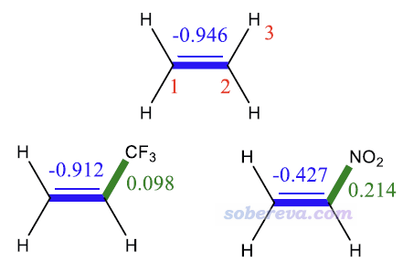
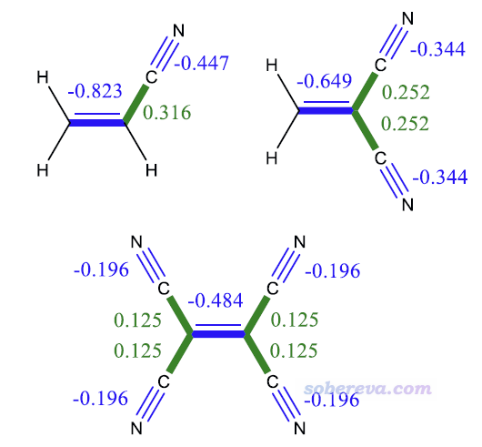
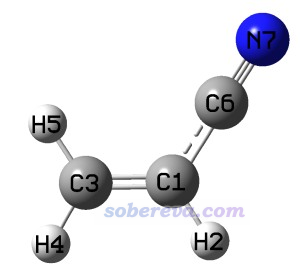

**使用Multiwfn计算键双描述符考察不同化学键的反应性**  
Using Multiwfn to calculate bond dual descriptor to study reactivity of different chemical bonds

文/Sobereva@[北京科音](http://www.keinsci.com/)   2026-Mar-27

## 0 前言

概念密度泛函理论是预测和解释化学反应位点的重要的理论框架，其中双描述符（dual descriptor）很知名并且应用广泛，可以用来考察一个化学体系中什么位置容易发生亲核或亲电反应。相关介绍见：  
• 《概念密度泛函综述和重要文献合集》（<http://bbs.keinsci.com/thread-384-1-1.html>）  
• 亲电取代反应中活性位点预测方法的比较（<http://www.whxb.pku.edu.cn/CN/abstract/abstract28694.shtml>）  
• Comparative study on the methods for predicting the reactive site of nucleophilic reaction（<https://link.springer.com/article/10.1007%2Fs11426-015-5494-7>）  
• 使用Multiwfn计算双描述符势预测反应位点  
<http://sobereva.com/708>  
• 通过轨道权重福井函数和轨道权重双描述符预测亲核和亲电反应位点  
<http://sobereva.com/533>

双描述符是个三维函数，可以通过绘制等值面图考察其分布。而为了便于定量考察和对比哪些原子易于发生亲电或亲核反应，又诞生了简缩双描述符（condensed dual descriptor），可以简单理解为双描述符在各个原子空间里的积分值。近期，J. Math. Chem., 63, 1588 (2025)提出了键双描述符（bond dual descriptor, BDD）的一种具体计算方式，通过一些例子证明了BDD在考察哪些键上容易发生亲电或亲核反应方面很有价值，因此我将之实现在了很流行的波函数分析程序Multiwfn（<http://sobereva.com/multiwfn>）中，使得用户可以很方便地计算BDD研究实际问题。下文第2节就对BDD的定义和用处进行介绍，在第3节演示怎么用Multiwfn对实际分子计算BDD。

注：J. Math. Chem.原文里用词是condensed-to-bond dual descriptor (CBDD)，直译是“简缩键双描述符”，但前缀condensed-to-在我来看是多余的，忽略掉它不会有任何歧义，因此本文和Multiwfn程序里一律用键双描述符（bond dual descriptor）这个词。

## 2 键双描述的介绍

### 2.1 键双描述符的定义

首先来看键福井函数的表达式，如下所示。f(k,l)代表k和l原子间的键福井函数，它被定义为外势不变情况下键级（P）对体系电子数（N）的导数。实际计算时通常使用有限差分形式来求这个导数，左导数和右导数分别对应f-和f+形式。

 与福井函数和双描述符之间的关系相一致，键双描述符BDD（也即下式的f(2)）就是两种形式的键福井函数的差值，也可以写为N+1、N-1、N电子态的键级之间的简单运算。注意当体系的前线轨道存在简并时，N+1应当改为N+p（p是LUMO轨道的简并度），N-1应当改为N-q（q是HOMO轨道的简并度），否则算出来的BDD不满足体系的点群对称性。

BDD明显为负暗示这个键容易被亲电进攻（即这个键具有亲核性），并且越负这个特征越强。BDD明显为正暗示这个键容易被亲核进攻（即这个键具有亲电性），并且越正这个特征越强。

键级有很多不同的计算方法，在《Multiwfn支持的分析化学键的方法一览》（<http://sobereva.com/471>）中做了介绍。前述的BDD的J. Math. Chem.原文里用的是基于NAO算的Wiberg键级，作者也发现改用Multiwfn算的Mayer键级时结果基本不变。也完全可以用模糊键级（fuzzy bond order, FBO），我发现将基于Hirshfeld原子空间划分计算的模糊键级用于计算BDD，得到的结论和BDD原文完全一致，只不过定量数值上有些差异而已。用FBO相较用Mayer键级的明显好处是不怕弥散函数，而相较基于NAO的Wiberg键级的好处是不用依赖于额外的NBO程序。

### 2.2 键双描述符的几个应用

这里简单摘取BDD原文里的两个例子以体现BDD的实际价值。

下图是乙烯及其取代物的BDD。从1-2键的BDD可见乙烯的C=C键的BDD非常负，这是因为它有丰富的pi电子，因而这个键的亲核性很强、易在这里发生亲电反应。当H被吸电子的CF3取代后，BDD(1,2)变得更正了一点，暗示键的亲核性略被削弱。当取代基改为吸电子能力很强的硝基后，由于它不仅有诱导效应，还有吸pi电子的共振效应，导致1-2键的亲核性巨幅下降、明显更难发生亲电反应，清晰体现在了BDD(1,2)的巨幅上升上。再看2-3键的BDD，被硝基和CF3取代时它都为正值，分别为0.214和0.098，体现这两个基团的吸电子效应都使得这个键变得有一定亲电性，而吸电子能力更强的硝基取代时这个键的亲电性明显更强。

笔者还使用Multiwfn对以上体系按照《使用Multiwfn的定量分子表面分析功能预测反应位点、分析分子间相互作用》（<http://sobereva.com/159>）介绍的方式做了分子表面上的平均局部离子化能的极值点分析，在C=C键上都有极小点。乙烯、CF3取代、NO2取代时此极小点的数值分别为8.23 eV、9.29 eV、9.90 eV，体现出这个键上的电子越来越难电离，暗示越来越难发生亲电反应，上述BDD的分析结论与此完全吻合。

下图是不同数目氰基取代乙烯时的BDD。由于氰基的吸电子效应，BDD的变化明显反映出氰基取代得越多，C=C键的亲核性越弱。而C=C键的BDD始终明显为负，体现出它的亲核性特征总是远强于亲电性的。氰基的BDD也为负，体现出显著的亲核性，并且氰基取代越多时每个氰基的亲核性就越弱。乙烯与氰基相连的C-C键的BDD为正，直接体现出缺电子造成的亲电性。

注：福井函数、双描述符一般不能在不同体系之间对比，但上述BDD的例子是在同系物之间对比，这在很大程度是可行的。

## 3 使用Multiwfn计算键双描述符

### 3.1 特征和基本用法

从2026.3.27版开始Multiwfn的概念密度泛函计算模块支持了BDD的计算。这个模块之前我在《使用Multiwfn超级方便地计算出概念密度泛函理论中定义的各种量》（<http://sobereva.com/484>）里有非常充分的介绍和示例，强烈建议先阅读此文，下文是对其在BDD计算方面的补充。另外，如果你不了解Multiwfn的话，十分建议阅读《Multiwfn FAQ》（<http://sobereva.com/452>）和《Multiwfn入门tips》（<http://sobereva.com/167>)。Multiwfn可以在官网<http://sobereva.com/multiwfn>免费下载。

使用Multiwfn计算BDD的最简单过程如下：  
(1)先自行用量子化学程序对当前体系做优化，得到任意一种记录了最终结构的Multiwfn支持的文件，比如xyz、mol2、fch、mwfn等格式的文件，Multiwfn支持的文件见《详谈Multiwfn支持的输入文件类型、产生方法以及相互转换》（<http://sobereva.com/379>）。如果你是Gaussian或ORCA的用户，Multiwfn也可以从其opt或opt freq任务的输出文件中直接读最后一帧的（优化完的）结构。  
(2)用Multiwfn载入上述文件，然后进入主功能22（概念密度泛函计算模块）。  
(3)如果体系的前线轨道有简并性，用选项-3设置简并度。  
(4)如果你当前机子里装了Gaussian或ORCA，选择1让Multiwfn调用Gaussian或ORCA直接对各个电子态在你指定的计算级别、电荷、自旋多重度的设置下算单点任务并得到它们的wfn文件。你也可以自己手动用任意量子化学程序算出来这些wfn文件并放到当前目录下。  
(5)选择10进入BDD计算功能，Multiwfn会依次读取那些wfn文件、依次计算这些态的模糊键级，然后计算BDD并排序后输出。通常这个计算过程花不了多少时间。

算BDD对计算级别要求不高，对于普通体系用B3LYP/6-31G*这样较廉价的级别做优化、产生wfn文件就够了，下文的例子都用这个级别。

下面给出Multiwfn对前线轨道非简并和简并的体系计算BDD的实例，涉及的文件可以直接在此下载：<http://sobereva.com/attach/766/file.rar>。此文用的是Multiwfn 2026.3.27版。

### 3.2 前线轨道非简并体系实例：丙烯腈

此例对丙烯腈计算BDD，结构如下所示。它的HOMO、LUMO都是非简并的。

此例假定读者是Gaussian程序用户，在当前机子里已经装好了Gaussian从而能用比如g16命令直接运行Gaussian（参考《Gaussian的安装方法及运行时的相关问题》<http://sobereva.com/439>），并且在Multiwfn的settings.ini文件里已经把gaupath设为了Gaussian可执行文件的路径从而能令Gaussian被Multiwfn调用。  
强调：绝非Gaussian用户才能用Multiwfn的BDD计算功能。如上所述，Multiwfn照样可以调用ORCA产生wfn文件，只需要settings.ini里orcapath设为ORCA的可执行文件路径，并且进入Multiwfn的主功能22后选-2把被调用的程序改为ORCA即可，其它操作步骤和以下过程完全相同。用户也完全可以自己手动算三个态的wfn文件并放到Multiwfn目录下，从而跳过Multiwfn调用Gaussian或ORCA的那一步。

上述file文件包里ethene-CN目录下的optfreq.gjf是Gaussian在B3LYP/6-31G*级别对丙烯腈做优化和振动分析的输入文件，输出文件是optfreq.out。启动Multiwfn，载入optfreq.out文件（Multiwfn会读取最终优化完的结构），然后依次输入  
22  //概念密度泛函理论计算  
1  //对各个电子态产生wfn文件  
[回车]  //用默认的B3LYP/6-31G*作为计算级别  
[回车]  //对三个电子态用默认的净电荷和自旋多重度，即N态为(0 1)、N+1态为(-1 2)、N-1态为(1 2)

现在Multiwfn在当前目录下产生了N.gjf、N+1.gjf、N-1.gjf，用于在当前结构（优化后的N态结构）下做单点任务并产生wfn文件，可以自行检查一下里面的各方面设置确认合理，之后在Multiwfn里输入y，Multiwfn就会调用Gaussian对这三个gjf文件依次进行计算，算完后当前目录下就会产生N.wfn、N+1.wfn、N-1.wfn（这三个文件都提供在了file文件包中的ethene-CN目录下）并自动删除gjf和out文件。注：也可以在Multiwfn里输入n不调用Gaussian，自己把三个gjf文件放到性能较好的机子上手动跑完，然后把得到的wfn文件放到Multiwfn的当前目录下。

在Multiwfn里选择10 Calculate bond dual descriptor (BDD)，Multiwfn就会读取当前目录下的N.wfn、N+1.wfn、N-1.wfn，分别对它们计算模糊键级，然后计算BDD。屏幕上直接输出的是10个最负的BDD值和10个最正的BDD值，通常这是我们最关心的，也分别相当于亲核性最强的10个键和亲电性最强的10个键。

10 most negative BDD values:  
    1(C )     3(C ):    -0.562  
    6(C )     7(N ):    -0.365  
    3(C )     7(N ):    -0.029  
    2(H )     3(C ):    -0.009  
    1(C )     4(H ):    -0.008  
    1(C )     5(H ):    -0.008  
    4(H )     7(N ):    -0.001  
    4(H )     5(H ):    -0.000  
    5(H )     7(N ):    -0.000  
    2(H )     4(H ):     0.000

10 most positive BDD values:  
    1(C )     6(C ):     0.312  
    1(C )     7(N ):     0.166  
    3(C )     6(C ):     0.064  
    3(C )     5(H ):     0.016  
    3(C )     4(H ):     0.016  
    2(H )     6(C ):     0.006  
    2(H )     7(N ):     0.004  
    5(H )     6(C ):     0.003  
    4(H )     6(C ):     0.003  
    1(C )     2(H ):     0.001

以上结果体现出C1-C3是最容易被亲电进攻的（亲核性最强），其次是C6-N7。而最容易被亲核进攻（亲电性最强）的是C1-C6。上述给出的一些项不对应直接相连的原子，如C1-N7、C3-C6，这样的项无视即可。

之后Multiwfn问你是否把所有键的BDD按原子序号顺序导出为当前目录下的BDD.txt，以及把按照数值排序后的所有键的BDD导出为当前目录下的BDD_sorted.txt，选y就可以导出。

### 3.3 前线轨道简并体系实例：C60富勒烯

C60富勒烯具有高对称性，它的HOMO、LUMO都是简并的，这一节以它为例演示Multiwfn对前线轨道简并的体系计算BDD的最简单过程。

前述file文件包的C60目录下的opt.out是Gaussian在B3LYP/6-31G*级别对C60做优化的输出文件。为了让Multiwfn能自动判断此体系的前线轨道简并度，此任务产生的chk文件转化出的fch文件C60_opt.fch也在此目录下一起提供了。注：如果自行判断和输入简并度，就不需要非得载入这样记录了所有轨道能量的文件。

启动Multiwfn，载入C60_opt.fch，然后依次输入  
22  //概念密度泛函理论计算  
-3  //设置前线轨道简并度  
[回车]  //Multiwfn根据空轨道能量自动判断出LUMO轨道简并度为3，是正确的，因此直接按回车用这个值  
[回车]  //Multiwfn根据占据轨道能量自动判断出HOMO轨道简并度为5，是正确的，因此直接按回车用这个值  
1   //对各个电子态产生wfn文件  
[回车]  //用默认的B3LYP/6-31G*作为计算级别  
[回车]  //对三个电子态用默认的净电荷和自旋多重度，如屏幕上的提示所示，N态为(0 1)、N+3态为(-3 4)、N-5态为(5 6)  
[回车]  //不计算N+1态（当前用不着）  
[回车]  //不计算N-1态（当前用不着）

现在Multiwfn在当前目录下产生了N.gjf、N+3.gjf、N-5.gjf。类似前例，要么输入y让Multiwfn调用Gaussian计算，要么自己手动用Gaussian计算，最终使得当前目录下有N.wfn、N+3.wfn、N-5.wfn。之后选择10计算BDD，结果如下：

10 most negative BDD values:  
   35(C )    48(C ):    -0.087  
    1(C )     6(C ):    -0.087  
    2(C )     3(C ):    -0.087  
   34(C )    60(C ):    -0.087  
    9(C )    10(C ):    -0.087  
   30(C )    31(C ):    -0.087  
    7(C )    19(C ):    -0.087  
   36(C )    49(C ):    -0.087  
   46(C )    47(C ):    -0.087  
    4(C )     5(C ):    -0.087

10 most positive BDD values:  
   25(C )    42(C ):     0.014  
   24(C )    41(C ):     0.014  
   29(C )    52(C ):     0.014  
   16(C )    44(C ):     0.014  
    7(C )    30(C ):     0.014  
    9(C )    36(C ):     0.014  
   28(C )    56(C ):     0.014  
   21(C )    39(C ):     0.014  
   10(C )    49(C ):     0.014  
   19(C )    31(C ):     0.014

C60有两类C-C键，两个六元环共享的[6,6]键，以及一个六元环与一个五元环共享的[5,6]键。上面显示的C35-C48等就是[6,6]键，BDD为负，体现出这个键上容易发生亲电反应。相反，C25-C42等是[5,6]键，BDD为正，暗示它相对来说更容易发生亲核反应，或者至少可以解释为它发生亲电反应比[6,6]键难得多。这个结论和《通过轨道权重福井函数和轨道权重双描述符预测亲核和亲电反应位点》（<http://sobereva.com/533>）文中通过轨道权重双描述符和平均局部离子化能（ALIE）通过图像展现出的结论完全一致。

## 4 总结

本文对颇有价值的预测化学体系中哪个键上容易发生亲电或亲核反应的键双描述符（BDD）做了介绍，并给出了在Multiwfn中计算的例子。可见计算过程十分简单快速，再加上BDD颇有实用性，笔者很鼓励将之用于实际问题的研究。它对于定量讨论原子反应特征的简缩双描述符也是很有意义的补充。
