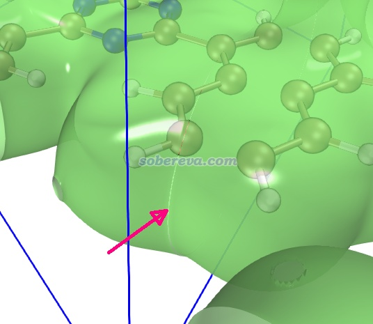
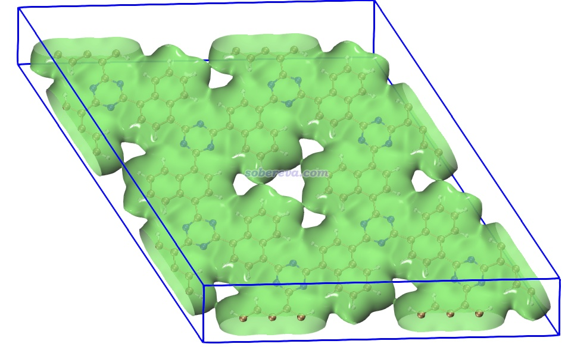

**使用Multiwfn快速产生超胞的格点数据**

文/Sobereva@[北京科音](http://www.keinsci.com)   2026-Apr-10

做第一性原理研究周期性的人经常要观看比如电子密度、自旋密度、IRI、IGMH、ELF等函数的等值面，最常用的程序之一就是VMD。但由于计算用的晶胞往往较小，经常需要在VMD的Graphics - Representation界面里的Periodic标签页设置在各个方向显示副本，以使得等值面和结构看起来更全面、完整。然而，这么做不仅无法令VMD显示出跨周期的化学键，显示的等值面在周期接壤处还无法严丝合缝，不好看。例如下图是CP2K计算的一个COF体系的电子密度cube文件按照《在VMD里将cube文件瞬间绘制成效果极佳的等值面图的方法》（<http://sobereva.com/483>）的方法显示的0.001 a.u.电子密度等值面，跨周期的部分就有这个问题：

不能显示跨周期的化学键问题可以通过让VMD载入超胞的结构文件解决，利用《Multiwfn中非常实用的几何操作和坐标变换功能介绍》（<http://sobereva.com/610>）介绍的构造超胞并导出结构文件的功能就可以做到。而产生超胞的格点数据文件据我所知没有现成又易用的程序且是基于文本的。为了解决这个问题，Multiwfn从2026.4.10版开始加入了基于原胞的格点数据构造超胞格点数据的功能，在这里演示一下。

Multiwfn可以在官网<http://sobereva.com/multiwfn>免费下载。不了解此程序者建议阅读《Multiwfn FAQ》（<http://sobereva.com/452>）、《Multiwfn入门tips》（<http://sobereva.com/167>）、《详谈Multiwfn支持的输入文件类型、产生方法以及相互转换》（<http://sobereva.com/379>）。

上图的COF的cube文件可以在<http://sobereva.com/attach/770/COF_rho.rar>下载，这里用Multiwfn将它产生为2\*2\*1超胞的格点数据。启动Multiwfn，载入COF_rho.cub，然后输入  
13   //格点数据处理功能  
20   //平移复制格点数据  
2   //第1个盒子矢量方向复制为原先的两倍  
2   //第2个盒子矢量方向复制为原先的两倍  
\[回车\]   //第3个盒子矢量方向保持不变  
y   //要求把原子坐标也相应地复制  
0   //把当前内存中的格点数据导出  
new.cub

马上当前目录下就出现了new.cub。用VMD显示出来，如下所示，可见已经是完美的超胞的结构和等值面了，毫无瑕疵！

如果本文介绍的功能对你的研究起到了帮助，请记得发表文章时按照Multiwfn启动时的说明引用Multiwfn原文。
