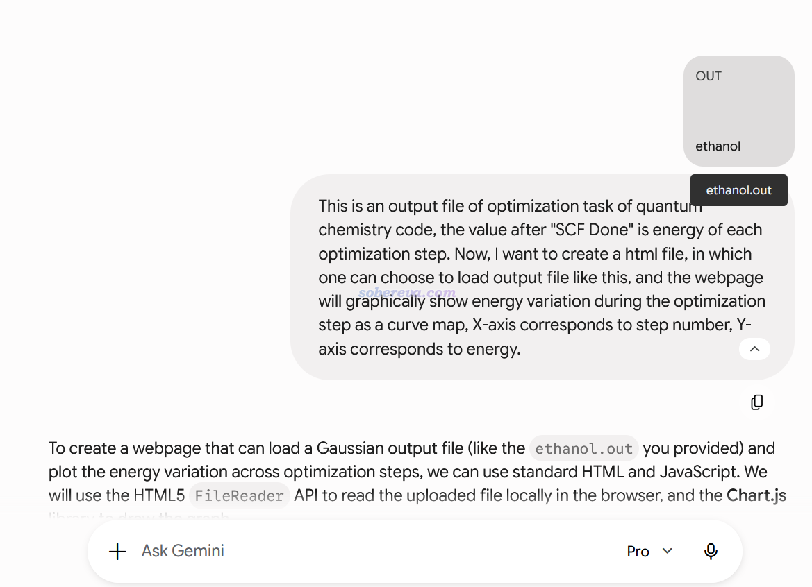
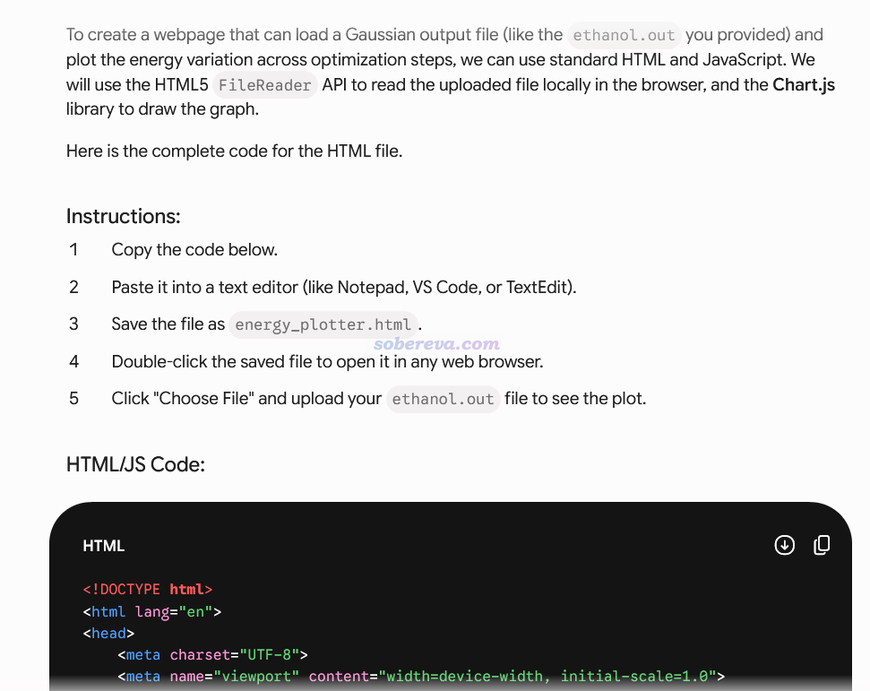
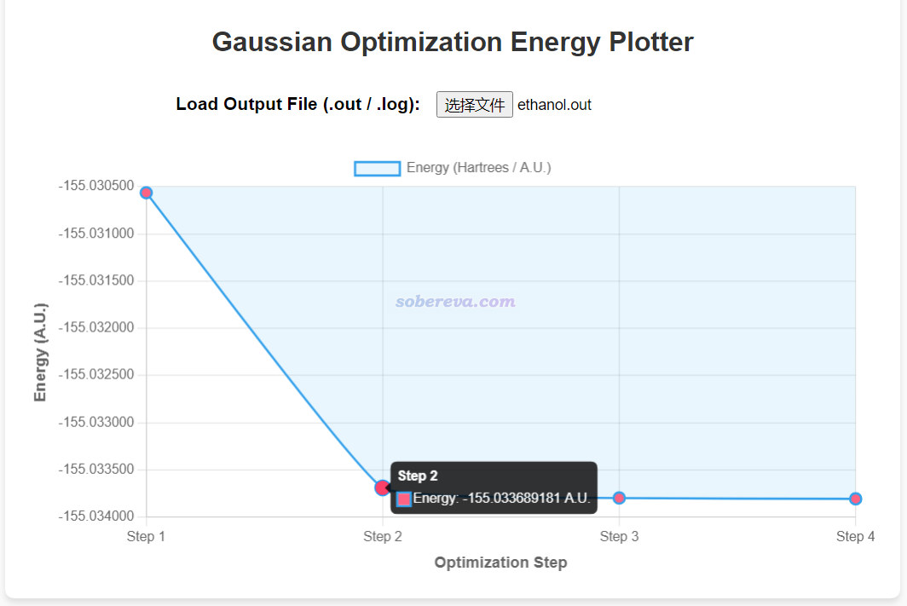
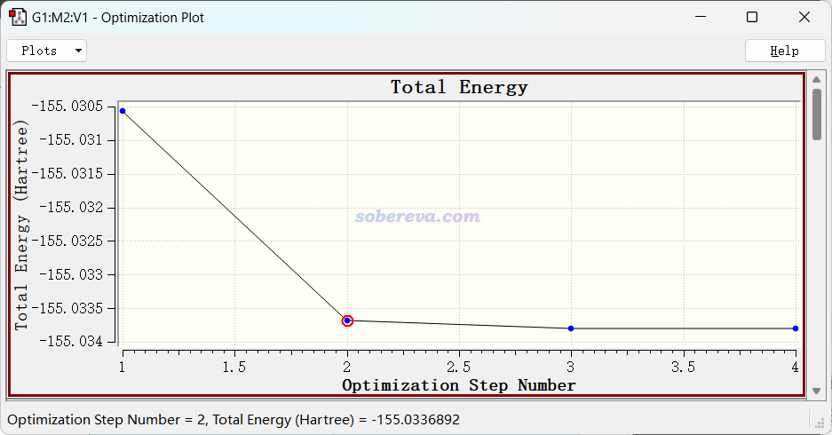
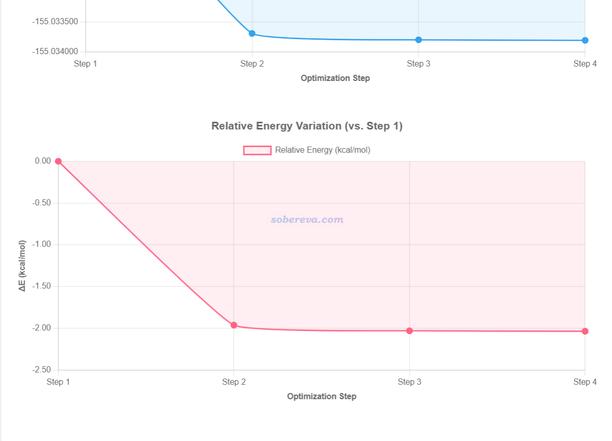
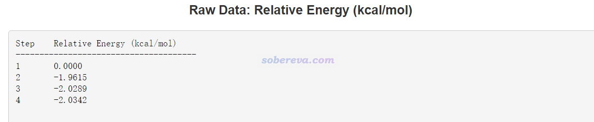
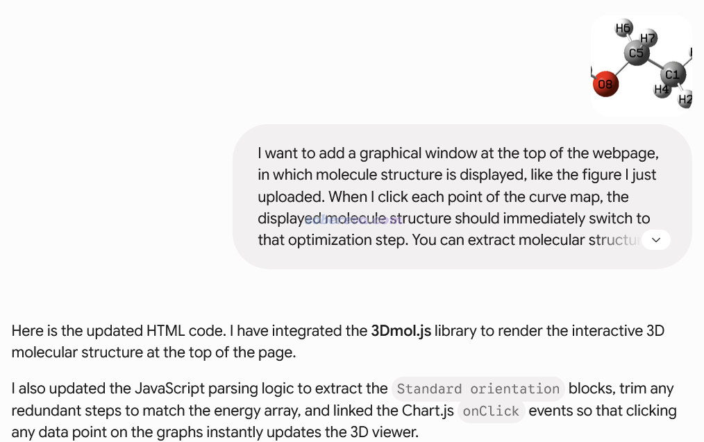
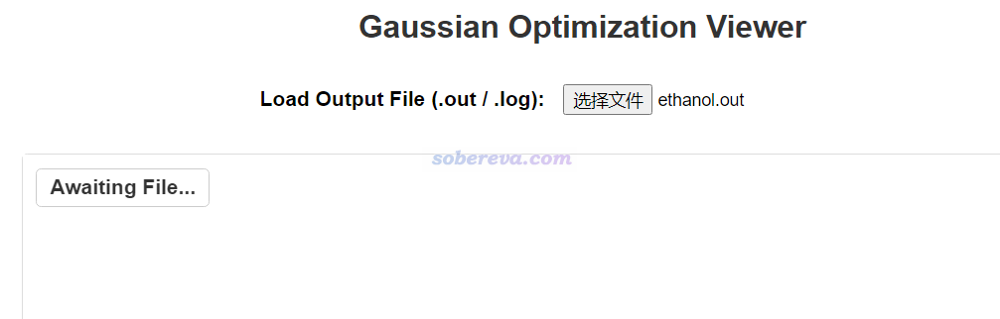
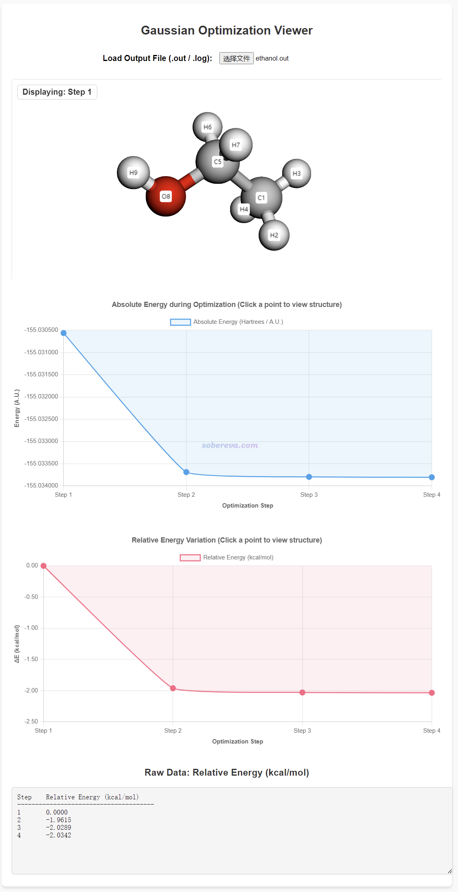

**利用AI快速创建观看几何优化过程中能量和结构变化的网页的完整示例**  
Full example of using AI to quickly create webpages that show energy and structural changes during geometry optimization

文/Sobereva@[北京科音](http://www.keinsci.com)   2026-May-31

现在的AI普及使得不涉及到复杂算法和逻辑的程序的创建难度变得极低。虽然纯靠AI写真正专业的重型计算化学程序完全不可能，但创建一些主要涉及界面交互、可视化、接口、信息转化之类的小型辅助程序，编程外行人靠AI也很容易快速实现。这里本文举一个例子，一步步详细演示一下利用目前最主流的AI之一Gemini在几分钟内创建一个可以把最流行的量子化学程序Gaussian的几何优化任务输出文件做可视化的网页，加载输出文件后就可以观看能量变化曲线、几何结构图，类似于GaussView。现在网上有许多主要靠甚至完全靠AI构建的与此例类似的计算化学数据可视化程序、交互程序，令许多人觉得很高大上，其实看过本文后，会觉得自己也不难实现，并且会感到自己用AI随手产生一个自用的辅助工具也挺简单。

注1：在合理写提示词（prompt）的情况下，AI很擅长快速完成这种代码的80-90%部分、达到能凑合用的水准，但如果想达到接近完美、能拿得出手给别人用的话，经常需要花很多时间精修，必须自己得懂一些编程才行！不擅长自己从头写代码完全没问题，但必须有读代码的能力。否则在懂编程常识情况下轻易能解决的问题很可能跟AI反复对话很多轮也搞不定，浪费大量精力甚至财力，而且也无法结合当前代码具体内容高效、精准地向AI提修改要求。利用AI作图模型画图也是类似的，会一些photoshop，以及懂一些稍微深入的东西（如controlNet、img2img、inpaint），往往就能很容易地解决纯靠AI费半天劲折腾prompt也搞不理想的图像细节。

注2：Gemini等AI大语言模型内在是基于概率预测进行回复，并且还有不可避免的随机扰动。同样的输入信息，两次运行同一个模型的结果也可能不同。所以哪怕读者恰好使用和本文相同的模型（Gemini 3.1 Pro），得到的结果也可能不同。读者也可以把本文的流程、思路也放在任何其它的像样的AI上跑，如Grok、chatGPT等，大概率也能成功，可能结果更好也可能更糟，并可能需要做额外的对话才能达到与本文类似效果，因此必须随机应变。未来Gemini必然会更新模型，结果大概率会比目前表现更好，尤其是精修时更不需要折腾。私人建议：像当前这样稍微有点专业度的事就该用像样点的AI，就别尝试用那种适合普通老奶奶用的AI了...

注3：本例演示的对话里我都用英文提要求，我习惯和计算化学哪怕沾一丁点边的事在和AI对话时都用英文，主观认为可靠度会稍微高点，尤其是对于Gemini这样的西方的AI模型来说。但读者也不是不能用中文，Gemini对中文支持也已经非常好，但前提是用词必须准确。

首先准备一个有代表性的Gaussian输出文件，提供给AI作为参考例子。就拿我在北京科音初级量子化学培训班（<http://www.keinsci.com/KEQC>）中讲几何优化时给的第一个优化例子（乙醇）的输出文件为例，可以在此下载：<http://sobereva.com/attach/771/ethanol.out>。这个优化非常简单，初始结构也理想，故4步就收敛了，并且没用#P，因而文件较小，只有69 KB，往Gemini上传能成功。我也试过直接上传几百KB的较大优化任务的输出文件，就失败了。

下面是我和Gemini每一轮的对话和得到的结果，没有跳步。读者也不是非得像这样一次次对话、步步为营加功能，也可以尝试一次性提完整来节约总时间，但成功几率会更低。

### 第1轮对话：

在Gemini里上传ethanol.out后，写入提示：This is an output file of optimization task of quantum chemistry code, the value after "SCF Done" is energy of each optimization step. Now, I want to create a html file, in which one can choose to load output file like this, and the webpage will graphically show energy variation during the optimization step as a curve map, X-axis corresponds to step number, Y-axis corresponds to energy.  
PS：有Gaussian常识的人都知道，对于单行列式方法（如当前计算对应的B3LYP），能量都在SCF Done后面输出，所以提示内容是上面那么写的。对于其它方法，读取能量的地方看《谈谈该从Gaussian输出文件中的什么地方读电子能量》（<http://sobereva.com/488>）。

Gemini飞快地写好了代码：

点击代码部分右上角的下载按钮，保存为1.html，可以在这里直接访问：<http://sobereva.com/attach/771/1.html>。也可以保存到本地后用网页浏览器打开。然后点击“选择文件”按钮，选择前述的ethanol.out，就马上看到下面的效果了，鼠标移动到相应点上会显示相应的步数和能量。

顺带一提，这和GaussView里看到的完全一样

### 第2轮对话：

为了能够显示相对于优化的第1步的能量变化，继续在Gemini里输入：Well done. Now, I want to add a new feature. In this html webpage, add the second graph, its Y-axis shows energy variation with respect to the first step, and the unit should be in kcal/mol, that is the energy multiplied by 627.51.

这次得到的网页是<http://sobereva.com/attach/771/2.html>。载入ethanol.out后可以看到相对能量变化作为网页中第二张图成功显示了：

### 第3轮对话：

这次增加一个文本框，显示相对能量变化曲线里面每个点的具体数值，继续在Gemini里输入：  
Great. Now add a text box in the webpage to show raw data of the second graph.

这次得到的网页是<http://sobereva.com/attach/771/3.html>。载入ethanol.out后可以看到文本框里出现在页面最下端，信息完全满足预期：

### 第4轮对话：

这次要求在网页顶端把分子结构显示出来，并且让AI参考GaussView的效果和配色。还要求点击曲线图上每个点的时候切换到相应结构。ethanol.out里的优化只有四步，但记录标准朝向坐标的standard orientation段落输出了5次，最后两次是相同的，为了避免Gemini糊涂，应在输入信息里特意说明。以下是ethanol.out的其中一个standard orientation部分，供读者参考

 ---------------------------------------------------------------------  
 Center     Atomic      Atomic             Coordinates (Angstroms)  
 Number     Number       Type             X           Y           Z  
 ---------------------------------------------------------------------  
      1          6           0        1.172768   -0.410358    0.000000  
      2          1           0        1.138081   -1.051798    0.886875  
      3          1           0        2.123225    0.135160    0.000000  
      4          1           0        1.138081   -1.051798   -0.886875  
      5          6           0        0.000000    0.555791    0.000000  
      6          1           0        0.050252    1.208194   -0.887635  
      7          1           0        0.050252    1.208194    0.887635  
      8          8           0       -1.198653   -0.215131    0.000000  
      9          1           0       -1.947276    0.400496    0.000000  
 ---------------------------------------------------------------------

现在在Gemini里上传GaussView对当前体系显示的结构图供它参考，并输入：I want to add a graphical window at the top of the webpage, in which molecule structure is displayed, like the figure I just uploaded. When I click each point of the curve map, the displayed molecule structure should immediately switch to that optimization step. You can extract molecular structure of each optimization step from "Standard orientation:" field from output file, but the last "Standard orientation:" is redundant and should be ignored. The data in "Center number" column is the atom index in current system, the data in "atomic number" column is the element index in the periodic table, the data in "X", "Y", "Z" columns are X,Y,Z coordinate of each atom, respectively. In the displayed molecule structure, different color should be used to render atoms of different elements, atom index and element name should be drawn as label on each atom.

对话截图：

这次得到的网页是<http://sobereva.com/attach/771/4.html>。载入ethanol.out后发现虽然曲线图都正常给出了，但是结构图没有出现：

### 第5轮对话：

让Gemini修改上述问题，输入：unfortunately, after upload a file like I provided previously, molecule structure was not displayed, it always shows "Awaiting File..."

这次得到的网页是<http://sobereva.com/attach/771/5.html>。载入文件后完整的页面如下所示，可见显示效果不错，鼠标左键拖动能旋转视角，滚轮滑动能缩放分子，配色和GaussView差不多。

到此，一个Gaussian几何优化输出文件观看网页的雏形就大致弄好了。之后的改进，诸如兼容性、功能性、显示效果、界面布局等，就不再演示了，留给读者折腾。比如我发现当前网页有个问题，每次点击曲线上的圆点切换到另一步时，分子结构的缩放就会被重置，我就接着这么提修改要求：Good job. I hope when I click a point in the curve map to switch structure, the zoom level of displayed molecule structure will not be reset but keep unchanged。

实测也有一些要求的改进通过对话让Gemini老也弄不好，比如要求分子结构缩放时文字标签大小也按比例变化。亲自看了代码很快发现Gemini把文字尺寸变量弄成了一个固定值，遂要求Gemini在缩放分子时也动态修改这个变量，就立刻搞好了。所以精修的阶段还是得自己能够理解代码的原理和逻辑。若想把程序做大、做复杂，还应当自己能够了解程序架构，作为设计师来控制AI干活。
