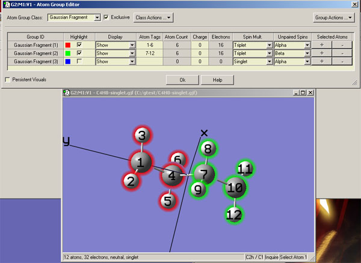
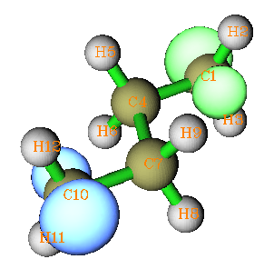
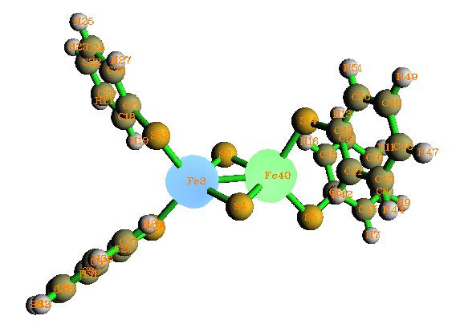
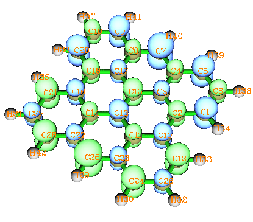

**谈谈片段组合波函数与自旋极化单重态**On the fragment combination wavefunction and spin polarized singlet state  
  
文/Sobereva @[北京科音](http://www.keinsci.com)  
First release: 2011-Apr-4  Last update: 2025-Jun-9

本文主要讨论片段组合波函数的意义、用处，并结合实例介绍在Gaussian中的用法。由于片段组合波函数最重要用处之一就是计算自旋极化单重态体系，而且自旋极化单重态问题本身也很值得说说，所以将之一并讨论。文末对初学者常问的“量子化学计算中如何设定原子/片段的电荷？”问题结合本文内容进行了讨论。本文只涉及单行列式波函数（HF/KS-DFT波函数）。

在产生片段组合波函数、做波函数稳定性测试等方面，笔者讲授的**北京科音中级量子化学培训班**（<http://www.keinsci.com/KBQC>）远比本文内容深入全面得多得多，并且给了很详细具体的例子和讲解，非常推荐想学习更多知识的读者参加。

## 1 片段组合波函数的含义

“片段组合波函数”具体来说是由整个体系内各个片段在孤立状态时的波函数组合出的波函数。比如H2O---HF这样的复合物体系，若将H2O和HF视为两个片段，那么此体系的片段组合波函数就是由一个孤立的H2O的波函数和一个孤立的HF的波函数组合出来的。对于只由强化学键构成的体系也可以划分，比如NH3BF3可以划分成NH3和BF3。一个体系怎么划分成片段要看目的是什么，要选择最有意义的划分，这在后文的例子中会体现出来。需要注意的是，所谓的“孤立状态”是指片段内原子感受不到任何其它原子的情况，但是片段的结构和朝向必须与在分子中完全一致，否则组合出的波函数没有意义。  
  
单行列式波函数情况下片段波函数很容易进行组合，这里介绍最简单的方法。比如一个体系被5个基函数χ1,χ2...χ5所描述，也因此有5条分子轨道（本文分子轨道都是指自旋轨道，后同），前3条是有电子占据的。假设将此体系划分为两个片段A和B，分别以前2个和后3个基函数描述，也因此分别含2和3条分子轨道，并假设A中第1条和B中前2条分子轨道是占据的。A的第i条分子轨道写为  
ψA(i)=C_A(1,i)*χ1+C_A(2,i)*χ2，其中C_A(m,n)是第n条轨道向m基函数的展开系数。  
B的第i条分子轨道写为  
ψB(i)=C_B(3,i)*χ3+C_B(4,i)*χ4+C_B(5,i)*χ5，其中C_B意义如同C_A  
  
那么由A、B组合出的整体的波函数的5个分子轨道就可写为  
Ψ(1)=ψA(1)+0*χ3+0*χ4+0*χ5  //由A的1号轨道（占据）扩展  
Ψ(2)=0*χ1+0*χ2+ψB(1)        //由B的1号轨道（占据）扩展  
Ψ(3)=0*χ1+0*χ2+ψB(2)        //由B的2号轨道（占据）扩展  
Ψ(4)=ψA(2)+0*χ3+0*χ4+0*χ5  //由A的2号轨道（虚）扩展  
Ψ(5)=0*χ1+0*χ2+ψB(3)        //由B的3号轨道（虚）扩展  
可见，所谓的组合就是把片段的分子轨道的维数扩展到整个体系的情况然后放在一起而已。比如ψA(1)原先只用χ1,χ2,χ3表达，由于整体的轨道需要用1~5号χ一起来展开，扩展到整体后，即Ψ(1)，就把χ4和χ5也加进去，其系数简单地设为0。要注意的是空轨道和占据轨道顺序不能错，整体的前3条轨道是占据的，所以必须由A和B的占据轨道扩展得到，而这三条轨道间的顺序是无所谓的。而整体的后2条是空的，就由A和B的空轨道扩展得到，同样这两条轨道间的顺序是随意的。  
  
这样组合成整体后，A的2个电子和B的3个电子在形式上构成了全同粒子，由于它们一起被整体的单行列式波函数所描述，所以它们之间满足了反对称原理。但是这个波函数中，A和B的轨道波函数（或者说其电子密度分布）仍然完全分别定域在A和B的区域内，因为它们在对方的基函数上系数是0。如果以这个片段组合波函数作为整体SCF计算的初猜波函数，这5个目前定域的轨道就有可能随着迭代逐渐弛豫开，最终离域到整体各个部分上。  
   

## 2 片段组合波函数的用处

片段组合波函数主要用途有三：  
(1)对于弱相互作用体系生成高质量初猜波函数。每个分子在复合物中的状态与在孤立状态下较为接近，所以如果已经有现成的单体的波函数，将之组合得到的复合物的初猜波函数质量会比直接让量化程序初猜的要高，在计算时SCF所需迭代次数会减少，节约了时间。体系越大，相互作用越弱时优势会越明显。  
(2)用片段组合波函数做为初猜的整体的SCF迭代过程正是电子密度在各个片段间转移以及其分布发生极化的过程，所以用最后一轮迭代的能量减去第一轮迭代的能量就能获知电子转移和极化造成的能量降低。  
(3)使波函数收敛到期望的态。SCF过程如同几何优化，会收敛到离初猜最近的参数空间的极小点（和具体收敛方法的选择有关），用默认的初猜波函数往往收敛不到能量最低的态或有特定特征的态，此时需要人为对其进行调整，例如常见的根据对称性调换占据轨道与虚轨道，调整各片段的电荷和自旋方向构建整体初猜也是方法之一，这对于计算自旋极化的单重态特别有用，将在下面讨论。  
   

## 3 自旋极化单重态的含义

对于单重态，一般用限制性方法计算，即alpha和beta轨道完全匹配，自旋密度处处为0；对于多重态，一般用非限制性方法计算，即alpha和beta轨道允许不匹配，不匹配程度（或称自旋极化程度）一般用它们之间重叠积分偏离1的程度衡量，这里暂不考虑限制性开壳层方法。还有一类特殊的单重态，即自旋极化单重态，它是指体系自旋多重度为1，但是自旋密度并不处处为0的态，有的地方alpha电密度大，有的地方beta电子密度大。计算这种态显然不能用限制性方法，如果基态是这种态，则将得不到真正基态，而必须用非限制性方法。然而，直接用非限制性方法的结果和限制性计算是一样的，因为量子化学程序会将这种体系按照一般单重态处理，默认的初猜波函数中alpha与beta轨道完全匹配，在迭代过程中由于并没引入导致自旋极化的因素，所以即便允许alpha和beta轨道波函数相互独立，收敛后的结果还是完全匹配的。因此，就必须人为地提供一个合适的自旋极化的初猜波函数才能收敛到真正基态。自旋极化单重态也经常叫对称破缺态，这是因为对称破缺态是指波函数对称性低于当前分子结构的对称性，自旋极化单重态总伴随对称破缺的出现，而出现对称破缺又必然存在自旋极化，所以除了个例，二者指的是同一种态。在下文中涉及稳定波函数时“极化”和“破缺”不加区别地使用，只有在谈到初猜时才会区分。  
  
遇见一个新颖的，且确定是单重态的体系，如果没有经验或证据判断是否它的基态是自旋极化态，可以在限制性方法计算后进行波函数优化，程序会寻找能量更低的态，包括尝试破坏对称性，如果找到了（称存在RHF->UHF不稳定性），说明自旋极化态才是基态。但是如果没找到，也不能说非自旋极化态一定就是基态，波函数优化并不能保证获得参数空间最小点，有可能通过调整初猜后能得到能量比非自旋极化态更低的自旋极化态。应指出的是未必得到了一个自旋极化态就能说它是基态，有的体系存在多个自旋极化态，比如双核配合物体系中两个金属既可能是高自旋耦合也可以能是低自旋耦合。需要注意，本文在说到判断基态时假设所用的理论方法是可靠的，基组有足够质量，否则没有意义，比如HF在小基组时有过度发生自旋破缺的倾向，而在一些纯DFT泛函（如BLYP）下往往RHF稳定性过强，该破缺时却又不破缺。  
  
这里举几个重要的自旋极化单重态的例子：(1)双自由基。其两个单电子位点间耦合明显时单重态一般比三重态能量要低。比如·CH2-CH2-CH2·、·O-O-O·，两边的单电子自旋相反。(2)反铁磁性耦合配合物。比如Mn2O2(NH3)8，基态是中性单重态，而两个Mn(II)在形式上都有5个d单电子，且在二者上的自旋相反。(3)共价键被拉长的情况。在共价键处于平衡位置附近体系可完全以限制性波函数描述，而当拉长到一定距离后（称为不稳定点），对称破缺态的能量将比非破缺态要低。(4)矩形有限尺寸石墨纳米带，见后文的例子。更多的例子参看《谈谈自旋密度、自旋布居以及在Multiwfn中的绘制和计算》（<http://sobereva.com/353>）和《详谈使用Gaussian做势能面扫描》（<http://sobereva.com/474>）。  
   

## 4 计算自旋极化单重态的方法

用HF、DFT计算自旋极化单重态需要在非限制性计算时给出一个合适的自旋极化、对称破缺的初猜，方法有很多，这里谈一下方法。  

### (1)混合HOMO与LUMO

电子密度的极化可以视为占据轨道与虚轨道混合产生的，所以让初猜出现自旋极化就是让初猜的alpha密度和beta密度发生不同的极化，最简单的方法是通过HOMO与LUMO轨道混合来实现，这一般也使其对称性得以破坏。在Gaussian中可以用guess=mix关键词实现。通过UHF/STO-3G下H2分子很容易说明其原理，这里键长设为1.5埃，已经超过了不稳定点。使用guess=only pop=full会看到初猜中alpha和beta轨道彼此都是相同的，两个基函数上系数在HOMO相等而在LUMO上相反，轨道对称性符号也给了出来。  
                           1         2  
                       (SGG)--O  (SGU)--V  
     Eigenvalues --    -0.28527  -0.05493  
   1 1   H  1S          0.63075   0.82022  
   2 2   H  1S          0.63075  -0.82022  
使用guess(mix,only) pop=full会看到HOMO与LUMO混合后的初猜  
     Alpha Molecular Orbital Coefficients:  
                           1         2  
                           O         V  
     Eigenvalues --    -0.28527  -0.05493  
   1 1   H  1S          1.02598   0.13398  
   2 2   H  1S         -0.13398  -1.02598  
     Beta Molecular Orbital Coefficients:  
                           1         2  
                           O         V  
     Eigenvalues --    -0.28527  -0.05493  
   1 1   H  1S         -0.13398   1.02598  
   2 2   H  1S          1.02598  -0.13398  
此时是对称破缺的，对称性符号不再显示，且alpha和beta轨道不再相同。通过观察可知是这些轨道是这样由原先HOMO与LUMO混合而得的：  
ψα_HOMO=ψ_HOMO+ψ_LUMO  
ψα_LUMO=ψ_LUMO-ψ_HOMO  
ψβ_HOMO=-(ψ_LUMO-ψ_HOMO)  
ψβ_LUMO=-(ψ_HOMO+ψ_LUMO)  
注意系数必须经过重新归一化。例如对于ψα_HOMO，将ψ_HOMO和ψ_LUMO的系数加和后为(1.45097,-0.18947)，通过iop(3/33=1)的输出可知两个基函数的重叠积分为0.256786，所以此时ψα_HOMO的模方的全空间积分值为1.45097^2+(-0.18947)^2-2*1.45097*0.18947*0.256786=2.00002，故ψα_HOMO的归一化系数为1/√2.00002，将1.45097和-0.18947都乘上此值就得到了归一化后的ψα_HOMO，与Gaussian输出中一致。

用默认初猜时UHF的收敛结果中Mulliken自旋密度布居在两个氢上都为0，且Mulliken总密度布居也都为0。这是由于在初猜中alpha占据轨道和beta占据轨道等价，且在两个氢上系数相等，由于迭代中没有引入破坏对称和非自旋极化的因素，在收敛时仍然会保持这种状态。使用guess=mix后收敛到了对称破缺态，自旋布居分别为0.862525和-0.862525。从前面列的系数可见，初猜中alpha和beta电子分布已经不相等了，前者和后者分别主要聚集在第一个氢和第二个氢上，而且的确对称破缺态是能量最低的态，所以最终会收敛到这种态。当然，如果键长没有超过不稳定点，即对称态是最稳定的，那么即便用了guess=mix，经过迭代后还是收敛到对称态，和使用RHF结果一样。

PS：还可以讨论一种假想态，尽管在无外电场时它不会在实际出现（此时也收敛不到这种态），即对称破缺但不自旋极化的态。对于H2，也就是让ψα_HOMO=ψβ_HOMO=ψ_HOMO+ψ_LUMO，ψα_LUMO=ψβ_LUMO=ψ_LUMO-ψ_HOMO，此时自旋密度各处皆为0，但是电子聚集在第一个氢上。以它为初猜在UHF迭代后，由于没有引入导致自旋极化的因素，得到的还是RHF那样的对称、非极化态。当然还可以考虑自旋极化而对称的初猜，比如alpha密度集中在两个氢中央，而beta密度均等分布在H2的两个端点区域，在迭代后还是也得不到期望的态，因为对称性不会自发地破坏。所以guess=mix的关键有两点，一是使HOMO与LUMO混合而破坏初猜对称性，二是对于alpha和beta轨道采用不同方式混合，以使初猜出现自旋极化。

guess=mix的使用很傻瓜化，在很多时候都能收敛到期望的自旋极化单重态，每次碰见一个新体系时可以先用它试一下，但它并非总是奏效，届时需要其它方法构建更接近期望的态的初猜。

### (2)利用片段组合波函数

这种方法虽然没(1)方便，但是可以人为控制，效果往往更好。从09版开始，Gaussian可以直接生成片段组合波函数，结合GaussView使用起来很方便，用法将在下面介绍。注意Gaussian用的组合方法和前述并不完全相同，但意义类似。

通过笔者开发的Multiwfn（<http://sobereva.com/multiwfn>）可以将多个算好的片段的输出文件里的波函数信息按照前述方法进行组合，并生成一个整体带有初猜波函数信息的Gaussian输入文件，初猜波函数在任务开始时会被guess=cards关键词读取。具体详见Multiwfn手册3.100.8节，利用这个做法还可以实现做能量分解的目的。

### (3)利用stable=opt关键词

还有一种计算自旋极化单重态的方法是用stable=opt关键词，代表程序会自动做波函数稳定性测试，如果发现不稳定，就通过特殊的算法试图优化到更稳定的波函数。比如体系实际上是双自由基，但是目前是使用对应计算闭壳层的关键词计算，算完之后通常stable测试会表示此波函数不稳定，自动优化出来的波函数通常就对应于当前体系的基态波函数，也即自旋极化单重态波函数了。此做法比起guess=mix耗时得多，但得到对应基态的自旋极化单重态的几率往往更大。注意stable=opt也不是什么时候都奏效。另外，stable=opt和做几何优化的关键词opt完全八竿子打不着，前者优化的是当前结构下的波函数，后者优化的是几何结构。

一般来说，算自旋极化单重态体系，我比较建议先尝试比如# UB3LYP/6-31G* guess=mix nosymm stable关键词，因为又快又省事，如果提示波函数是稳定的，而且自旋密度确实不是处处为0（怎么绘制自旋密度看<http://sobereva.com/353>），那就OK了。如果提示不稳定，改用# UB3LYP/6-31G* guess=mix nosymm stable=opt再试，一般都能成功找到最稳定基态对称破缺波函数。这里nosymm要求Gaussian计算时不利用对称性，碰见有对称性的体系的时候这么做会更稳妥。但对于像反铁磁性耦合这种配合物体系，我更建议用片段组合波函数的做法，这样可控性更强。片段组合波函数的用法下文有具体例子。

## 5 使用Gaussian通过片段组合波函数计算自旋极化单重态实例

构建的片段组合波函数应当尽可能接近预期的态，这样才能收敛到且较快地收敛到相应态。这里先以计算C2h对称性的单重态双自由基·CH2-CH2-CH2-CH2·为例来说明这一点以及在Gaussian中的操作，实际上此例用guess=mix也能实现目的。这里假设结构式左边的小点是alpha单电子，右边的是beta单电子，因此为了构建合适的初猜，就要让左边的·CH2-CH2-片段富集alpha电子，应当在计算它时让它带着两个未成对alpha电子。因为这样可以期望其中一个alpha电子定域在小点那里，而另一个alpha电子定域在划分片段时断裂的C-C键的位置。同理对于右边的-CH2-CH2·片段，就让它带着两个未成对的beta电子。这样两个片段波函数组合在一起时，按照价键理论的观点，未成对的alpha和beta电子在划分片段处就恰好接上而恢复C-C键了，而左右两个小点处就正好是一个alpha一个beta电子了，非常理想。  
  
首先在GView里编辑好分子结构，然后进入Edit-Atom Group，将两个片段的Atom Tags、Spin Mult.、Unpaired Spins改成图中这样  

然后保存成gjf文件。适当修改后，最终输入文件如下。  
%chk=C:\gtest\C4H8-singlet.chk  
# ub3lyp/6-31g(d) guess(fragment=2)  
[空行]  
Title Card Required  
[空行]  
0 1 0 3 0 -3  
 C(Fragment=1)      0.09727146    1.92239482    0.00000000  
 H(Fragment=1)      0.47392697    2.13428940    0.97885116  
 H(Fragment=1)      0.47392697    2.13428940   -0.97885116  
 C(Fragment=1)     -0.55878611    0.59240328    0.00000000  
 H(Fragment=1)     -1.16892856    0.49566725    0.87365029  
 H(Fragment=1)     -1.16892856    0.49566725   -0.87365029  
 C(Fragment=2)      0.55878611   -0.59240328    0.00000000  
 H(Fragment=2)      1.16892856   -0.49566725   -0.87365029  
 H(Fragment=2)      1.16892856   -0.49566725    0.87365029  
 C(Fragment=2)     -0.09727146   -1.92239482    0.00000000  
 H(Fragment=2)     -0.47392697   -2.13428940   -0.97885116  
 H(Fragment=2)     -0.47392697   -2.13428940    0.97885116  
   
其中guess(fragment=2)说明体系包含两个片段，并且执行生成片段组合波函数任务。每个原子所属片段在原子名后面的括号里指定。也可以将所属片段序号写在坐标后面，比如 H -0.47392697 -2.13428940 -0.97885116 2。

0 1 0 3 0 -3部分代表：总电荷 总自旋多重度 片段1电荷 片段1自旋多重度 片段2电荷 片段2自旋多重度，如同Counterpoise任务的写法。由于逗号和空格都是允许的分隔符，为了清楚起见，也可以写为0,1 0,3 0,-3。如果片段的自旋多重度前面没写符号，就被认未成对电子是alpha自旋，如果写了负号，就代表是beta自旋。此例片段1和2的未成对电子分别是两个alpha和两个beta，即自旋磁量子数分别是1和-1，两片段组合在一起时相互抵消为0，故整体的自旋多重度为1。  
  
Gaussian生成片段组合波函数的任务开始后，主要有以下步骤：  
1 初猜整体波函数并做分析，但是不迭代  
2 初猜片段1的波函数，进行SCF迭代，然后做分析  
3 初猜片段2的波函数，进行SCF迭代，然后做分析  
... （如果有更多的片段，将它们都类似地做完）  
4 将片段波函数组合，然后写入chk文件  
  
如果运算开始时看到读取电荷和自旋多重度时提示Charge and multiplicity card seems defective，但自己确信输入是正确的，就不用管它。当程序提示Counterpoise: doing MCBS calculation for fragment X的时候，就说明开始处理第X个片段了。如果将此例的guess(fragment=2)写成guess(fragment=2,only)，则代表对每个片段都只初猜而不做SCF迭代，最后将各个片段的初猜波函数直接组成整体波函数，这样可以明显省时，但得到的整体波函数质量会差一些，不过一般来说并没什么问题。所以我比较建议每次都写上only。  
  
现在开始计算自旋极化单重态·CH2-CH2-CH2-CH2·波函数。可以重新编辑一个新输入文件，也可以直接把上面的输入文件的route section改成  
# ub3lyp/6-31g(d) guess=read nosymm  
并进行运算（其它的都无需改动）。guess=read说明计算时从chk文件中读取片段组合波函数作为初猜，nosymm让程序在迭代过程中允许波函数对称性的改变。迭代结束后，会看到Mulliken自旋布居在两边的碳上分别接近1和-1，说明这正是所希望的态，从Multiwfn绘制的自旋密度的等值面图上能更直观地验证（等值面0.025，绿色和蓝色分别代表正值和负值）：

如果希望对自旋极化单重态进行优化，就直接在计算整体时写上opt即可。默认情况是计算下一步结构时的初猜使用上一步结构的收敛波函数，因此自旋极化状态会一直传递下去，除非优化到某步时波函数收敛到了非自旋极化状态。上例可以加上stable关键词确定波函数是否稳定，通过检验，收敛的波函数是稳定的。如果在RB3LYP下，或者直接用UB3LYP但不特意调整初猜，就会提示波函数存在不稳定性，如果用stable=opt让程序自动找稳定波函数，最后也可以得到期望的自旋极化单重态，但是耗时远比直接给出合适的初猜多得多。

笔者在《详谈使用Gaussian做势能面扫描》（<http://sobereva.com/474>）文中给出了好多个对共价键拉伸使之解离为双自由基过程的计算例子，强烈建议大家仔细看看，即便你要做的不是扫描任务，看那些例子也会显著加深对自旋极化单重态计算的理解。  
   
计算反铁磁性配合物的片段设定稍复杂些，在官方网站有计算Mn2O2(NH3)8的实例<http://gaussian.com/afc>。另一个例子是Gaussian自带测试任务中的test780，在手册的Guess关键词末尾也介绍了，这里稍微解析一下其片段设定的原理。这是个Fe2S2结合四个S-R配体的体系，两个铁被两个硫桥连接。在片段设定中，两个Fe被定义为两个片段，电荷设为+3，自旋多重度分别设为6和-6，对应于5个alpha和5个beta自旋d电子；由于两个硫桥不相连，所以定义为两个独立的片段，每个硫桥在形式上从两个Fe获得各一个电子，故电荷和自旋多重度都为-2和1。四个S-R定义成四个独立片段，由于整体的电荷为-2，Fe2S2部分的电荷为+2，所以四个S-R配体电荷应为-1，此时电子为偶数个，又由于S-R与自旋极化没直接关系，故自旋多重度设为1。最终得到的收敛波函数下的自旋密度图如下，不同自旋的单电子的确富集在了两个Fe上。

  
  
最后一个例子是矩形有限尺寸的石墨纳米带(GNR)，它是一个矩形石墨片，边界由氢原子饱和，当它的长宽大到一定尺度后，基态就成为自旋极化单重态，有兴趣的读者请参阅Phys.Rev.B 77,035411。能够出现自旋极化单重态的最小的GNR称Bisanthrene，它的基态自旋密度图如下(泛函用的是HSE06，在Gaussian中写作HSEh1PBE。6-31G*基组)：  
  

  
这种体系在设定初猜片段时似乎难以入手，不同自旋区域不相连而且数目众多。实际上初猜没必要很完美，往往只要引入一个对称破缺及自旋极化的“因素”即可，随着迭代的进行，破缺和极化因素将自动扩散，最终波函数将调整到最佳状态。比如此例，可以只定义两个片段，随便取一个碳原子作为第一个片段（比如取C16），电荷设0，自旋多重度设成3，其余原子作为第二个片段，电荷和自旋多重度为0和-3。然后按照本节第1个例子的方法计算即可。为了节省生成片段组合波函数的时间，可以写上SCF=sleazy，因为Gaussian默认用的是SCF=tight，往往比SCF=sleazy多花一倍时间迭代，而初猜波函却又没必要收敛得很精确。或者也可以尝试直接在guess里写上only省得对片段做SCF迭代了。顺带一提，此例直接用简单的guess=mix经测试也能达到目的，可以省去生成片段组合波函数的步骤和时间，所以我建议总是先试试guess=mix，不行再考虑别的。  
  
  

## 6 谈谈“量子化学计算中如何设定原子/片段的电荷？”

经常看到初学者在群里或论坛里问这个问题，鉴于此问题与本文有一定关系，就在此谈谈。问这种问题属于量子化学知识完全没有入门。

严格来说，量子化学计算中没法设定原子/片段的电荷。因为在量子化学角度，所有原子/片段构成一个整体，薛定谔方程的求解是对整体而言的，没有任何一个原子/片段是孤立的。从密度泛函的角度看，SCF迭代过程就是整体的电子密度的弛豫，是从不真实、非基态的分布调整到真实的、基态的分布的过程。虽然从技术上，利用拉格朗日乘子方法，可以使迭代过程中保持某个原子或片段的电荷为期望的数值（对于DFT而言也叫CDFT，详见《谈谈约束性DFT (CDFT)》<http://sobereva.com/271>），但是这样做没有太强的物理意义，并不能得到基态的能量和波函数。有些人受了形式电荷的误导，以为原子电荷（或者分子复合物中的某个分子的净电荷）应为整数，以为也只有算出来也是这样时才正确，于是试图这样设定原子/片段电荷，实际上这样做与初衷恰恰相反。实际电荷到底是怎么分布的，是做过量子化学计算得到了波函数/电子密度，然后再进行布居分析才知道的，显然不是人为事先设定的。另外，计算出来的原子电荷和化合价、氧化态这样经典概念的数值肯定会有很大偏差，看此文开头的讨论：《使用Multiwfn通过LOBA方法计算氧化态》（<http://sobereva.com/362>）。

有人以为利用片段组合波函数的方式可以达到限定原子/片段的电荷及其上电子自旋的目的，于是在片段设定中将相应原子或原子团设为某种电荷和自旋多重度，实际上如上所述，这种想法本身没有物理意义，而且将这样的片段组合波函数作为初猜在实际计算中也达不到目的。比如前面提到的Fe2S2结合四个S-R配体的例子，尽管初态将Fe的电荷设为形式电荷+3，自旋多重度设为6，但SCF收敛后Fe的Mulliken电荷仅为+1.1，有3.3个未成对电子，说明Fe在此配合物中带+3电荷、存在5个未成对d电子只不过是人为臆测罢了。在SCF迭代过程中，电子分布不断弛豫，有不少电子从周围转移到了Fe(3+)上，并且有不少单电子从Fe上转移走。当然有人会说Mulliken布居不合理，但是无论哪一种有一定根据、基于波函数及衍生性质（如电子密度、静电势）的布居方法都不可能得到那种臆测的结果。
