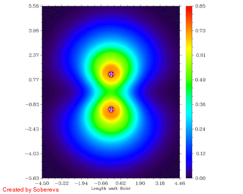
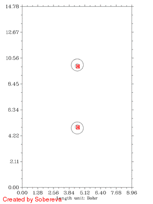
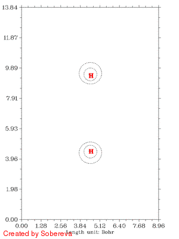
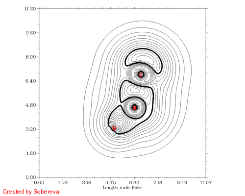
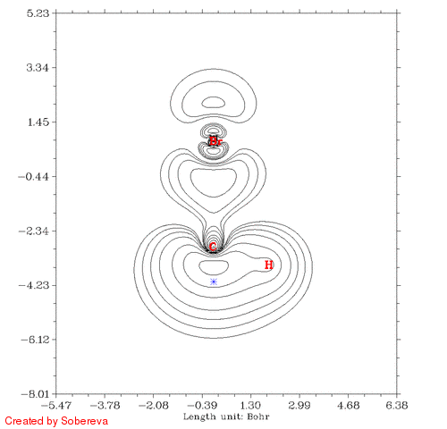

**制作动画分析电子结构特征**Creating animations to analyze electron structure characteristics

文/Sobereva @[北京科音](http://www.keinsci.com/)  
First release: 2011-May-1    Last update: 2014-Apr-15

在《自写Link生成Gaussian的IRC任务中每个点的波函数文件》（<http://sobereva.com/85>）一文中笔者已经谈了怎么获得IRC、Scan等任务中每一步的波函数文件，本文将通过实例介绍如何利用Multiwfn对它们批量作图并生成动画。动画是图形化研究电子结构特点的最高级形式，比静态图像能展现更丰富的信息，即便是外行人对此也是喜闻乐见的，插在幻灯片里会使得讲述妙趣横生。注：如果限于水平搞不定自写link的话，可以参看另一种方法，更容易实现，见《通过键级曲线和ELF/LOL/RDG等值面动画研究化学反应过程》（<http://sobereva.com/200>）。

本文使用的是Multiwfn 2.0.2版，可以在<http://sobereva.com/multiwfn>免费下载。本文涉及的Gaussian输入文件、波函数文件、动画文件等等都可以在这里下载：[/usr/uploads/file/20150610/20150610200942_56003.rar](http://sobereva.com/usr/uploads/file/20150610/20150610200942_56003.rar)。笔者windows系统为WinXP，Linux为RHEL6 server，ImageMagick版本为6.5.4-7。

## 1 三重态H2拉伸过程的LOL函数填色图动画

这是最简单的一个例子。定域化轨道定位函数(LOL)类似电子定域化函数(ELF)，数值在[0,1]之间，数值越大的地方说明电子定域性越大，即电子的运动被越大程度地限制在相应区域内。当两个拥有相同自旋电子的氢原子间距逐渐缩小，由于Pauli互斥，必然导致两个电子运动区域相互躲着，高定域性区域分别跑到氢分子的两端去。此例就来绘制这样一个过程的动画，看看是不是这样。

在Gaussian中通过scan关键词，让原子间距从0.2开始拉，共10步，每步0.1埃。输入文件如下  
%subst l555 .  
#P ub3lyp/cc-pvdz scan geom=nocrowd 6d 10f extralinks=l555

Title Card Required

0 3  
 H                
 H                  1            B1

   B1             0.20000000 10 0.1

/sob/H2tri/H2.wfn  
其中l555是自编的link，在《自写Link生成Gaussian的IRC任务中每个点的波函数文件》里有介绍，extralinks=l555使得l555被插入在SCF模块l502之后，即每一步都输出波函数文件，将依次得到H2_0000.wfn, H2_0001.wfn...H2_0010.wfn。geom=nocrowd是为了避免距离检测，否则原子距离小于0.5埃时Gaussian会报错。

运行完毕后将装着波函数文件的H2tri目录从linux中拷到windows，放在Multiwfn所在目录下。将Multiwfn的Settings.ini里的isilent参数设为0（后文皆如此）。在Multiwfn目录下编写一个文本文件batchcolor.txt，内容是（//后是注释）：  
4   //绘制平面图  
10  //LOL函数  
1   //填色图  
200,200   //两方向格点数  
3   //YZ平面。波函数文件中分子轴顺着Z  
0   //X=0  
4   //显示原子标签  
3   //用蓝色字体  
0   //保存图像到当前目录  
[空行]  
[空行]  
若不知道上述过程是什么目的，请看Multiwfn手册附录部分关于silent模式运行的介绍。

然后再编辑一个文本文件也放在Multiwfn录下，叫batchrun.bat，内容只有一行：  
for /f %%i in ('dir H2tri\*.wfn /b') do Multiwfn H2tri\%%i < batchcolor.txt  
这是一个DOS的批处理脚本。其中dir H2tri\*.wfn /b代表输出H2tri目录下所有.wfn文件名。这个脚本会使每个.wfn文件都被Multiwfn安静地执行一遍，相当于依次执行  
Multiwfn H2tri\H2_0000.wfn < batchcolor.txt  
Multiwfn H2tri\H2_0001.wfn < batchcolor.txt  
...  
Multiwfn H2tri\H2_0010.wfn < batchcolor.txt  
由于将isilent设为了1，图像不会自动弹出，而且每一步要输入的命令都通过batchcolor.txt重定向进了Multiwfn，所以每一步Multiwfn都会无声无息地执行，用户不需要干预。执行batchrun.bat后，由于体系小，几秒钟后当前目录下就出现了DISLIN.PNG, DISLIN_1.PNG, DISLIN_2.PNG...DISLI_10.PNG，依次对应核间距从近到远。

PS：有些人希望Multiwfn变成全GUI的，我之所以不这样做，而是将之开发成现在这样GUI+文本模式，一方面是因为那样并不会使操作简化，完全是多余的，另外届时也没法像上文这样，通过脚本来方便地批量执行任务。

接下来就是将这些图像文件合成为动画，我倾向于用gif格式，可以方便地嵌入到网页中，图像清楚，尽管色彩数上限为256，但足够了。合成gif的软件非常多，在Windows下比如可以用Atani，但是最方便的还是用Linux下的convert命令，它是ImageMagick图形软件包中的一员，通常在Linux发行版本中都自带也默认安装。先将刚才得到的所有.PNG文件拷贝到/sob/H2tri目录下，然后进入/sob目录，在shell下执行（这是一整行命令）：

convert -delay 20 -resize 500 -colors 128 -monitor -reverse -fill red -annotate +5+395 "Created by Sobereva" H2tripic/DISLIN.PNG H2tripic/DISLIN_?.PNG H2tripic/DISLI_??.PNG H2tripic/H2tri_all.gif

这条命令表明H2tripic下的DISLIN.PNG、DISLIN_?.PNG、DISLI_??.PNG（问号代表通配符）按顺序依次被convert命令读入，然后组合成H2tri_all.gif。不能为了省事直接写DISLI*.PNG，这样的话输入文件顺序是错的。文件名前面那一串是对图像的操作符或者设定参数的命令，delay指定每一帧停留的时间，越大则播放越慢。resize是将图像宽度调整为500像素而横纵比不变，因为Multiwfn默认输出的图像尺寸太大，不这样做则生成的.gif体积会较大，不适合放到网页，如果用于插入幻灯片倒是可以设大些以保证图像清晰。colors设定此gif动画的色彩数，将默认的256色降为128色不影响效果，文件体积也会减小。monitor代表监控convert命令内部执行过程。reverse代表将读入的图像顺序反转，因为上面的scan过程是由近及远，而此例想让过程由远及近。annotate命令用来在动画上写上文字，便于保护版权或进行内容说明，+5+395代表字符串的左下角相对于图像左上角的位置。前面的-fill red说明文字用红色。

不一会儿，H2tri_all.gif就生成了。如图：

可见，两原子离得越近三重态H2两端定域化区域越显著，和预期的一致。然而，仔细分析会发现这个过程还给出了新的信息，也就是当两个原子核离得很近时，二者中央很小区域内定域性也明显增加了！这看似与Pauli互斥有些违背，但实际上这并不奇怪。因为原子核离得越近，中间区域的电子感受到的核吸引势越强，自然定域性会升高。如果进一步离近，则两个氢核就融合成He了，与三重态He的LOL图相对比，会发现动画的最后一帧（距离0.2埃）与之十分相似。这样来看，这个动画实际上蕴含了两个截然不同的过程：动画前一半，两个氢核越来越近，两个自旋相同的电子因Pauli互斥相互避开，导致H2两端的高定域化区域膨胀。动画后一半，三重态H2逐渐显示三重态He特征，中间紧凑的高定域性区域对应于s轨道的电子，而两端高定域性区域实际上是占据p轨道的电子。这两个过程虽本质不同，但在动画中看上去是平滑过渡的。

下面的动画是上面这个scan过程的电子密度差图，从中可以得到与上述一致的结论，而且显得更清晰。这个图的做法在看过下一节的介绍后就会明白。图中虚线代表相对于两原子都在孤立状态时电子密度减小的区域，实线代表增加的区域。可见，一开始原子离得远，相互作用很弱，对原始电子密度几乎没有影响，几乎没出现等值线。随着它们离近，由于Pauli互斥导致中间电子密度大幅减少，电子纷纷转移向两端了。离近到一定距离后，中间一小部分电子密度开始增加，说明氦核开始形成了，s电子开始聚集了。仅仅是一个H2拉伸过程的动画就包含了很多信息，可见通过动画展现电子结构特征的威力之大！

注意彩图gif动画比较占空间，上面的填色图动画有11帧，占了535KB，而等值线动画有25帧，才238KB。

## 2 单重态H2拉伸过程的电子密度差等值线动画

做电子密度差图必须先获得涉及到的各个元素原子的波函数文件。每次执行Multiwfn时程序会从当前目录下atomwfn目录里寻找是否已有原子的波函数文件，没有则需要调用Gaussian重算。为了方便、省时，这里先事先算好氢原子的波函数文件，放在atomwfn目录下，并命名为H .wfn，注意空格必须有，否则Multiwfn不认。基组建议与计算分子时一致（若基组级别已较高，不一致时问题也不大）。其实计算密度差图还有个既重要又麻烦的球对称化原子密度问题，由于氢的密度本来就是球对称的，这里就不提了。

执行压缩包内的H2sin.gjf，这是单重态H2的scan任务，从0.2埃开始24步，每步0.1埃。注意尽管是单重态，但是拉远后对称破缺态是基态，所以要用非限制性方法，且需要加上guess(always,mix)打破对称性。计算完毕后将储存波函数文件的目录H2sin拷到Multiwfn所在目录下。

编写一个文本文件batchcontourfix.txt放在Multiwfn目录下，内容是：  
4  
-2  
1  
2  
200,200  
6  //自行输入格点设定  
0.00000  -4.50000  -6.95664  //原点  
0.00000   0.04500   0.00000  //平移向量1  
0.00000   0.00000   0.06957  //平移向量2  
0  
[空行]  
[空行]  
其中-2代表要做变形属性，由于函数选了1，计算的就是变形密度（密度差）。第一节的例子中坐标轴尺寸和刻度在不断变动，这是为了使当前帧的结构能充满图像，然而有些人不喜欢这样，因此此例中自行设定原点和平移向量，坐标轴就固定住了。显然很难直观判断数值应该设多少，我建议用体系涉及空间尺度最广的一帧作参考获取这些信息。比如此例H2_0024.wfn对应拉得最远的一帧，就先手动对这个波函数的任意一个函数做图（X=0的YZ平面，延展距离用默认的4.5 bohr），Multiwfn会输出作图时所用的格点信息：  
Origin is   0.00000  -4.50000  -6.95664 bohr  
 The x/y/z of transition vector 1 is   0.00000   0.04500   0.00000 bohr  
 The x/y/z of transition vector 2 is   0.00000   0.00000   0.06957 bohr  
令所有帧作图时都使用这个格点设定，就能保证每一帧感兴趣的区域都不出界。

然后，将前面batchrun.bat里的H2tri替换为H2sin，batchcolor.txt替换为batchcontourfix.txt，执行之，就得到了每帧的.PNG图像。将图像复制到/sob/H2sinpic目录下，并进入/sob目录，执行:

convert -delay 20 -resize 500 -shave '100x0' -colors 128 -monitor -reverse -fill red -annotate +5+395 "Created by Sobereva" H2sinpic/DISLIN.PNG H2sinpic/DISLIN_?.PNG H2sinpic/DISLI_??.PNG H2sinpic/H2sin_all.gif

和第一节的命令没什么区别，只是目录换了，并且加入了一个新的设定-shave '100x0'，这是因为这次的图像的坐标轴横轴固定了，左右的白边长度也固定了，将每帧在resize为宽度为500后，左右都截掉100像素可以让动画的画布更紧凑。最终所得动画H2sin_all.gif如图所示：

随距离拉近后，电子密度迅速在原子间聚集，表明共价键正在加强。聚集的区域一开始逐渐变大并逐渐变得扁长，但后来却开始收缩并变得接近于球型，最后一帧电子密度减少区域和增加区域都几乎变成了球对称状，前者包着后者。这是因为原子序数越大，核吸引势越强，电子密度分布范围收缩得越厉害，基态He的1s电子密度延展范围小于基态H的，所以当两个氢核距离接近到氦核特征明显出现时内部电子密度就增加了，相应地外侧减少。

## 3 HCN异构化过程的LOL等值线动画

如何获得IRC过程中每个点的波函数文件的方法在《自写Link生成Gaussian的IRC任务中每个点的波函数文件》已经介绍，就不累述，此例的Gaussian输入文件是附件里的HCN_IRC.gjf，加上过渡态最终将得到21个波函数文件。将它们都拷入Multiwfn目录下HCN子目录内，编写一个文本文件batchcontourfixldset.txt放在Multiwfn目录下，内容是：  
4  
10  
2  
200,200  
6  
-6.47878  -5.57534   0.00000  
0.05565   0.00000   0.00000  
0.00000   0.05626   0.00000  
3   //进入等值线设定  
7   //从外部文件载入等值线设定  
ELFctrsp.txt  //记录着适合绘制LOL、ELF函数的等值线设定的文件（假设在当前目录），从0至1，步长0.05。  
10  // 加粗等值线  
1   // 被加粗的只有一条  
11  // 加粗第11条等值线，对应0.5，它所包围的区域一般是化学上感兴趣的区域  
1   // 保存等值线设定  
0  
[空行]  
[空行]  
将batchrun.bat里的路径都改为HCN，重定向文件名也改为batchcontourfixldset.txt，执行此文件。将所得的DISLIN.PNG、DISLIN_1.PNG...DISLI_10.PNG放到/sob/HCNpic/b，将DISLIN_11.PNG...DISLI_20.PNG放到/sob/HCNpic/f，这两批图像分别对应IRC的两个方向（DISLIN.PNG对应TS）。进入/sob目录，然后依次执行下述命令：

convert -delay 25 -resize 500 -colors 128 -reverse -fill red -annotate +5+395 "Created by Sobereva" -monitor HCNpic/b/DISLIN.PNG HCNpic/b/DISLIN_?.PNG HCNpic/b/DISLI_??.PNG HCNpic/b.gif

convert -delay 25 -resize 500 -colors 128 -fill red -annotate +5+395 "Created by Sobereva" -monitor HCNpic/f/DISLI_??.PNG HCNpic/f.gif

convert HCNpic/b.gif HCNpic/f.gif HCNpic/HCN_all.gif  
最后一步用来将前后两个方向的动画合并到一起，得到的HCN_all.gif就是我们想要的：

从加粗的等值线上能很容易考察电子结构特征的变化。在接近两种稳定异构体的构型下C-N键的定域化域扁平而中间凹陷，显示出明显多重键特征。氢转移开始后，随着氢远离氮，氮的孤对电子逐渐显现，并且氢开始与C-N键的定域化域连通，说明此时形成了三中心键。当氢与氮的孤对电子定域化域分离后，马上就与碳的孤对电子区域相连，随后碳的孤对电子逐渐消失，氢也不再参与三中心键，最终完成了整个异构化过程。

## 4 参考点在CH3Br的C-Br键径上移动过程中Fermi穴函数的变化

这是个特殊的例子，不是使用多个波函数，而是使用一个波函数但是通过变化参数来获得动画。

Fermi穴函数是个六维量，需选择一个参考点才能用图形来表征。它代表的含义是已知一个电子在参考点位置，由于Pauli互斥作用而在其它位置发现另一个同自旋电子的概率变化，其值处处为负，全空间积分值为-1。电子只能运动到以它的位置为参考点时Fermi穴函数有数值分布的区域（数值越大机会越大），如果范围很小，则这个区域有较高的定域性。定域化函数与Fermi穴函数是有很大共通之处的，这些问题我会单独撰文介绍，这里就不再多谈了。

为了方便写脚本，Multiwfn中Fermi穴函数的参考点可以在主功能1000里设定（也可以在settings.ini里设定）。为了绘制参考点移动过程的动画，就需要生成一批重定向文件，每个文件里依次使用不同的参考点位置。此例的CH3Br中C和Br的x、y坐标皆为0，z坐标分别为-2.88和0.79 bohr，我们想让参考点从z=-4.1移动到z=2.1，x、y都为0，过程共31帧。执行下面的shell脚本createinpctr.sh就可以在当前目录生成31个重定向文件了。

#!/bin/bash  
nstep=30  
refx=0  
refy=0  
refz=0  
refzmin=-4.1  
refzmax=2.1  
refz=$refzmin  
rangez=`echo "$refzmax-($refzmin)"|bc`  
dz=`echo "scale=5;$rangez/$nstep"|bc`  
for ((i=1;i<=$(($nstep+1));i=i+1))  
do  
cat << EOF > `printf "%4.4i" $i`.txt  
1000              #特殊功能  
1                 #设定Fermi穴参考点  
$refx,$refy,$refz #Fermi穴参考点数值  
4  
17  
2  
200,200  
3  
0                  #X=0的YZ平面，是CH3Br中的一个对称面  
-7                 #Multiwfn 2.02新增功能，对所有数据乘上某个值  
-1                 #乘上的值为-1  
0

EOF  
refz=`echo "$refz+$dz"|bc`  #每个重定向文件内的参考点z值依次增加  
done  
由于shell脚本不能直接支持浮点运算，所以这个脚本利用了linux下bc命令来做运算。之所以所有数据乘上-1，是因为默认等值线设定下负值和正值分别使用虚线和实线表示，而Fermi穴函数都为负值，满屏虚线看起来有点乱，乘上-1后就会通过实线来表示了，会好看些。将这个脚本生成的0001.txt至0031.txt文件拷到Multiwfn所在目录下的inpctr子目录下。

在Multiwfn目录下写一个批处理文件batchrunsinfil.bat，内容如下  
for /f %%i in ('dir inpctr\*.txt /b') do Multiwfn CH3Br.wfn < inpctr\%%i  
将CH3Br.wfn也放到Multiwfn所在目录下。这个波函数是Hartree-Fock方法生成的，注意研究Fermi穴函数时切勿使用DFT波函数，因为DFT波函数本意用于产生基态密度和获得较准确动能，而并不是用于逼近真实波函数，它的Fermi穴函数意义不清。

执行batchrunsinfil.bat，将得到的31幅图像都放到/sob/CH3Br目录下，然后进入/sob目录，执行  
convert -delay 20 -resize 600 -colors 128 -shave '50x0' -monitor -fill red -annotate +5+475 "Created by Sobereva" CH3Br/DISLIN.PNG CH3Br/DISLIN_?.PNG CH3Br/DISLI_??.PNG CH3Br/CH3Br_Fermi.gif  
得到的CH3Br_Fermi.gif如下图所示：

蓝色米字符号表示的是参考点位置。有两个氢离平面太远所以没有标出。从图中可见，在一开始参考点与C有一段距离的时候Fermi穴函数分布很广，也包围了氢原子，这表明在参考点的电子有很大离域性，这个参考点附近电子定域性因此也不大。而到了碳原子核附近后，Fermi穴函数分布紧密集中在碳原子核附近，这说明这个位置的电子的运动被明显束缚在有限空间了，实际上这正是内层s电子的情况。有文章指出具有近完美的定域性的区域只会出现在原子内核。当参考点移动到C-Br键中间时虽然电子也离域到C-Br的两端，但中间有很广且数值较高的区域，这是为什么共价键区域定域化函数比较大。当参考点与Br开始接近的时候Fermi穴函数分布范围开始急剧缩小，和C的情况类似，当穿过Br之后离域性又开始变大。

## 5 结语

限于时间和精力，本文只给出了几个基本化学过程的动画的制作方法并对其包含的信息进行了讨论，但我想仍足矣证明动画这种形式的强大表现力，也足以阐明制作的基本流程。虽然制作过程看似步骤较多，实际上熟练之后会发现很容易，无非是生成波函数、用Multiwfn批量绘图、用convert合并。制作不同化学过程的动画需要对上述过程做不同细微的调整，需随机应变。曲线的动画和等值面图的动画在本文没有涉及，前者对于研究一维上的问题很适合（比如前文的H2拉伸过程，用曲线图在定量上更清楚），后者对研究在空间上比较复杂的过程是很有用的，制作并不困难，方法参见文章开头提到的《通过键级曲线和ELF/LOL/RDG等值面动画研究化学反应过程》。
