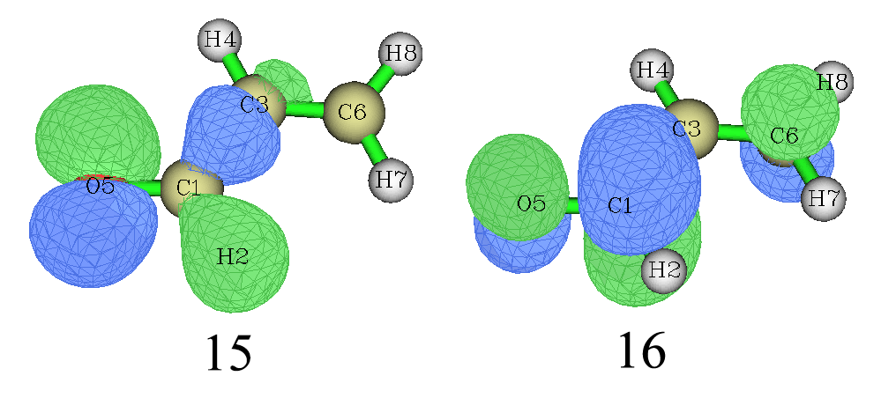

**注1**：此文发布后Multiwfn也支持了NTO分析，用Multiwfn做NTO比此文的方法方便得多得多得多！**故强烈建议用Multiwfn做NTO分析**，尤其是处理大批激发态的时候更是必用Multiwfn！用Multiwfn做NTO的方法见《使用Multiwfn做自然跃迁轨道(NTO)分析》（<http://sobereva.com/377>）。而且Multiwfn做NTO分析还支持周期性体系，见《使用CP2K结合Multiwfn对周期性体系模拟UV-Vis光谱和考察电子激发态》（<http://sobereva.com/634>）。

**注2**：Multiwfn支持的空穴-电子分析远比NTO强大得多、普适性强得多，如今非常流行，详细介绍见《使用Multiwfn做空穴-电子分析全面考察电子激发特征》（<http://sobereva.com/434>）。**笔者强烈建议使用空穴-电子分析代替NTO！**

**跃迁密度分析方法-自然跃迁轨道(NTO)简介**  
Transition density analysis method: Introduction to natural transition orbital (NTO)

文/Sobereva @[北京科音](http://www.keinsci.com)  
First release: 2011-Jun-17   Last update: 2014-Dec-23

## 1 前言

虽然电子跃迁问题本质是体系电子态与电子态之间的跃迁，但是人们往往喜欢通过轨道模型来描述，也就是把电子跃迁问题以某占据轨道的电子向某虚轨道跃迁的形式来描述，以使跃迁模式更易于考察和理解。使用CIS、TDHF、TDDFT计算激发态时，跃迁模式都可以表达为基态占据轨道与虚轨道间的不同方式跃迁的线性组合，很多情况下，只有一种跃迁所占成分较大，例如Gaussian输出的一例（RCIS/6-31+G*，丙烯醛）  
 Excited State   2:      Singlet-A'     7.0919 eV  174.83 nm  f=0.7713  <S**2>=0.000  
      15 -> 16         0.66677  
      15 -> 25        -0.13319  
这表明，S0->S2这种跃迁方式有88.9%（0.66677^2*2*100%）的程度可以描述为占据轨道15的电子向虚轨道16的跃迁。因此，可以通过分析这种占主导地位的轨道跃迁模式来阐述S0->S2跃迁的本质。

不过，有些情况很难用单一的轨道跃迁模式来描述，例如上面那个体系的S0->S1  
 Excited State   1:      Singlet-A"     4.6966 eV  263.99 nm  f=0.0003  <S**2>=0.000  
      14 -> 16         0.56407  
      14 -> 20        -0.21920  
      14 -> 25        -0.24192  
      14 -> 29        -0.17712  
      14 -> 33        -0.13568  
系数最大的是14 -> 16，但它只能描述S0->S1跃迁的63.6%的情况，这不够充分。然而如果将其它系数不太小的轨道跃迁模式也一起考虑，分析起来会很困难，不便于指认。自然跃迁轨道(Natural transition orbitals, NTO，原文见JCP,118,4775)可以解决这个困难，它通过对分子轨道的变换，使得需要涉及多个轨道跃迁模式才能描述的跃迁问题只用一对儿占据轨道到虚轨道的跃迁就能很好地描述，分析起来容易许多。

## 2 跃迁密度

先简要回顾一下跃迁密度的概念。  
基态ΨG到激发态ΨE的跃迁密度（无自旋形式，后同）写为  
T(r|r')=T(r1|r1')=N*∫∫...∫|ΨG(x1,x2...xN)><ΨE(x1',x2...xN)| ds1 dx2 dx3... dxN  其中N是总电子数，x是自旋+空间坐标，s是自旋坐标，r是空间坐标。  
以基态的分子轨道{ψ}为基的跃迁密度矩阵的i,n矩阵元可写为  
T_i,n=∫∫T(r|r')*ψi`(r)*ψn(r') dr dr'  
这里i代表占据轨道标号，n代表虚轨道标号，`是取共轭。T是n_occ*n_vir维矩阵，n_occ和n_vir分别是占据和虚轨道的数目，假设n_vir>n_occ。

PS:这里并不把T写为n*n维矩阵，n代表全部轨道数。因为这里构成ΨG的各行列式是由ΨE的单行列式通过激发电子得到的，根据Slater-Condon定理，T(r|r')只由各个占据轨道{ψi(r)}和各个虚轨道波函数{ψn`(r')}乘积所构成，T_i,n实际上为ΨE中由i向n激发的行列式的系数乘以N。若令j和m分别代表另外任意一个占据轨道和虚轨道，则T_i,j=0、T_m,n=0，也就是只有n_occ*n_vir的子矩阵不都为0。

对于单粒子算符∑[l]h_l，其期望值<ΨE|∑[l]h_l|ΨG>=∑[i]∑[n]T_i,n*<ψn|h|ψi>。

## 3 NTO的原理

首先回忆多组态波函数，它是由基态单行列式与对它进行各种激发获得的其它行列式组合而成的，由于组态数众多而很难考察。若将密度矩阵对角化，得到的本征向量就是自然轨道，通常只需要本征值最大的n_occ个轨道就能很充分地描述体系密度矩阵，冗余的信息就被去掉了。NTO的思路和做法在某种意义上与此相似，使一大堆轨道跃迁模式转化为一个“紧凑”的轨道跃迁模式。

首先将TT`矩阵进行酉变换对角化（`仍是取共轭）  
U`TT`U=A  
U、TT`、A都是n_occ*n_occ矩阵，U是变换矩阵。第i个占据的NTO φi与原先的占据MO {ψj}关系为  
φi=∑[j=1→n_occ]U_j,i*ψj  
A_i,i就是φi的本征值

然后将T`T进行酉变换对角化  
V`T`TV=B  
V、T`T、B都是n_vir*n_vir矩阵，V是变换矩阵。第n个虚NTO φn与原先的虚MO {ψm}关系为  
φn=∑[m=1→n_occ]V_m,n*ψm  
B_n,n就是φn的本征值

这样，就可以将原先n_occ个占据轨道变换成数目相同的占据NTO，n_vir个虚轨道就被变换成了数目相同的虚NTO。占据以及虚NTO的本征值都小于等于1且大于等于0。每个占据NTO都有一个本征值相同的虚NTO与之对应，因此总共形成n_occ对儿占据→虚NTO跃迁模式。剩下的n_vir减n_occ个虚NTO的本征值都等于0。假设某NTO跃迁模式的本征为0.95，就说明这种NTO跃迁模式可以描述95%的体系电子跃迁模式，或者说这种NTO跃迁模式的组合系数为√0.95=0.975。一般本征值最大的NTO跃迁模式本征值都比较接近于1（除非一些含简并的高对称性体系），故一般只需要这一个NTO跃迁模式就足够展现体系当前电子跃迁的本质特点了。对于CIS，全部占据NTO（或全部虚NTO）的本征值加和为1，代表全部NTO跃迁模式一起可以100%地描述当前的电子跃迁，但对于TDHF/TDDFT由于存在去激发，可能稍微偏离1。

如果用占据的和虚NTO构建跃迁密度矩阵，则可以将跃迁密度矩阵写成对角的形式，故单粒子跃迁属性就可以写为每个NTO跃迁模式贡献和。其中占主导的NTO跃迁模式的贡献就可以用于近似解释跃迁属性。比如体系的跃迁偶极矩，可以近似用本征值最大的占据NTO到相应虚NTO的跃迁偶极矩来描述。

## 4 实例

在Gaussian09中已支持NTO分析。这里我们将第一节涉及的丙烯醛S0->S1跃迁做NTO分析。Route section内容如下  
# cis/6-31+G* pop(saveNTO,NTO) density=transition=1

density=transition=1代表将基态到第一激发态的跃迁密度矩阵传递给L601模块（波函数分析模块）用于分析，pop里NTO代表对这个传来的S0->S1跃迁密度矩阵生成NTO，saveNTO代表将生成的所有NTO都保存到checkpoint文件里，就可以用gview，或者转化为fch文件后用Multiwfn (<http://sobereva.com/multiwfn>) 观看NTO轨道了，而且还可以用Multiwfn做轨道成分分析。

Gaussian里对NTO的排序方式是：对于占据NTO，本征值从低往高排，对于虚NTO，本征值从高往低排。下面是输出信息的一部分，占据轨道部分最后一个（第15号）是0.99276，这就是本征值最大的占据NTO，虚轨道部分第一个（第16号）就是本征值最大的虚NTO。可见每个占据NTO都有一个本征值相同的虚NTO相对应。0.99276这个值几乎达到了上限，它说明S0->S1跃迁的高达99.2%的内涵都可以只用15号轨道到16号NTO的跃迁来描述，其它的NTO跃迁模式，如14到17号（占0.6%）、13到18号（占0.08%）等等都可以忽略。

 Alpha  occ. eigenvalues --    0.00000   0.00000   0.00000   0.00000   0.00000  
 Alpha  occ. eigenvalues --    0.00000   0.00000   0.00001   0.00003   0.00005  
 Alpha  occ. eigenvalues --    0.00008   0.00018   0.00077   0.00611   0.99276  
 Alpha virt. eigenvalues --    0.99276   0.00611   0.00077   0.00018   0.00008  
 Alpha virt. eigenvalues --    0.00005   0.00003   0.00001   0.00000   0.00000  
 Alpha virt. eigenvalues --    0.00000   0.00000   0.00000   0.00000   0.00000  
...略

把chk转换为fch文件，再用Multiwfn载入之，进入主功能0查看分子轨道，第15和第16号NTO如下所示

我们通过Multiwfn基于Becke方法来做一下15号NTO的轨道成分分析。关闭观看分子轨道的界面，然后输入  
8   //轨道成分分析  
9   //Becke方法  
15   //15号轨道  
我们看到第15号NTO中氧的成分达到了70%，因此可以指认S0->S1跃迁是氧的孤对电子向π反键轨道跃迁。用NTO的时候考察一对儿轨道的跃迁就说明问题了，而原先使用分子轨道描述时需要同时考虑好几对儿轨道的跃迁，明显NTO使跃迁分析方便多了。

如果接下来想对比如S0->S2做NTO分析，当然可以用cis/6-31+G* pop(saveNTO,NTO) density=transition=2，但是这要完全地重算一遍，比较费时。较好的办法是写cis(read)/6-31+G* guess=read pop(saveNTO,NTO) density=transition=2，这说明在SCF过程中直接读取check文件里已经收敛的SCF波函数，而在CIS过程中（需要Davidson迭代求解）也直接读取check文件里的初猜，这样做会比起重算一遍速度会快不少。

## 5 其它

NTO对于一些情况，特别是简并的情况，效果并不好，也就是多个NTO对儿的本征值都不小，没有哪对儿NTO是主导的从而可以较好描述电子的跃迁，此时仍需要通过两个或更多NTO对儿才能描述电子跃迁，相当于NTO分析失去意义了。在Multiwfn程序(<http://sobereva.com/multiwfn>)的主功能18里的子功能1可以做电子-空穴(electron-hole)分析，会给出电子以及空穴的分布图形。假设跃迁可以被一对儿NTO所完美描述，那么这种电子-空穴分析与NTO分析给出的结论是一致的，电子分布和空穴分布分别相当于那两个NTO轨道波函数的平方。然而当单个NTO对儿不足以定性描述跃迁时，就必须用电子-空穴分析了，也就是说Multiwfn的电子-空穴分析是一种比NTO更普适的分析跃迁的方法，这种分析方法详见手册3.21.1节的理论介绍和4.18.1节的示例。另外，如果对于一个体系你需要分析多个激发的话，Multiwfn的这个功能比起NTO用起来也更方便，因为只需要用Gaussian计算一次即可，然后在Multiwfn里可以直接选择要分析哪个激发态，而不用像NTO一样每次还得重新用Gaussian算一遍。

值得一提的是Mayer在CPL,437,284里提出的方法和NTO在出发点和目的上如出一辙，只是推导过程不同而已，但实际上也不难证明等价性。Mayer的推导处理的不是跃迁密度，而是CI系数。对应的程序CIS-T可以从这里下载<http://occam.chemres.hu/programs/>，不过也只能处理Gaussian的输出，由于G09已经内建了NTO，CIS-T就用处不大了。

NTO同样可以分析开壳层体系的跃迁，意义与上面介绍的是相同的，用前文处理无自旋的跃迁密度矩阵的方法分别处理alpha-alpha跃迁密度矩阵和beta-beta跃迁密度矩阵即可。

补充说明：很多人在NTO和分子轨道的序号方面没搞明白。这里再强调一下：NTO和MO的序号没有任何直接对应关系！如文中所说，Gaussian里NTO是根据相应的TT`、T`T矩阵的本征值排序的，而MO是按照能量从低到高排序的，序号规则完全不同。而且NTO是从MO变换而来（或者说每个NTO是由诸多MO混合得到），形状上也没法直接对应。一种电子跃迁模式多数情况都可以仅靠本征值最高的占据NTO向相应本征值的虚NTO跃迁来近似描述。例如对于本文讨论的丙烯醛（15个占据轨道），不管是哪种跃迁，无论是S0->S1也好还是S0->S2也好或是向更高的激发态跃迁也好，按照Gaussian对NTO的排序方式，总是能近似视为是NTO 15->NTO 16的跃迁。然而，这些跃迁用MO的跃迁来表示就很不相同了，比如S0->S2主要以MO 15->MO 16来表示（HOMO->LUMO），而占S0->S1最大成分的则是MO 14->MO 16。另外，NTO也没有轨道能量的概念，绝对不能由于电子激发模式可以被NTO 15->NTO 16的跃迁所很好地表达就说成是HOMO->LUMO的跃迁，这是大错特错。
