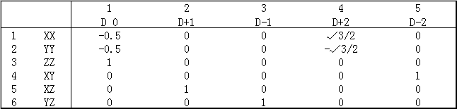
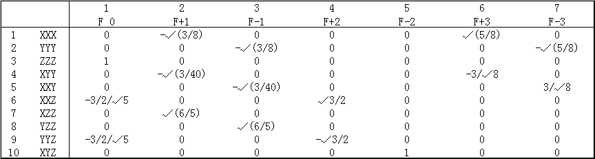
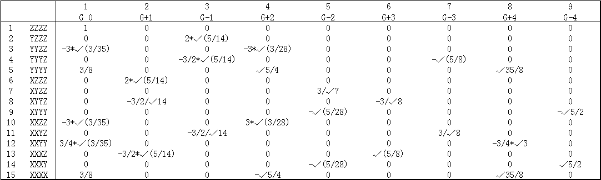
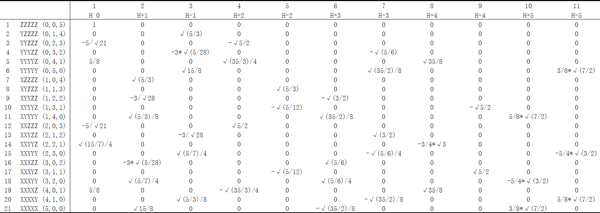

**球谐型与笛卡尔型Gaussian函数的转换关系**Transformation relationship between spherical-harmonic type and Cartesian type of Gaussian functions

文/Sobereva @[北京科音](http://www.keinsci.com/)    First release: 2011-Jul-31

在笔者的《谈谈5d、6d型d壳层基函数与它们在Gaussian中的标识》(<http://sobereva.com/51>)一文中曾简要介绍了球谐型与笛卡尔型高斯函数的关系，本文是一些补充。  
  
要提醒大家注意的是，球谐高斯函数与笛卡尔型的转换关系对于d型是十分明确的，也是通用的。然而对更高角动量函数，在不同程序中用的关系往往不一致。在Gaussian中，f用的既不是所谓的“标准f集”，也不是“立方f集”，而用的是IJQC,54,83文中给出的形式。在Gaussian官方网站上介绍fch文件格式的页面给出的球谐f函数的组合方式是错误的（页面中写的是ZZZ-ZRR,XZZ-XRR,YZZ-YRR,XXZ-YYZ,XYZ,XXX-XYY,XXY-YYY）。  
  
笔者发现网上找不到很清楚的、带归一化系数的、包含高角动量的转换表，给编程带来不便，因此在这里总结出来。  
以下是归一化的实型球谐高斯函数向归一化的笛卡尔型高斯函数的转换关系（比如XYY，它的归一化系数已经纳入XYY这个符号当中了）。注意符号的表示，如√3/2=sqrt(3)/2，√(3/2)/5=sqrt(3/2)/5。  
  
5D->6D:  
!Used in all quantum chemistry codes  
Sequence: XX,YY,ZZ,XY,XZ,YZ  
D 0=-0.5*XX-0.5*YY+ZZ  
D+1=XZ  
D-1=YZ  
D+2=√3/2*(XX-YY)  
D-2=XY  
  
  
7F->10F:  
!f in Gaussian program  
Sequence in .fch: XXX,YYY,ZZZ,XYY,XXY,XXZ,XZZ,YZZ,YYZ,XYZ  
F 0=-3/2/√5*(XXZ+YYZ)+ZZZ  
F+1=-√(3/8)*XXX-√(3/40)*XYY+√(6/5)*XZZ  
F-1=-√(3/40)*XXY-√(3/8)*YYY+√(6/5)*YZZ  
F+2=√3/2*(XXZ-YYZ)  
F-2=XYZ  
F+3=√(5/8)*XXX-3/√8*XYY  
F-3=3/√8*XXY-√(5/8)*YYY  
  
!Standard f set, normalization coefficient  
!NBO程序里用这种形式，命名不同而已，f(c?)对应F+?，f(s?)对应F-?。如NBO输出中的f(s2)对应这里的F-2  
F 0=-3*XXZ-3*YYZ+2*ZZZ    0.240654032741774  
F+1=-XXX-XYY+4*XZZ        0.281160203343101  
F-1=-XXY-YYY+4*YZZ        0.281160203343101  
F+2=XXZ-YYZ               √3/2  
F-2=XYZ                   1  
F+3=XXX-3*XYY             0.369693511996758  
F-3=3*XXY-YYY             0.369693511996758  
  
!Cubic f set, normalization coefficient  
F(D1)=2*XXX-3*XYY-3*XZZ   0.240654032741774  
F(D2)=-3*XXY+2*YYY-3*YZZ  0.240654032741774  
F(D3)=-3*XXZ-3*YYZ+2*ZZZ  0.240654032741774  
F(B)=XYZ                  1  
F(E1)=XZZ-XYY             √3/2  
F(E2)=YZZ-XXY             √3/2  
F(E3)=XXZ-YYZ             √3/2  
  
  
9G->15G:  
!g in Gaussian program  
Sequence in .fch: ZZZZ,YZZZ,YYZZ,YYYZ,YYYY,XZZZ,XYZZ,XYYZ,XYYY,XXZZ,XXYZ,XXYY,XXXZ,XXXY,XXXX  
G 0=ZZZZ+3/8*(XXXX+YYYY)-3*√(3/35)*(XXZZ+YYZZ-1/4*XXYY)  
G+1=2*√(5/14)*XZZZ-3/2*√(5/14)*XXXZ-3/2/√14*XYYZ  
G-1=2*√(5/14)*YZZZ-3/2*√(5/14)*YYYZ-3/2/√14*XXYZ  
G+2=3*√(3/28)*(XXZZ-YYZZ)-√5/4*(XXXX-YYYY)  
G-2=3/√7*XYZZ-√(5/28)*(XXXY+XYYY)  
G+3=√(5/8)*XXXZ-3/√8*XYYZ  
G-3=-√(5/8)*YYYZ+3/√8*XXYZ  
G+4=√35/8*(XXXX+YYYY)-3/4*√3*XXYY  
G-4=√5/2*(XXXY-XYYY)  
  
  
11H->21H:  
!h in Gaussian program  
Sequence in .fch: ZZZZZ,YZZZZ,YYZZZ,YYYZZ,YYYYZ,YYYYY,XZZZZ,XYZZZ,XYYZZ,XYYYZ,XYYYY,XXZZZ,XXYZZ,XXYYZ,XXYYY,XXXZZ,XXXYZ,XXXYY,XXXXZ,XXXXY,XXXXX  
H 0=ZZZZZ-5/√21*(XXZZZ+YYZZZ)+5/8*(XXXXZ+YYYYZ)+√(15/7)/4*XXYYZ  
H+1=√(5/3)*XZZZZ-3*√(5/28)*XXXZZ-3/√28*XYYZZ+√15/8*XXXXX+√(5/3)/8*XYYYY+√(5/7)/4*XXXYY  
H-1=√(5/3)*YZZZZ-3*√(5/28)*YYYZZ-3/√28*XXYZZ+√15/8*YYYYY+√(5/3)/8*XXXXY+√(5/7)/4*XXYYY  
H+2=√5/2*(XXZZZ-YYZZZ)-√(35/3)/4*(XXXXZ-YYYYZ)  
H-2=√(5/3)*XYZZZ-√(5/12)*(XXXYZ+XYYYZ)  
H+3=√(5/6)*XXXZZ-√(3/2)*XYYZZ-√(35/2)/8*(XXXXX-XYYYY)+√(5/6)/4*XXXYY  
H-3=-√(5/6)*YYYZZ+√(3/2)*XXYZZ-√(35/2)/8*(XXXXY-YYYYY)-√(5/6)/4*XXYYY  
H+4=√35/8*(XXXXZ+YYYYZ)-3/4*√3*XXYYZ  
H-4=√5/2*(XXXYZ-XYYYZ)  
H+5=3/8*√(7/2)*XXXXX+5/8*√(7/2)*XYYYY-5/4*√(3/2)*XXXYY  
H-5=3/8*√(7/2)*YYYYY+5/8*√(7/2)*XXXXY-5/4*√(3/2)*XXYYY  
  
注：尽管没有明确的文档介绍.fch中f以上角动量笛卡尔型函数的排列顺序，只要自行用6d 10f pop=full结合高角动量基组随便算一下，从输出的分子轨道系数部分就能看到笛卡尔型函数的排列顺序，正是本文所给出的。  
  
  
在量子化学代码里，将以上转换关系（Gaussian程序里所用的转换方式）写成矩阵形式是便于使用的。  

下面通过代码介绍怎么用上面的转换矩阵把球谐型高斯函数下的系数矩阵转换成笛卡尔型高斯函数下的。笛卡尔和球谐型基函数的记录顺序与Gaussian中的一致。  
变量或数组后面5D和6D代表它对应球谐型和笛卡尔型（无论角动量的高低）。CObasa是系数矩阵，第n,i元素代表第i条轨道在n基函数上的展开系数，由于基函数数目与轨道数相同，所以是方阵。conv5d6d、conv7f10f和conv9g15g对应上面三个矩阵。以下Fortran代码实际上是Multiwfn的readfch子程序里的一段。  
  
ipos5D=1 !用于记录当前位置  
ipos6D=1 !同上  
do ish=1,nshell !nshell是总壳层数  
    ishtyp5D=shelltype5D(ish) !shelltype5D将壳层编号转化为球谐型的壳层类型  
    ishtyp6D=shelltype6D(ish) !同上  
    numshorb5D=type2norb(ishtyp5D) !获得壳层内基函数数目  
    numshorb6D=type2norb(ishtyp6D) !同上  
    if (ishtyp5D==0.or.ishtyp5D==1.or.ishtyp5D==-1) then !S、P、SP壳层，不用变换，直接复制  
                !nbasis5D是球谐型高斯函数的数目，Cobasa6D之前已初始化为0，所以nbasis5D后面的列的元素都将是0。  
        CObasa6D(ipos6D:ipos6D+numshorb6D-1,1:nbasis5D)=CObasa5D(ipos5D:ipos5D+numshorb5D-1,:)  
    else if (ishtyp5D==-2) then !5D->6D  
!CObasa5D的(ipos5D:ipos5D+4,k)列向量对应k轨道对当前D壳层的5个球谐型高斯基函数的展开系数，左乘变换矩阵conv5d6d，就能转换成k轨道对相应的6个笛卡尔型高斯基函数的展开系数。将k替换为:，则所有轨道的展开系数被一次性转换。  
        CObasa6D(ipos6D:ipos6D+5,1:nbasis5D)=matmul(conv5d6d,CObasa5D(ipos5D:ipos5D+4,:))  
    else if (ishtyp5D==-3) then !同上，这次是7F->10F  
        CObasa6D(ipos6D:ipos6D+9,1:nbasis5D)=matmul(conv7f10f,CObasa5D(ipos5D:ipos5D+6,:))  
    else if (ishtyp5D==-4) then !同上，这次是9G->15G  
        CObasa6D(ipos6D:ipos6D+14,1:nbasis5D)=matmul(conv9g15g,CObasa5D(ipos5D:ipos5D+8,:))  
    end if  
    ipos5D=ipos5D+numshorb5D !将读写位置移到下一个壳层的第一个元素  
    ipos6D=ipos6D+numshorb6D !同上  
end do  
  
笛卡尔型高斯基函数间的重叠矩阵(Sbas)很容易获得，下面的代码通过转换矩阵将之转换成球谐型高斯基函数的，从上面的注释中应该容易理解代码含义。基本原理是，设m:n代表一个D壳层内的全部基函数编号，Sbas(:,m:n)就代表这个6个笛卡尔型D基函数与全部笛卡尔型基函数间的重叠矩阵。令Sbas(:,m:n)右乘conv5d6d，则得到的就是变换出的5个球谐型D基函数与全部笛卡尔基函数间的重叠矩阵。因此，扫描Sbas的所有列，即循环每个壳层，将每个壳层右乘对应的变换矩阵，所得矩阵V中的i,j元素就是球谐型基函数j与笛卡尔型基函数i的重叠积分。然后，再类似地扫描V的所有行，即循环每个壳层，但改为左乘变换矩阵，所得的矩阵Sbas5D就是我们需要的球谐型高斯函数间的重叠矩阵了。下面的代码为了紧凑将循环列和循环行这两步揉在同一个循环里了。另外也没有利用临时矩阵V，而是每次乘完后直接赋值到原矩阵适当位置，这是因为球谐型高斯函数数目总少于笛卡尔型，所以赋值时不会把后面壳层的数据覆盖掉。  
ipos5D=1  
ipos6D=1  
do ish=1,nshell  
    ishtyp5D=shelltype5D(ish)  
    ishtyp6D=shelltype(ish)  
    numshorb5D=type2norb(ishtyp5D)  
    numshorb6D=type2norb(ishtyp6D)  
    !Now contract columns  
    if (ishtyp5D==0.or.ishtyp5D==1.or.ishtyp5D==-1) sbas(:,ipos5D:ipos5D+numshorb5D-1)=sbas(:,ipos6D:ipos6D+numshorb6D-1)  
    if (ishtyp5D==-2) sbas(:,ipos5D:ipos5D+numshorb5D-1)=matmul(sbas(:,ipos6D:ipos6D+numshorb6D-1),conv5d6d)  
    if (ishtyp5D==-3) sbas(:,ipos5D:ipos5D+numshorb5D-1)=matmul(sbas(:,ipos6D:ipos6D+numshorb6D-1),conv7f10f)  
    if (ishtyp5D==-4) sbas(:,ipos5D:ipos5D+numshorb5D-1)=matmul(sbas(:,ipos6D:ipos6D+numshorb6D-1),conv9g15g)  
    !Now contract rows  
    if (ishtyp5D==0.or.ishtyp5D==1.or.ishtyp5D==-1) sbas(ipos5D:ipos5D+numshorb5D-1,:)=sbas(ipos6D:ipos6D+numshorb6D-1,:)  
    if (ishtyp5D==-2) sbas(ipos5D:ipos5D+numshorb5D-1,:)=matmul(conv5d6dtr,sbas(ipos6D:ipos6D+numshorb6D-1,:))  
    if (ishtyp5D==-3) sbas(ipos5D:ipos5D+numshorb5D-1,:)=matmul(conv7f10ftr,sbas(ipos6D:ipos6D+numshorb6D-1,:))  
    if (ishtyp5D==-4) sbas(ipos5D:ipos5D+numshorb5D-1,:)=matmul(conv9g15gtr,sbas(ipos6D:ipos6D+numshorb6D-1,:))  
    ipos5D=ipos5D+numshorb5D  
    ipos6D=ipos6D+numshorb6D  
end do  
sbas5D=sbas(1:nbasis5D,1:nbasis5D)
