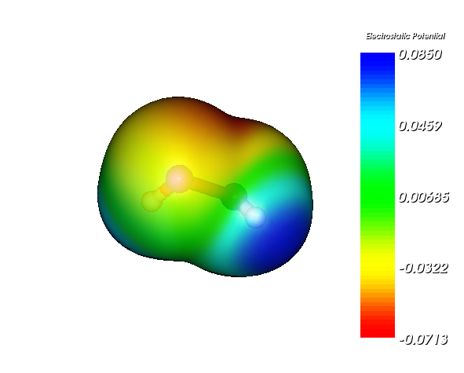
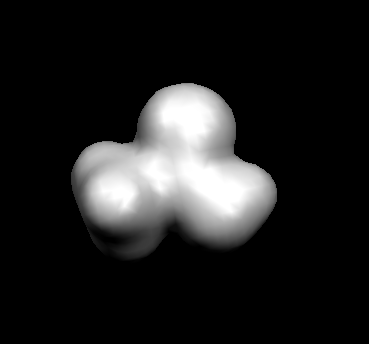
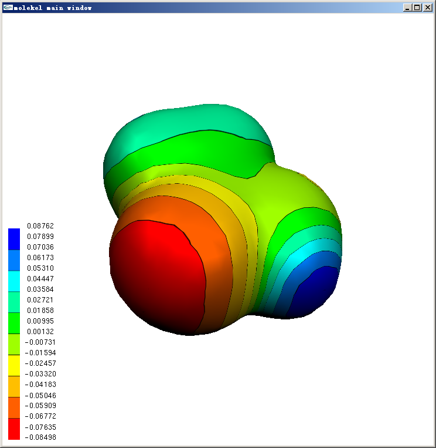
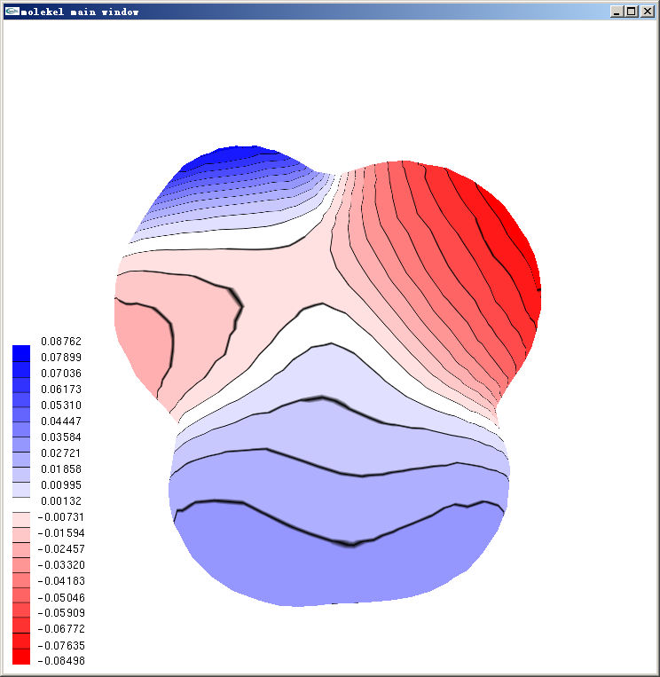
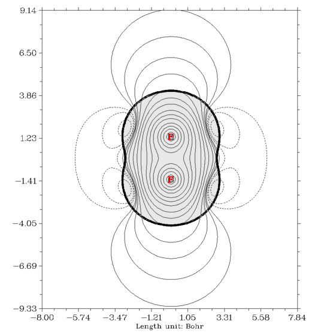

注1：阅读此文不要断章取义。要读就全读完，要么别读。

注2：如果你的目的纯粹是想绘制分子表面静电势填色图，此文是绝对的最佳的做法：《使用Multiwfn+VMD快速地绘制静电势着色的分子范德华表面图和分子间穿透图（含视频演示）》（<http://sobereva.com/443>），而当前这篇文章就完全没必要看了。

**谈谈Molekel做静电势填色等值面图的方法及误区**

On the plotting electrostatic potential color-filled isosurface map by Molekel and related misunderstandings

文/Sobereva @[北京科音](http://www.keinsci.com/)    2011-Aug-2

## 1 前言

研究分子静电势(MEP)的时候通常研究的是它在分子范德华表面（一般取电子密度为0.001的等值面）上的数值分布，最直观的方法是绘制填色等值面图进行分析。这种图可以通过很多软件绘制，比如GaussView、ChemCraft、VMD等等，它们都需要载入两套格点数据（一般为高斯cub格式），分别描述整个空间的静电势和电子密度分布。Molekel 4.x版也能做到，而且有独特的优势，就是能让色彩刻度离散化，并且每种色彩过渡区域都能显示黑线，类似于填色等值面图上再加上等值线，这使得分析更容易定量化。然而Molekel 4.x程序本身的界面设计得极差，所以有必要专门介绍下做法。另外，Molekel程序本身可以计算分子静电势，而且速度很快，看似十分方便，但实际上这是通过Mulliken原子电荷计算的，这样得到的静电势有严重的误导性，我认为很有必要进行澄清。

由于Molekel 4.x版本已经很老了，目前的Molekel 5.x版本的界面与之相比有了很大变化，所以本文先顺便说说用Molekel 5.x做填色等值面图的方法。遗憾的是，5.x版本的代码完全重写了，已不支持色彩刻度离散化，所以不能替代4.x。

## 2 用Molekel 5.4绘制由Mulliken原子电荷产生的静电势填色等值面图

Molekel目前最新版本是5.4，在这里下载<http://molekel.cscs.ch>。  
先在Gaussian 03里计算一个分子（比如算单点能），计算的时候必须加上gfoldprint pop=full关键词，这样才会输出足够的信息令Molekel能够计算电子密度。然后在Molekel里选择打开文件，文件类型选择g03 output，然后选刚才得到的G03输出文件。分子载入后，选Surfaces-Electron Density，把Density Matirx（这里实际上就是指电子密度）和Map Molecular Electrostatic Potential都打上勾，Isosurface Value输入0.001。Bounding Box里面x,y,z代表的是格点范围的中心，dx,dy,dz是往相应方向延展的距离，将之调大以避免等值面被截断，调整的时候注意3D窗口中的虚线框，它描述的是格点数据的范围。都设好后，点Generate就生成了填色等值面图。如果想把背景调为白色，选Display-Background，然后设成白色。如果想把分子周围的方框去掉，选Display-Hide Bounding Boxes。如果想显示色彩刻度条，选Display-Show MEP Scalar Bar，可以用鼠标拖动色彩刻度条移动之。若想让等值面变得透明，可以再次选Surfaces-Electron Density，点Transparency，把Density Matrix的数值调大点。  
最终得到的图像如下（双氧水）

## 3 用Molekel 4.3绘制由Mulliken原子电荷产生的色彩刻度离散的静电势填色等值面图

4.x版在Molekel网站上已不提供下载，4.3的windows版可以在这里下载[/usr/uploads/file/20150610/20150610202037_66558.rar](http://sobereva.com/usr/uploads/file/20150610/20150610202037_66558.rar)，在Windows XP下可以正常使用，双击molekel4.3.win32.exe即可启动。4.3版的手册找不到，4.1版的见此<http://www.chm.tu-dresden.de/edv/molekel/manual.4.1.html>。

在4.x版里面缩放分子可以按住ctrl+鼠标中键拖动，或者按住Ctrl+Shift+鼠标左键拖动。注意关闭任何子窗口的时候不要按右上角的X，而要点cancel，否则关了之后就再也打不开那个子窗口了。

和Molekel 5.x类似，Gaussian03的输入文件中必须包含gfoldprint pop=full关键词。由于Molekel 4.x面向的是Gaussian98，在G03中输出文件信息有了些变动，所以必须手动修改。首先把输出文件开头的比如  
 ******************************************  
 Gaussian 03:  IA32W-G03RevE.01 11-Sep-2007  
                01-Aug-2011   
 ******************************************  
里的"Gaussian 03"改成"Gaussian 98"，否则载入分子后会发现立体的分子变成了平的。然后把布居分析中的Mulliken atomic charges当中的"Mulliken"改为"Total"，否则Molekel找不到原子电荷条目，会认为原子电荷都是0，Molekel也就无法计算静电势。如果是多步任务，比如几何优化，要改的是最后一次出现的Mulliken atomic charges。

这里以乙酸为例介绍作图方法，笔者的Gaussian03是windows E.01版本。把已经改好的Gaussian03输出文件放到Molekel所在目录下（后缀名必须是.out或.log，注意大小写），在Molekel主界面点右键，Load里选gaussian log，选择那个输出文件，点Accept。此时分子出现在主窗口中。  
然后生成电子密度格点数据，步骤是在主窗口点右键选Compute-El. density，直接点OK，然后程序问你生成的电子密度格点数据存在哪里，随便输入一个名字，点Accept（后缀是macu，这是Molekel私有的格点数据格式，是二进制文件）。此时主窗口中出现了白色的电子密度等值面，如下图所示

然而这个默认等值面的数值并非0.001。在主窗口点右键选Surface，把cutoff设为0.001，再点Create surface，原来的等值面就被更新为数值为0.001的等值面了。也许你会发现等值面在边缘有窟窿，这表明默认的格点数据的空间范围太小，把等值面截断了。解决方法是主窗口点右键-Compute-Adjust box，把x,y,z的上下限都调大些，然后再按上述步骤重新生成电子密度格点数据。

主窗口点右键-Compute-MEP，选map to surface，点OK，立刻主窗口中的等值面上出现了静电势的色彩投影，同时还出现一个小窗口让你设定色彩刻度上下限，一般直接点OK用默认即可。

若想将背景设为白色，在主窗口点右键，选Color，Diffuse color下面的r,g,b都设为1，此时左上角的球会变成白色。然后点background字样下面的top和bottom按钮。如果还想把色彩刻度条的文字改成黑色，把Diffuse color下面的r,g,b都设为0，然后点label按钮即可。结果如下图所示

等值面上用黑线分隔的离散的色彩刻度的表现方式在Molekel里叫做Texture。如果想把色彩连续化，即类似在Molekel 5.4中那样，把主窗口右边的main interface窗口中的texture的对钩去掉即可。Texture也允许设定成不同类型，在主窗口点右键，选Texture，点击tex list up/down按钮就可以切换预设的四种texture，选成想要的texture后，在add texture to下面点击surface，再点击主窗口中的等值面，就可以将之套用在相应等值面上了。texture properties框里面可以调texture细节，右下角的start/end texture可以设定只让某个刻度区间内的texture显示出来，也是选完之后在add texture to下面点击surface再点相应等值面以生效。经过简单调节，上面的图可以变成下面这样

## 4 在Molekel 4.3里显示精确的静电势图

在第三节里，静电势数据是通过高斯输出文件里的Mulliken原子电荷生成的，在下一节将会谈到这样生成的静电势是很糟的。精确地绘制上一节的那种图，就需要从外部载入一个电子密度格点文件和一个精确计算的静电势的格点文件，注意两个格点文件的格点设定必须完全一致。这两个格点文件可以用高斯自带的cubegen来生成，也可以用笔者开发的Multiwfn来生成（<http://sobereva.com/multiwfn>），见Multiwfn手册里的实例，这里就不累述了。注意Multiwfn计算静电势用的是核吸引势积分的方法，是完全精确的。cubegen用的算法不明，有可能用的是近似方法，如多级展开、泊松方程方法，在单核的机子上生成静电势的速度比Multiwfn快一些，但是不像Multiwfn那样支持并行。

把算好的电子密度和静电势格点文件放在Molekel所在目录，后缀改为cube。在Molekel的主窗口里点右键，选Load-gaussian cube，然后选电子密度或静电势格点文件，点Accept。实际上此时并没有把格点数据读进去，只是把cube文件里记录的分子结构信息读入了。然后点右键选Surface，把类型选为gaussian cube，再点Load，选择电子密度格点文件，点Accept。把cutoff设为0.001，点create surface。此时电子密度0.001的等值面生成好了。再点Load，选择静电势格点文件，点Accept，然后再点grid value，点OK直接用默认的色彩刻度。此时静电势数据就被投影到刚才生成的等值面上了，图像和第3节的效果类似。

## 5 原子电荷生成的静电势与精确静电势的关系

原子电荷这种模型本身有很大的局限性，它产生的静电势相当于一个个点电荷产生的球型势的叠加。然而在分子体系中，当原子核附近电子分布的各向异性十分明显时，比如出现pi键、孤对电子的地方，这种模型就显得太粗糙，很多电子密度分布产生的效应就被抹杀掉了，原子电荷产生的静电势很可能连定性正确都称不上。F2是个很好的例子，下面是使用Multiwfn绘制的截面的静电势图，粗黑线是范德华面，因此对应分子内部的灰色区域不必关心。

从图上看，在分子轴线的两端有静电势正值区域（实线处，被称为sigma穴），由静电势互补规则可知，F2可以通过轴向与Lewis碱形成复合物，这被称作卤键（相关概念见诸如J Mol Model,13,291、J Mol Model,13,305）。图中虚线区域显示F2在侧面还有很大的静电势负值区域，因此能够F2可以利用侧面与Lewis酸复合。然而，无论哪种计算原子电荷的方法，由于F2的对称性，得到的F的原子电荷一定是0。这也就是说，用原子电荷计算的静电势在整个空间处处为0，上图中丰富的静电势信息全没了！所以，千万别用Molekel生成的静电势去分析电子效应过强的问题，否则结果可能是荒谬的。

在很多研究中，对于静电势的精度要求并不那么高，或者并不主要关注电子在原子核附近各向异性分布产生的效应，此时使用合适的计算方法得到的原子电荷是能够满足需要的，也因此大多数分子力场使用原子电荷模型描述静电相互作用，并且能得到满意结果。不同的方法计算的原子电荷对精确静电势（这里指与计算原子电荷相同理论级别产生的量子化学计算的静电势）的重现性相差极其悬殊，显然，最好的是拟合静电势方法，拟合过程就是指最小化原子电荷产生的静电势与精确静电势的偏差。不过拟合静电势方法也有很多弊端，笔者会在其它文章中详细讨论。而常见的Mulliken电荷的静电势重现并不好，偏差通常是拟合静电势电荷的2~3倍。而且Mulliken电荷还有很多问题，诸如交叉项平分缺乏物理意义、结果不随基组质量提高而收敛、在含有弥散函数的基组下容易出现荒谬结果等等。因此，很不建议使用Mulliken电荷来产生静电势，也因此Molekel自己产生的静电势数据得到的填色等值面图顶多用来做为定性参考，在文章中对静电势进行简要分析时，起码应该把高斯输出文件中Mulliken电荷的数值替换成拟合静电势电荷的，然后再让Molekel计算静电势并生成填色等值面图。如果文章专门探讨某些分子的静电势，尤其涉及到定量问题时，一定要按第四节的方法绘制精确的静电势图，而不能用原子电荷产生的静电势，否则文章会产生严重的误导。
